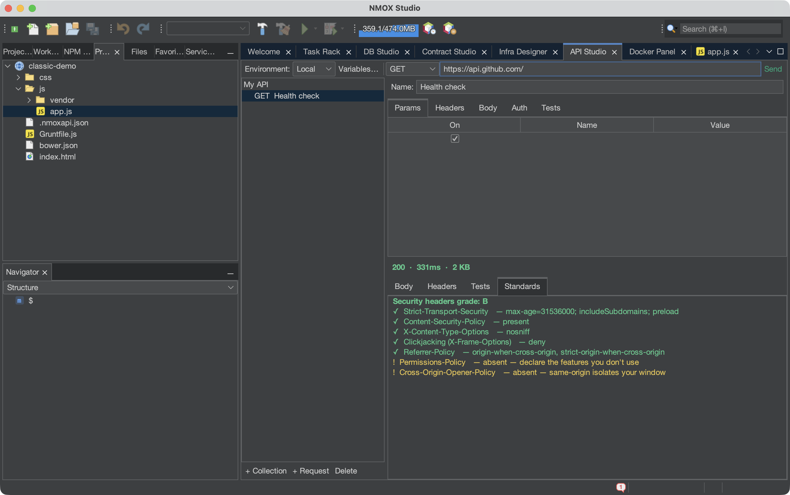
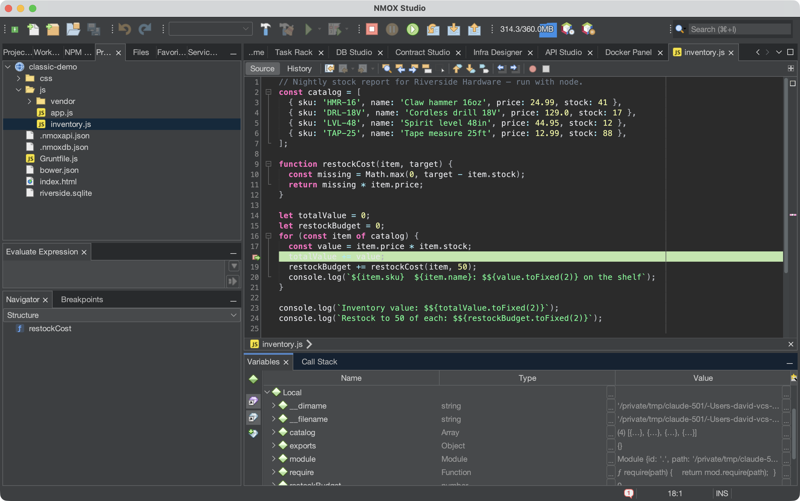

# NMOX Studio

**The web studio with a rack — wire your tools like a synth.**

[](https://github.com/NMOX/NMOX-Studio/actions/workflows/build-and-test.yml)
[](LICENSE)
[](https://adoptium.net/)
[](https://netbeans.apache.org/)


NMOX Studio is an IDE for web development with a twist: your tooling lives in a Reason-style **Task Rack**. Every task — install, build, test, serve, lint, deploy — is a hardware-styled device with knobs, LEDs, and patch cables; wire OK jacks together and one keypress runs your whole pipeline, with errors landing on a phosphor monitor bus. Around the rack: a polyglot editor (70+ languages via 73 TextMate grammars, NetBeans CSL, and LSP — code and the whole config layer, down to `.editorconfig` and `.env`), a Workbench home base, a Node-RED-style multi-cloud infra designer (DigitalOcean, Hetzner, Cloudflare), and project templates. Built on the NetBeans Rich Client Platform; the core developer loop is proven against real `node`/`npm` in CI on every commit.

## Download

Grab **[the latest release](https://github.com/NMOX/NMOX-Studio/releases/latest)** — DMG (macOS), installer (Windows), tar.gz/deb (Linux), or portable zip. The DMG, installer, tar.gz and deb ship with their own Java runtime — nothing to install. (The portable zip alone expects a Java 21+ on the machine.)

Once it's running, **[the User Guide](docs/user-guide.md)** walks every feature — the rack, the studios, the wizards, and the safety nets.

> **macOS note:** the app is not yet notarized. If Gatekeeper objects, right-click the app and choose *Open*, or run `xattr -d com.apple.quarantine "/Applications/NMOX Studio.app"`.

### Homebrew (macOS)

```bash
brew tap NMOX/NMOX-Studio https://github.com/NMOX/NMOX-Studio
brew trust --cask nmox/nmox-studio/nmox-studio
brew install --cask nmox-studio
```

The `brew trust` step is a one-time acknowledgment Homebrew requires for any third-party tap; you won't be asked again for future updates. The cask wraps the release DMG (bundled Java runtime, no separate install). The app is ad-hoc signed but not yet notarized, so the first launch needs one extra step: right-click the app → *Open* once and confirm, or `xattr -dr com.apple.quarantine "/Applications/NMOX Studio.app"`.

Update later with `brew update && brew upgrade --cask nmox-studio`; remove cleanly with `brew uninstall --cask --zap nmox-studio`. Since v1.51.0 the IDE also updates itself in-app: **Tools ▸ Plugins ▸ Updates** offers the product modules of any newer release (fed from the latest GitHub release's update catalog).

## Screenshots

*The web studio with a rack — wire your tools like a synth.*

| | |
|---|---|
|  |  |
| *Welcome screen* | *Flip the rack (Tab) and patch task pipelines by cable* |
|  |  |
| *Phosphor-on-dark editing, 70+ languages* | *API Studio — a live response, graded on its security headers* |

## Features

### 🎛️ The Task Rack
Every web-dev task is a hardware device — knobs, LEDs, LCDs, patch cables.
Wire OK jacks together (Tab flips the rack) and one keypress runs install →
build → test, with output scrolling on a phosphor monitor. 53 devices:
package managers, bundlers, test runners, dev servers, databases, linters,
formatters, git, deploy, HTTP, tunnels, load bench, file watcher, the
QUORUM lane-join barrier, SOLDER (any command as a unit), TAIL (follow log
files), HELM (run commands on your servers over ssh), an in-rack REPL,
the ANVIL local EVM chain, the STELLAR (Soroban) and ANCHOR (Solana)
smart-contract consoles, the DYNAMO Grunt/Gulp runner, the ORACLE AI
error explainer, the WAYPOINT monorepo-workspace selector, and framework
consoles for Angular, Phoenix, Next.js, Vite, Astro, SvelteKit, Nuxt,
and Laravel (ARTISAN), and more. Patches
persist per project, ship as presets, and export to GitHub Actions.
**[The full device reference](docs/devices.md)** is generated from the
catalog itself — CI fails if it drifts.

### 🚦 Quality is a shipping gate
Four floors, each a knob on a faceplate, each able to close the OK jack:
**VITALS** (Lighthouse performance/a11y/best-practices/SEO), **VERITAS
MIN COV** (test coverage), **GAUNTLET MIN R/S** (load-bench throughput),
and **PRISM** (bundle-size budget). **BEACON** watches production —
uptime plus TLS days-remaining on a clock. Wire any subset through
QUORUM into LAUNCHPAD: nothing slow, thin, heavy, or expiring ships.

### ⚡ Built to live in all day
- **Switch Project (⌘⇧P)** re-aims the whole IDE through a guard that
  names running work before stopping it — no more silently killed dev
  servers. **Quick Search (⌘I)** finds actions, files, recent projects
  (Enter switches), rack devices (Enter racks them), **API Studio
  requests** (jumps to the request), and **infra nodes** (selects them
  on the canvas). ⌘9 rack, ⌘8 Docker, ⌥⌘0 workbench; the status line
  shows what's running.
- **The rack has undo (⌘Z / ⇧⌘Z)**: add, remove, move a device or
  patch a cable and take it back — including a removed device, which
  comes back with its cables re-wired. A 100-deep history that starts
  clean on whatever patch you loaded.
- **Experiments (⌘⇧E)**: throwaway workspaces in `~/.nmox/experiments` —
  no git, no recents pollution, pre-trusted. Promote the keepers
  (move + git init), discard the rest.
- **`.env` respected everywhere**: every command the rack launches reads
  the project's `.env`/`.env.local` automatically; rack settings win.
- **Git on the status line**: aim inside a repo and a **⎇ branch chip**
  appears (`⎇ main ±3` — HEAD read straight from disk, no git process
  until you interact). Click it for **Show Changes, Diff, Annotate,
  History, Refresh** — and because aiming opens the project for the
  whole platform, the **Team** menu is the full enabled git suite with
  just a project aimed, nothing selected.

### 🧠 The rack remembers, sees, and survives
- **BLACKBOX** records every launch, exit, duration, and error on a session
  timeline that persists across restarts — with a slow-creep alarm that
  notices when your build quietly doubles.
- **SONAR** maps every listening port to its owning process (docker
  containers labeled) with one-click kill. EADDRINUSE, solved.
- **Session Resurrection**: crash, `kill -9`, or power loss — relaunch and
  the IDE offers your running dev servers back. One click and they're alive.

### 🧬 Wired together
The parts talk to each other. Every running server — dev servers,
`php -S`, static serves, even ANVIL's local chain — announces itself to
one live registry: the **status line** grows a `⇄ serving` chip (click
to open), **⌘I finds running servers**, VITALS and BEACON **auto-target**
the served URL when theirs is blank, API Studio quietly offers to set
`{{baseUrl}}`, and Contract Studio **connects itself** the moment your
chain is up. Edit a manifest and the rack keeps up: save package.json
and NPM-9000 re-lists your scripts; save the Gruntfile and DYNAMO
re-parses its tasks — no re-aiming, and a wizard writing ten files costs
one re-sync, not ten. Build your contracts anywhere (rack, terminal, CI)
and Contract Studio's tree refreshes itself. Run a postgres container
and DB Studio offers the connection, prefilled. Hand-edit any studio's
workspace file and it reloads — silently when it's safe, with a polite
"Reload?" when you have unsaved work, and never, ever by clobbering it.

### 🐳 First-class Docker
The HARBOR device tracks the daemon (containers up, images held, disk
reclaimable) and opens the Docker Panel: a disk-reclaim ledger, live
container management with browser-jump ports, image tooling, volumes,
networks — and **Dockerize**, which generates production multi-stage
Dockerfiles from your project's detected toolchain.

### 🐘 First-class LAMP/LEMP
PHP is a full citizen: the **ARTISAN** device is a Laravel console
(serve/test/migrate/fresh/queue/routes with composer.lock version
currency), TYPEGUARD runs **phpstan** and GLOSS runs **Pint** on PHP
projects, IGNITION serves `php -S` docroot-aware, and the test under
your caret runs via PHPUnit. `.htaccess` and Apache configs highlight
alongside nginx, php.ini, and `.env`. The **PHP Web (LEMP)** template
scaffolds a guarded front controller, a passing PHPUnit suite, a working
nginx + php-fpm + MariaDB compose stack, and a `deploy/cloud-init.yml`
LEMP bootstrap you paste straight into a droplet in the Infra designer —
with the **LAMP Bench** preset wiring composer → phpunit + phpstan +
pint on one keypress. And the **Database Explorer** ships in the box:
connect to MySQL/MariaDB from the Services window, browse schemas, and
run SQL in a real editor with result grids (bring the Connector/J jar;
the driver UI handles registration).

### 🕰️ The classic web, first-class
The stacks that used to be number one still run half the internet, and
NMOX Studio treats them like it. A **script-tag site with no manifest at
all** opens as a project and serves with one keypress (VITALS and BEACON
work on it unchanged). `bower.json`, `Gruntfile.js`, `gulpfile.js`, and
`webpack.config.js` are project manifests; FORGE builds through webpack,
grunt, or gulp straight from the config file; CRATE runs `bower install`
in sequence; and the **DYNAMO** device reads your Gruntfile or gulpfile
and puts its tasks on a knob — no node required just to browse them.
Completion knows the classic APIs (`$.ajax`, `_.debounce`,
`ko.observable`…) whenever your deps or script tags carry jQuery,
MooTools, Prototype, Backbone, Underscore, or Knockout — and a project
still on jQuery 1.x wears an honest **EOL** chip. CoffeeScript
highlights and outlines like any other language. Want to go the other
way? The **Classic Kit** (File → Classic Kit…) extends any codebase with
pinned vendored builds (script tags wired idempotently) or npm deps, and
generates webpack/Grunt/gulp/bower scaffolds without ever clobbering a
file you wrote. There's even a **Classic Web (jQuery)** template —
script-tag era, no build step, served as-is.

### ⌨️ Polyglot editing
Bun and Deno are first-class toolchains (detected with precedence over
plain Node — every AUTO device speaks the right binary, CI export
included), alongside Rust, Go, Python, Ruby, PHP, the BEAM family, and
more. 70+ languages with syntax highlighting (73 TextMate grammars through NetBeans
CSL) — code plus the whole config layer: `.editorconfig`, dotenv, ignore
files, GraphQL, Vue, Svelte, Astro, Pug, Handlebars, Liquid, nginx,
Makefile, Protocol Buffers, Prisma, YAML, TOML, Dockerfile. First-class
HTML, CSS, SCSS and Less with tag, attribute, value and property
completion; LSP with ordered server fallbacks; a regex-aware JavaScript
lexer; typing intelligence; **format on save with Prettier** (opt-in via
the project's own Prettier config, project-pinned binary preferred, caret
survives the save); comment-only spellcheck (your keys and values
are never flagged as typos); a **Structure navigator** (⌘7) that outlines
any file — classes, functions, tests, selectors, headings, config keys —
and jumps to a symbol on click; and the NMOX Phosphor dark theme.

### 🐞 Breakpoints that actually stop

Click the gutter, right-click → **Debug File**, and your program pauses
there — call stack, variables in scope, stepping, watch expressions
evaluated against the live process. **JavaScript and TypeScript debug
out of the box**: Microsoft's [js-debug](https://github.com/microsoft/vscode-js-debug)
(the engine VS Code uses) ships inside the IDE, so if `node` runs your
file, you can debug it. Python (debugpy) and Go (delve) work the same
way with their own adapters. Debugging runs your code, so it asks for
Workspace Trust first — the same gate the rack uses.



### 🎓 Learning Spaces
Projects that exist to be learned from. **File → New Learning Space…**
(⇧⌘L) opens a searchable picker of **83 built-in tutorials** across
languages, frameworks, and libraries; choose one — say Common Lisp —
and the studio generates a real project: sample code, a TUTORIAL.md
that walks it (with the install command for your OS), and a rack
already wired with a **live REPL** pointed at the right interpreter.
Press START, click HINTS for starter expressions, type `(+ 1 2 3)`,
read the answer. The REPL is a genuine interactive process you type
into (clisp, python3, node, ghci, iex, irb, sqlite3, redis-cli…) — a
new capability, since the rack's command devices deliberately run with
a closed stdin. Framework spaces with a real console (Rails, Django,
Phoenix, Laravel Tinker) wire that console; the rest wire a run
command. The whole catalog is data (`learn-catalog.json`) — and every
space is honest: if a tool isn't installed, it says so and hands you
the install line.

### 🩺 Honest about your machine
**Tools → Environment Doctor** probes every external tool the studio
can drive — the core four, each language toolchain, and every
learning-space interpreter — live with its version command, in one
table: ✓ with the version line, or ✗ with the install command that
fixes it. The **Welcome screen** is a real launchpad: start actions
with their shortcuts, your recent projects (click to aim the studio),
every tool window with its keystroke, and the stamped version with a
What's-new link. And once a day the studio quietly checks GitHub for
a newer release and mentions it exactly once — dev builds never
check, offline never nags, one preference turns it off.

### 🧩 Block Studio
A Scratch-like composer (⌥⌘5) that builds **real Web Components** from
interlocking pieces: state, props, slots, timers, event handlers — snap
them together (illegal nestings simply refuse) and the runnable
custom-element code appears live beside the canvas, each piece mapped to
the exact lines it generates. Fully keyboard-operable and
screen-reader-visible. A workspace holds many components with a
toolbar switcher; **Save Component** writes `src/components/<tag>.js`
(never clobbering a file it didn't generate), **Open Component…**
parses a generated file back into blocks, and **Preview** serves the
whole workspace live on localhost — components can nest each other's
tags and render composed.

### 🧪 API Studio
A Postman-style tab (Window → API Studio) for building, saving, sending,
and **testing** HTTP requests: collections of requests, a builder with
params/headers/body/auth, `{{variable}}` environments so one request
travels from localhost to prod, and per-request assertions (status,
response time, body contains, JSON path, header present) that turn a
probe into a check. The workspace persists as `.nmoxapi.json` beside the
project.

### 🗄️ DB Studio
A database management suite in its own tab (⌥⌘7) — **SQLite, PostgreSQL,
MySQL, MariaDB, MongoDB, and CouchDB**, batteries included: the drivers
are bundled (CouchDB needs none — it's plain HTTP), so a fresh install
connects to a real database in under a minute. One tree browses
tables/views, Mongo collections, or Couch databases down to columns and
document shapes; a kind-aware console speaks SQL (highlighted) to SQL
engines and JSON to document engines — Extended-JSON commands for Mongo,
Mango selectors for Couch. Scripts run statement-by-statement (an error
in one never stops the rest), results land in per-statement grids with
elapsed times and honest truncation flags, history keeps your last 50
runs — persisted per project, next to named **saved queries** — and
CANCEL actually cancels. Connection specs persist per project
in `.nmoxdb.json`; **passwords live only in the OS keychain** via the
platform Keyring. ⌘I finds your connections and tables like everything
else. And it speaks platform: connections configured in the NetBeans
**Services** window appear under a Services branch and run in the same
console — any database with a registered driver, Java DB and Oracle
included, with NetBeans owning drivers and credentials.

The grids work for a living, too. Run a simple single-table SELECT (or
peek a table) on a SQL engine and the grid unlocks for **in-grid row
editing**: edited cells tint, a chip counts pending edits, and
**Apply…** shows the exact `UPDATE` statements — primary-key WHERE
clauses, properly quoted identifiers — before anything runs, then
re-runs your query so you see database truth. Grids that can't be
edited safely tell you why in plain words ("Read-only — no primary
key"). Any result exports to **CSV or JSON**; **EXPLAIN** lights up for
SELECTs and shows the engine's own query plan; and if your project's
`.env` declares `DB_*` or `DATABASE_URL`, DB Studio quietly offers to
create the connection — prefilled dialog, password straight to the
keychain.

### ⛓️ Contract Studio (Web3)
Smart contract development in its own tab (⌥⌘6) — **Solidity in the
editor** (pinned TextMate grammar, Navigator outline, LSP catalog
entry), **Foundry as a real toolchain** (`foundry.toml` projects get
IDE-native Build/Test/Clean → forge, plus rack lanes), and a Studio
that treats contracts like the first-class artifacts they are. The
tree scans Foundry `out/` and Hardhat `artifacts/`; the **Interact**
pane generates call forms straight from the ABI — CALL a view function
and read the decoded return, SEND a write and watch the receipt land,
with revert reasons decoded to their names. Deploys record into a
per-project address book (`.nmoxweb3.json`). **Observation and
oversight are built in**: the **Watch** pane follows blocks and
ABI-decodes event logs live off your devnet; **Oversight** shows the
per-function gas table (`forge test --gas-report`, parsed), every
contract's size against the EIP-170 24 KB limit with headroom bars,
and the deployment book. In the rack, **ANVIL** runs your local chain
(port/chain-id/block-time/fork-url, READY gate, resurrection) and
**GOVERNOR** holds the gas line (`forge snapshot --check` with a
tolerance knob) alongside the other quality gates.

**And Web3 is more than the EVM here.** **STELLAR** builds Soroban
contracts (Rust → WASM via `stellar contract build`, native `cargo
test`, the quickstart local network one knob away) and **ANCHOR** runs
Solana (`solana-test-validator` with a live RPC URL and a truthful
SERVING gate, `anchor build/test`); **Cairo/Starknet is a full language
vertical** — `Scarb.toml` projects get the official grammar, outline,
LSP (served by scarb itself), and every Run/Build/Test lane; and the
**Multi-Chain Bench** preset racks all three chains on one MONITOR.
Learning spaces walk Stellar, Solana, CosmWasm, ink!, and Cairo with
samples proven against the real toolchains. Keys never touch the IDE:
every chain CLI manages its own identities.

**The security boundary is the feature**: the IDE never touches
private keys — no key fields, no signing code. Deploys and sends go
through the devnet's own unlocked accounts (`eth_sendTransaction` on
anvil); remote networks are read-only in the Studio, and RPC URLs
that embed API keys live only in the OS keychain, never on disk.

### 🌐 Standards & PWA, supported with gusto
`.editorconfig` is **honored, not just highlighted** — every save
applies the spec for real (trim_trailing_whitespace,
insert_final_newline, glob sections, root stopping, closer-file
precedence) with a minimal edit so the caret stays put. The
**Standards Kit wizard** (File → Standards Kit…) generates the web's
well-known files, each correct to its spec: robots.txt (RFC 9309),
sitemap.xml, site.webmanifest, RFC 9116 security.txt with a true
RFC 3339 Expires, humans.txt. The **PWA Kit wizard** (File → PWA Kit…)
makes the project installable in one dialog: a generated icon set
(monogram or your own artwork — icon-192/512, W3C-safe-zone maskable
pair, apple-touch-icon, rendered in-process with zero external tools),
an installability-complete manifest, a **readable vanilla service
worker** (app-shell or network-first strategy, precache list built
from the files the project actually has, offline.html fallback), and
idempotent index.html wiring. Every API Studio response is graded on a
**Standards tab** — HSTS, CSP, nosniff, clickjacking, Referrer-Policy,
Permissions-Policy, COOP — value-aware, letter-graded, a named fix for
every miss. And VITALS' GATE knob makes **WCAG a shipping gate**:
an inaccessible page closes the deploy gate exactly like a slow one.
Neither wizard ever overwrites an existing file.

### 🏗️ Projects and infrastructure
The Workbench home base (toolchain chips, open/recent files, tooling
shelf), Project Studio templates that scaffold versioned, rack-wired
projects, and a Node-RED-style Infra Designer for DigitalOcean, Hetzner,
and Cloudflare with cost estimates and dry-run planning — plus the
truth-and-teardown loop: **Sync from cloud** pulls your live resources
from all three providers into the designer in one sweep (each provider
isolated, so one bad token never aborts the others; re-syncing
refreshes nodes in place instead of duplicating them), **Refresh**
flags cloud-deleted resources as drifted, **Destroy stack** tears
everything down in reverse dependency order with the monthly bill in
view, droplets take **cloud-init** user_data, and a deployed node hands
you its **ssh command** from the context menu.

### ✅ Proven, not promised
CI runs real `npm install`/build/test/serve through the actual rack devices
on every commit. Quitting the IDE reaps every child process — no orphaned
dev servers, guaranteed and tested. Every commit also clears SpotBugs,
find-sec-bugs, and **per-module JaCoCo coverage floors** on all ten code
modules — coverage measured on the *testable surface* (pure-Swing windows
and dialogs are excluded by name with a written reason, not chased with
brittle tests), so the floors mean what they say.

See the [CHANGELOG](CHANGELOG.md) for the full release history.

## Quick Start

### Prerequisites
- **Java 21+** (JDK required for development)
- **Maven 3.6+**
- **Git** (for source code management)

### Building from Source

```bash
# Clone the repository
git clone https://github.com/NMOX/NMOX-Studio.git
cd NMOX-Studio

# Build the application
./build.sh

# Run the application
./run.sh
```

### Development Build

```bash
# Clean build with tests
mvn clean test package

# Create distribution packages
mvn package -Pdeployment

# Run in development mode
mvn nbm:run-platform
```

## Project Structure

```
NMOX-Studio/
├── core/                   # Startup hooks (e.g. NMOX phosphor terminal styling)
├── ui/                     # Main windows, Workbench home base, actions
├── editor/                 # Polyglot editor: TextMate grammars, LSP,
│   │                       #   completion, outline, spellcheck
│   ├── polyglot/          # 70+ language registration
│   ├── grammars/          # TextMate grammar loading via NetBeans CSL
│   ├── lsp/               # Language Server Protocol client
│   ├── javascript/        # Regex-aware JavaScript lexer
│   └── outline/           # Structure navigator (⌘7)
├── rack/                   # The Task Rack: hardware-styled task devices
│   ├── devices/           # The 53 rack devices
│   ├── engine/            # Patch execution (wire OK jacks → run pipeline)
│   ├── docker/            # HARBOR device + Docker panel
│   └── projectstudio/     # Project Studio templates
├── infra/                  # Node-RED-style multi-cloud Infra Designer
│   ├── api/               # Provider abstraction
│   └── model/             # DigitalOcean, Hetzner, Cloudflare resources
├── apiclient/              # API Studio: Postman-style request tab
├── dbstudio/               # DB Studio: SQL + document database suite
│   ├── model/             # Engines, connection specs, schema records
│   ├── engine/            # DbBackend: JDBC + Mongo + CouchDB(HTTP)
│   └── ui/                # The ⌥⌘7 tab: tree, console, results
├── web3/                   # Contract Studio: Web3/EVM development
│   ├── engine/            # Keccak-256, ABI codec, JSON-RPC client
│   └── ui/                # The ⌥⌘6 tab: Interact, Watch, Oversight
├── project/               # Project and resource management
├── tools/                 # Development tools and utilities
├── branding/              # Splash, icons, NMOX Phosphor theme
├── application/           # Main application assembly (the cluster)
├── NMOX-Studio-sample/    # Sample project module
├── packaging/             # macOS DMG, Linux tar.gz/deb, Windows installer
├── build.sh               # Build script
├── run.sh                 # Development run script
└── README.md              # This file
```

### Module Overview

| Module | Description | Key Components |
|--------|-------------|----------------|
| **core** | Startup hooks and platform-wide styling | `TerminalPhosphor` (@OnStart terminal theming) |
| **ui** | Main windows, Workbench home base, actions | `MainWindow`, Workbench, actions |
| **editor** | Polyglot editor — grammars, LSP, completion, outline | `WebFileSupport`, polyglot/grammars/lsp/outline |
| **rack** | The Task Rack — hardware-styled task devices and patch engine | `RackTopComponent`, devices, engine, docker (HARBOR) |
| **infra** | Node-RED-style multi-cloud Infra Designer | `InfraDesignerTopComponent`, provider api/model |
| **apiclient** | API Studio — Postman-style request tab | `ApiClientTopComponent`, engine, `.nmoxapi.json` |
| **dbstudio** | DB Studio — SQL + document database suite | `DbStudioTopComponent`, `DbBackend` (JDBC/Mongo/Couch), Keyring passwords |
| **web3** | Contract Studio — Web3/EVM smart contracts | `Web3StudioTopComponent`, `AbiCodec`/`Keccak256`/`JsonRpcClient`, no-private-keys boundary |
| **project** | Project and resource management | `ProjectExplorerTopComponent` |
| **tools** | Development and debugging tools | Tool windows, utilities |
| **branding** | Splash, icons, NMOX Phosphor theme | Branding resources |
| **application** | Main application assembly (the cluster) | App descriptor, packaging hooks |

## Architecture

NMOX Studio is built on the NetBeans Rich Client Platform, so it inherits the
platform's module system, windowing, and `Lookup`-based service wiring rather
than reinventing them. The application is assembled from the modules listed
above, each a self-contained NetBeans module (NBM).

### Module System
Each module is a self-contained NetBeans module (NBM) with:
- **Clear Dependencies**: Explicit module dependencies declared in the POM
- **API Separation**: Clean separation between API and implementation
- **Lookup Wiring**: Services and `TopComponent`s registered via NetBeans
  annotations (`@ServiceProvider`, `@TopComponent.Registration`) and resolved
  through the platform `Lookup`
- **Resource Management**: Proper resource bundling and internationalization
- **Testing Support**: Unit and integration tests run headless in CI

## Development

### Building and Testing

```bash
# Run all tests
mvn test

# Run tests for specific module
mvn test -pl core

# Build without tests
mvn package -DskipTests

# Generate test reports
mvn surefire-report:report
```

### Adding New Modules

1. Create module directory structure
2. Add module POM with proper dependencies
3. Register module in parent POM
4. Implement module functionality
5. Add comprehensive tests
6. Update documentation

### Code Quality

The project maintains high code quality through:
- **Static Analysis**: Compiler warnings and linting
- **Unit Testing**: Comprehensive test coverage with JUnit 5
- **Integration Testing**: NetBeans platform integration tests
- **Code Review**: Pull request review process
- **Documentation**: Comprehensive inline and external documentation

## Contributing

We welcome contributions! Please see [CONTRIBUTING.md](CONTRIBUTING.md) for details on:
- Code of conduct
- Development workflow
- Pull request process
- Coding standards

## License

This project is licensed under the Apache License 2.0 - see the [LICENSE](LICENSE) file for details.

## Support

- **Issues**: [GitHub Issues](https://github.com/NMOX/NMOX-Studio/issues)
- **Discussions**: [GitHub Discussions](https://github.com/NMOX/NMOX-Studio/discussions)
- **Documentation**: [Wiki](https://github.com/NMOX/NMOX-Studio/wiki)

---

**NMOX Studio** - wire your web tooling like a synth.
