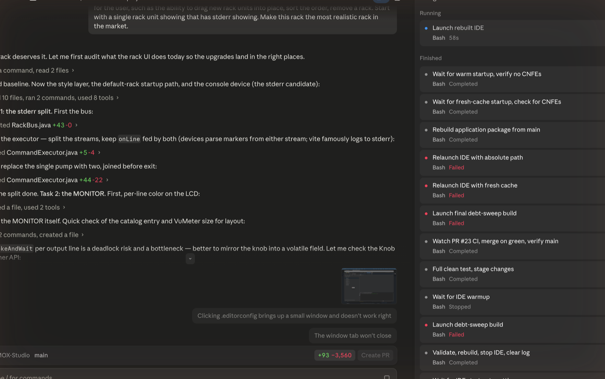
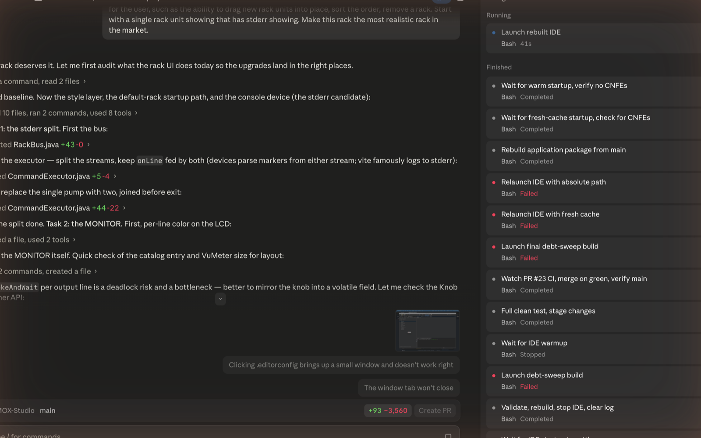
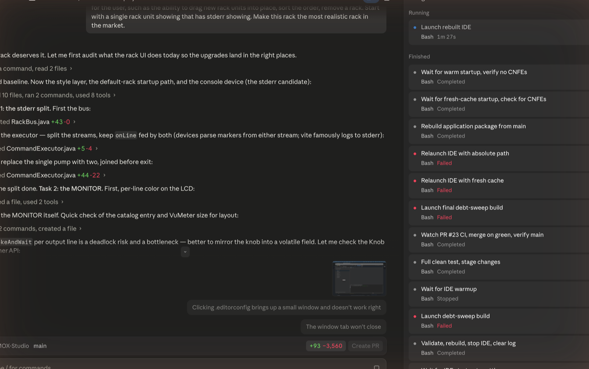
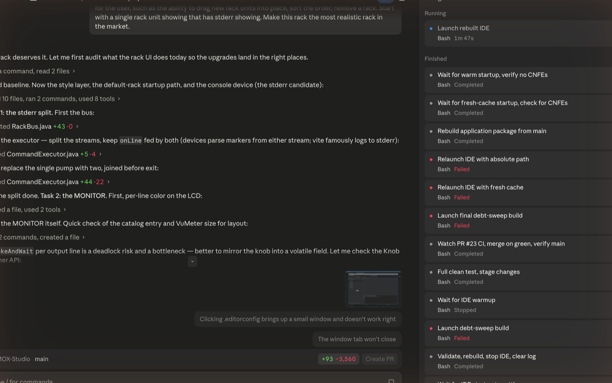
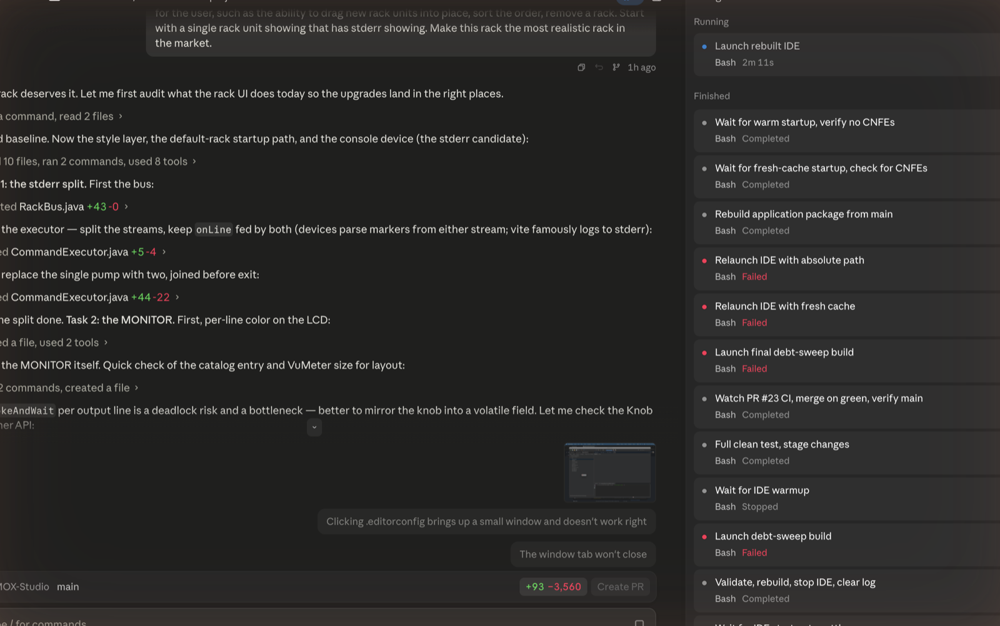

# NMOX Studio

**Professional Cloud Deployment and Microservices IDE**

[](https://github.com/NMOX/NMOX-Studio/actions/workflows/build-and-test.yml)
[](LICENSE)
[](https://adoptium.net/)
[](https://netbeans.apache.org/)



NMOX Studio is a powerful integrated development environment for managing cloud deployments, microservices, and containerized applications. Built on the robust NetBeans Rich Client Platform, it provides comprehensive tools for deploying, monitoring, and scaling applications across AWS, Azure, Google Cloud, and Kubernetes clusters.

## Screenshots

*The web studio with a rack — wire your tools like a synth.*

| | |
|---|---|
|  |  |
| *Welcome screen* | *Flip the rack (Tab) and patch task pipelines by cable* |
|  |  |
| *Phosphor-on-dark editing, 30+ languages* | *Workbench home base beside the multi-cloud Infra Designer* |

## Features

### ☁️ **Cloud Provider Integration**
- **Multi-Cloud Support**: Deploy to AWS, Azure, Google Cloud Platform
- **Unified Interface**: Single pane of glass for all cloud resources
- **Cost Management**: Track and forecast cloud spending across providers
- **Resource Management**: Create, configure, and manage VMs, networks, and storage

### 🐳 **Container & Orchestration**
- **Docker Integration**: Full Docker container lifecycle management
- **Kubernetes Support**: Deploy and manage applications on K8s clusters
- **Container Registry**: Push/pull images from Docker Hub, ECR, ACR, GCR
- **Helm Charts**: Deploy complex applications using Helm

### 🚀 **Deployment Management**
- **CI/CD Pipeline**: Integrated deployment pipelines
- **Blue-Green Deployments**: Zero-downtime deployment strategies
- **Rollback Support**: One-click rollback to previous versions
- **Environment Management**: Dev, staging, and production environments

### 📊 **Monitoring & Observability**
- **Real-time Metrics**: CPU, memory, network, and custom metrics
- **Log Aggregation**: Centralized log viewing across all services
- **Health Checks**: Automatic health monitoring and alerting
- **Performance Analysis**: Identify bottlenecks and optimize resources

### 🕸️ **Microservices Architecture**
- **Service Discovery**: Automatic service registration and discovery
- **API Gateway Management**: Configure and manage API gateways
- **Service Mesh**: Integration with Istio and Linkerd
- **Dependency Visualization**: Interactive service topology maps

### 🖥️ **Professional IDE Features**
- **Modern UI**: Dockable windows with customizable layouts
- **Project Management**: Organize deployments, services, and configurations
- **Integrated Terminal**: Execute commands directly within the IDE
- **Git Integration**: Version control for infrastructure as code

## Quick Start

### Prerequisites
- **Java 17+** (JDK required for development)
- **Maven 3.6+**
- **Git** (for source code management)

### Building from Source

```bash
# Clone the repository
git clone https://github.com/NMOX/NMOX-Studio.git
cd NMOX-Studio

# Build the application
./build.sh

# Run the application
./run.sh
```

### Development Build

```bash
# Clean build with tests
mvn clean test package

# Create distribution packages
mvn package -Pdeployment

# Run in development mode
mvn nbm:run-platform
```

## Project Structure

```
NMOX-Studio/
├── core/                    # Core services and infrastructure
├── cloud/                   # Cloud provider abstraction layer
│   ├── api/                # Provider interfaces
│   ├── providers/          # AWS, Azure, GCP implementations
│   └── services/           # Cloud service management
├── deployment/             # Deployment management
│   ├── ui/                # Deployment UI components
│   ├── services/          # Deployment orchestration
│   └── model/             # Deployment models
├── containers/             # Container and orchestration
│   ├── docker/            # Docker integration
│   ├── kubernetes/        # Kubernetes client
│   └── ui/               # Container management UI
├── ui/                     # Core UI components
├── project/               # Project management
├── tools/                 # Development tools
├── branding/              # Application branding
├── application/           # Main application assembly
├── build.sh              # Build script
├── run.sh               # Development run script
└── README.md           # This file
```

### Module Overview

| Module | Description | Key Components |
|--------|-------------|----------------|
| **core** | Core services and infrastructure | `ServiceManager`, `NMOXStudioCore` |
| **cloud** | Cloud provider abstraction and management | `CloudProvider`, `CloudInstance`, `CloudMetrics` |
| **deployment** | Application deployment management | `DeploymentManager`, `DeploymentService` |
| **containers** | Docker and Kubernetes integration | `DockerService`, `KubernetesService` |
| **ui** | Main windows and UI components | `MainWindow`, Actions |
| **project** | Project and resource management | `ProjectExplorerTopComponent` |
| **tools** | Development and debugging tools | Tool windows, utilities |
| **branding** | Application theming | Splash screen, icons |

## Architecture

NMOX Studio follows a clean, modular architecture based on the NetBeans Platform:

### Service Management
The application uses a centralized service management system that provides:
- **Automatic Discovery**: Services are automatically discovered through the Lookup system
- **Lifecycle Management**: Proper initialization and cleanup of services
- **Event Notification**: Service registration/unregistration events
- **Type Safety**: Strongly-typed service retrieval

### Module System
Each module is a self-contained NetBeans module (NBM) with:
- **Clear Dependencies**: Explicit module dependencies
- **API Separation**: Clean separation between API and implementation
- **Resource Management**: Proper resource bundling and internationalization
- **Testing Support**: Comprehensive unit and integration tests

## Development

### Building and Testing

```bash
# Run all tests
mvn test

# Run tests for specific module
mvn test -pl core

# Build without tests
mvn package -DskipTests

# Generate test reports
mvn surefire-report:report
```

### Adding New Modules

1. Create module directory structure
2. Add module POM with proper dependencies
3. Register module in parent POM
4. Implement module functionality
5. Add comprehensive tests
6. Update documentation

### Code Quality

The project maintains high code quality through:
- **Static Analysis**: Compiler warnings and linting
- **Unit Testing**: Comprehensive test coverage with JUnit 5
- **Integration Testing**: NetBeans platform integration tests
- **Code Review**: Pull request review process
- **Documentation**: Comprehensive inline and external documentation

## Contributing

We welcome contributions! Please see [CONTRIBUTING.md](CONTRIBUTING.md) for details on:
- Code of conduct
- Development workflow
- Pull request process
- Coding standards

## License

This project is licensed under the Apache License 2.0 - see the [LICENSE](LICENSE) file for details.

## Support

- **Issues**: [GitHub Issues](https://github.com/NMOX/NMOX-Studio/issues)
- **Discussions**: [GitHub Discussions](https://github.com/NMOX/NMOX-Studio/discussions)
- **Documentation**: [Wiki](https://github.com/NMOX/NMOX-Studio/wiki)

---

**NMOX Studio** - Empowering media professionals with professional-grade development tools.
