# A Day at Meridian

*One story through every corner of NMOX Studio. Every screenshot in
this tutorial was captured live from the shipped app while building
exactly what the story describes — a coffee shop's site, its order
API, and the launch prep around them. Follow along in an afternoon,
or skim the pictures to see what the studio is.*

---

## 9:00 — an idea, not a project yet

You don't owe an idea a repository. The Welcome tab's START column
leads with **New Experiment…** for exactly this moment:

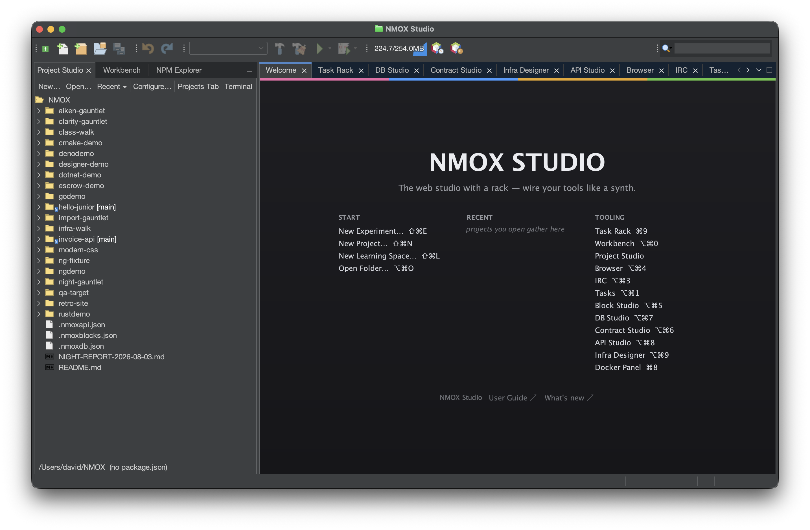

Pick a template, give it a throwaway name, and note the checkbox that
is already on — dependencies install at creation, so the first Run
works instead of teaching you about `node_modules`:

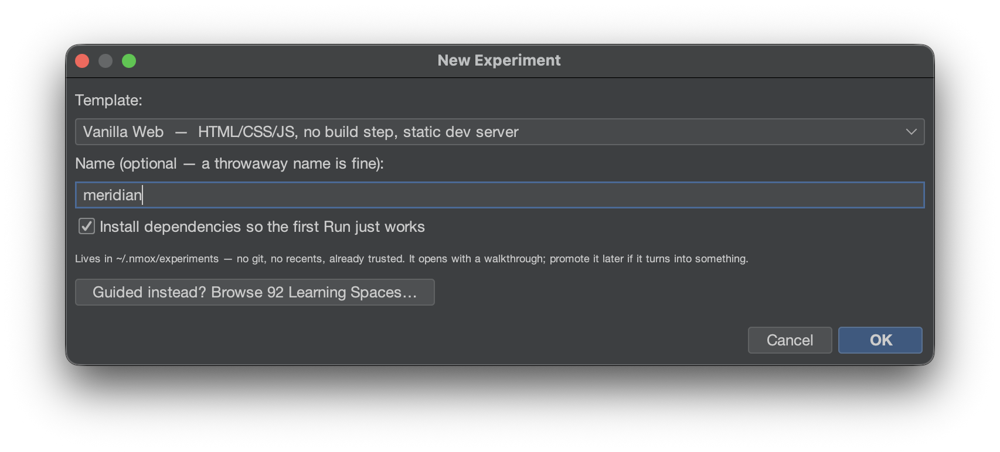

The experiment lands in `~/.nmox/experiments` — no git, no recents,
already trusted — and opens on its own walkthrough. `EXPERIMENT.md`
tells you what to press, which file to change, and where this stack's
IDE intelligence lives:

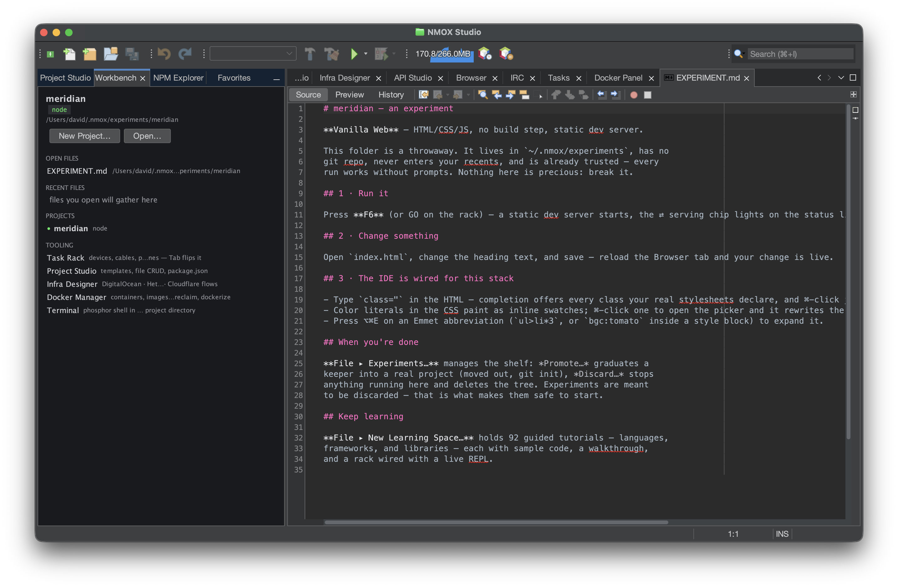

## 9:20 — the palette

Meridian's colors go into `style.css` as design tokens. The editor
paints every color literal *as its color* — the hex values, the named
`tomato`, and the `var(--espresso)` references, which resolve through
the token to show the real swatch:

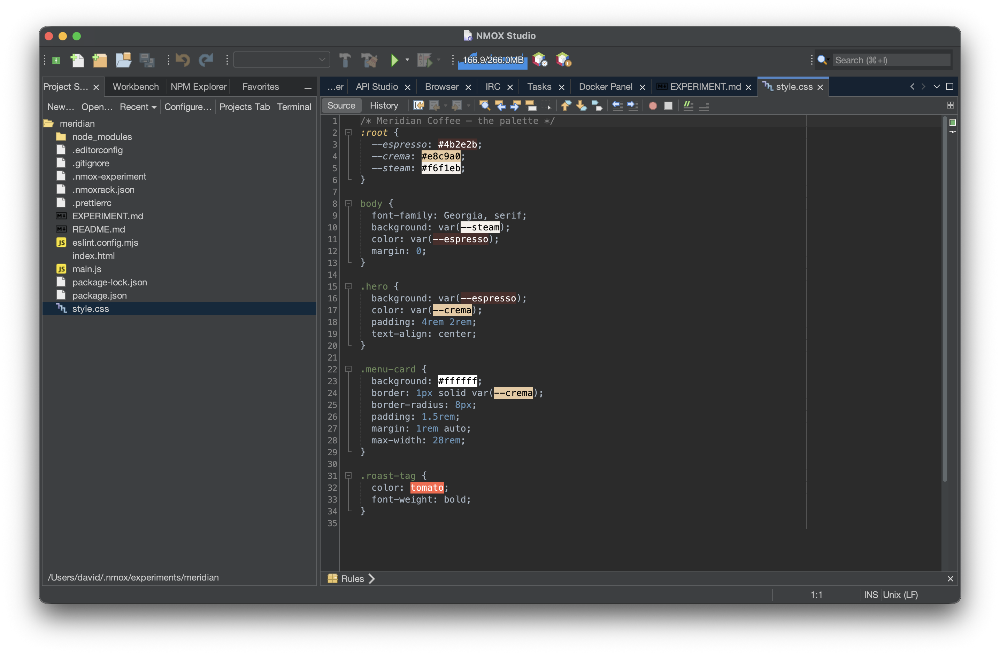

⌘-click any swatch to open the picker; it rewrites the literal in its
authored form. Over in `index.html`, type `class="` and completion
offers every class your real stylesheets declare — with the declaring
file named beside each one:

## 9:40 — first serve

Press **F6**. That one keystroke is most of the studio's story: a
static dev server starts through the rack, the **⇄ serving** chip
lights on the status line, the in-app Browser opens the page, the
Output pane streams the real server log, and the Navigator outlines
your stylesheet's rules:

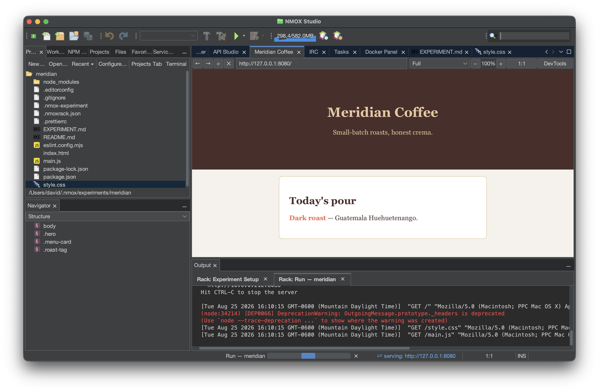

## 10:00 — the browser that knows your source

Open **DevTools** on the Browser toolbar. The DOM pane's **Pick
element** puts a crosshair in the live page — click the hero heading
and it rings in the page, selects itself in the tree, and shows its
computed styles. From here, **Open Source** jumps to the line of
`index.html` that produced it, and **Edit Style…** lands a change back
in the stylesheet the cascade actually chose:

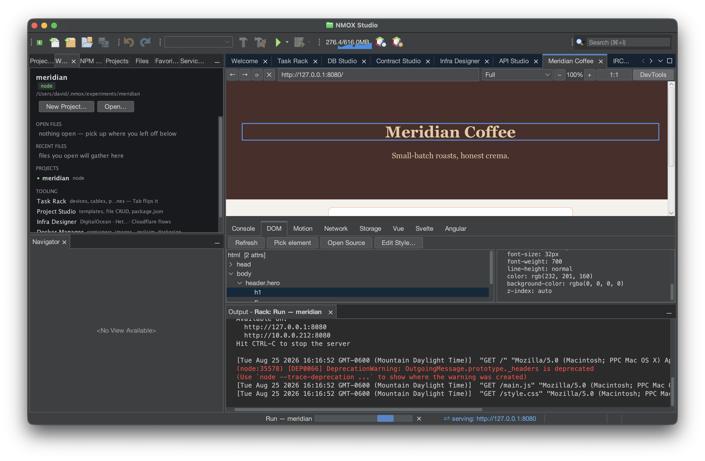

*(This scene found a real bug while this tutorial was being made —
the DOM pane had broken in v2.37.5 — which is the whole idea: these
documents are walked, not imagined. The fix ships in the same release
as this page.)*

## 11:00 — it grew up: promote it

The experiment stopped being throwaway around the third good idea.
**File ▸ Experiments…** shows the shelf — each experiment with its
template, age, and the honest disk cost — and **Promote…** moves it
out, drops the marker, and git-inits it into an ordinary project:

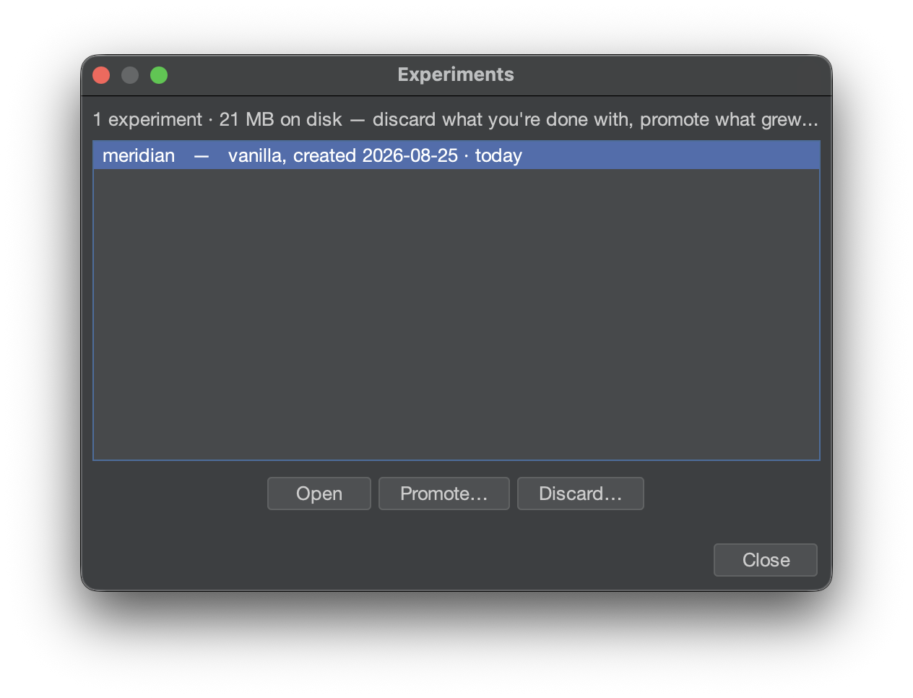

## 12:00 — the API

The order counter needs a backend, so `server.js` gets an Express
route. The editor's full-stack intelligence follows: routes outline
as `GET /path` in the Navigator, `process.env.` completes from your
real `.env`, ⌘-clicking a `fetch('/path')` jumps to the route that
serves it — and right-clicking a route line offers **Test in API
Studio**, which drafts the request with the verb and path filled in:

Send it and the response pane grades the security headers, **Copy
curl** gives the byte-exact command, and **Copy TS Types** turns the
JSON into interfaces on your clipboard.

## 13:00 — the data

Orders live in SQLite. DB Studio (⌥⌘7) connects with bundled
drivers, keeps passwords in the OS keychain only, and its grid edits
rows for real — PK-gated, previewing the exact UPDATEs before
anything runs:

## 14:00 — the board runs the afternoon

The Task Board (⌥⌘1) keeps the day honest. Cards, advisory WIP
limits, a blocked card that names its owner *and* the unblock action
— and the sprint header counting the days:

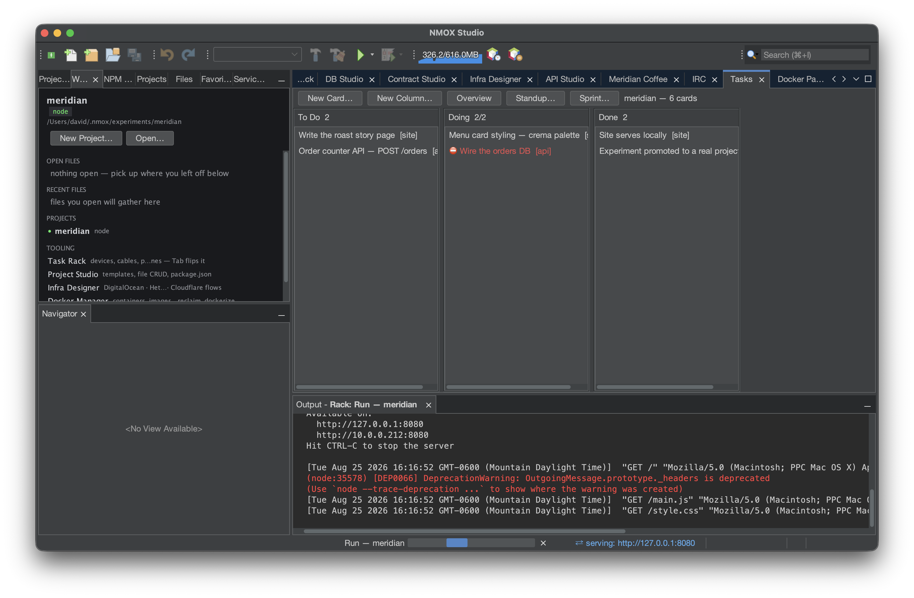

The **Overview** face turns the board's own records into flow: the
burndown against the ideal line, done-per-day bins, aging cards, the
blocker register, and the time clock's honest tally:

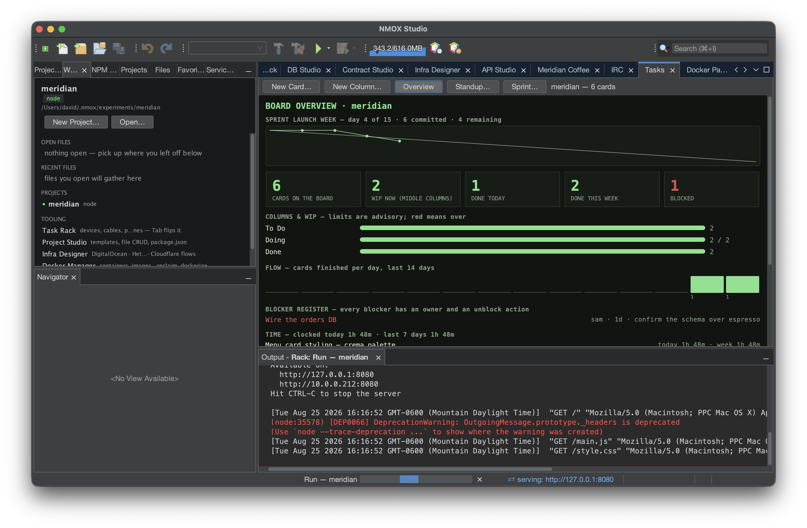

And when someone asks "where are we?" — the **Standup** button
answers from the records, never from memory:

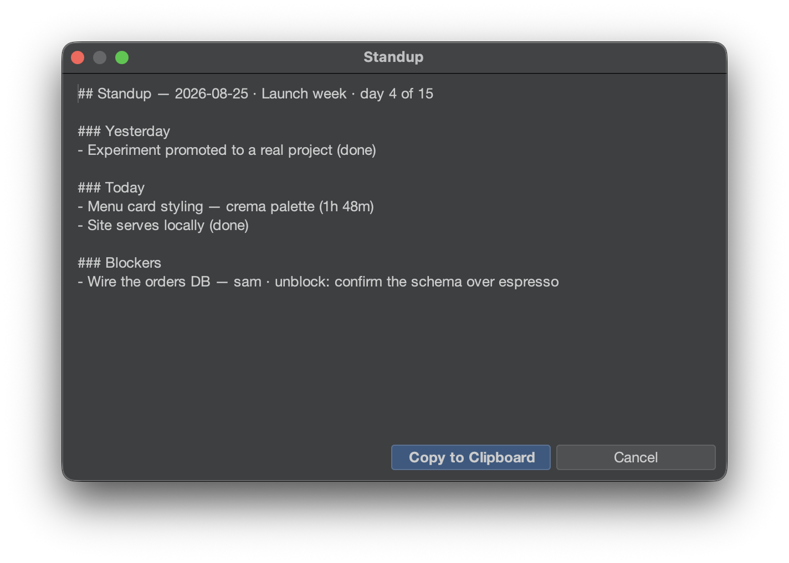

## 15:00 — launch prep, the kit way

Four dialogs get Meridian launch-ready, each idempotent and
never-clobbering: the **Standards Kit** writes robots.txt, sitemap,
manifest, and RFC 9116 security.txt; the **PWA Kit** forges the icon
set and service worker; the **A11y Kit** wires the focus ring, skip
link, and `lang` with a checklist for what automation can't check;
and the **I18n Kit** makes it translatable — locale catalogs, a
dependency-free applier, and `<html lang>` kept truthful:

Run any kit twice: the second report speaks only refusals, and the
bytes don't change. That's the house style — tools that say what they
did, refuse out loud, and never guess.

## 16:00 — the deep end

The same building has floors this story didn't need today. The
**Infra Designer** (⌥⌘9) drags real cloud resources onto a canvas —
dry-run by default, costs estimated before any token is spent:

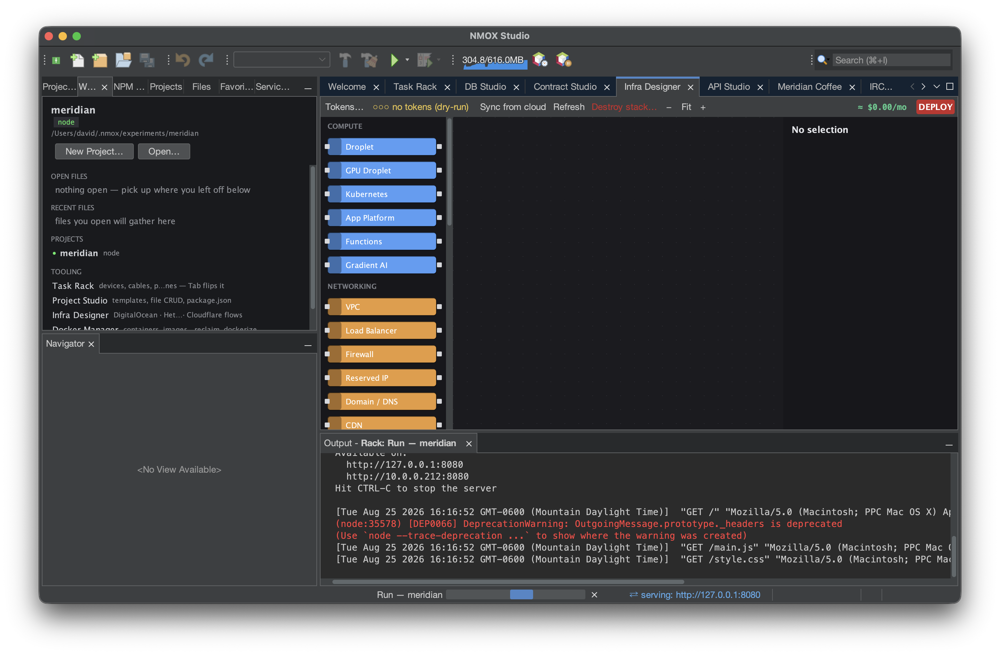

**Contract Studio** (⌥⌘6) does the same honest job for smart
contracts — artifacts, ABI-driven calls, and never, by construction,
your private keys:

The **Docker Panel** (⌘8) manages containers and offers DB Studio
connections for the databases it sees; the **IRC client** (⌥⌘3) is a
real one, proven against Libera.Chat:

And when the next stack is one you don't know yet, **File ▸ New
Learning Space…** holds 93 guided tutorials — sample code, a
walkthrough, and a rack wired with a live REPL.

## 16:40 — an agent looks over your shoulder

Tools ▸ **Agent Port (MCP)…** starts a loopback-only MCP server with a
token that exists nowhere but this dialog. Paste the config into your
agent's `.mcp.json` and it can ask what is serving, what you have
open, where `checkout` is declared, and what ran lately — a run you
stopped yourself reads *stopped*, never *failed* — or subscribe and be
told the moment a run starts. It can ask; it can never run, write, or
stop anything, and the build fails if that ever changes:

## 17:00 — close

Count what the day used: an experiment that installed its own
dependencies, an editor that knows your classes and colors, one
keystroke from code to served page, a browser that points back at
source lines, an API workbench, a database suite, a board that wrote
the standup itself, and four kits that made launch prep a set of
dialogs. Every gesture either worked, or told you exactly why it
wouldn't — nothing silent, nothing guessed, nothing clobbered.

That's NMOX Studio. Tomorrow's pour: promote the experiment, close
the sprint, ship.

## 17:20 — epilogue: the story serves itself

Meridian's tabs are closed, but one gesture is left. **Help ▸ NMOX
Studio Website (local)** — and the product serves its own story to
you, from inside the install, on a localhost port with the ⇄ serving
chip lit to prove it. The page's accessibility stylesheet is the A11y
Kit's own output and its EN/ES switch rides the I18n Kit's helper,
byte-for-byte, build-gated — the site is built from the same parts
the day was. The same bytes are on the public web at
<https://nmox.github.io/NMOX-Studio/>, so tomorrow you can send
someone the story before they ever install it.

---

*Companion references: the [user guide](user-guide.md) covers every
feature in depth; the [Kitchen Sink](kitchen-sink.md) is the
station-by-station do/see tour; the [visual tour](tour.md) is the
five-minute skim.*
