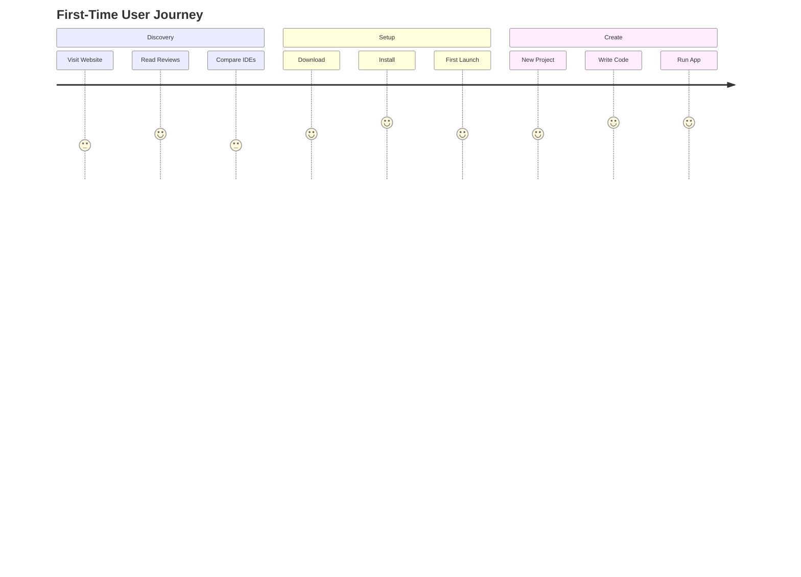
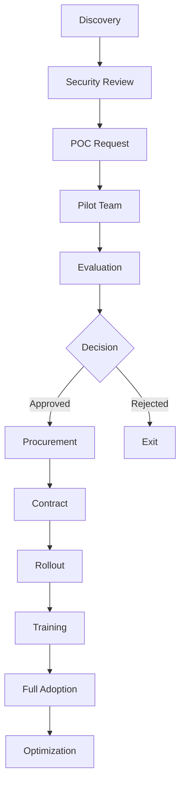

# User Journey Maps

## 🚀 Journey 1: First-Time User Onboarding

### Persona: Alex Kim - Junior Developer
**Goal:** Set up NMOX Studio and create first project  
**Success:** Running "Hello World" web app in <5 minutes

### Journey Stages

#### 1. Discovery (Pre-Download)
**Touchpoints:** Website, GitHub, Reviews  
**Actions:** Research IDEs, compare features, read docs  
**Emotions:** 😕 Overwhelmed by choices → 😊 Excited about free professional tool  
**Pain Points:** Too many IDE options, unclear differences  
**Opportunities:** Clear comparison charts, video demos

#### 2. Download & Install
**Touchpoints:** Download page, installer  
**Actions:** Choose platform, download, run installer  
**Emotions:** 😊 Hopeful → 😰 Anxious about system requirements  
**Pain Points:** Large download size, unclear requirements  
**Opportunities:** Progressive download, clear requirements

#### 3. First Launch
**Touchpoints:** Welcome screen, UI  
**Actions:** Initial setup, theme selection, workspace creation  
**Emotions:** 😍 Impressed by UI → 😕 Confused by options  
**Pain Points:** Too many initial choices  
**Opportunities:** Smart defaults, guided setup

#### 4. Create Project
**Touchpoints:** New project wizard, templates  
**Actions:** Select template, configure project, create files  
**Emotions:** 😊 Confident with templates → 🎉 Success!  
**Pain Points:** Template selection paralysis  
**Opportunities:** Recommended templates, preview

#### 5. Write Code
**Touchpoints:** Editor, IntelliSense, terminal  
**Actions:** Type code, use auto-complete, run commands  
**Emotions:** 😎 Productive → 🚀 Empowered  
**Pain Points:** Learning shortcuts  
**Opportunities:** Interactive tutorials, tooltips

### Key Metrics
- Time to download: <2 minutes
- Time to install: <1 minute
- Time to first code: <3 minutes
- Time to running app: <5 minutes
- Completion rate: >80%

---

## 💼 Journey 2: Professional Migration from VS Code

### Persona: Sarah Chen - Full-Stack Developer
**Goal:** Migrate existing projects from VS Code  
**Success:** All projects working with improved performance

### Journey Stages

#### 1. Evaluation
**Touchpoints:** Feature comparison, performance benchmarks  
**Actions:** Test with real project, measure performance  
**Emotions:** 🤔 Skeptical → 😲 Impressed by speed  
**Pain Points:** Learning new UI, missing extensions  
**Opportunities:** VS Code importer, extension alternatives

#### 2. Migration
**Touchpoints:** Import wizard, settings migration  
**Actions:** Import projects, configure settings, install tools  
**Emotions:** 😰 Worried about breaking changes → 😌 Relieved  
**Pain Points:** Different keybindings, missing features  
**Opportunities:** Keybinding presets, migration guide

#### 3. Adaptation
**Touchpoints:** Editor, debugging, testing  
**Actions:** Daily development, explore features  
**Emotions:** 😕 Occasionally frustrated → 😊 Discovering benefits  
**Pain Points:** Muscle memory, workflow differences  
**Opportunities:** Progressive disclosure, quick wins

#### 4. Optimization
**Touchpoints:** Advanced features, customization  
**Actions:** Customize workspace, create snippets, optimize workflow  
**Emotions:** 😎 Confident → 🚀 More productive  
**Pain Points:** Hidden features  
**Opportunities:** Power user tips, webinars

#### 5. Advocacy
**Touchpoints:** Team sharing, social media  
**Actions:** Recommend to team, share tips, contribute  
**Emotions:** 😍 Enthusiastic → 🌟 Evangelist  
**Pain Points:** Convincing team  
**Opportunities:** Team trial, success stories

### Key Metrics
- Migration completion: >90%
- Feature discovery: 5+ features/week
- Productivity gain: >20%
- Team referrals: 2+ per user
- Retention: >80% at 90 days

---

## 🏢 Journey 3: Enterprise Team Adoption

### Persona: Marcus Johnson - Enterprise Architect
**Goal:** Standardize team on NMOX Studio  
**Success:** 25+ developers using daily with 90% satisfaction

### Journey Stages

#### 1. Discovery & Research
**Timeline:** Weeks 1-2  
**Actions:** Security review, compliance check, POC request  
**Stakeholders:** Security, Legal, Procurement  
**Concerns:** Data security, vendor stability, support SLA

#### 2. Proof of Concept
**Timeline:** Weeks 3-6  
**Actions:** Pilot with 5 developers, test integrations  
**Success Criteria:** Performance benchmarks, developer feedback  
**Risks:** Integration failures, resistance to change

#### 3. Procurement
**Timeline:** Weeks 7-10  
**Actions:** Negotiate contract, security approval, budget approval  
**Stakeholders:** CFO, CISO, Legal  
**Challenges:** Budget cycles, approval chains

#### 4. Rollout
**Timeline:** Weeks 11-14  
**Actions:** Training sessions, gradual migration, support setup  
**Phases:** Early adopters → Full team → Organization  
**Critical:** Change management, training quality

#### 5. Optimization
**Timeline:** Ongoing  
**Actions:** Customize for workflows, measure productivity  
**Metrics:** Adoption rate, productivity gains, satisfaction  
**Evolution:** Feedback loop, continuous improvement

### Key Metrics
- POC success rate: >80%
- Time to decision: <10 weeks
- Rollout time: <4 weeks
- Adoption rate: >90%
- Satisfaction: >4.5/5

---

## 🎓 Journey 4: Student Learning Path

### Persona: Alex Kim - Computer Science Student
**Goal:** Learn web development with professional tools  
**Success:** Build portfolio project, get internship

### Semester Timeline

#### Month 1: Basics
- Install and setup
- HTML/CSS projects
- First JavaScript
- Git basics

#### Month 2: Frameworks
- React introduction
- Component development
- State management
- API integration

#### Month 3: Full-Stack
- Node.js backend
- Database connection
- Authentication
- Deployment

#### Month 4: Portfolio
- Personal project
- Testing & debugging
- Performance optimization
- Job preparation

### Support System
- Video tutorials
- Student community
- Mentor program
- Career resources

---

## 🚀 Journey 5: Startup Speed Development

### Persona: Emily Rodriguez - Startup CTO
**Goal:** Ship MVP in 3 months  
**Success:** Launch with 1000 users

### Sprint Progression

#### Sprint 0: Setup (Week 1)
- Team onboarding
- Project scaffolding
- CI/CD pipeline
- Development workflow

#### Sprints 1-3: Core Features (Weeks 2-7)
- Rapid prototyping
- Daily deployments
- Quick iterations
- User feedback loops

#### Sprints 4-5: Polish (Weeks 8-10)
- Bug fixes
- Performance tuning
- Security hardening
- Documentation

#### Sprint 6: Launch (Weeks 11-12)
- Production deployment
- Monitoring setup
- Launch preparation
- Go-live

### Acceleration Points
- Project templates save 1 week
- Integrated tools save 2 weeks
- Debugging efficiency saves 1 week
- Testing automation saves 1 week
- **Total time saved: 5 weeks (42%)**

---

## 📊 Journey Analytics

### Funnel Analysis

| Stage | All Users | Completion | Drop-off | Improvement |
|-------|-----------|------------|----------|-------------|
| Download | 100% | 100% | 0% | - |
| Install | 100% | 95% | 5% | Smaller installer |
| First Launch | 95% | 90% | 5% | Better onboarding |
| Create Project | 90% | 80% | 11% | Simpler templates |
| Write Code | 80% | 75% | 6% | Better tutorials |
| Daily Use | 75% | 50% | 33% | Habit formation |

### Time to Value

| User Type | Target | Current | Improvement Needed |
|-----------|--------|---------|-------------------|
| Student | 10 min | 15 min | Better templates |
| Professional | 30 min | 45 min | Import tools |
| Enterprise | 1 week | 2 weeks | Faster POC |
| Startup | 1 day | 2 days | Quick start guide |

## 🎯 Journey Optimization

### Quick Wins
1. **Onboarding Video** - 2-minute getting started
2. **Import Wizard** - Migrate from other IDEs
3. **Template Gallery** - Curated project starters
4. **Keyboard Shortcuts** - Familiar mappings
5. **Progress Tracker** - Gamified onboarding

### Medium-term
1. **AI Assistant** - Contextual help
2. **Peer Programming** - Built-in collaboration
3. **Learning Paths** - Structured tutorials
4. **Performance Coach** - Optimization tips
5. **Success Manager** - Enterprise support

### Long-term
1. **Predictive Setup** - AI-configured workspace
2. **Workflow Automation** - Task automation
3. **Skill Development** - Integrated learning
4. **Team Analytics** - Productivity insights
5. **Career Growth** - Skill certification

## 🔄 Continuous Improvement

### Feedback Loops
- In-app surveys at key moments
- User interviews monthly
- Analytics on drop-off points
- A/B testing improvements
- Community feedback integration

### Success Metrics
- Journey completion rates
- Time to value metrics
- User satisfaction scores
- Feature adoption rates
- Retention by journey type

---

**Last Updated:** January 2025  
**UX Research:** ux@nmox.studio  
**Next Review:** Monthly