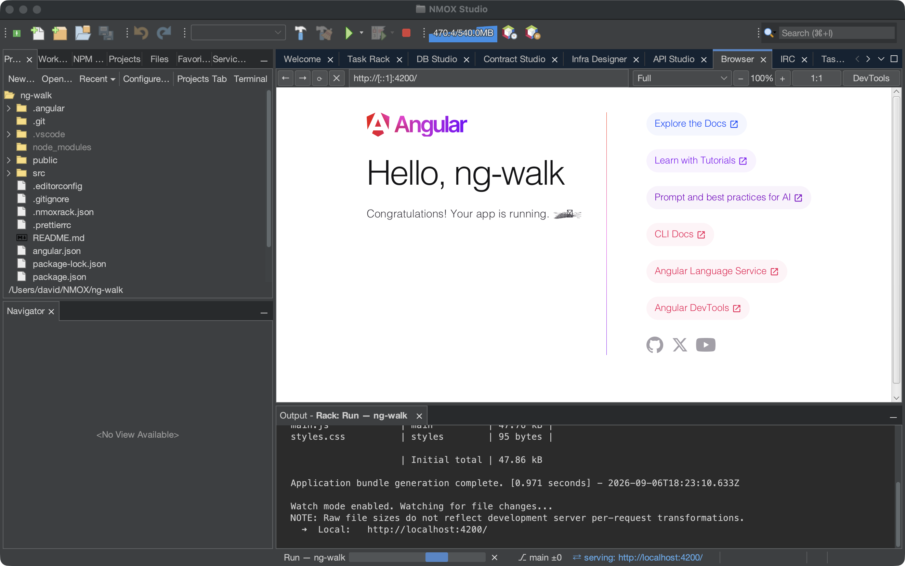

# NMOX Studio — the visual tour

**The IDE with a rack in it.**

`53 RACK DEVICES` · `87 LANGUAGE GRAMMARS` · `93 LEARNING SPACES` · `5 STUDIOS` · `11 CONTRACT CHAINS`

A NetBeans-platform IDE for the modern web where every build tool is a
piece of hardware you patch with cables, every studio is a first-class
suite tab, and every feature below shipped through a gated release with
its proofs attached. **Every screenshot on this page is the real
product.** The same tour with the product's own phosphor styling is the
website — <https://nmox.github.io/NMOX-Studio/> — which the product also
serves to you from inside the app (Help ▸ NMOX Studio Website (local)).

---

## The identity

### The Task Rack
`53 DEVICES · PATCH CABLES · PRESETS · JSON DEVICES`

Your toolchain as hardware: VERITAS runs tests with a coverage floor,
IGNITION serves anything, ANVIL is a local EVM chain, SPECTER drives
Playwright, ORACLE explains failures. Wire a cable from a FAIL jack to
a trigger and lanes coordinate themselves. Patches save as JSON, export
to GitHub Actions CI, and resurrect after a `kill -9`. The fleet is not
fixed: drop a JSON file in `~/.nmox/devices.d/` and a real device is on
the shelf — no Java, no restart — and the host keeps every law for it
(trust gates the spawn, the role picks the colour, a file it cannot read
honestly is skipped whole with the reason logged). The toolbar's ▶ runs
the aimed project the way its toolchain runs, and the ■ stops every
command the product started for you.


---

## The editor

### Polyglot editing
`87 GRAMMARS · LSP · MINIMAP · STICKY SCROLL · GO TO SYMBOL`

From TypeScript to Fortran to COBOL to the contract languages the Web3
kit writes (Clarity, Aiken, Tact) — highlighting, typing intelligence,
spellcheck-in-comments, keyword completion, and a structure outline for
58 file types. Every editor carries a **minimap** beside its scrollbar
and **sticky scroll** pinning the enclosing declarations above the
text; **Go to Symbol** (⌥⇧⌘O) reaches any symbol project-wide; the
**Tests window** (⌥⌘2) lists every test before anything runs. Color
literals wear **swatches** — through `var()` tokens too — with a
click-to-pick chooser; `class="…"` completes from the project's real
stylesheets; Emmet (⌥⌘E) expands in HTML, Angular templates, Vue and
Svelte components, and stylesheets. Language servers launch through
Workspace Trust: a cloned repo's committed binaries never run without
your yes.


### The AI faces
`ASK · EDIT · COMPLETE · DRAFT COMMIT · EXPLAIN`

Select code in any editor and **Ask ORACLE** about it — follow-ups carry
the full history, so "that syntax" means what it meant one answer ago.
**Edit with ORACLE** turns an instruction into a before/after preview
you approve, applied as one undo. **Complete with ORACLE** (⌥⌘G) sends
the code around the caret once and paints the answer as ghost text —
Tab inserts, any edit dismisses; no always-on stream, the gesture is the
gate. **Draft Commit Message** on the git chip writes from your staged
diff and never commits. And the rack's ORACLE device does the same for
a failed run: press **EXPLAIN**, then keep asking — the same face
reaches API Studio responses, DB Studio errors, the Browser's page
errors and a failed Check My Work. Each flow has its own one-time
consent naming exactly what is sent (never the rest of the file), keys
live in the OS keychain, and the transcript shows precisely what the
model was told. Fast (Haiku) or Deep (Sonnet), remembered.

```text
You: What does UFCS mean here, and when should I prefer it?
ORACLE: UFCS is Uniform Function Call Syntax — `"nim".greet()`
        and `greet("nim")` are the same call…
You: Show me one more idiomatic example of it.
ORACLE: # UFCS style — reads naturally as a pipeline
        echo numbers.filter(proc(x: int): bool = x > 2)

— live session transcript, real Anthropic API
```


### Debugging, out of the box
`JS/TS · CHROME · PYTHON · GO`

Breakpoints for JavaScript and TypeScript with zero setup — a vendored
js-debug adapter plus a session multiplexer the platform lacked.
"Debug in Chrome" launches a throwaway-profile browser at your live dev
server and page breakpoints hit in the IDE. Every debug spawn passes
the same trust gate, and a stopped session leaves zero orphan
processes.


### Angular, first-class
`ANGULAR (STANDALONE) TEMPLATE · LANGUAGE SERVICE · ⌘B IN TEMPLATES · HALO`

The framework bet. The New Project wizard scaffolds an Angular 21
workspace that is proven to install and run before it ships; the ▶
runs `ng serve`, the printed address lights the ⇄ chip, and the in-app
Browser opens on the page at the loopback the CLI actually bound.
Templates open under their own editor with the Angular team's grammars,
and the Angular Language Service — installed into the project by one
click on the balloon that offers it — type-checks a template against
its component class as you type, so a misspelled property gets the
compiler's own *Did you mean…?* squiggle in the editor. ⌘B jumps from
a template to the declaration, Open Angular Template / Component /
Styles / Spec switch the four-file set, the routes file outlines as its
route table, HALO in the rack speaks `ng` verbs, and the DevTools
Angular pane reads the live component tree of a dev build.



### The source-aware Browser
`⌥⌘4 · PICK ELEMENT · OPEN SOURCE · EDIT STYLE…`

The in-app Browser is a real WebKit engine with DevTools the product
owns. In the DOM tab, **Pick element** arms a crosshair in the live page
— click, and the tree selects the element with its computed styles and
a WCAG contrast verdict. **Open Source** opens the HTML file that
produced it, at the line — only for pages it can trace to your disk
(`file://` and anything a rack device serves), refusing honestly
otherwise. **Edit Style…** applies a tweak inline instantly, then lands
it in the source stylesheet in the rule the page's own cascade chose,
every other byte untouched. A page error on your project lands in the
editor as a squiggle and an Action Items row, with **Explain error…**
one click away; save-to-reload and viewport presets close the loop.


### The Task Board and sprints
`⌥⌘1 · KANBAN · WIP LIMITS · BURNDOWN · STANDUP`

A per-project kanban in `.nmoxtasks.json` beside the code: cards
dragged or keyed between columns, advisory WIP limits that turn the
header red and never block a move, epic labels, a blocker register with
owners and unblock actions, and one time clock per board. The
**Overview** reads the same board as a dashboard — WIP now, done today
and this week, a 14-day flow strip, aging cards. **Sprints** name a
window and the burndown is reconstructed from the cards' own done
stamps; **Sprint Report…** and **Close Sprint…** archive for velocity;
the **Standup** button turns it all into the daily report as markdown.
Commit the file and the team shares one board — a teammate's push wins
over a stale gesture, and card text always renders as plain characters.


### Made to be shown
`PRESENTATION MODE · SHOW KEYSTROKES · COPY AS MARKDOWN · SCREENSHOTS`

One toggle (View ▸ Presentation Mode) and every open editor is +10 pt,
the in-app Browser's page is at 150%, the Output window and every open
Terminal follow — live, never persisted, back exactly when you toggle
off. Show Keystrokes puts the chord you pressed at the bottom of the
window (chords only; what you type never reaches the projector). Copy as
Markdown — plain, or with the GitHub link to the same lines — Copy
Project Tree as Markdown, and the screenshot trio (the window, the
editor tab alone, or straight onto the clipboard, all painted by Swing
at 2x with no screen-recording permission) are the same persona's other
daily motions.


---

## Web3, honestly

### Contract Kit + Contract Studio
`FILE ▸ CONTRACT KIT (WEB3)… · ⌥⌘6`

One wizard scaffolds a live-proven starter — manifest, contract, native
test, next-step notes — for eleven chains. Every template ran green
against its real toolchain before it shipped, and each chain teaches
its own refusal idiom: Aiken declares failing tests, TON bounces the
transaction, Bitcoin makes the spend unspendable. Contract Studio then
gives you an ABI-driven Interact pane, live block/event watch, gas and
EIP-170 verdicts, token faces for ERC-20/721/1155, Import ABI… for any
contract on any chain — and by construction, private keys never touch
the IDE.

> **The eleven chains:** Solidity/Foundry · Stellar Soroban · Solana ·
> CosmWasm · ink! · Cairo · Move (Sui + Aptos) · Bitcoin Miniscript ·
> Clarity · Cardano Aiken · TON Tact

New to contracts entirely? Start with
**[the Beginner's Guide](smart-contracts-beginners-guide.md)**.


---

## The studios

### Block Studio
`⌥⌘5 · BLOCKS ⇄ CODE, BYTE-EXACT`

Compose real Web Components from interlocking typed pieces — the
generated custom element appears beside the canvas with per-piece code
ranges, and the round trip is law: `generate(parse(code))` is
byte-identical. The live preview serves your whole component library so
components render composed, and the canvas is fully keyboard- and
screen-reader-operable.


### DB Studio
`⌥⌘7 · SIX ENGINES, BUNDLED DRIVERS`

SQLite, PostgreSQL, MySQL, MariaDB, MongoDB, CouchDB — schema tree,
kind-aware console, per-statement grids with in-grid row editing
(PK-gated, Apply previews the exact UPDATEs). Passwords are
keychain-only, EXPLAIN refuses multi-statement text, and a hostile
server can't read your files: local-infile is off at connect.


### API Studio
`⌥⌘8 · COLLECTIONS · {{VAR}} ENVIRONMENTS`

Postman-style collections with assertions and per-response
security-header grades — every response streams through a capped
reader, sends are cancellable, and auth tokens live in the OS keychain,
never in the committable workspace file. Import curl, `.http`, OpenAPI,
Postman and HAR; export `.http`.


### Infra Designer
`⌥⌘9 · DIGITALOCEAN · HETZNER · CLOUDFLARE`

A Node-RED-style canvas for real cloud resources: drag droplets and
DNS, see cost estimates, deploy with cloud-init, sync live resources
back and watch drift. Destroy confirmations default to the safe button,
the canvas locks during live operations, and tokens are keychain-only.


### Docker Panel
`CONTAINERS · IMAGES · DOCKERIZE`

Engine overview, containers, images, volumes, networks — plus a
Dockerize tab that generates a production Dockerfile, .dockerignore and
compose file tuned to your detected toolchain.


---

## Learning & wayfinding

### The learning loop
`⇧⌘L · 93 BUILT-IN TUTORIALS · CHECK MY WORK`

Every space is a real project: sample code, a walked tutorial, and a
rack pre-wired with an in-rack REPL you actually type into. From your
first web page to Gleam to a Cardano validator — each one proven
against its real toolchain before it shipped, with an INSTALL button
when the interpreter is missing. No terminal needed. Spaces with
checkpoints **check your work** for real — file claims verified
pure-Java, command claims through the space's own toolchain — every ✗
answering with the space's own hint and offering the ORACLE tutor; and
**Export as Learning Space…** turns any project into a drop-in your
students can load. Experiments teach the same way: every one is born
with a walkthrough that opens on aim.


### The Agent Port
`TOOLS ▸ AGENT PORT (MCP)… · READ-ONLY BY CONSTRUCTION`

One dialog starts a Model Context Protocol server any agent can
connect to: loopback only, a per-start bearer token, any browser
`Origin` refused. Twelve typed tools, `nmox://` resources, prompts
that fold live state into the question, argument completion, and an
event stream that tells a subscribed agent when a run starts or a
server goes live. It can read everything and change nothing — a
build-failing ledger bans every spawn, write and stop primitive from
the package — and a port that can read the IDE is never invisible: the
status line wears a `⌁ agent port` chip while it runs.


### Quick Search and the chips
`⌘I · EVERYTHING, ONE KEYSTROKE`

Projects, rack devices, live dev servers, API requests, database
connections, infra nodes, Task Board cards and epic labels — one search
field reaches all of it. The status line tells the truth about the
session: the **⇄ serving** chip always knows what's serving where and
opens it in the in-app Browser, the **⎇ branch** chip carries the git
verbs and your pull requests through your own `gh`, and the **⌁ agent
port** chip says when something can read the IDE.


---

## House laws — enforced by tests, not intentions

- Private keys never touch the IDE — every chain CLI owns its identities
- AI flows are consent-gated per disclosure; keys keychain-only, nothing sent without a gesture
- A cloned repo's code never runs without Workspace Trust saying yes
- Every HTTP, process and file read in the product is bounded
- Quit leaves zero orphan processes; `kill -9` resurrects your session
- Destructive dialogs default to the safe button, everywhere
- No external text renders as markup — a hostile file name is just its letters
- Every refusal speaks; nothing fails silently

**Install:** on macOS, the one-time `brew trust --cask nmox/nmox-studio/nmox-studio`,
then `brew install nmox/nmox-studio/nmox-studio` — or the macOS / Linux /
Windows installers with bundled runtimes on
[every release](https://github.com/NMOX/NMOX-Studio/releases/latest).
