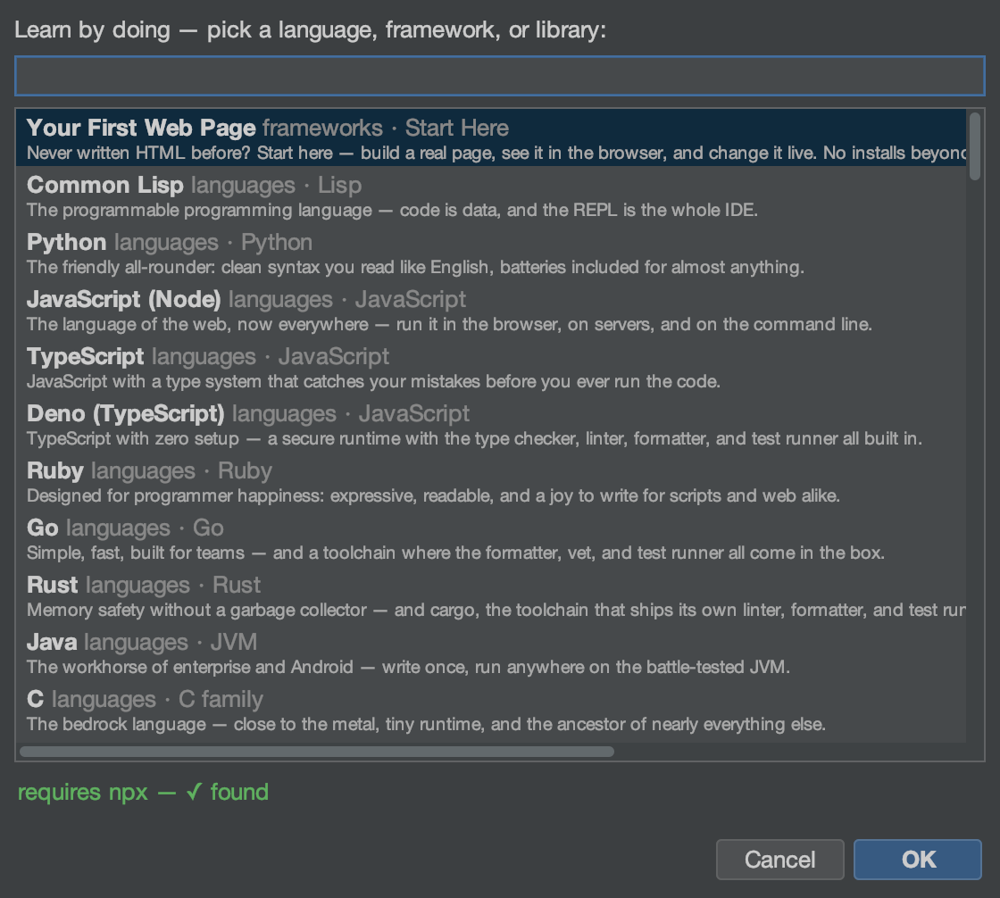

# NMOX Studio — the visual tour

**The IDE with a rack in it.**

`53 RACK DEVICES` · `78 LANGUAGE GRAMMARS` · `88 LEARNING SPACES` · `5 STUDIOS` · `11 CONTRACT CHAINS`

A NetBeans-platform IDE for the modern web where every build tool is a
piece of hardware you patch with cables, every studio is a first-class
suite tab, and every feature below shipped through a gated release with
its proofs attached. **Every screenshot on this page is the real
product.** (Prefer this page with the product's own phosphor styling?
Open [tour.html](tour.html) in a browser from a checkout.)

---

## The identity

### The Task Rack
`53 DEVICES · PATCH CABLES · PRESETS`

Your toolchain as hardware: VERITAS runs tests with a coverage floor,
IGNITION serves anything, ANVIL is a local EVM chain, SPECTER drives
Playwright, ORACLE explains failures. Wire a cable from a FAIL jack to
a trigger and lanes coordinate themselves. Patches save as JSON, export
to GitHub Actions CI, and resurrect after a `kill -9` — and a
third-party Device SPI lets anyone build new hardware.


---

## The AI surface

### Ask ORACLE
`RIGHT-CLICK ▸ ASK ORACLE ABOUT SELECTION…`

Select code in any of 77 languages and hold a conversation about it —
follow-ups carry the full history, so "that syntax" means what it meant
one answer ago. The rack's ORACLE device does the same for failed runs:
press EXPLAIN, then keep asking. Each flow has its own one-time consent
naming exactly what is sent (the selection, file name, language, your
question — never the rest of the file), keys live in the OS keychain,
and the transcript shows precisely what the model was told. Fast
(Haiku) or Deep (Sonnet), remembered.

```text
You: What does UFCS mean here, and when should I prefer it?
ORACLE: UFCS is Uniform Function Call Syntax — `"nim".greet()`
        and `greet("nim")` are the same call…
You: Show me one more idiomatic example of it.
ORACLE: # UFCS style — reads naturally as a pipeline
        echo numbers.filter(proc(x: int): bool = x > 2)

— live session transcript, shipped v1.155.0, real Anthropic API
```


---

## The editor

### Polyglot editing
`78 GRAMMARS · LSP · NAVIGATOR OUTLINE`

From TypeScript to Fortran to COBOL to the contract languages the Web3
kit writes (Clarity, Aiken, Tact) — highlighting, typing intelligence,
spellcheck-in-comments, keyword completion, and a structure outline for
60+ mimes. Language servers launch through Workspace Trust: a cloned
repo's committed binaries never run without your yes.


### Debugging, out of the box
`JS/TS · CHROME · PYTHON · GO`

Breakpoints for JavaScript and TypeScript with zero setup — a vendored
js-debug adapter plus a session multiplexer the platform lacked.
"Debug in Chrome" launches a throwaway-profile browser at your live dev
server and page breakpoints hit in the IDE. Every debug spawn passes
the same trust gate, and a stopped session leaves zero orphan
processes.


---

## Web3, honestly

### Contract Kit + Contract Studio
`FILE ▸ CONTRACT KIT (WEB3)… · ⌥⌘6`

One wizard scaffolds a live-proven starter — manifest, contract, native
test, next-step notes — for eleven chains. Every template ran green
against its real toolchain before it shipped, and each chain teaches
its own refusal idiom: Aiken declares failing tests, TON bounces the
transaction, Bitcoin makes the spend unspendable. Contract Studio then
gives you an ABI-driven Interact pane, live block/event watch, gas and
EIP-170 verdicts — and by construction, private keys never touch the
IDE.

> **The eleven chains:** Solidity/Foundry · Stellar Soroban · Solana ·
> CosmWasm · ink! · Cairo · Move (Sui + Aptos) · Bitcoin Miniscript ·
> Clarity · Cardano Aiken · TON Tact

New to contracts entirely? Start with
**[the Beginner's Guide](smart-contracts-beginners-guide.md)**.


---

## The studios

### Block Studio
`⌥⌘5 · BLOCKS ⇄ CODE, BYTE-EXACT`

Compose real Web Components from interlocking typed pieces — the
generated custom element appears beside the canvas with per-piece code
ranges, and the round trip is law: `generate(parse(code))` is
byte-identical. The live preview serves your whole component library so
components render composed, and the canvas is fully keyboard- and
screen-reader-operable.


### DB Studio
`⌥⌘7 · SIX ENGINES, BUNDLED DRIVERS`

SQLite, PostgreSQL, MySQL, MariaDB, MongoDB, CouchDB — schema tree,
kind-aware console, per-statement grids with in-grid row editing
(PK-gated, Apply previews the exact UPDATEs). Passwords are
keychain-only, EXPLAIN refuses multi-statement text, and a hostile
server can't read your files: local-infile is off at connect.


### API Studio
`⌥⌘8 · COLLECTIONS · {{VAR}} ENVIRONMENTS`

Postman-style collections with assertions and per-response
security-header grades — every response streams through a capped
reader, sends are cancellable, and auth tokens live in the OS keychain,
never in the committable workspace file.


### Infra Designer
`⌥⌘9 · DIGITALOCEAN · HETZNER · CLOUDFLARE`

A Node-RED-style canvas for real cloud resources: drag droplets and
DNS, see cost estimates, deploy with cloud-init, sync live resources
back and watch drift. Destroy confirmations default to the safe button,
the canvas locks during live operations, and tokens are keychain-only.


### Docker Panel
`CONTAINERS · IMAGES · DOCKERIZE`

Engine overview, containers, images, volumes, networks — plus a
Dockerize tab that generates a production Dockerfile, .dockerignore and
compose file tuned to your detected toolchain.


---

## Learning & wayfinding

### Learning Spaces
`⇧⌘L · 88 BUILT-IN TUTORIALS`

Every space is a real project: sample code, a walked tutorial, and a
rack pre-wired with an in-rack REPL you actually type into. From jQuery
to Gleam to a Cardano validator — each one proven against its real
toolchain before it shipped, with an INSTALL button when the
interpreter is missing. No terminal needed.



### Quick Search
`⌘I · EVERYTHING, ONE KEYSTROKE`

Projects, rack devices, live dev servers, API requests, database
connections, infra nodes — one search field reaches all of it, and the
⇄ chip on the status line always knows what's serving where.


---

## House laws — enforced by tests, not intentions

- Private keys never touch the IDE — every chain CLI owns its identities
- AI flows are consent-gated per disclosure; keys keychain-only, wiped after use
- A cloned repo's code never runs without Workspace Trust saying yes
- Every HTTP, process and file read in the product is bounded
- Quit leaves zero orphan processes; `kill -9` resurrects your session
- Destructive dialogs default to the safe button, everywhere

**Install:** `brew tap NMOX/NMOX-Studio https://github.com/NMOX/NMOX-Studio`, then the one-time `brew trust --cask nmox/nmox-studio/nmox-studio`, then `brew install --cask nmox-studio` — macOS /
Linux / Windows installers with bundled runtimes on
[every release](https://github.com/NMOX/NMOX-Studio/releases/latest).
