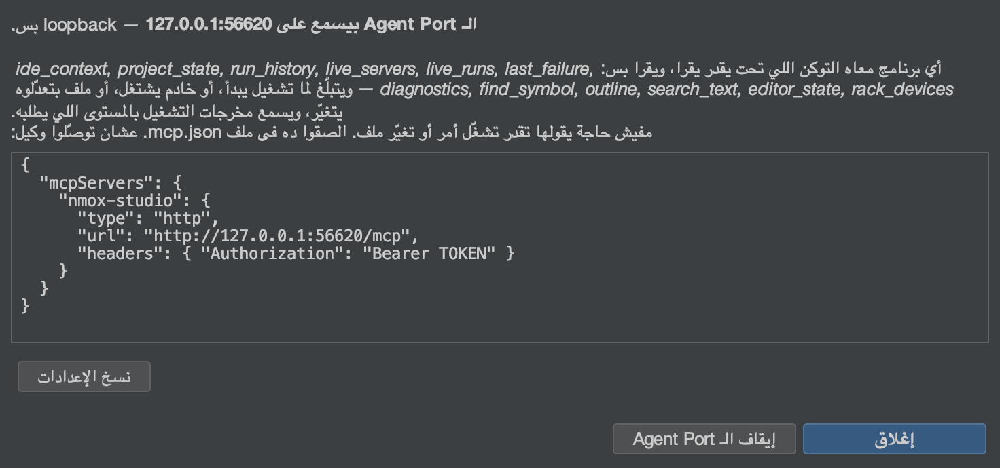

# الـ Agent Port ‏(MCP)

<!-- languages -->
[English](agent-port.md) · [Español](agent-port.es.md) · [Français](agent-port.fr.md) · [Deutsch](agent-port.de.md) · [Русский](agent-port.ru.md) · [Українська](agent-port.uk.md) · [Polski](agent-port.pl.md) · [Português (Brasil)](agent-port.pt.md) · [Bahasa Indonesia](agent-port.id.md) · [Filipino](agent-port.tl.md) · [Tiếng Việt](agent-port.vi.md) · [简体中文](agent-port.zh.md) · [हिन्दी](agent-port.hi.md) · [עברית](agent-port.he.md) · **العربية**
<!-- /languages -->

*وجّهوا وكيل AI على الـ IDE بتاعكم — وسيبوه يقرا، ومايشغّلش أبدًا.*



NMOX Studio جاي معاه خادم Model Context Protocol. أي وكيل بيتكلم MCP
‏(Claude Code، أو مساعد في محرر، أو سكريبت بتاعكم) يقدر يتوصّل بيه ويسأل
الـ IDE عن اللي يعرفه: أنهي مشروع متوجّه عليه، وإيه اللي بيتقدّم، وإيه اللي
شغال، وإنتوا بتعدّلوا إيه، والاسم ده متعرّف فين، وإيه اللي فشل آخر مرة. هو
**للقراءة بس من أساس تصميمه**: البناء بيفشل لو أي class في package الـ Agent
Port حتى ذكر طريقة يشغّل بيها عملية، أو يكتب ملف، أو يوقف تشغيل.

## 1. شغّلوه

**اعملوا:** أدوات ‏◂‏ **Agent Port ‏(MCP)…** (اختياره بيشغّل البورت)، وبعدين **نسخ الإعدادات**.

**هتشوفوا:** ديالوج فيه نقطة الوصول (loopback بس، وبورت جديد)، وتوكن bearer
بيتعمل مع كل تشغيل، وإعدادات عميل جاهزة:

```json
{
  "mcpServers": {
    "nmox-studio": {
      "type": "http",
      "url": "http://127.0.0.1:PORT/mcp",
      "headers": { "Authorization": "Bearer TOKEN" }
    }
  }
}
```

الزقوها في ‎`.mcp.json` بتاع الوكيل بتاعكم. التوكن موجود في الديالوج ده بس —
عمره ما بيتسجل ولا بيتحفظ — وبيموت مع البورت. **إيقاف الـ Agent Port** بيقفله؛
ونفس الكلام لما تقفلوا الـ IDE. وطول ما هو بيسمع، شريط الحالة بيعرض
**⌁ Agent Port ‏:N** — البورت اللي يقدر يقرا الـ IDE بتاعكم عمره ما بيبقى
مستخبي؛ والتلميح بتاع الشارة بيعدّ الوكلاء اللي بيستقبلوا stream، والضغط عليها
بيفتح الديالوج تاني (الإعدادات، أو الإيقاف).

## 2. الأدوات

كل أداة بترد بنص للبني آدمين وكمان `structuredContent` ليه أنواع تحت
`outputSchema` متعرّف (البناء بيتأكد إن الـ schema مطابق للمخرجات الحقيقية)،
وعليها التعليق `readOnlyHint: true`.

| الأداة | بتجاوب على إيه | الوسائط |
|------|-----------------|-----------|
| `ide_context` | الصورة الكاملة اللي بتوجّهكم في طلب واحد: المشروع، والـ toolchain، والخوادم، والتشغيلات، والملف اللي بيتعدّل، وآخر فشل، وعدد التشخيصات | — |
| `project_state` | المشروع المتوجّه عليه: الاسم، والمجلد، وفرع git، والنوع المكتشف، ومدير حزم Node | — |
| `run_history` | عمليات البدء والخروج من مسجّل الرحلة، الأحدث الأول، وكل خروج معاه الأمر والكود والمدة؛ والتشغيل اللي وقفتوه بنفسكم بيتقري `stopped`، عمره ما بيتقري `failed` | `limit` |
| `live_servers` | كل خادم تطوير الـ IDE عارف إنه بيقدّم، ومعاه الـ URL بتاعه | — |
| `live_runs` | كل أمر شغال دلوقتي (اللي زرار ■ في شريط الأدوات هيوقفه)، ومن إمتى بدأ | — |
| `last_failure` | آخر تشغيل فشل: الجهاز، والأمر، وكود الخروج، ولحد خمس سطور خطأ | — |
| `diagnostics` | اللي الـ linters وأدوات الفحص بتبلّغ عنه دلوقتي | `file` (فلتر بجزء من النص) |
| `find_symbol` | الاسم متعرّف فين — نفس فهرس الانتقال لرمز (⌥⇧⌘O) | `query`، `limit` |
| `outline` | تركيب ملف واحد — نفس عناصر نافذة التنقل | `file` |
| `search_text` | السطور اللي فيها نص حرفي، من غير فرق بين الحروف الكبيرة والصغيرة، بحدود وكل حد بيتبلّغ عنه؛ وملفات `.env`، وملفات rc بتاعة مديري الحزم، والمفاتيح الخاصة عمرها ما بتتبحث | `query`، `limit` |
| `editor_state` | الملف اللي بيتعدّل (تبويب المحرر اللي عليه التركيز، وإلا اللي ظاهر في منطقة المحرر) وكل تبويب مفتوح، واللي متحفظش عليه علامة | — |
| `rack_devices` | الأجهزة المركّبة على راك المهام، بالترتيب | — |

كل قايمة ليها حد وبتقول كده: `find_symbol` و`outline` بيبلّغوا عن فهرس
ناقص، و`search_text` بيبلّغ `truncated` بس لما يكون فيه تطابق زيادة فعلًا،
و`run_history` بيبلّغ لما أحداث أقدم تكون اتسابت برا.

## 3. الموارد، والـ prompts، والـ stream

نفس الإجابات تقدروا تتصفحوها كموارد الوكيل بيضيفها كسياق —
`nmox://context`، و`nmox://project`، و`nmox://history`،
و`nmox://servers`، و`nmox://runs`، و`nmox://editor`،
و`nmox://last-failure`، و`nmox://diagnostics`، و`nmox://devices` — ومعاهم
قالبين للأدوات اللي بتاخد وسيط:
`nmox://outline/{file}` و`nmox://search/{query}` (بترميز percent).
نص المورد هو الـ JSON المنظّم بتاع الأداة بتاعته، بايت ببايت.

الوكيل اللي يفضّل يتقاله بدل ما يسأل تاني يقدر **يشترك**:
`resources/subscribe` على أي URI من دول، والـ stream بتاع الـ GET في البورت
(قناة الخادم-للعميل في Streamable HTTP، ‏`Accept:
text/event-stream`، نفس التوكن، من غير `Origin`) بيبعت frame
`notifications/resources/updated` في اللحظة اللي الحاجة اللي وراه تتغير —
تشغيل يبدأ فيتعلن `nmox://runs`، وخادم يقوم فيتعلن `nmox://servers`، وlinter
يبلّغ فيتعلن `nmox://diagnostics`، وتبويب يتغير أو ملف يتحفظ فيتعلن
`nmox://editor`؛ و`nmox://context` بيمشي ورا دول كلهم. الـ frame بيسمّي الـ URI
ومفيش حاجة غيره؛ والوكيل بيقرا تاني اللي يهمه. والمخطط اللي الوكيل ضافه
بيمشي ورا ملفه كمان: اشتركوا في `nmox://outline/src/app.ts` والبورت هيعلن
الـ URI ده لما الملف يتغير على الديسك (حفظ، أو تنسيق، أو مولّد)، ومرة كمان
لو اختفى — ملف عادي جوه المشروع المتوجّه عليه، بحد أقصى اتنين وتلاتين
ملف، بيتفحصوا كل تانيتين؛ والمسار اللي برا المشروع بيرجع
`-32002`، وعمره ما بيتقري.

تلات prompts بيحطوا الحالة الحية جوه سؤال: `diagnose_failure`
(آخر فشل)، و`review_setup` (السياق كله)، و`where_is`
— اللي بياخد وسيط، `name` — وده بيحط نتايج الرموز للاسم ده.

الوكيل اللي بيملا الوسيط ده، أو `{file}` في قالب المخطط، يقدر يسأل
الأول: `completion/complete` (رابع primitive في المواصفات) بيجاوب على
`name` بتاع `where_is` من فهرس الرموز (نفس النتايج اللي
`find_symbol` بيرجّعها، من غير تكرار، والمطابق بالبادئة الأول) وعلى `{file}`
من ملفات المشروع نفسه (المطابق بالبادئة، وبعدين اللي فيه النص؛ وقايمة التجاهل
بتاعة البحث بتتطبّق، فـ `node_modules` عمره ما بيطلع في الإكمال) — بحد أقصى 100
قيمة، و`hasMore` لما الحد يقص منهم، و`total` بس لما العدد يكون مضبوط (قايمة
الملفات دايمًا مضبوطة؛ وبعد الحد فهرس الرموز بيجاوب بحد أدنى، فمفيش رقم
بيتقال بدل ما يتقال رقم غلط). النص الحرفي في قالب البحث
أي حاجة، فمبيكمّلش لأي حاجة؛ وأي prompt، أو قالب، أو اسم وسيط مش معروف
بيترفض بـ `-32602`.

نفس الـ stream بيشيل **رسائل السجل**: كل سطر أي تشغيل بيطبعه
بيوصل كـ `notifications/message` والتشغيل هو الـ `logger` بتاعه —
دورة الحياة على `info` (‏`$ npm run build`، و`[exit 0]`، و`[exit 143]
stopped`؛ والخروج الفاشل على `error`)، وstderr على `warning`، والمخرجات
العادية على `debug`. المستوى بيبدأ على `info`، فالوكيل بيسمع التشغيلات وهي
بتبدأ وبتخلص ومفيش حاجة غير كده لحد ما يطلب: `logging/setLevel` بـ
`debug` بيفتح الحنفية على الآخر. البناء اللي بيطبع أسرع من ما العميل
بيقرا عمره ما بيكبّر ذاكرة البورت — بعد ألف سطر متكتبوش الزيادة بتتعدّ
وبتتعلن كسطر `warning` واحد، عمرها ما بتضيع في السكوت. والمستوى اللي
المواصفات مبتسمّيهوش بيترفض بـ `-32602`.

## 4. الجولة، بإيدكم

والتوكن في متغير shell (عمره ما يبقى في سطر أوامر ممكن تلزقوه في أي
حتة):

```bash
curl -s -X POST "$URL" -H "Authorization: Bearer $TOKEN" \
  -H "Content-Type: application/json" -H "Accept: application/json" \
  -d '{"jsonrpc":"2.0","id":1,"method":"tools/call","params":{"name":"find_symbol","arguments":{"query":"checkout"}}}'
```

**هتشوفوا:** `checkout (function) — src/cart.js:12`، ونفس الحاجة في
`structuredContent.hits[0]`.

الـ stream، بإيدكم: افتحوه في shell واشتركوا من shell تاني —

```bash
curl -N -s "$URL" -H "Authorization: Bearer $TOKEN" -H "Accept: text/event-stream"
```

```bash
curl -s -X POST "$URL" -H "Authorization: Bearer $TOKEN" \
  -H "Content-Type: application/json" -H "Accept: application/json" \
  -d '{"jsonrpc":"2.0","id":2,"method":"resources/subscribe","params":{"uri":"nmox://runs"}}'
curl -s -X POST "$URL" -H "Authorization: Bearer $TOKEN" \
  -H "Content-Type: application/json" -H "Accept: application/json" \
  -d '{"jsonrpc":"2.0","id":3,"method":"logging/setLevel","params":{"level":"debug"}}'
```

**هتشوفوا:** `: connected`، وبعدين `: keepalive` كل خمستاشر ثانية؛ دوسوا
▶ والـ shell الأول هيطبع `notifications/resources/updated` لـ
`nmox://runs` وكل سطر التشغيل بيطبعه كـ `notifications/message`
(‏`$ npm run dev` على `info`، والمخرجات على `debug`)؛ دوسوا ■ و
`[exit 143] stopped` هيوصل على `info`.

نفس الجولة بـ **العميل الرسمي**، وكل الـ primitives مرة واحدة،
موجودة في المستودع: `scripts/agent-port-walk.mjs` (العنوان اللي في أوله بيقول
إزاي تثبّتوا `@modelcontextprotocol/sdk` في مجلد مؤقت، والـ URL والتوكن
بيتحطوا فين — متغيرات shell، عمرهم ما يبقوا في سطر أوامر).
بيطبع سطر لكل خطوة وبيخلص بـ WALK CLEAN أو بعدد
المفاجآت ككود خروج (وخطوة الرفض بتعدّ أي إجابة على إنها
المفاجأة)، فأي job في CI يقدر يقراه؛ دوسوا ▶ و■ في الـ IDE وهو
بيسمع ورسائل السجل هتوصل.

## 5. الرفض ميزة

| اللي بتعملوه | البورت بيقول |
|--------|---------------|
| طلب من غير توكن، أو بتوكن قديم | `401` — ومفيش حاجة غيره، ولا حتى قايمة الأدوات |
| طلب من صفحة في متصفح (أي `Origin`) | `403` |
| ‏`GET` عادي | `405` — البورت مش صفحة؛ مفيش غير `GET` بتاع SSE (بـ `Accept: text/event-stream`) هو اللي بيتخدم، كـ stream الاشتراكات |
| اشتراك في `nmox://nonesuch`، أو في مخطط برا المشروع | JSON-RPC ‏`-32002` (المورد مش موجود) |
| اشتراك في المخطط رقم تلاتة وتلاتين | `-32602`، وبيسمّي الحد |
| قراية `nmox://nonesuch` | JSON-RPC ‏`-32002` (المورد مش موجود) |
| طلب `where_is` من غير `name` | `-32602`، وبيسمّي الوسيط الناقص |
| طلب ملف برا المشروع (`../../.zshrc`) | `outline` بيرفض — *برا المشروع المتوجّه عليه* — وعمره ما بيقراه |
| بحث عن قيمة موجودة في ‎`.env` (أو `app.env`)، أو ‎`.npmrc`، أو ‎`.htpasswd`، أو `secrets.yaml`، أو `credentials.json`، أو ‎`.pem` — أو طلب المخطط بتاعهم | ولا حاجة — الملفات دي عمرها ما بتتبحث، ولا بتتعدّ، ولا بتطلع في الإكمال، و`outline` بيرفضها بالاسم؛ وقاعدة البيئة بتاعة الـ IDE نفسه (اسم المفتاح، عمره ما يبقى قيمته) ماشية على الوكلاء كمان |
| تحديد مستوى السجل على `loud` | `-32602`، وبيسمّي المستويات التمانية |
| طلب إنه يشغّل، أو يكتب، أو يوقف أي حاجة | مفيش أداة كده؛ واختبار السجل بيخلّيها كده |

السطر الأخير ده هو التصميم. الوكيل اللي يقدر يشغّل الخادم بتاعكم يقدر
يوقفه كمان، والوكيل اللي يقدر يكتب يقدر يمسح كمان؛ الـ Agent Port بيفضل
طريقة إنكم تسألوا. ولو إصدار جاي ضاف طريقة للتشغيل، هتيجي
بتصميم موافقة خاص بيها، زي ما حصل مع البيانات اللي KVASIR بيبعتها برا.

شوفوا كمان: المحطة 24 في Kitchen Sink، وفقرة الـ Agent Port في دليل
المستخدم.
