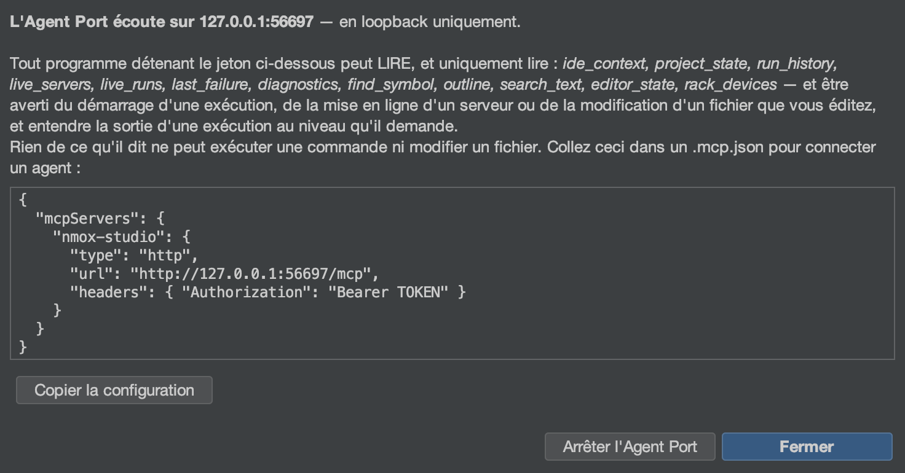

# L’Agent Port (MCP)

<!-- languages -->
[English](agent-port.md) · [Español](agent-port.es.md) · **Français** · [Deutsch](agent-port.de.md) · [Русский](agent-port.ru.md) · [Українська](agent-port.uk.md) · [Polski](agent-port.pl.md) · [Português (Brasil)](agent-port.pt.md) · [Bahasa Indonesia](agent-port.id.md) · [Filipino](agent-port.tl.md) · [Tiếng Việt](agent-port.vi.md) · [简体中文](agent-port.zh.md) · [हिन्दी](agent-port.hi.md) · [עברית](agent-port.he.md) · [العربية](agent-port.ar.md)
<!-- /languages -->

*Pointez un agent d’IA sur votre IDE — et laissez-le LIRE, jamais exécuter.*



NMOX Studio embarque un serveur Model Context Protocol. Tout agent qui parle
MCP (Claude Code, un assistant d’éditeur, votre propre script) peut s’y
connecter et demander à l’IDE ce qu’il sait : quel projet est visé, ce qui
sert, ce qui tourne, ce que vous modifiez, où un nom est déclaré, ce qui a
échoué en dernier. Il est **en lecture seule par construction** : la
compilation échoue si une classe du paquet Agent Port se contente même de
nommer un moyen de lancer un processus, d’écrire un fichier ou d’arrêter une
exécution.

## 1. Le démarrer

**Faites :** Outils ▸ **Agent Port (MCP)…** (le choisir démarre le port), puis **Copier la configuration**.

**Vous voyez :** une boîte de dialogue avec le point d’accès (interface locale
seulement, un port neuf), un jeton porteur propre à chaque démarrage et une
configuration client prête à l’emploi :

```json
{
  "mcpServers": {
    "nmox-studio": {
      "type": "http",
      "url": "http://127.0.0.1:PORT/mcp",
      "headers": { "Authorization": "Bearer TOKEN" }
    }
  }
}
```

Collez-la dans le `.mcp.json` de votre agent. Le jeton n’existe que dans cette
boîte de dialogue — il n’est jamais journalisé ni conservé — et meurt avec le
port. **Arrêter l'Agent Port** y met fin ; quitter l’IDE aussi. Tant qu’il
écoute, la barre d’état affiche **⌁ agent port :N** — un port capable de lire
votre IDE n’est jamais invisible ; l’infobulle de la pastille compte les
agents abonnés au flux, et un clic rouvre la boîte de dialogue (la
configuration, ou l’arrêt).

## 2. Les outils

Chaque outil répond avec un texte lisible par un humain ET un
`structuredContent` typé sous un `outputSchema` déclaré (la compilation valide
le schéma contre la sortie réelle), et porte l’annotation
`readOnlyHint: true`.

| Outil | Ce qu’il répond | Arguments |
|------|-----------------|-----------|
| `ide_context` | Tout l’instantané d’orientation en un seul appel : projet, chaîne d’outils, serveurs, exécutions, fichier en cours de modification, dernier échec, nombre de diagnostics | — |
| `project_state` | Le projet visé : nom, répertoire, branche git, type détecté, gestionnaire de paquets Node | — |
| `run_history` | Les lancements et les sorties de l’enregistreur de vol, les plus récents d’abord, chaque sortie avec sa commande, son code et sa durée ; une exécution que vous avez arrêtée vous-même se lit `stopped`, jamais `failed` | `limit` |
| `live_servers` | Chaque serveur de développement dont l’IDE sait qu’il sert, avec son URL | — |
| `live_runs` | Chaque commande en cours à cet instant (ce que le ■ de la barre d’outils arrêterait), avec son heure de démarrage | — |
| `last_failure` | L’exécution échouée la plus récente : appareil, commande, code de sortie, jusqu’à cinq lignes d’erreur | — |
| `diagnostics` | Ce que les linters et les vérificateurs signalent en ce moment | `file` (filtre par sous-chaîne) |
| `find_symbol` | Où un nom est déclaré — le même index qu’Aller au symbole (⌥⇧⌘O) | `query`, `limit` |
| `outline` | La structure d’un fichier — les éléments mêmes du Navigateur | `file` |
| `search_text` | Les lignes qui contiennent un littéral, sans tenir compte de la casse, avec des bornes et chaque plafond signalé ; les fichiers `.env`, les fichiers rc des gestionnaires de paquets et les clés privées ne sont jamais parcourus | `query`, `limit` |
| `editor_state` | Le fichier en cours de modification (l’onglet d’éditeur qui a le focus, sinon celui affiché dans la zone d’édition) et tous les onglets ouverts, les non enregistrés signalés | — |
| `rack_devices` | Les appareils montés sur le rack de tâches, dans l’ordre | — |

Toute liste est bornée et le dit : `find_symbol` et `outline` signalent un
index partiel, `search_text` signale `truncated` seulement quand une
correspondance supplémentaire existe, `run_history` signale quand des
événements plus anciens ont été laissés de côté.

## 3. Ressources, prompts et flux

Les mêmes réponses se consultent comme des ressources qu’un agent joint en
contexte — `nmox://context`, `nmox://project`, `nmox://history`,
`nmox://servers`, `nmox://runs`, `nmox://editor`,
`nmox://last-failure`, `nmox://diagnostics`, `nmox://devices` — plus
deux gabarits pour les outils qui prennent un argument :
`nmox://outline/{file}` et `nmox://search/{query}` (encodés en pourcentage).
Le texte d’une ressource est le JSON structuré de son outil, octet pour
octet.

Un agent qui préfère être prévenu plutôt que de redemander peut
**s’abonner** : `resources/subscribe` sur n’importe laquelle de ces URI, et
le flux GET du port (le canal serveur-vers-client de Streamable HTTP, `Accept:
text/event-stream`, le même jeton, sans `Origin`) transporte une trame
`notifications/resources/updated` dès que ce qu’elle désigne change — une
exécution démarre et `nmox://runs` est annoncée, un serveur s’allume et
`nmox://servers` l’est, un linter signale quelque chose et
`nmox://diagnostics` l’est, un onglet change ou un fichier est enregistré et
`nmox://editor` l’est ; `nmox://context` les suit toutes. La trame nomme
l’URI et rien d’autre ; l’agent relit ce qui l’intéresse. Un plan qu’un agent
a joint suit aussi son fichier : abonnez-vous à `nmox://outline/src/app.ts`
et le port annonce cette URI quand le fichier change sur le disque (un
enregistrement, un formatage, un générateur), et une fois encore s’il
disparaît — un fichier ordinaire dans le projet visé, trente-deux au plus,
interrogés toutes les deux secondes ; un chemin hors du projet donne
`-32002`, et n’est jamais lu.

Trois prompts intègrent l’état en direct dans une question :
`diagnose_failure` (le dernier échec), `review_setup` (tout le contexte) et
`where_is` — celui qui prend un argument, `name` — qui intègre les
occurrences de symbole pour ce nom.

Un agent qui remplit cet argument, ou le `{file}` du gabarit de plan, peut
demander d’abord : `completion/complete` (la quatrième primitive de la
spécification) complète le `name` de `where_is` à partir de l’index des
symboles (les mêmes occurrences que renvoie `find_symbol`, dédoublonnées, les
correspondances de préfixe d’abord) et `{file}` à partir des fichiers du
projet lui-même (correspondances de préfixe, puis de contenu ; la liste
d’exclusion du parcours de recherche s’applique, donc `node_modules` n’est
jamais proposé) — 100 valeurs au plus, `hasMore` quand le plafond les a
coupées, et `total` seulement quand le compte est exact (une liste de
fichiers l’est toujours ; au-delà du plafond, l’index des symboles ne fournit
qu’un plancher, donc aucun nombre n’est donné plutôt qu’un nombre faux). Le
littéral du gabarit de recherche peut être n’importe quoi, il ne se complète
donc en rien ; un nom de prompt, de gabarit ou d’argument inconnu est refusé
avec `-32602`.

Le même flux transporte les **messages de journal** : chaque ligne
qu’imprime chaque exécution arrive en `notifications/message`, avec
l’exécution comme `logger` — le cycle de vie au niveau `info`
(`$ npm run build`, `[exit 0]`, `[exit 143]
stopped` ; une sortie en échec au niveau `error`), stderr au niveau
`warning`, la sortie ordinaire au niveau `debug`. Le niveau commence à
`info`, donc un agent entend les exécutions démarrer et se terminer, et rien
d’autre tant qu’il ne demande pas : `logging/setLevel` avec `debug` ouvre les
vannes. Une compilation qui imprime plus vite que le client ne lit ne fait
jamais grossir la mémoire du port — au-delà de mille lignes non écrites, le
trop-plein est compté et annoncé en une seule ligne `warning`, jamais perdu
en silence. Un niveau que la spécification ne nomme pas est refusé avec
`-32602`.

## 4. Le parcours, à la main

Avec le jeton dans une variable du shell (jamais sur une ligne de commande que
vous pourriez coller ailleurs) :

```bash
curl -s -X POST "$URL" -H "Authorization: Bearer $TOKEN" \
  -H "Content-Type: application/json" -H "Accept: application/json" \
  -d '{"jsonrpc":"2.0","id":1,"method":"tools/call","params":{"name":"find_symbol","arguments":{"query":"checkout"}}}'
```

**Vous voyez :** `checkout (function) — src/cart.js:12`, et la même chose
dans `structuredContent.hits[0]`.

Le flux, à la main : ouvrez-le dans un shell et abonnez-vous depuis un
autre —

```bash
curl -N -s "$URL" -H "Authorization: Bearer $TOKEN" -H "Accept: text/event-stream"
```

```bash
curl -s -X POST "$URL" -H "Authorization: Bearer $TOKEN" \
  -H "Content-Type: application/json" -H "Accept: application/json" \
  -d '{"jsonrpc":"2.0","id":2,"method":"resources/subscribe","params":{"uri":"nmox://runs"}}'
curl -s -X POST "$URL" -H "Authorization: Bearer $TOKEN" \
  -H "Content-Type: application/json" -H "Accept: application/json" \
  -d '{"jsonrpc":"2.0","id":3,"method":"logging/setLevel","params":{"level":"debug"}}'
```

**Vous voyez :** `: connected`, puis `: keepalive` toutes les quinze
secondes ; pressez ▶ et le premier shell imprime
`notifications/resources/updated` pour `nmox://runs`, puis chaque ligne que
l’exécution imprime en `notifications/message` (`$ npm run dev` au niveau
`info`, la sortie au niveau `debug`) ; pressez ■ et `[exit 143] stopped`
arrive au niveau `info`.

Le même parcours avec le **client officiel**, toutes les primitives à la
fois, est livré dans le dépôt : `scripts/agent-port-walk.mjs` (son en-tête
explique comment installer `@modelcontextprotocol/sdk` dans un répertoire
jetable et où placer l’URL et le jeton — des variables du shell, jamais une
ligne de commande). Il imprime une ligne par étape et se termine par
WALK CLEAN, ou avec le nombre de surprises comme code de sortie (pour une
étape de refus, c’est une RÉPONSE qui compte comme surprise), si bien qu’une
tâche de CI peut le lire ; pressez ▶ et ■ dans l’IDE pendant qu’il écoute, et
les messages de journal arrivent.

## 5. Les refus sont des fonctionnalités

| Vous faites | Le port répond |
|--------|---------------|
| Appeler sans le jeton, ou avec un jeton périmé | `401` — rien d’autre, pas même la liste des outils |
| Appeler depuis une page dans un navigateur (n’importe quel `Origin`) | `403` |
| Un simple `GET` | `405` — le port n’est pas une page ; seul le `GET` SSE (avec `Accept: text/event-stream`) est servi, en tant que flux d’abonnement |
| S’abonner à `nmox://nonesuch`, ou à un plan hors du projet | JSON-RPC `-32002` (ressource introuvable) |
| S’abonner à un trente-troisième plan | `-32602`, qui nomme le plafond |
| Lire `nmox://nonesuch` | JSON-RPC `-32002` (ressource introuvable) |
| Demander `where_is` sans `name` | `-32602`, qui nomme l’argument manquant |
| Demander un fichier hors du projet (`../../.zshrc`) | `outline` refuse — *outside the aimed project* — et ne le lit jamais |
| Chercher une valeur qui vit dans `.env` (ou `app.env`), `.npmrc`, `.htpasswd`, `secrets.yaml`, `credentials.json` ou un `.pem` — ou demander leur plan | rien — ces fichiers ne sont jamais parcourus, jamais comptés, jamais proposés en complétion, et `outline` les refuse nommément ; la loi de l’IDE sur l’environnement (le nom d’une clé, jamais sa valeur) vaut aussi pour les agents |
| Régler le niveau de journal sur `loud` | `-32602`, qui nomme les huit niveaux |
| Lui demander d’exécuter, d’écrire ou d’arrêter quoi que ce soit | aucun outil de ce genre n’existe ; le test du registre veille à ce que cela reste ainsi |

Cette dernière ligne, c’est le principe même. Un agent qui peut lancer votre
serveur peut aussi l’arrêter, et un agent qui peut écrire peut aussi
supprimer ; l’Agent Port reste un moyen de DEMANDER. Si une future version
ajoute une surface d’exécution, elle arrivera avec sa propre conception du
consentement, comme l’a fait le flux de données sortant de KVASIR.

Voir aussi : la station 24 du Kitchen Sink et le paragraphe sur l’Agent Port
dans le guide de l’utilisateur.
