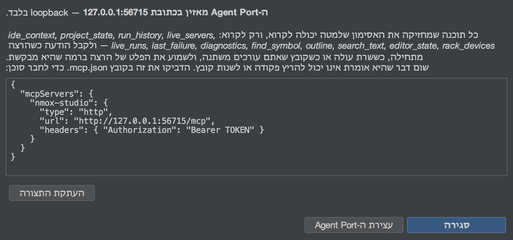

# ה‑Agent Port ‏(MCP)

<!-- languages -->
[English](agent-port.md) · [Español](agent-port.es.md) · [Français](agent-port.fr.md) · [Deutsch](agent-port.de.md) · [Русский](agent-port.ru.md) · [Українська](agent-port.uk.md) · [Polski](agent-port.pl.md) · [Português (Brasil)](agent-port.pt.md) · [Bahasa Indonesia](agent-port.id.md) · [Filipino](agent-port.tl.md) · [Tiếng Việt](agent-port.vi.md) · [简体中文](agent-port.zh.md) · [हिन्दी](agent-port.hi.md) · **עברית** · [العربية](agent-port.ar.md)
<!-- /languages -->

*כוונו סוכן AI אל ה‑IDE שלכם — ותנו לו לקרוא, אף פעם לא להריץ.*



NMOX Studio מגיע עם שרת Model Context Protocol. כל סוכן שמדבר MCP
(‏Claude Code, עוזר בעורך, סקריפט משלכם) יכול להתחבר אליו ולשאול את
ה‑IDE מה הוא יודע: לאיזה פרויקט מכוונים, מה מוגש, מה רץ, מה אתם עורכים,
איפה שם מוצהר, מה נכשל אחרון. הוא **לקריאה בלבד מעצם התכנון**: הבנייה
נכשלת אם מחלקה כלשהי בחבילת ה‑Agent Port רק מזכירה דרך להפעיל תהליך,
לכתוב קובץ או לעצור הרצה.

## 1. הפעילו אותו

**עשו:** כלים ‏◂‏ **Agent Port ‏(MCP)…**‏ (הבחירה בו מפעילה את הפורט), ואז **העתקת התצורה**.

**ראו:** תיבת דו‑שיח עם נקודת הגישה (loopback בלבד, פורט חדש), אסימון
bearer שנוצר בכל הפעלה, ותצורת לקוח מוכנה:

```json
{
  "mcpServers": {
    "nmox-studio": {
      "type": "http",
      "url": "http://127.0.0.1:PORT/mcp",
      "headers": { "Authorization": "Bearer TOKEN" }
    }
  }
}
```

הדביקו אותה בקובץ ‎`.mcp.json` של הסוכן שלכם. האסימון קיים רק בתיבת
הדו‑שיח הזו — הוא לעולם אינו נרשם ביומן או נשמר — ומת יחד עם הפורט.
**עצירת ה‑Agent Port** מסיים אותו; כך גם יציאה מה‑IDE. כל עוד הוא מאזין,
שורת המצב מציגה **⌁ Agent Port ‏:N** — פורט שיכול לקרוא את ה‑IDE שלכם
לעולם אינו בלתי נראה; חלונית העצה של השבב סופרת את הסוכנים שמזרימים,
ולחיצה פותחת מחדש את תיבת הדו‑שיח (תצורה, או עצירה).

## 2. הכלים

כל כלי עונה בטקסט קריא לבני אדם וגם ב‑`structuredContent` מוקלד תחת
`outputSchema` מוצהר (הבנייה מאמתת את הסכמה מול הפלט האמיתי), ומסומן
`readOnlyHint: true`.

| כלי | על מה הוא עונה | ארגומנטים |
|------|-----------------|-----------|
| `ide_context` | כל תמונת ההתמצאות בקריאה אחת: פרויקט, שרשרת כלים, שרתים, הרצות, הקובץ שנערך, הכישלון האחרון, מספר האבחונים | — |
| `project_state` | הפרויקט שמכוונים אליו: שם, תיקייה, ענף git, הסוג שזוהה, מנהל החבילות של Node | — |
| `run_history` | ההפעלות והסיומים ברשם הטיסה, החדשים קודם, כל סיום עם הפקודה, הקוד והמשך שלו; הרצה שעצרתם בעצמכם נקראת `stopped`, אף פעם לא `failed` | `limit` |
| `live_servers` | כל שרת פיתוח שה‑IDE יודע שמגיש, עם הכתובת שלו | — |
| `live_runs` | כל פקודה שרצה ממש עכשיו (מה שה‑■ בסרגל הכלים היה עוצר), עם מתי היא התחילה | — |
| `last_failure` | ההרצה האחרונה שנכשלה: מכשיר, פקודה, קוד יציאה, עד חמש שורות שגיאה | — |
| `diagnostics` | מה שה‑linters והבודקים מדווחים כרגע | `file` (מסנן לפי תת‑מחרוזת) |
| `find_symbol` | איפה שם מוצהר — אותו אינדקס כמו מעבר לסמל (⌥⇧⌘O) | `query`, `limit` |
| `outline` | המבנה של קובץ אחד — הפריטים של הנווט עצמו | `file` |
| `search_text` | שורות שמכילות מחרוזת מילולית, בלי תלות ברישיות, מוגבל וכל תקרה מדווחת; קובצי ‎`.env`, קובצי rc של מנהלי חבילות ומפתחות פרטיים לעולם אינם נסרקים | `query`, `limit` |
| `editor_state` | הקובץ שנערך (לשונית העורך שבמיקוד, אחרת זו שמוצגת באזור העורך) וכל לשונית פתוחה, עם סימון לאלה שלא נשמרו | — |
| `rack_devices` | המכשירים שמורכבים בראק המשימות, לפי הסדר | — |

כל רשימה מוגבלת ואומרת זאת: `find_symbol` ו‑`outline` מדווחים על אינדקס
חלקי, `search_text` מדווח `truncated` רק כשקיימת עוד התאמה, ו‑`run_history`
מדווח כשאירועים ישנים יותר נשארו בחוץ.

## 3. משאבים, הנחיות והזרם

אותן תשובות זמינות לעיון כמשאבים שסוכן מצרף כהקשר — `nmox://context`,
‏`nmox://project`, ‏`nmox://history`, ‏`nmox://servers`, ‏`nmox://runs`,
‏`nmox://editor`, ‏`nmox://last-failure`, ‏`nmox://diagnostics`,
‏`nmox://devices` — ועוד שתי תבניות לכלים שמקבלים ארגומנט:
`nmox://outline/{file}` ו‑`nmox://search/{query}` (בקידוד אחוזים). הטקסט
של משאב הוא ה‑JSON המובנה של הכלי שלו, בייט אחר בייט.

סוכן שמעדיף שיודיעו לו במקום לשאול שוב יכול **להירשם**:
`resources/subscribe` על כל אחד מה‑URI האלה, וזרם ה‑GET של הפורט (הערוץ
משרת ללקוח של Streamable HTTP, `Accept:
text/event-stream`, אותו אסימון, בלי `Origin`) נושא מסגרת
`notifications/resources/updated` ברגע שהדבר שמאחוריו משתנה — הרצה
מתחילה ו‑`nmox://runs` מוכרז, שרת עולה ו‑`nmox://servers` מוכרז, linter
מדווח ו‑`nmox://diagnostics` מוכרז, לשונית מתחלפת או קובץ נשמר
ו‑`nmox://editor` מוכרז; `nmox://context` עוקב אחרי כולם. המסגרת נוקבת
ב‑URI ולא בשום דבר אחר; הסוכן קורא מחדש את מה שחשוב לו. גם מתאר שסוכן
צירף עוקב אחרי הקובץ שלו: הירשמו ל‑`nmox://outline/src/app.ts`, והפורט
מכריז על ה‑URI הזה כשהקובץ משתנה בדיסק (שמירה, עיצוב קוד, מחולל), ופעם
נוספת אם הוא נעלם — קובץ רגיל בתוך הפרויקט שמכוונים אליו, לכל היותר
שלושים ושניים כאלה, שנבדקים כל שתי שניות; נתיב מחוץ לפרויקט הוא
`-32002`, ולעולם אינו נקרא.

שלוש הנחיות מקפלות מצב חי לתוך שאלה: `diagnose_failure` (הכישלון
האחרון), `review_setup` (ההקשר כולו) ו‑`where_is` — זו שמקבלת ארגומנט,
`name` — שמקפלת את התוצאות של הסמל עבור השם הזה.

סוכן שממלא את הארגומנט הזה, או את `{file}` של תבנית המתאר, יכול לשאול
קודם: `completion/complete` (הפרימיטיב הרביעי של המפרט) עונה על `name`
של `where_is` מתוך אינדקס הסמלים (אותן תוצאות ש‑`find_symbol` מחזיר,
בלי כפילויות, התאמות תחילית קודם) ועל `{file}` מתוך הקבצים של הפרויקט
עצמו (התאמות תחילית, ואז הכלה; רשימת הדילוג של סריקת החיפוש חלה, כך
ש‑`node_modules` לעולם אינו מושלם) — לכל היותר 100 ערכים, `hasMore`
כשהתקרה חתכה אותם, ו‑`total` רק כשהספירה מדויקת (רשימת קבצים תמיד
מדויקת; מעבר לתקרה אינדקס הסמלים עונה ברף תחתון, ולכן לא ניתן מספר במקום
לתת מספר שגוי). המחרוזת של תבנית החיפוש יכולה להיות כל דבר, ולכן היא אינה
מושלמת לשום דבר; שם לא מוכר של הנחיה, תבנית או ארגומנט נדחה כ‑`-32602`.

אותו זרם נושא **הודעות יומן**: כל שורה שכל הרצה מדפיסה מגיעה
כ‑`notifications/message` עם ההרצה בתור ה‑`logger` שלה — מחזור החיים
ברמת `info` (`$ npm run build`, `[exit 0]`, `[exit 143]
stopped`; סיום כושל ברמת `error`), stderr ברמת `warning`, פלט רגיל ברמת
`debug`. הרמה מתחילה ב‑`info`, כך שסוכן שומע הרצות מתחילות ומסתיימות
ושום דבר מעבר לזה עד שהוא מבקש: `logging/setLevel` עם `debug` פותח את
השטף המלא. בנייה שמדפיסה מהר יותר ממה שהלקוח קורא לעולם אינה מגדילה את
הזיכרון של הפורט — מעבר לאלף שורות שלא נכתבו, העודף נספר ומוכרז כשורת
`warning` אחת, ולעולם אינו אובד בשקט. רמה שהמפרט אינו מכיר נדחית
כ‑`-32602`.

## 4. הסיור, ביד

כשהאסימון נמצא במשתנה shell (אף פעם לא בשורת פקודה שאולי תדביקו במקום
כלשהו):

```bash
curl -s -X POST "$URL" -H "Authorization: Bearer $TOKEN" \
  -H "Content-Type: application/json" -H "Accept: application/json" \
  -d '{"jsonrpc":"2.0","id":1,"method":"tools/call","params":{"name":"find_symbol","arguments":{"query":"checkout"}}}'
```

**ראו:** `checkout (function) — src/cart.js:12`, ואותו דבר
כ‑`structuredContent.hits[0]`.

הזרם, ביד: פתחו אותו ב‑shell אחד והירשמו מ‑shell אחר —

```bash
curl -N -s "$URL" -H "Authorization: Bearer $TOKEN" -H "Accept: text/event-stream"
```

```bash
curl -s -X POST "$URL" -H "Authorization: Bearer $TOKEN" \
  -H "Content-Type: application/json" -H "Accept: application/json" \
  -d '{"jsonrpc":"2.0","id":2,"method":"resources/subscribe","params":{"uri":"nmox://runs"}}'
curl -s -X POST "$URL" -H "Authorization: Bearer $TOKEN" \
  -H "Content-Type: application/json" -H "Accept: application/json" \
  -d '{"jsonrpc":"2.0","id":3,"method":"logging/setLevel","params":{"level":"debug"}}'
```

**ראו:** `: connected`, ואחר כך `: keepalive` כל חמש־עשרה שניות; לחצו ▶,
וה‑shell הראשון מדפיס `notifications/resources/updated` עבור
`nmox://runs` וכל שורה שההרצה מדפיסה כ‑`notifications/message`
(`$ npm run dev` ברמת `info`, הפלט ברמת `debug`); לחצו ■,
ו‑`[exit 143] stopped` מגיע ברמת `info`.

אותו סיור עם **הלקוח הרשמי**, כל הפרימיטיבים בבת אחת, נמצא במאגר:
`scripts/agent-port-walk.mjs` (הכותרת שלו מסבירה איך להתקין את
`@modelcontextprotocol/sdk` בתיקייה זמנית ולאן הולכים הכתובת והאסימון —
משתני shell, אף פעם לא שורת פקודה). הוא מדפיס שורה אחת לכל שלב ומסתיים
ב‑WALK CLEAN או במספר ההפתעות כקוד היציאה שלו (בשלב של סירוב, *תשובה*
נספרת כהפתעה), כך ש‑job של CI יכול לקרוא אותו; לחצו ▶ ו‑■ ב‑IDE בזמן
שהוא מאזין, והודעות היומן מגיעות.

## 5. הסירובים הם תכונות

| אתם עושים | הפורט אומר |
|--------|---------------|
| קוראים בלי האסימון, או עם אסימון ישן | `401` — ותו לא, אפילו לא רשימת הכלים |
| קוראים מדף בדפדפן (כל `Origin`) | `403` |
| `GET` רגיל | `405` — הפורט אינו דף; רק `GET` של SSE (עם `Accept: text/event-stream`) מוגש, כזרם ההרשמות |
| נרשמים ל‑`nmox://nonesuch`, או למתאר מחוץ לפרויקט | JSON-RPC ‏`-32002` (המשאב לא נמצא) |
| נרשמים למתאר השלושים ושלושה | `-32602`, עם שם התקרה |
| קוראים את `nmox://nonesuch` | JSON-RPC ‏`-32002` (המשאב לא נמצא) |
| שואלים את `where_is` בלי `name` | `-32602`, עם שם הארגומנט החסר |
| מבקשים קובץ מחוץ לפרויקט (`../../.zshrc`) | `outline` מסרב — *מחוץ לפרויקט שמכוונים אליו* — ולעולם אינו קורא אותו |
| מחפשים ערך שנמצא ב‑‎`.env` (או `app.env`), ‏`.npmrc`, ‏`.htpasswd`, ‏`secrets.yaml`, ‏`credentials.json` או `.pem` — או מבקשים את המתאר שלהם | כלום — הקבצים האלה לעולם אינם נסרקים, נספרים או מושלמים, ו‑`outline` מסרב להם בשמם; חוק הסביבה של ה‑IDE עצמו (שם המפתח, אף פעם לא הערך שלו) חל גם על סוכנים |
| מגדירים את רמת היומן ל‑`loud` | `-32602`, עם שמונה הרמות |
| מבקשים ממנו להריץ, לכתוב או לעצור משהו | אין כלי כזה; בדיקת הרישום דואגת שזה יישאר כך |

השורה האחרונה היא התכנון. סוכן שיכול להריץ את השרת שלכם יכול גם לעצור
אותו, וסוכן שיכול לכתוב יכול גם למחוק; ה‑Agent Port נשאר דרך *לשאול*.
אם גרסה עתידית תוסיף משטח ביצוע, הוא יגיע עם תכנון הסכמה משלו, כמו
שהגיעה זרימת הנתונים החוצה של KVASIR.

ראו גם: תחנה 24 ב‑Kitchen Sink והפסקה על ה‑Agent Port במדריך למשתמש.
