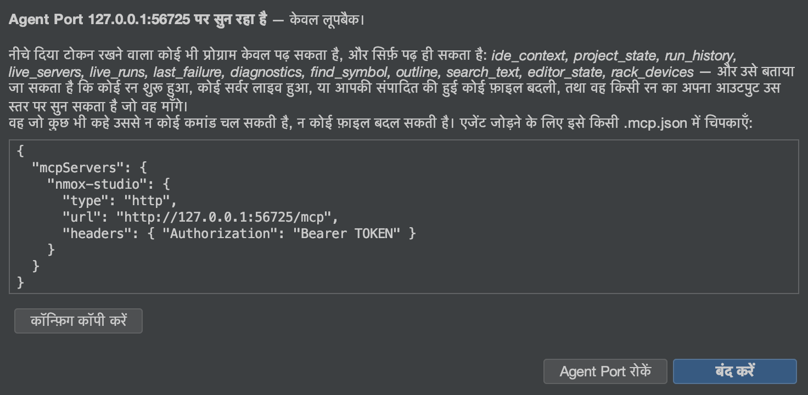

# Agent Port (MCP)

<!-- languages -->
[English](agent-port.md) · [Español](agent-port.es.md) · [Français](agent-port.fr.md) · [Deutsch](agent-port.de.md) · [Русский](agent-port.ru.md) · [Українська](agent-port.uk.md) · [Polski](agent-port.pl.md) · [Português (Brasil)](agent-port.pt.md) · [Bahasa Indonesia](agent-port.id.md) · [Filipino](agent-port.tl.md) · [Tiếng Việt](agent-port.vi.md) · [简体中文](agent-port.zh.md) · **हिन्दी** · [עברית](agent-port.he.md) · [العربية](agent-port.ar.md)
<!-- /languages -->

*किसी AI एजेंट को अपने IDE की ओर मोड़िए — और उसे पढ़ने दीजिए, चलाने कभी नहीं।*



NMOX Studio के साथ एक Model Context Protocol सर्वर आता है। MCP बोलने वाला
कोई भी एजेंट (Claude Code, कोई एडिटर सहायक, आपकी अपनी स्क्रिप्ट) उससे जुड़कर
IDE से पूछ सकता है कि वह क्या जानता है: कौन-सा प्रोजेक्ट लक्षित है, क्या सर्व
हो रहा है, क्या चल रहा है, आप क्या संपादित कर रहे हैं, कोई नाम कहाँ घोषित है,
पिछली बार क्या विफल हुआ। यह **रचना से ही केवल-पठनीय** है: अगर Agent Port
पैकेज की कोई भी क्लास प्रक्रिया शुरू करने, फ़ाइल लिखने या किसी रन को रोकने का
कोई तरीका नाम से भी ले, तो बिल्ड विफल हो जाता है।

## 1. उसे शुरू कीजिए

**करें:** उपकरण ▸ **Agent Port (MCP)…** (इसे चुनते ही पोर्ट शुरू हो जाता है), फिर **कॉन्फ़िग कॉपी करें**।

**देखें:** एक संवाद जिसमें एंडपॉइंट (सिर्फ़ लूपबैक, हर बार नया पोर्ट), हर शुरुआत
पर बनने वाला bearer टोकन, और कॉपी करने को तैयार क्लाइंट कॉन्फ़िगरेशन होता है:

```json
{
  "mcpServers": {
    "nmox-studio": {
      "type": "http",
      "url": "http://127.0.0.1:PORT/mcp",
      "headers": { "Authorization": "Bearer TOKEN" }
    }
  }
}
```

इसे अपने एजेंट की `.mcp.json` में पेस्ट कीजिए, या **Claude Code के लिए कॉपी
करें** दबाइए — उसकी जगह वह एक पंक्ति मिलेगी जो Claude Code लेता है:

```bash
claude mcp add --transport http nmox-studio http://127.0.0.1:PORT/mcp --header "Authorization: Bearer TOKEN"
```

टोकन कभी लॉग नहीं होता। जब तक आप कुछ और न कहें, वह सिर्फ़ उसी संवाद में
मौजूद रहता है और पोर्ट के साथ ही ख़त्म हो जाता है, इसलिए अगली शुरुआत पर नया
पता और नया टोकन मिलता है। **यह पता और टोकन रखें** चुनिए, तो वह आपके सिस्टम
के कीचेन में सहेजा जाता है और उसी पोर्ट के साथ दोबारा इस्तेमाल होता है, ताकि
एक बार सेट किया गया एजेंट कल भी जुड़ जाए; अगर कोई दूसरा प्रोग्राम वह पोर्ट ले
चुका है, तो NMOX Studio नया पोर्ट बाँधता है और यह बताता है। साथ में **NMOX
Studio शुरू होने पर शुरू करें** भी चुनिए, तो पोर्ट IDE के साथ ही चालू हो जाता
है। रखें का चयन हटाने पर कीचेन की प्रविष्टि मिट जाती है।
**Agent Port रोकें** उसे बंद करता है; IDE छोड़ना भी। जब तक वह
सुन रहा है, स्थिति-पट्टी पर **⌁ agent port :N** दिखता है — जो पोर्ट आपका IDE
पढ़ सकता है वह कभी अदृश्य नहीं रहता; चिह्न का टूलटिप स्ट्रीम कर रहे एजेंट गिनता
है, और एक क्लिक संवाद फिर खोल देता है (कॉन्फ़िग, या रोकना)।

## 2. टूल

हर टूल एक मानवीय पाठ और साथ में घोषित `outputSchema` के तहत एक टाइप किया
हुआ `structuredContent` लौटाता है (बिल्ड इस स्कीमा को असली आउटपुट से जाँचता
है), और हर एक पर `readOnlyHint: true` लगा होता है।

| टूल | वह किसका उत्तर देता है | तर्क |
|------|-----------------|-----------|
| `ide_context` | दिशा देने वाली पूरी तस्वीर एक ही कॉल में: प्रोजेक्ट, टूलचेन, सर्वर, रन, संपादित हो रही फ़ाइल, पिछली विफलता, डायग्नॉस्टिक्स की गिनती | — |
| `project_state` | लक्षित प्रोजेक्ट: नाम, डायरेक्टरी, git ब्रांच, पहचाना गया प्रकार, Node पैकेज मैनेजर | — |
| `run_history` | फ़्लाइट रिकॉर्डर की शुरुआतें और समाप्तियाँ, सबसे नई पहले, हर समाप्ति अपनी कमांड, कोड और अवधि के साथ; जिस रन को आपने ख़ुद रोका वह `stopped` पढ़ा जाता है, कभी `failed` नहीं | `limit` |
| `live_servers` | हर डेव सर्वर जिसके बारे में IDE जानता है कि वह सर्व कर रहा है, उसके URL के साथ | — |
| `live_runs` | इस समय चल रही हर कमांड (जिसे टूलबार का ■ रोकेगा), कब शुरू हुई उसके साथ | — |
| `last_failure` | सबसे हाल का विफल रन: डिवाइस, कमांड, exit कोड, त्रुटि की अधिकतम पाँच पंक्तियाँ | — |
| `diagnostics` | लिंटर और चेकर इस समय क्या बता रहे हैं | `file` (उपस्ट्रिंग फ़िल्टर) |
| `find_symbol` | कोई नाम कहाँ घोषित है — वही इंडेक्स जो सिंबल पर जाएँ (⌥⇧⌘O) का है | `query`, `limit` |
| `outline` | एक फ़ाइल की संरचना — नेविगेटर के अपने आइटम | `file` |
| `search_text` | किसी शाब्दिक पाठ वाली पंक्तियाँ, केस-असंवेदी, सीमित और हर सीमा की सूचना के साथ; `.env` फ़ाइलें, पैकेज-मैनेजर की rc फ़ाइलें और निजी कुंजियाँ कभी खोजी नहीं जातीं | `query`, `limit` |
| `editor_state` | संपादित हो रही फ़ाइल (फ़ोकस वाला एडिटर टैब, नहीं तो एडिटर क्षेत्र में दिख रहा टैब) और हर खुला टैब, बिना सेव वाले चिह्नित | — |
| `rack_devices` | टास्क रैक पर लगे डिवाइस, क्रम से | — |

हर सूची सीमित है और यह बताती भी है: `find_symbol` और `outline` अधूरे इंडेक्स
की सूचना देते हैं, `search_text` `truncated` तभी बताता है जब सचमुच एक और
मेल मौजूद हो, `run_history` बताता है जब पुरानी घटनाएँ छोड़ी गईं।

## 3. रिसोर्स, प्रॉम्प्ट और स्ट्रीम

यही उत्तर रिसोर्स के रूप में भी ब्राउज़ किए जा सकते हैं जिन्हें एजेंट संदर्भ के
रूप में जोड़ता है — `nmox://context`, `nmox://project`, `nmox://history`,
`nmox://servers`, `nmox://runs`, `nmox://editor`,
`nmox://last-failure`, `nmox://diagnostics`, `nmox://devices` — और तर्क लेने
वाले टूलों के लिए दो टेम्पलेट: `nmox://outline/{file}` और
`nmox://search/{query}` (percent-encoded)। रिसोर्स का पाठ उसके टूल का संरचित
JSON है, बाइट-दर-बाइट।

जो एजेंट बार-बार पूछने के बजाय बताया जाना पसंद करे, वह **subscribe** कर सकता
है: इनमें से किसी भी URI पर `resources/subscribe`, और पोर्ट की GET स्ट्रीम
(Streamable HTTP का सर्वर-से-क्लाइंट चैनल, `Accept:
text/event-stream`, वही टोकन, कोई `Origin` नहीं) पीछे की चीज़ बदलते ही एक
`notifications/resources/updated` फ़्रेम ले आती है — कोई रन शुरू होता है और
`nmox://runs` की घोषणा होती है, कोई सर्वर जीवित होता है और `nmox://servers`
की, कोई लिंटर रिपोर्ट करता है और `nmox://diagnostics` की, कोई टैब बदलता है या
फ़ाइल सेव होती है और `nmox://editor` की; `nmox://context` इन सबके पीछे चलता
है। फ़्रेम सिर्फ़ URI का नाम लेता है, और कुछ नहीं; एजेंट जिसकी परवाह करता है उसे
दोबारा पढ़ता है। एजेंट की जोड़ी हुई आउटलाइन भी अपनी फ़ाइल के पीछे चलती है:
`nmox://outline/src/app.ts` को subscribe कीजिए और फ़ाइल डिस्क पर बदलते ही
(सेव, फ़ॉर्मेट, जनरेटर) पोर्ट उस URI की घोषणा करता है, और फ़ाइल ग़ायब हो तो
एक बार और — लक्षित प्रोजेक्ट के भीतर की एक सामान्य फ़ाइल, ऐसी अधिकतम बत्तीस,
हर दो सेकंड पर जाँची हुई; प्रोजेक्ट के बाहर का पाथ `-32002` है, कभी पढ़ा
नहीं जाता।

तीन प्रॉम्प्ट जीवित स्थिति को एक सवाल में समेटते हैं: `diagnose_failure`
(पिछली विफलता), `review_setup` (पूरा संदर्भ), और `where_is` — वह जो एक तर्क,
`name`, लेता है — जो उस नाम के सिंबल मेल समेट लेता है।

उस तर्क को, या आउटलाइन टेम्पलेट के `{file}` को भरने वाला एजेंट पहले पूछ सकता
है: `completion/complete` (स्पेसिफ़िकेशन का चौथा primitive) `where_is` के
`name` का उत्तर सिंबल इंडेक्स से देता है (वही मेल जो `find_symbol` लौटाता है,
अलग-अलग, prefix वाले मेल पहले) और `{file}` का प्रोजेक्ट की अपनी फ़ाइलों से
(prefix वाले मेल, फिर जिनमें शामिल हो; खोज की छोड़ने वाली सूची लागू होती है, इसलिए
`node_modules` कभी पूरा नहीं होता) — अधिकतम 100 मान, सीमा ने काटा हो तो
`hasMore`, और `total` सिर्फ़ तब जब गिनती सटीक हो (फ़ाइलों की सूची हमेशा सटीक
होती है; सीमा के पार सिंबल इंडेक्स एक न्यूनतम संख्या देता है, इसलिए ग़लत संख्या
देने के बजाय कोई संख्या नहीं दी जाती)। खोज टेम्पलेट का शाब्दिक पाठ कुछ भी हो
सकता है, इसलिए वह किसी भी चीज़ में पूरा नहीं होता; अनजान प्रॉम्प्ट, टेम्पलेट या
तर्क का नाम `-32602` के रूप में मना होता है।

वही स्ट्रीम **लॉग संदेश** भी लाती है: हर रन की छापी हर पंक्ति
`notifications/message` के रूप में आती है, रन उसका `logger` होता है —
जीवनचक्र `info` पर (`$ npm run build`, `[exit 0]`, `[exit 143]
stopped`; विफल समाप्ति `error` पर), stderr `warning` पर, सामान्य आउटपुट
`debug` पर। स्तर `info` से शुरू होता है, इसलिए एजेंट को रन शुरू और ख़त्म होते
सुनाई देते हैं और तब तक कुछ नहीं जब तक वह न माँगे: `debug` के साथ
`logging/setLevel` पूरी धार खोल देता है। जो बिल्ड क्लाइंट के पढ़ने से तेज़ छापे,
वह पोर्ट की मेमोरी कभी नहीं बढ़ाता — एक हज़ार बिना लिखी पंक्तियों के बाद अतिरिक्त
को गिना जाता है और एक `warning` पंक्ति के रूप में घोषित किया जाता है, कभी
चुपचाप खोया नहीं जाता। जिस स्तर का नाम स्पेसिफ़िकेशन में नहीं, वह `-32602`
के रूप में मना होता है।

## 4. हाथ से पूरा चक्कर

टोकन को एक शेल वेरिएबल में रखकर (कभी ऐसी कमांड लाइन पर नहीं जिसे आप कहीं
पेस्ट करें):

```bash
curl -s -X POST "$URL" -H "Authorization: Bearer $TOKEN" \
  -H "Content-Type: application/json" -H "Accept: application/json" \
  -d '{"jsonrpc":"2.0","id":1,"method":"tools/call","params":{"name":"find_symbol","arguments":{"query":"checkout"}}}'
```

**देखें:** `checkout (function) — src/cart.js:12`, और वही
`structuredContent.hits[0]` के रूप में।

हाथ से स्ट्रीम: एक शेल में उसे खोलिए और दूसरे से subscribe कीजिए —

```bash
curl -N -s "$URL" -H "Authorization: Bearer $TOKEN" -H "Accept: text/event-stream"
```

```bash
curl -s -X POST "$URL" -H "Authorization: Bearer $TOKEN" \
  -H "Content-Type: application/json" -H "Accept: application/json" \
  -d '{"jsonrpc":"2.0","id":2,"method":"resources/subscribe","params":{"uri":"nmox://runs"}}'
curl -s -X POST "$URL" -H "Authorization: Bearer $TOKEN" \
  -H "Content-Type: application/json" -H "Accept: application/json" \
  -d '{"jsonrpc":"2.0","id":3,"method":"logging/setLevel","params":{"level":"debug"}}'
```

**देखें:** `: connected`, फिर हर पंद्रह सेकंड पर `: keepalive`; ▶ दबाइए और
पहला शेल `nmox://runs` के लिए `notifications/resources/updated` छापता है,
और रन की छापी हर पंक्ति `notifications/message` के रूप में (`$ npm run dev`
`info` पर, आउटपुट `debug` पर); ■ दबाइए और `[exit 143] stopped` `info` पर
आता है।

यही चक्कर **आधिकारिक क्लाइंट** के साथ, हर primitive एक साथ, रिपॉज़िटरी में
मौजूद है: `scripts/agent-port-walk.mjs` (उसका शीर्ष भाग बताता है कि
`@modelcontextprotocol/sdk` को किसी अस्थायी डायरेक्टरी में कैसे इंस्टॉल करें
और URL तथा टोकन कहाँ जाते हैं — शेल वेरिएबल में, कभी कमांड लाइन पर नहीं)।
वह हर क़दम की एक पंक्ति छापता है और अंत में WALK CLEAN लिखता है या exit कोड के
रूप में आश्चर्यों की गिनती देता है (इनकार वाले क़दम में उत्तर मिलना ही आश्चर्य
गिना जाता है), ताकि कोई CI जॉब उसे पढ़ सके; जब वह सुन रहा हो तब IDE में ▶ और ■
दबाइए और लॉग संदेश आ पहुँचते हैं।

## 5. इनकार सुविधाएँ हैं

| आप करते हैं | पोर्ट कहता है |
|--------|---------------|
| बिना टोकन के, या पुराने टोकन से कॉल | `401` — और कुछ नहीं, टूल की सूची तक नहीं |
| ब्राउज़र के किसी पेज से कॉल (कोई भी `Origin`) | `403` |
| एक सादा `GET` | `405` — पोर्ट कोई पेज नहीं है; सिर्फ़ SSE `GET` (`Accept: text/event-stream` के साथ) subscription स्ट्रीम के रूप में परोसा जाता है |
| `nmox://nonesuch` को, या प्रोजेक्ट के बाहर की आउटलाइन को subscribe करना | JSON-RPC `-32002` (resource not found) |
| तैंतीसवीं आउटलाइन को subscribe करना | `-32602`, सीमा का नाम लेकर |
| `nmox://nonesuch` पढ़ना | JSON-RPC `-32002` (resource not found) |
| `name` के बिना `where_is` पूछना | `-32602`, छूटे तर्क का नाम लेकर |
| प्रोजेक्ट के बाहर की फ़ाइल माँगना (`../../.zshrc`) | `outline` मना करता है — *लक्षित प्रोजेक्ट के बाहर* — और उसे कभी नहीं पढ़ता |
| ऐसा मान खोजना जो `.env` (या `app.env`), `.npmrc`, `.htpasswd`, `secrets.yaml`, `credentials.json` या किसी `.pem` में है — या उनकी आउटलाइन माँगना | कुछ नहीं — ये फ़ाइलें कभी खोजी नहीं जातीं, कभी गिनी नहीं जातीं, कभी पूरी नहीं होतीं, और `outline` नाम लेकर उन्हें मना करता है; IDE का अपना env नियम (कुंजी का नाम, उसका मान कभी नहीं) एजेंटों पर भी लागू है |
| लॉग स्तर `loud` पर सेट करना | `-32602`, आठों स्तरों का नाम लेकर |
| उससे कुछ चलाने, लिखने या रोकने को कहना | ऐसा कोई टूल नहीं है; लेजर टेस्ट इसे ऐसा ही रखता है |

आख़िरी पंक्ति ही डिज़ाइन है। जो एजेंट आपका सर्वर चला सकता है वह उसे रोक भी
सकता है, और जो एजेंट लिख सकता है वह मिटा भी सकता है; Agent Port पूछने का ही
एक रास्ता बना रहता है। अगर भविष्य का कोई संस्करण चलाने की कोई सतह जोड़ेगा, तो
वह अपनी सहमति-व्यवस्था के साथ आएगी, जैसे KVASIR का बाहर जाने वाला डेटा प्रवाह
आया था।

यह भी देखिए: Kitchen Sink का स्टेशन 24 और उपयोगकर्ता मार्गदर्शिका का Agent Port
वाला अनुच्छेद।
