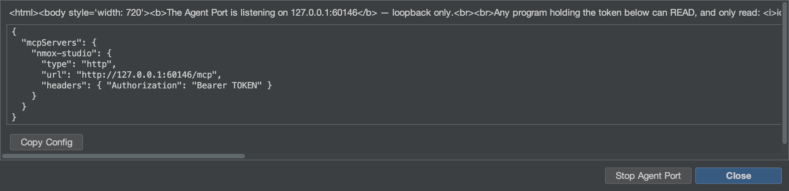

# The Agent Port (MCP)

*Point an AI agent at your IDE — and let it READ, never run.*



NMOX Studio ships a Model Context Protocol server. Any agent that speaks
MCP (Claude Code, an editor assistant, your own script) can connect to
it and ask the IDE what it knows: which project is aimed, what is
serving, what is running, what you are editing, where a name is
declared, what failed last. It is **read-only by construction**: the
build fails if any class in the Agent Port package so much as names a
way to spawn a process, write a file, or stop a run.

## 1. Start it

**Do:** Tools ▸ **Agent Port (MCP)…** ▸ **Start**, then **Copy Config**.

**See:** A dialog with the endpoint (loopback only, a fresh port), a
per-start bearer token, and a ready-made client configuration:

```json
{
  "mcpServers": {
    "nmox-studio": {
      "type": "http",
      "url": "http://127.0.0.1:PORT/mcp",
      "headers": { "Authorization": "Bearer TOKEN" }
    }
  }
}
```

Paste it into your agent's `.mcp.json`. The token exists only in that
dialog — it is never logged or persisted — and dies with the port.
**Stop Agent Port** ends it; so does quitting the IDE. While it
listens, the status line shows **⌁ agent port :N** — a port that can
read your IDE is never invisible; the chip's tooltip counts the agents
streaming, and a click reopens the dialog (config, or Stop).

## 2. The tools

Every tool answers with a human text AND a typed `structuredContent`
under a declared `outputSchema` (the schema is validated against the
real output by the build), and is annotated `readOnlyHint: true`.

| Tool | What it answers | Arguments |
|------|-----------------|-----------|
| `ide_context` | The whole orienting snapshot in one call: project, toolchain, servers, runs, the file being edited, the last failure, a diagnostics count | — |
| `project_state` | The aimed project: name, directory, git branch, detected kind, Node package manager | — |
| `run_history` | The flight recorder's launches and exits, newest first, each exit with its command, code and duration; a run you stopped yourself reads `stopped`, never `failed` | `limit` |
| `live_servers` | Every dev server the IDE knows is serving, with its URL | — |
| `live_runs` | Every command running right now (what the toolbar ■ would stop), with when it started | — |
| `last_failure` | The most recent failed run: device, command, exit code, up to five error lines | — |
| `diagnostics` | What the linters and checkers currently report | `file` (substring filter) |
| `find_symbol` | Where a name is declared — the same index as Go to Symbol (⌥⇧⌘O) | `query`, `limit` |
| `outline` | One file's structure — the Navigator's own items | `file` |
| `search_text` | Lines containing a literal, case-insensitive, bounded and every cap reported; `.env` files, package-manager rc files and private keys are never searched | `query`, `limit` |
| `editor_state` | The file being edited (the focused editor tab, else the one showing in the editor area) and every open tab, unsaved ones flagged | — |
| `rack_devices` | The devices mounted on the task rack, in order | — |

Every list is bounded and says so: `find_symbol` and `outline` report a
partial index, `search_text` reports `truncated` only when a further
match exists, `run_history` reports when older events were left out.

## 3. Resources, prompts, and the stream

The same answers are browsable as resources an agent attaches as
context — `nmox://context`, `nmox://project`, `nmox://history`,
`nmox://servers`, `nmox://runs`, `nmox://editor`,
`nmox://last-failure`, `nmox://diagnostics`, `nmox://devices` — plus
two templates for the tools that take an argument:
`nmox://outline/{file}` and `nmox://search/{query}` (percent-encoded).
A resource's text is its tool's structured JSON, byte for byte.

An agent that would rather be told than ask again can **subscribe**:
`resources/subscribe` on any of those URIs, and the port's GET stream
(Streamable HTTP's server-to-client channel, `Accept:
text/event-stream`, same token, no `Origin`) carries a
`notifications/resources/updated` frame the moment the thing behind it
changes — a run starts and `nmox://runs` is announced, a server goes
live and `nmox://servers` is, a linter reports and `nmox://diagnostics`
is, a tab changes or a file is saved and `nmox://editor` is;
`nmox://context` follows all of them. The frame names the URI and
nothing else; the agent re-reads what it cares about. An outline an
agent attached follows its file too: subscribe to
`nmox://outline/src/app.ts` and the port announces that URI when the
file changes on disk (a save, a format, a generator), once more if it
vanishes — a regular file inside the aimed project, at most thirty-two
of them, polled every two seconds; a path outside the project is
`-32002`, never read.

Three prompts fold live state into a question: `diagnose_failure`
(the last failure), `review_setup` (the whole context), and `where_is`
— the one that takes an argument, `name` — which folds the symbol hits
for that name.

An agent filling that argument, or the outline template's `{file}`,
can ask first: `completion/complete` (the spec's fourth primitive)
answers `where_is`'s `name` from the symbol index (the same hits
`find_symbol` returns, distinct, prefix hits first) and `{file}` from
the project's own files (prefix hits, then contains; the search walk's
skip list applies, so `node_modules` never completes) — at most 100
values, `hasMore` when the cap cut them, and `total` only when the
count is exact (a file list always is; past the cap the symbol index
answers a floor, so no number is given rather than a wrong one). The search template's
literal is anything, so it completes to nothing; an unknown prompt,
template or argument name is refused as `-32602`.

The same stream carries **log messages**: every line every run prints
arrives as `notifications/message` with the run as its `logger` —
lifecycle at `info` (`$ npm run build`, `[exit 0]`, `[exit 143]
stopped`; a failed exit at `error`), stderr at `warning`, ordinary
output at `debug`. The level starts at `info`, so an agent hears runs
start and end and nothing else until it asks: `logging/setLevel` with
`debug` opens the firehose. A build that prints faster than the client
reads never grows the port's memory — past a thousand unwritten lines
the overflow is counted and announced as one `warning` line, never
silently lost. A level the spec does not name is refused as `-32602`.

## 4. The walk, by hand

With the token in a shell variable (never on a command line you would
paste anywhere):

```bash
curl -s -X POST "$URL" -H "Authorization: Bearer $TOKEN" \
  -H "Content-Type: application/json" -H "Accept: application/json" \
  -d '{"jsonrpc":"2.0","id":1,"method":"tools/call","params":{"name":"find_symbol","arguments":{"query":"checkout"}}}'
```

**See:** `checkout (function) — src/cart.js:12`, and the same as
`structuredContent.hits[0]`.

The stream, by hand: open it in one shell and subscribe from another —

```bash
curl -N -s "$URL" -H "Authorization: Bearer $TOKEN" -H "Accept: text/event-stream"
```

```bash
curl -s -X POST "$URL" -H "Authorization: Bearer $TOKEN" \
  -H "Content-Type: application/json" -H "Accept: application/json" \
  -d '{"jsonrpc":"2.0","id":2,"method":"resources/subscribe","params":{"uri":"nmox://runs"}}'
curl -s -X POST "$URL" -H "Authorization: Bearer $TOKEN" \
  -H "Content-Type: application/json" -H "Accept: application/json" \
  -d '{"jsonrpc":"2.0","id":3,"method":"logging/setLevel","params":{"level":"debug"}}'
```

**See:** `: connected`, then `: keepalive` every fifteen seconds; press
▶ and the first shell prints `notifications/resources/updated` for
`nmox://runs` and every line the run prints as `notifications/message`
(`$ npm run dev` at `info`, the output at `debug`); press ■ and
`[exit 143] stopped` arrives at `info`.

The same walk with the **official client**, every primitive at once,
ships in the repo: `scripts/agent-port-walk.mjs` (its header says how
to install `@modelcontextprotocol/sdk` in a scratch directory and
where the URL and token go — shell variables, never a command line).
It prints one line per step and ends with WALK CLEAN or the count of
surprises as its exit code (a refusal step counts an ANSWER as the
surprise), so a CI job can read it; press ▶ and ■ in the IDE while it
listens and the log messages arrive.

## 5. The refusals are features

| You do | The port says |
|--------|---------------|
| Call without the token, or with a stale one | `401` — nothing else, not even the tool list |
| Call from a page in a browser (any `Origin`) | `403` |
| A plain `GET` | `405` — the port is not a page; only the SSE `GET` (with `Accept: text/event-stream`) is served, as the subscription stream |
| Subscribe to `nmox://nonesuch`, or to an outline outside the project | JSON-RPC `-32002` (resource not found) |
| Subscribe to a thirty-third outline | `-32602`, naming the cap |
| Read `nmox://nonesuch` | JSON-RPC `-32002` (resource not found) |
| Ask `where_is` without `name` | `-32602`, naming the missing argument |
| Ask for a file outside the project (`../../.zshrc`) | `outline` refuses — *outside the aimed project* — and never reads it |
| Search for a value that lives in `.env` (or `app.env`), `.npmrc`, `.htpasswd`, `secrets.yaml`, `credentials.json`, or a `.pem` — or ask for their outline | nothing — those files are never searched, never counted, never completed, and `outline` refuses them by name; the IDE's own env law (a key's name, never its value) holds for agents too |
| Set the log level to `loud` | `-32602`, naming the eight levels |
| Ask it to run, write, or stop anything | there is no such tool; the ledger test keeps it that way |

That last row is the design. An agent that can run your server can also
stop it, and an agent that can write can also delete; the Agent Port
stays a way to ASK. If a future version adds an execution surface it
will arrive with its own consent design, the way ORACLE's outward data
flow did.

See also: the Kitchen Sink's station 24 and the user guide's Agent
Port paragraph.
