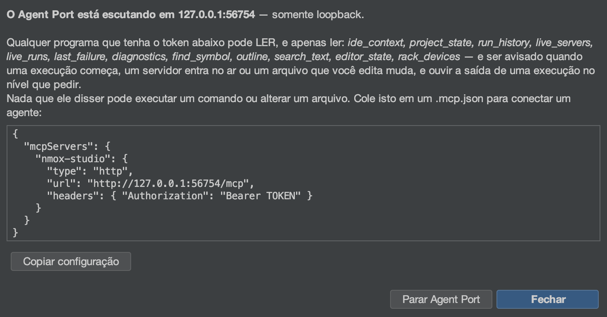

# O Agent Port (MCP)

<!-- languages -->
[English](agent-port.md) · [Español](agent-port.es.md) · [Français](agent-port.fr.md) · [Deutsch](agent-port.de.md) · [Русский](agent-port.ru.md) · [Українська](agent-port.uk.md) · [Polski](agent-port.pl.md) · **Português (Brasil)** · [Bahasa Indonesia](agent-port.id.md) · [Filipino](agent-port.tl.md) · [Tiếng Việt](agent-port.vi.md) · [简体中文](agent-port.zh.md) · [हिन्दी](agent-port.hi.md) · [עברית](agent-port.he.md) · [العربية](agent-port.ar.md)
<!-- /languages -->

*Aponte um agente de IA para a sua IDE — e deixe-o LER, nunca executar.*



O NMOX Studio traz um servidor Model Context Protocol. Qualquer agente que
fale MCP (Claude Code, um assistente de editor, o seu próprio script) pode
se conectar a ele e perguntar à IDE o que ela sabe: qual projeto está
apontado, o que está servindo, o que está rodando, o que você está
editando, onde um nome é declarado, o que falhou por último. Ele é
**somente leitura por construção**: a compilação falha se qualquer classe
do pacote do Agent Port sequer citar um jeito de iniciar um processo,
gravar um arquivo ou parar uma execução.

## 1. Ligue

**Faça:** Ferramentas ▸ **Agent Port (MCP)…** (escolher o item já inicia
a porta), depois **Copiar configuração**.

**Veja:** uma caixa de diálogo com o endpoint (só na interface local, numa
porta nova), um token bearer gerado a cada partida e uma configuração de
cliente pronta:

```json
{
  "mcpServers": {
    "nmox-studio": {
      "type": "http",
      "url": "http://127.0.0.1:PORT/mcp",
      "headers": { "Authorization": "Bearer TOKEN" }
    }
  }
}
```

Cole isso no `.mcp.json` do seu agente, ou pressione **Copiar para o Claude
Code** para obter a única linha que o Claude Code aceita no lugar:

```bash
claude mcp add --transport http nmox-studio http://127.0.0.1:PORT/mcp --header "Authorization: Bearer TOKEN"
```

O token nunca vai para log. A menos que você peça o contrário, ele existe só
nessa caixa de diálogo e morre com a porta, então a próxima inicialização tem
um endereço novo e um token novo. Marque **Manter este endereço e este token**
e ele é guardado no chaveiro do sistema e reutilizado, com a mesma porta, de
modo que um agente configurado uma vez ainda se conecta amanhã; se outro
programa tiver ocupado essa porta, o NMOX Studio abre uma nova e avisa.
Marque também **Iniciar junto com o NMOX Studio** e a porta sobe junto com a
IDE. Desmarcar Manter apaga a entrada do chaveiro.
**Parar Agent Port** encerra; sair da IDE também. Enquanto ele escuta, a
linha de status mostra **⌁ agent port :N** — uma porta que pode ler a sua
IDE nunca fica invisível; a dica do selo conta os agentes com stream
aberto, e um clique reabre a caixa de diálogo (configuração, ou Parar).

## 2. As ferramentas

Toda ferramenta responde com um texto para humanos E um
`structuredContent` tipado sob um `outputSchema` declarado (a compilação
valida o esquema contra a saída real) e vem anotada com
`readOnlyHint: true`.

| Ferramenta | O que responde | Argumentos |
|------|-----------------|-----------|
| `ide_context` | O retrato inteiro para se orientar, numa chamada: projeto, cadeia de ferramentas, servidores, execuções, o arquivo em edição, a última falha, uma contagem de diagnósticos | — |
| `project_state` | O projeto apontado: nome, diretório, branch do git, tipo detectado, gerenciador de pacotes do Node | — |
| `run_history` | As partidas e saídas do gravador de voo, mais recentes primeiro, cada saída com o comando, o código e a duração; uma execução que você mesmo parou aparece como `stopped`, nunca `failed` | `limit` |
| `live_servers` | Cada servidor de desenvolvimento que a IDE sabe estar servindo, com a URL | — |
| `live_runs` | Cada comando rodando neste momento (o que o ■ da barra pararia), com a hora em que começou | — |
| `last_failure` | A execução com falha mais recente: dispositivo, comando, código de saída, até cinco linhas de erro | — |
| `diagnostics` | O que os linters e verificadores estão apontando agora | `file` (filtro por trecho) |
| `find_symbol` | Onde um nome é declarado — o mesmo índice de Ir para o símbolo (⌥⇧⌘O) | `query`, `limit` |
| `outline` | A estrutura de um arquivo — os próprios itens do Navegador (⌘7) | `file` |
| `search_text` | Linhas que contêm um literal, sem diferenciar maiúsculas, com limite e cada corte informado; arquivos `.env`, arquivos rc de gerenciadores de pacotes e chaves privadas nunca são pesquisados | `query`, `limit` |
| `editor_state` | O arquivo em edição (a aba de editor em foco, senão a que aparece na área do editor) e cada aba aberta, com as não salvas marcadas | — |
| `rack_devices` | Os dispositivos montados no rack de tarefas, em ordem | — |

Toda lista tem limite e diz isso: `find_symbol` e `outline` informam um
índice parcial, `search_text` informa `truncated` só quando existe mais
uma ocorrência, `run_history` informa quando eventos mais antigos ficaram
de fora.

## 3. Recursos, prompts e o stream

As mesmas respostas podem ser navegadas como recursos que um agente anexa
como contexto — `nmox://context`, `nmox://project`, `nmox://history`,
`nmox://servers`, `nmox://runs`, `nmox://editor`,
`nmox://last-failure`, `nmox://diagnostics`, `nmox://devices` — mais dois
modelos para as ferramentas que recebem argumento:
`nmox://outline/{file}` e `nmox://search/{query}` (com percent-encoding).
O texto de um recurso é o JSON estruturado da ferramenta dele, byte a byte.

Um agente que prefere ser avisado a perguntar de novo pode **assinar**:
`resources/subscribe` em qualquer uma dessas URIs, e o stream GET da porta
(o canal servidor-para-cliente do Streamable HTTP, `Accept:
text/event-stream`, o mesmo token, sem `Origin`) traz um quadro
`notifications/resources/updated` no instante em que a coisa por trás
muda — uma execução começa e `nmox://runs` é anunciado, um servidor entra
no ar e `nmox://servers` é anunciado, um linter aponta algo e
`nmox://diagnostics` é anunciado, uma aba muda ou um arquivo é salvo e
`nmox://editor` é anunciado; `nmox://context` acompanha todos eles. O
quadro nomeia a URI e mais nada; o agente relê o que lhe interessa. Um
esquema que um agente anexou também acompanha o seu arquivo: assine
`nmox://outline/src/app.ts` e a porta anuncia essa URI quando o arquivo
muda no disco (um salvamento, uma formatação, um gerador), e mais uma vez
se ele sumir — um arquivo comum dentro do projeto apontado, no máximo
trinta e dois deles, verificados a cada dois segundos; um caminho fora do
projeto é `-32002`, nunca lido.

Três prompts juntam o estado ao vivo numa pergunta: `diagnose_failure`
(a última falha), `review_setup` (o contexto inteiro) e `where_is` — o
que recebe um argumento, `name` — que junta os resultados de símbolo para
esse nome.

Um agente preenchendo esse argumento, ou o `{file}` do modelo de esquema,
pode perguntar antes: `completion/complete` (a quarta primitiva da
especificação) responde o `name` do `where_is` a partir do índice de
símbolos (os mesmos resultados que `find_symbol` devolve, sem repetição,
os que começam com o prefixo primeiro) e o `{file}` a partir dos próprios
arquivos do projeto (os que começam com o prefixo, depois os que o
contêm; a lista de pastas ignoradas da busca vale, então `node_modules`
nunca é completado) — no máximo 100 valores, `hasMore` quando o limite
cortou, e `total` só quando a contagem é exata (uma lista de arquivos
sempre é; passado o limite, o índice de símbolos responde um mínimo, então
nenhum número é dado em vez de um número errado). O literal do modelo de
busca pode ser qualquer coisa, então ele não completa nada; um nome de
prompt, modelo ou argumento desconhecido é recusado como `-32602`.

O mesmo stream traz **mensagens de log**: cada linha que cada execução
imprime chega como `notifications/message`, com a execução como `logger`
— o ciclo de vida em `info` (`$ npm run build`, `[exit 0]`,
`[exit 143] stopped`; uma saída com falha em `error`), o stderr em
`warning`, a saída comum em `debug`. O nível começa em `info`, então um
agente ouve as execuções começarem e terminarem e mais nada até pedir:
`logging/setLevel` com `debug` abre a torneira. Um build que imprime mais
rápido do que o cliente lê nunca faz a memória da porta crescer — passadas
mil linhas não escritas, o excedente é contado e anunciado como uma única
linha `warning`, nunca perdido em silêncio. Um nível que a especificação
não nomeia é recusado como `-32602`.

## 4. O passeio, à mão

Com o token numa variável de shell (nunca numa linha de comando que você
colaria em algum lugar):

```bash
curl -s -X POST "$URL" -H "Authorization: Bearer $TOKEN" \
  -H "Content-Type: application/json" -H "Accept: application/json" \
  -d '{"jsonrpc":"2.0","id":1,"method":"tools/call","params":{"name":"find_symbol","arguments":{"query":"checkout"}}}'
```

**Veja:** `checkout (function) — src/cart.js:12`, e o mesmo em
`structuredContent.hits[0]`.

O stream, à mão: abra-o num shell e assine a partir de outro —

```bash
curl -N -s "$URL" -H "Authorization: Bearer $TOKEN" -H "Accept: text/event-stream"
```

```bash
curl -s -X POST "$URL" -H "Authorization: Bearer $TOKEN" \
  -H "Content-Type: application/json" -H "Accept: application/json" \
  -d '{"jsonrpc":"2.0","id":2,"method":"resources/subscribe","params":{"uri":"nmox://runs"}}'
curl -s -X POST "$URL" -H "Authorization: Bearer $TOKEN" \
  -H "Content-Type: application/json" -H "Accept: application/json" \
  -d '{"jsonrpc":"2.0","id":3,"method":"logging/setLevel","params":{"level":"debug"}}'
```

**Veja:** `: connected`, depois `: keepalive` a cada quinze segundos;
aperte ▶ e o primeiro shell imprime `notifications/resources/updated` para
`nmox://runs` e cada linha que a execução imprime como
`notifications/message` (`$ npm run dev` em `info`, a saída em `debug`);
aperte ■ e `[exit 143] stopped` chega em `info`.

O mesmo passeio com o **cliente oficial**, todas as primitivas de uma vez,
vem no repositório: `scripts/agent-port-walk.mjs` (o cabeçalho dele diz
como instalar `@modelcontextprotocol/sdk` num diretório descartável e onde
entram a URL e o token — variáveis de shell, nunca uma linha de comando).
Ele imprime uma linha por etapa e termina com WALK CLEAN ou com o número
de surpresas como código de saída (numa etapa de recusa, uma RESPOSTA é a
surpresa), para que um job de CI consiga lê-lo; aperte ▶ e ■ na IDE
enquanto ele escuta e as mensagens de log chegam.

## 5. As recusas são recursos

| Você faz | A porta diz |
|--------|---------------|
| Chama sem o token, ou com um vencido | `401` — mais nada, nem a lista de ferramentas |
| Chama de uma página num navegador (qualquer `Origin`) | `403` |
| Um `GET` simples | `405` — a porta não é uma página; só o `GET` SSE (com `Accept: text/event-stream`) é atendido, como o stream de assinatura |
| Assina `nmox://nonesuch`, ou um esquema fora do projeto | JSON-RPC `-32002` (recurso não encontrado) |
| Assina um trigésimo terceiro esquema | `-32602`, citando o limite |
| Lê `nmox://nonesuch` | JSON-RPC `-32002` (recurso não encontrado) |
| Pede `where_is` sem `name` | `-32602`, citando o argumento que falta |
| Pede um arquivo fora do projeto (`../../.zshrc`) | `outline` recusa — *fora do projeto apontado* — e nunca o lê |
| Busca um valor que mora em `.env` (ou `app.env`), `.npmrc`, `.htpasswd`, `secrets.yaml`, `credentials.json` ou num `.pem` — ou pede o esquema deles | nada — esses arquivos nunca são pesquisados, nunca contados, nunca completados, e `outline` os recusa pelo nome; a lei de ambiente da própria IDE (o nome de uma chave, nunca o valor) vale para os agentes também |
| Define o nível de log como `loud` | `-32602`, citando os oito níveis |
| Pede para executar, gravar ou parar qualquer coisa | não existe essa ferramenta; o teste do inventário garante que continue assim |

Essa última linha é o projeto. Um agente que pode rodar o seu servidor
também pode pará-lo, e um agente que pode gravar também pode apagar; o
Agent Port continua sendo um jeito de PERGUNTAR. Se uma versão futura
acrescentar uma superfície de execução, ela virá com o seu próprio desenho
de consentimento, como veio o fluxo de dados para fora do KVASIR.

Veja também: a estação 24 do Kitchen Sink e o parágrafo sobre o Agent Port
no guia do usuário.
