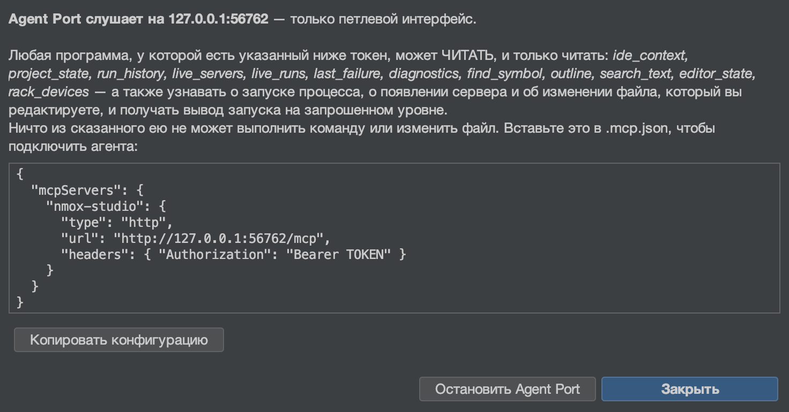

# Agent Port (MCP)

<!-- languages -->
[English](agent-port.md) · [Español](agent-port.es.md) · [Français](agent-port.fr.md) · [Deutsch](agent-port.de.md) · **Русский** · [Українська](agent-port.uk.md) · [Polski](agent-port.pl.md) · [Português (Brasil)](agent-port.pt.md) · [Bahasa Indonesia](agent-port.id.md) · [Filipino](agent-port.tl.md) · [Tiếng Việt](agent-port.vi.md) · [简体中文](agent-port.zh.md) · [हिन्दी](agent-port.hi.md) · [עברית](agent-port.he.md) · [العربية](agent-port.ar.md)
<!-- /languages -->

*Наведите ИИ-агента на свою IDE — и позвольте ему ЧИТАТЬ, но никогда не запускать.*



NMOX Studio поставляется с сервером Model Context Protocol. Любой агент,
говорящий на MCP (Claude Code, помощник в редакторе, ваш собственный
скрипт), может к нему подключиться и спросить IDE о том, что она знает:
на какой проект она наведена, что раздаётся, что выполняется, что вы
редактируете, где объявлено имя, что упало последним. Он **только для
чтения по построению**: сборка падает, если какой-либо класс пакета Agent
Port хотя бы называет способ запустить процесс, записать файл или
остановить запуск.

## 1. Запустите его

**Сделайте:** Сервис ▸ **Agent Port (MCP)…** (сам выбор пункта запускает порт),
затем **Копировать конфигурацию**.

**Увидите:** диалог с конечной точкой (только петлевой интерфейс, свежий
порт), токеном доступа, создаваемым при каждом запуске, и готовой
конфигурацией клиента:

```json
{
  "mcpServers": {
    "nmox-studio": {
      "type": "http",
      "url": "http://127.0.0.1:PORT/mcp",
      "headers": { "Authorization": "Bearer TOKEN" }
    }
  }
}
```

Вставьте её в `.mcp.json` вашего агента. Токен существует только в этом
диалоге — он никогда не пишется в журнал и не сохраняется — и умирает
вместе с портом. **Остановить Agent Port** его завершает; выход из IDE
тоже. Пока порт слушает, строка состояния показывает **⌁ agent port :N**
— порт, способный читать вашу IDE, никогда не бывает невидимым;
подсказка значка считает агентов, получающих поток, а щелчок снова
открывает диалог (конфигурация или остановка).

## 2. Инструменты

Каждый инструмент отвечает и текстом для человека, И типизированным
`structuredContent` под объявленной `outputSchema` (сборка сверяет
схему с настоящим выводом) и помечен `readOnlyHint: true`.

| Инструмент | На что отвечает | Аргументы |
|------|-----------------|-----------|
| `ide_context` | Весь ориентирующий снимок за один вызов: проект, инструментарий, серверы, запуски, редактируемый файл, последний сбой, число диагностик | — |
| `project_state` | Наведённый проект: имя, каталог, ветка git, определённый вид, менеджер пакетов Node | — |
| `run_history` | Запуски и выходы из бортового самописца, новые первыми, у каждого выхода команда, код и длительность; запуск, который вы остановили сами, читается как `stopped`, никогда как `failed` | `limit` |
| `live_servers` | Каждый сервер разработки, о раздаче которого знает IDE, с его URL | — |
| `live_runs` | Каждая команда, выполняющаяся прямо сейчас (то, что остановила бы ■ на панели), со временем начала | — |
| `last_failure` | Последний неудачный запуск: прибор, команда, код выхода, до пяти строк ошибок | — |
| `diagnostics` | Что сейчас сообщают линтеры и проверки | `file` (фильтр по подстроке) |
| `find_symbol` | Где объявлено имя — тот же индекс, что у «Перейти к символу» (⌥⇧⌘O) | `query`, `limit` |
| `outline` | Структура одного файла — те же элементы, что в Навигаторе | `file` |
| `search_text` | Строки, содержащие литерал, без учёта регистра, с ограничениями и отчётом о каждом пределе; файлы `.env`, rc-файлы менеджеров пакетов и приватные ключи никогда не просматриваются | `query`, `limit` |
| `editor_state` | Редактируемый файл (вкладка редактора в фокусе, иначе та, что показана в области редактора) и все открытые вкладки, несохранённые отмечены | — |
| `rack_devices` | Приборы, стоящие в стойке задач, по порядку | — |

Каждый список ограничен и говорит об этом: `find_symbol` и `outline`
сообщают о неполном индексе, `search_text` сообщает `truncated` только
тогда, когда существует ещё одно совпадение, `run_history` сообщает,
когда более старые события не вошли.

## 3. Ресурсы, промпты и поток

Те же ответы можно просматривать как ресурсы, которые агент подключает
как контекст — `nmox://context`, `nmox://project`, `nmox://history`,
`nmox://servers`, `nmox://runs`, `nmox://editor`,
`nmox://last-failure`, `nmox://diagnostics`, `nmox://devices`, — плюс
два шаблона для инструментов, принимающих аргумент:
`nmox://outline/{file}` и `nmox://search/{query}` (с процентным
кодированием). Текст ресурса — это структурированный JSON его
инструмента, байт в байт.

Агент, которому удобнее, чтобы ему сообщали, чем спрашивать снова, может
**подписаться**: `resources/subscribe` на любой из этих URI, и
GET-поток порта (канал от сервера к клиенту в Streamable HTTP, `Accept:
text/event-stream`, тот же токен, без `Origin`) несёт кадр
`notifications/resources/updated` в тот момент, когда меняется то, что
за ним стоит: начинается запуск — и объявляется `nmox://runs`, сервер
оживает — и объявляется `nmox://servers`, линтер отчитывается —
`nmox://diagnostics`, меняется вкладка или сохраняется файл —
`nmox://editor`; `nmox://context` следует за всеми ними. Кадр называет
URI и ничего больше; агент перечитывает то, что ему нужно. Подключённая
агентом структура файла тоже следует за своим файлом: подпишитесь на
`nmox://outline/src/app.ts`, и порт объявит этот URI, когда файл
изменится на диске (сохранение, форматирование, генератор), и ещё раз,
если он исчезнет; это должен быть обычный файл внутри наведённого
проекта, не больше тридцати двух таких, опрос каждые две секунды; путь
вне проекта даёт `-32002` и никогда не читается.

Три промпта вкладывают живое состояние в вопрос: `diagnose_failure`
(последний сбой), `review_setup` (весь контекст) и `where_is` —
единственный с аргументом, `name`, — который вкладывает найденные
символы с этим именем.

Агент, заполняющий этот аргумент или `{file}` шаблона структуры, может
сначала спросить: `completion/complete` (четвёртый примитив
спецификации) отвечает на `name` для `where_is` из индекса символов (те
же находки, что возвращает `find_symbol`, без повторов, совпадения по
префиксу первыми), а на `{file}` — из собственных файлов проекта
(совпадения по префиксу, затем по вхождению; действует список пропусков
обхода поиска, так что `node_modules` никогда не дополняется) — не
больше 100 значений, `hasMore`, когда предел их обрезал, и `total`,
только когда счёт точен (у списка файлов он точен всегда; за пределом
индекс символов даёт лишь нижнюю границу, поэтому число не приводится
вовсе, а не приводится неверное). Литерал шаблона поиска может быть
чем угодно, поэтому он не дополняется ничем; неизвестный промпт, шаблон
или имя аргумента получают отказ `-32602`.

Тот же поток несёт **сообщения журнала**: каждая строка, которую
печатает любой запуск, приходит как `notifications/message` с запуском в
качестве `logger` — жизненный цикл на уровне `info` (`$ npm run build`, `[exit 0]`, `[exit 143]
stopped`; неудачный выход — на `error`), stderr — на `warning`, обычный
вывод — на `debug`. Уровень начинается с `info`, так что агент слышит
начало и конец запусков и ничего больше, пока не попросит:
`logging/setLevel` с `debug` открывает поток целиком. Сборка, которая
печатает быстрее, чем читает клиент, никогда не раздувает память порта:
после тысячи неотправленных строк переполнение подсчитывается и
объявляется одной строкой `warning`, а не теряется молча. Уровень,
которого нет в спецификации, получает отказ `-32602`.

## 4. Проход вручную

Держите токен в переменной оболочки (никогда в командной строке, которую
вы стали бы куда-то вставлять):

```bash
curl -s -X POST "$URL" -H "Authorization: Bearer $TOKEN" \
  -H "Content-Type: application/json" -H "Accept: application/json" \
  -d '{"jsonrpc":"2.0","id":1,"method":"tools/call","params":{"name":"find_symbol","arguments":{"query":"checkout"}}}'
```

**Увидите:** `checkout (function) — src/cart.js:12` и то же самое в
`structuredContent.hits[0]`.

Поток вручную: откройте его в одной оболочке и подпишитесь из другой —

```bash
curl -N -s "$URL" -H "Authorization: Bearer $TOKEN" -H "Accept: text/event-stream"
```

```bash
curl -s -X POST "$URL" -H "Authorization: Bearer $TOKEN" \
  -H "Content-Type: application/json" -H "Accept: application/json" \
  -d '{"jsonrpc":"2.0","id":2,"method":"resources/subscribe","params":{"uri":"nmox://runs"}}'
curl -s -X POST "$URL" -H "Authorization: Bearer $TOKEN" \
  -H "Content-Type: application/json" -H "Accept: application/json" \
  -d '{"jsonrpc":"2.0","id":3,"method":"logging/setLevel","params":{"level":"debug"}}'
```

**Увидите:** `: connected`, затем `: keepalive` каждые пятнадцать
секунд; нажмите ▶ — и первая оболочка напечатает
`notifications/resources/updated` для `nmox://runs` и каждую строку
запуска как `notifications/message` (`$ npm run dev` на `info`, вывод на
`debug`); нажмите ■ — и на `info` придёт `[exit 143] stopped`.

Тот же проход с **официальным клиентом**, со всеми примитивами сразу,
лежит в репозитории: `scripts/agent-port-walk.mjs` (его заголовок
объясняет, как поставить `@modelcontextprotocol/sdk` во временный
каталог и куда девать URL и токен — в переменные оболочки, никогда в
командную строку). Он печатает по строке на шаг и завершается с WALK
CLEAN или с числом неожиданностей в качестве кода выхода (в шаге с
отказом неожиданностью считается ОТВЕТ), так что его может читать задача
CI; нажимайте ▶ и ■ в IDE, пока он слушает, — и сообщения журнала
придут.

## 5. Отказы — это возможности

| Вы делаете | Порт отвечает |
|--------|---------------|
| Вызов без токена или с устаревшим | `401` — и больше ничего, даже списка инструментов |
| Вызов со страницы в браузере (любой `Origin`) | `403` |
| Простой `GET` | `405` — порт не страница; обслуживается только SSE `GET` (с `Accept: text/event-stream`) как поток подписки |
| Подписка на `nmox://nonesuch` или на структуру файла вне проекта | JSON-RPC `-32002` (ресурс не найден) |
| Подписка на тридцать третью структуру | `-32602` с указанием предела |
| Чтение `nmox://nonesuch` | JSON-RPC `-32002` (ресурс не найден) |
| Вызов `where_is` без `name` | `-32602` с указанием недостающего аргумента |
| Запрос файла вне проекта (`../../.zshrc`) | `outline` отказывает — *вне наведённого проекта* — и никогда его не читает |
| Поиск значения, которое живёт в `.env` (или `app.env`), `.npmrc`, `.htpasswd`, `secrets.yaml`, `credentials.json` или `.pem`, — или запрос их структуры | ничего — эти файлы никогда не просматриваются, не подсчитываются и не дополняются, а `outline` отказывает им по имени; собственный закон IDE для окружения (имя ключа, но никогда не его значение) действует и для агентов |
| Уровень журнала `loud` | `-32602` с перечислением восьми уровней |
| Просьба что-нибудь запустить, записать или остановить | такого инструмента нет; тест-реестр следит, чтобы так и оставалось |

Последняя строка и есть замысел. Агент, который может запустить ваш
сервер, может его и остановить, а агент, который может писать, может и
удалять; Agent Port остаётся способом СПРОСИТЬ. Если будущая версия
добавит поверхность выполнения, она придёт со своим собственным
устройством согласия — так, как это было с исходящим потоком данных
KVASIR.

См. также: станцию 24 в Kitchen Sink и абзац об Agent Port в
руководстве пользователя.
