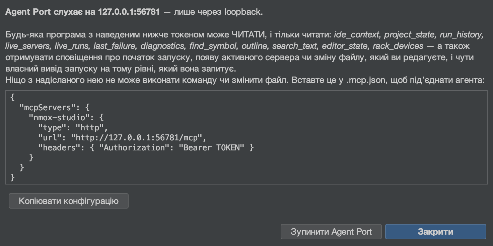

# Agent Port (MCP)

<!-- languages -->
[English](agent-port.md) · [Español](agent-port.es.md) · [Français](agent-port.fr.md) · [Deutsch](agent-port.de.md) · [Русский](agent-port.ru.md) · **Українська** · [Polski](agent-port.pl.md) · [Português (Brasil)](agent-port.pt.md) · [Bahasa Indonesia](agent-port.id.md) · [Filipino](agent-port.tl.md) · [Tiếng Việt](agent-port.vi.md) · [简体中文](agent-port.zh.md) · [हिन्दी](agent-port.hi.md) · [עברית](agent-port.he.md) · [العربية](agent-port.ar.md)
<!-- /languages -->

*Націльте ШІ-агента на свою IDE — і дозвольте йому ЧИТАТИ, але ніколи не
запускати.*



NMOX Studio постачається із сервером Model Context Protocol. Будь-який
агент, що говорить MCP (Claude Code, помічник у редакторі, ваш власний
скрипт), може під’єднатися до нього й запитати IDE про те, що вона знає:
на який проєкт націлено, що обслуговується, що виконується, що ви
редагуєте, де оголошено ім’я, що востаннє завершилося невдачею. Він
**лише для читання за побудовою**: збирання падає, якщо будь-який клас у
пакеті Agent Port бодай назве спосіб запустити процес, записати файл або
зупинити запуск.

## 1. Запустіть його

**Зробіть:** Інструменти ▸ **Agent Port (MCP)…** (вибір цього пункту запускає порт), потім
**Копіювати конфігурацію**.

**Побачите:** діалог із кінцевою точкою (лише loopback, щоразу новий
порт), токеном bearer для цього запуску та готовою конфігурацією клієнта:

```json
{
  "mcpServers": {
    "nmox-studio": {
      "type": "http",
      "url": "http://127.0.0.1:PORT/mcp",
      "headers": { "Authorization": "Bearer TOKEN" }
    }
  }
}
```

Вставте її в `.mcp.json` вашого агента. Токен існує лише в цьому діалозі —
він ніколи не потрапляє в журнал і не зберігається — і зникає разом із
портом. **Зупинити Agent Port** завершує роботу; так само діє вихід з IDE.
Поки порт слухає, рядок стану показує **⌁ agent port :N** — порт, що може
читати вашу IDE, ніколи не буває невидимим; підказка значка рахує агентів,
які слухають потік, а клацання знову відкриває діалог (конфігурація або
зупинка).

## 2. Інструменти

Кожен інструмент відповідає зрозумілим людині текстом І типізованим
`structuredContent` за оголошеною `outputSchema` (збирання перевіряє схему
на справжньому виводі) і має анотацію `readOnlyHint: true`.

| Інструмент | Що відповідає | Аргументи |
|------|-----------------|-----------|
| `ide_context` | Увесь орієнтаційний знімок за один виклик: проєкт, інструментарій, сервери, запуски, файл, що редагується, остання невдача, кількість діагностик | — |
| `project_state` | Націлений проєкт: назва, каталог, гілка git, визначений тип, менеджер пакетів Node | — |
| `run_history` | Запуски й завершення з бортового самописця, найновіші першими, кожне завершення з командою, кодом і тривалістю; запуск, який ви зупинили самі, позначено `stopped`, а не `failed` | `limit` |
| `live_servers` | Кожен сервер розробки, про який IDE знає, що він обслуговує, з його URL | — |
| `live_runs` | Кожна команда, що виконується просто зараз (те, що зупинив би ■ на панелі інструментів), із часом запуску | — |
| `last_failure` | Найсвіжіший невдалий запуск: прилад, команда, код завершення, до п’яти рядків помилок | — |
| `diagnostics` | Що наразі повідомляють лінтери й перевірки | `file` (фільтр за підрядком) |
| `find_symbol` | Де оголошено ім’я — той самий індекс, що й у «Перейти до символу» (⌥⇧⌘O) | `query`, `limit` |
| `outline` | Структура одного файлу — ті самі елементи, що в Навігаторі | `file` |
| `search_text` | Рядки з буквальним текстом, без урахування регістру, з обмеженнями, про кожне з яких повідомлено; файли `.env`, rc-файли менеджерів пакетів і приватні ключі ніколи не проглядаються | `query`, `limit` |
| `editor_state` | Файл, що редагується (вкладка редактора у фокусі, інакше та, що показана в області редактора), і кожна відкрита вкладка з позначкою незбережених | — |
| `rack_devices` | Прилади, змонтовані на стійці, по порядку | — |

Кожен список обмежений і прямо про це каже: `find_symbol` і `outline`
повідомляють про неповний індекс, `search_text` ставить `truncated` лише
тоді, коли справді існує ще один збіг, `run_history` повідомляє, що
старіші події пропущено.

## 3. Ресурси, підказки й потік

Ті самі відповіді доступні як ресурси, які агент прикріплює як контекст, —
`nmox://context`, `nmox://project`, `nmox://history`,
`nmox://servers`, `nmox://runs`, `nmox://editor`,
`nmox://last-failure`, `nmox://diagnostics`, `nmox://devices`, — а також
два шаблони для інструментів, що приймають аргумент:
`nmox://outline/{file}` і `nmox://search/{query}` (з відсотковим
кодуванням). Текст ресурсу — це структурований JSON його інструмента,
байт у байт.

Агент, якому зручніше отримувати повідомлення, ніж перепитувати, може
**підписатися**: `resources/subscribe` на будь-який із цих URI, і потік GET
порту (канал «сервер → клієнт» у Streamable HTTP, `Accept:
text/event-stream`, той самий токен, без `Origin`) доставляє кадр
`notifications/resources/updated` тієї миті, коли змінюється те, що за ним
стоїть: починається запуск — оголошується `nmox://runs`, сервер стає
живим — `nmox://servers`, лінтер щось повідомляє — `nmox://diagnostics`,
змінюється вкладка чи зберігається файл — `nmox://editor`;
`nmox://context` іде за всіма ними. Кадр називає URI і нічого більше;
агент сам перечитує те, що його цікавить. Прикріплена агентом структура
теж стежить за своїм файлом: підпишіться на `nmox://outline/src/app.ts`, і
порт оголосить цей URI, коли файл зміниться на диску (збереження,
форматування, генератор), і ще раз, якщо він зникне — це має бути
звичайний файл усередині націленого проєкту, щонайбільше тридцять два
таких, опитуються кожні дві секунди; шлях поза проєктом дає `-32002` і
ніколи не читається.

Три підказки вбудовують живий стан у запитання: `diagnose_failure`
(остання невдача), `review_setup` (увесь контекст) і `where_is` — та, що
приймає аргумент `name`, — яка вбудовує знайдені символи для цього імені.

Агент, що заповнює цей аргумент або `{file}` шаблону структури, може
спершу запитати: `completion/complete` (четвертий примітив специфікації)
відповідає на `name` для `where_is` з індексу символів (ті самі збіги, що
повертає `find_symbol`, без повторів, спершу збіги за префіксом) і на
`{file}` — з власних файлів проєкту (спершу збіги за префіксом, потім за
входженням; діє список пропусків обходу пошуку, тож `node_modules` ніколи
не доповнюється) — щонайбільше 100 значень, `hasMore`, коли обмеження їх
обрізало, і `total` лише тоді, коли кількість точна (для списку файлів
завжди; понад обмеження індекс символів знає лише нижню межу, тож краще
жодного числа, ніж хибне). Літерал шаблону пошуку може бути будь-яким,
тож він не доповнюється нічим; невідома назва підказки, шаблону чи
аргументу відхиляється як `-32602`.

Той самий потік доставляє **повідомлення журналу**: кожен рядок, який
друкує кожен запуск, надходить як `notifications/message` із запуском як
`logger` — життєвий цикл на рівні `info` (`$ npm run build`, `[exit 0]`,
`[exit 143] stopped`; невдале завершення на рівні `error`), stderr на
`warning`, звичайний вивід на `debug`. Рівень спершу `info`, тож агент
чує початок і кінець запусків і нічого більше, доки не попросить:
`logging/setLevel` з `debug` відкриває повний потік. Збирання, що друкує
швидше, ніж читає клієнт, ніколи не роздуває пам’ять порту — понад тисячу
незаписаних рядків надлишок рахується й оголошується одним рядком
`warning`, а не губиться мовчки. Рівень, якого немає в специфікації,
відхиляється як `-32602`.

## 4. Обхід вручну

З токеном у змінній оболонки (ніколи не в командному рядку, який ви
могли б кудись вставити):

```bash
curl -s -X POST "$URL" -H "Authorization: Bearer $TOKEN" \
  -H "Content-Type: application/json" -H "Accept: application/json" \
  -d '{"jsonrpc":"2.0","id":1,"method":"tools/call","params":{"name":"find_symbol","arguments":{"query":"checkout"}}}'
```

**Побачите:** `checkout (function) — src/cart.js:12`, і те саме в
`structuredContent.hits[0]`.

Потік вручну: відкрийте його в одній оболонці й підпишіться з іншої —

```bash
curl -N -s "$URL" -H "Authorization: Bearer $TOKEN" -H "Accept: text/event-stream"
```

```bash
curl -s -X POST "$URL" -H "Authorization: Bearer $TOKEN" \
  -H "Content-Type: application/json" -H "Accept: application/json" \
  -d '{"jsonrpc":"2.0","id":2,"method":"resources/subscribe","params":{"uri":"nmox://runs"}}'
curl -s -X POST "$URL" -H "Authorization: Bearer $TOKEN" \
  -H "Content-Type: application/json" -H "Accept: application/json" \
  -d '{"jsonrpc":"2.0","id":3,"method":"logging/setLevel","params":{"level":"debug"}}'
```

**Побачите:** `: connected`, потім `: keepalive` кожні п’ятнадцять секунд;
натисніть ▶ — і перша оболонка надрукує `notifications/resources/updated`
для `nmox://runs` і кожен рядок запуску як `notifications/message`
(`$ npm run dev` на рівні `info`, вивід на `debug`); натисніть ■ — і
надійде `[exit 143] stopped` на рівні `info`.

Той самий обхід з **офіційним клієнтом**, усі примітиви разом,
постачається в репозиторії: `scripts/agent-port-walk.mjs` (його заголовок
пояснює, як встановити `@modelcontextprotocol/sdk` в окремий каталог і
куди йдуть URL і токен — у змінні оболонки, ніколи не в командний рядок).
Він друкує по рядку на крок і завершується WALK CLEAN або кількістю
несподіванок як кодом завершення (у кроці з відмовою несподіванкою
вважається ВІДПОВІДЬ), тож його може читати завдання CI; натисніть ▶ і ■
в IDE, поки він слухає, — і надійдуть повідомлення журналу.

## 5. Відмови — це функції

| Що ви робите | Що каже порт |
|--------|---------------|
| Виклик без токена або із застарілим | `401` — і нічого більше, навіть переліку інструментів |
| Виклик зі сторінки в браузері (будь-який `Origin`) | `403` |
| Звичайний `GET` | `405` — порт не є сторінкою; обслуговується лише SSE `GET` (з `Accept: text/event-stream`) як потік підписки |
| Підписка на `nmox://nonesuch` або на структуру поза проєктом | JSON-RPC `-32002` (ресурс не знайдено) |
| Підписка на тридцять третю структуру | `-32602` із назвою обмеження |
| Читання `nmox://nonesuch` | JSON-RPC `-32002` (ресурс не знайдено) |
| Запит `where_is` без `name` | `-32602` із назвою відсутнього аргументу |
| Запит файлу поза проєктом (`../../.zshrc`) | `outline` відмовляє — *outside the aimed project* — і ніколи його не читає |
| Пошук значення, що живе в `.env` (чи `app.env`), `.npmrc`, `.htpasswd`, `secrets.yaml`, `credentials.json` або `.pem`, — чи запит їхньої структури | нічого — ці файли ніколи не проглядаються, не рахуються, не доповнюються, а `outline` відмовляє їм на ім’я; власний закон IDE щодо env (назва ключа, але ніколи його значення) діє й для агентів |
| Встановлення рівня журналу `loud` | `-32602` із переліком восьми рівнів |
| Прохання щось запустити, записати чи зупинити | такого інструмента немає; тест реєстру стежить, щоб так і лишалося |

Останній рядок — це і є задум. Агент, який може запустити ваш сервер,
може його й зупинити, а агент, який може записувати, може й видаляти;
Agent Port лишається способом ЗАПИТАТИ. Якщо майбутня версія додасть
поверхню виконання, вона прийде з власним дизайном згоди — так, як це
було з вихідним потоком даних KVASIR.

Див. також: станцію 24 у Kitchen Sink і абзац про Agent Port у посібнику
користувача.
