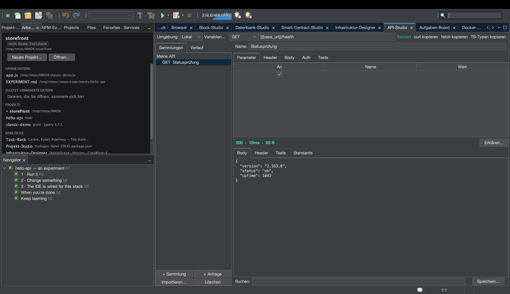

# Tutorial: API-Studio

<!-- languages -->
[English](api-studio.md) · [Español](api-studio.es.md) · [Français](api-studio.fr.md) · **Deutsch** · [Русский](api-studio.ru.md) · [Українська](api-studio.uk.md) · [Polski](api-studio.pl.md) · [Português (Brasil)](api-studio.pt.md) · [Bahasa Indonesia](api-studio.id.md) · [Filipino](api-studio.tl.md) · [Tiếng Việt](api-studio.vi.md) · [简体中文](api-studio.zh.md) · [हिन्दी](api-studio.hi.md) · [עברית](api-studio.he.md) · [العربية](api-studio.ar.md)
<!-- /languages -->

Das API-Studio ist eine REST-Werkbank nach Art von Postman, eingebaut in
die IDE. Sie bauen Anfragen, prüfen die Antwort mit Assertions, und —
das gibt es sonst nirgends — jede Antwort wird an den Standards für
Sicherheits-Header gemessen.

## Öffnen

`⌥⌘8`, oder die Zeile **API-Studio** in der Spalte WERKZEUGE der
Willkommensseite.

## Schritte

1. **Stellen Sie eine Anfrage.** Setzen Sie im Anfrage-Editor die Methode
   auf `GET` und die URL auf `https://httpbin.org/json`. Drücken Sie
   **Senden**. Der Antwort-Body kommt formatiert an; die Statuszeile zeigt
   Code, Zeit und Größe. (Eine ausufernde Antwort kann Ihnen nicht schaden —
   Bodies laufen durch eine Obergrenze von 8 MB.)

2. **Fügen Sie eine Assertion hinzu.** Fügen Sie im Tab **Tests**
   `Status ist 200` und `Body enthält slideshow` hinzu. Senden Sie erneut —
   jede Assertion zeigt ein grünes ✓ oder ein rotes ✗ mit dem tatsächlichen
   Wert.

3. **Lesen Sie die Sicherheitsnote.** Öffnen Sie den Tab **Standards**. Das
   API-Studio bewertet HSTS, CSP, X-Content-Type-Options, den Schutz vor
   Clickjacking, Referrer-Policy und mehr und vergibt eine Schulnote in
   Buchstaben — die Prüfung, die Webentwickler 2026 auf securityheaders.com
   machen, eingebaut in jede Sendung.

4. **Nutzen Sie eine Variable.** Legen Sie eine Umgebung mit `base =
   https://httpbin.org` an und setzen Sie dann die URL einer Anfrage auf
   `{{base}}/get`. Wechseln Sie die Umgebung, um alle Anfragen auf einmal
   umzulenken. Hat das Rack einen laufenden Entwicklungsserver, bietet das
   API-Studio dessen URL sogar als `{{baseUrl}}` an.

5. **Fügen Sie Authentifizierung sicher hinzu.** Wählen Sie im Tab **Auth**
   Bearer oder Basic und geben Sie ein Token ein. Das Token wird **nie** in
   die einzucheckende `.nmoxapi.json` geschrieben — es liegt im
   Schlüsselbund des Systems, zugeordnet zur Anfrage.

6. **Importieren Sie, was Sie schon haben.** Der Knopf **Importieren…**
   liest einen eingefügten curl-Befehl („Copy as cURL“ aus den DevTools des
   Browsers), eine Anfragedatei `.http`/`.rest` oder eine OpenAPI-3-Spezifikation
   (JSON oder YAML) — aus jedem werden echte Anfragen, und ein
   `Authorization`-Header wandert direkt in das Auth-Feld mit
   Schlüsselbund-Anbindung, statt in Ihrer Arbeitsbereichsdatei zu landen.
   **curl kopieren** geht den umgekehrten Weg: der genaue Befehl, den Senden
   ausführen würde, in Ihrer Zwischenablage.

7. **Fragen Sie KVASIR zu einer schlechten Antwort.** Kommt eine Sendung
   falsch zurück, drücken Sie **Erklären…**. Ein
   Einwilligungsdialog sagt Ihnen zuerst genau, was Ihren Rechner verlassen
   würde — Methode, URL mit maskierten Query-*Werten*, Status, unbedenkliche
   Header (Header mit Zugangsdaten bereits entfernt und gezählt) und einen
   begrenzten Body —, und nichts wird gesendet, bevor Sie zustimmen. Lehnen
   Sie ab, läuft nichts; stimmen Sie zu, öffnet sich die Erklärung als
   Gespräch, in dem Sie nachfragen können.

## Was Sie gerade gelernt haben

- Anfragen, Umgebungen und Assertions bleiben je Projekt in
  `.nmoxapi.json` erhalten (ohne Geheimnisse).
- Die Sicherheitsnote macht aus „hat es funktioniert“ ein „ist es sicher“.
- Sendungen lassen sich abbrechen (der Knopf Senden wird zu
  **Abbrechen**) und blockieren nie den Rest der IDE.

## Weiter

- Richten Sie eine Anfrage über das Angebot `{{baseUrl}}` auf einen
  laufenden Rack-Server.
- Das Gegenstück für Datenbanken finden Sie im
  [Datenbank-Studio](db-studio.de.md).
