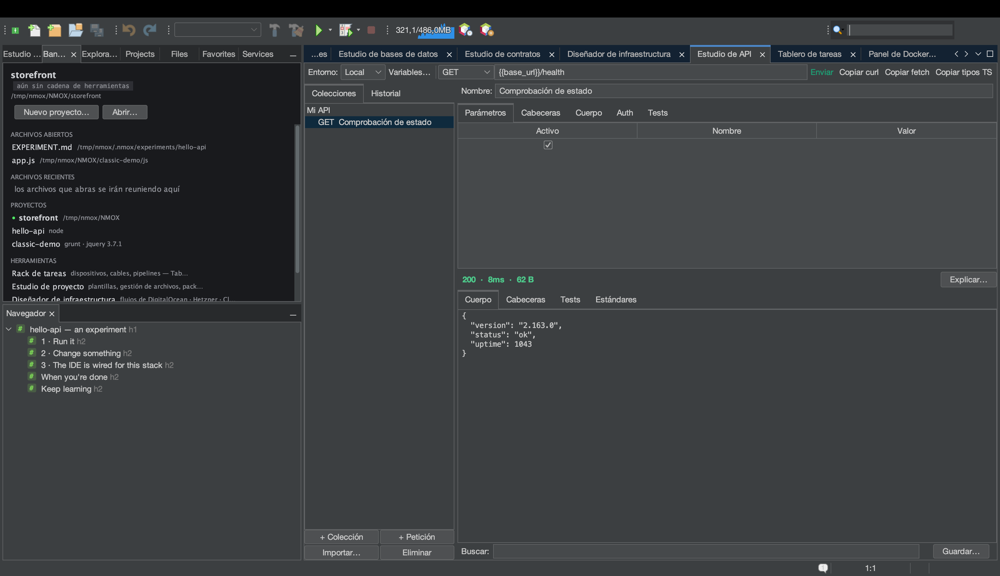

# Tutorial: el Estudio de API

<!-- languages -->
[English](api-studio.md) · **Español** · [Français](api-studio.fr.md) · [Deutsch](api-studio.de.md) · [Русский](api-studio.ru.md) · [Українська](api-studio.uk.md) · [Polski](api-studio.pl.md) · [Português (Brasil)](api-studio.pt.md) · [Bahasa Indonesia](api-studio.id.md) · [Filipino](api-studio.tl.md) · [Tiếng Việt](api-studio.vi.md) · [简体中文](api-studio.zh.md) · [हिन्दी](api-studio.hi.md) · [עברית](api-studio.he.md) · [العربية](api-studio.ar.md)
<!-- /languages -->

El Estudio de API es un banco de trabajo REST al estilo de Postman
integrado en el IDE. Construyes peticiones, lanzas comprobaciones contra
la respuesta y, algo que no hace nadie más, cada respuesta recibe una
nota según los estándares de cabeceras de seguridad de la web.

## Ábrelo

`⌥⌘8`, o la fila **Estudio de API** en la columna HERRAMIENTAS de la
Bienvenida.

## Pasos

1. **Haz una petición.** En el constructor de peticiones, pon el método
   en `GET` y la URL en `https://httpbin.org/json`. Pulsa **Enviar**. El
   cuerpo de la respuesta llega formateado; la línea de estado muestra el
   código, el tiempo y el tamaño. (Una respuesta desbocada no puede
   hacerte daño: los cuerpos pasan por un límite de 8 MB.)

2. **Añade una comprobación.** En la pestaña **Pruebas**, añade
   `Status is 200` y `Body contains slideshow`. Vuelve a enviar: cada
   comprobación muestra un ✓ verde o un ✗ rojo con el valor real.

3. **Lee la nota de seguridad.** Abre la pestaña **Estándares**. El
   Estudio de API evalúa HSTS, CSP, X-Content-Type-Options, la protección
   contra clickjacking, Referrer-Policy y más, y da una nota con letra: la
   comprobación que un desarrollador web de 2026 hace en
   securityheaders.com, integrada en cada envío.

4. **Usa una variable.** Crea un entorno con `base =
   https://httpbin.org` y pon la URL de una petición en `{{base}}/get`.
   Cambia de entorno para reapuntar todas las peticiones a la vez. Si el
   rack tiene un servidor de desarrollo vivo, el Estudio de API incluso te
   ofrece su URL como `{{baseUrl}}`.

5. **Añade autenticación con seguridad.** En la pestaña **Auth**, elige
   Bearer o Basic e introduce un token. El token **nunca** se escribe en
   el `.nmoxapi.json` versionable: vive en el llavero del sistema
   operativo, asociado a la petición.

6. **Importa lo que ya tienes.** El botón **Importar…** lee un comando
   curl pegado («Copy as cURL» de las devtools del navegador), un archivo
   de peticiones `.http`/`.rest` o una especificación OpenAPI 3 (JSON o
   YAML); cada uno se convierte en peticiones reales, y una cabecera
   `Authorization` pasa directamente al campo Auth respaldado por el
   llavero en vez de acabar en tu archivo de trabajo. **Copiar curl** va
   en sentido contrario: el comando exacto que ejecutaría Enviar, en tu
   portapapeles.

7. **Pregúntale a KVASIR por una respuesta rara.** Cuando un envío vuelve
   mal, pulsa **Explicar…**. Primero, un diálogo de consentimiento te dice
   exactamente qué saldría de tu máquina —el método, la URL con los
   *valores* de la consulta enmascarados, el estado, las cabeceras seguras
   (las de credenciales ya eliminadas y contadas) y un cuerpo acotado— y
   no se envía nada hasta que lo digas. Si rechazas, no se ejecuta nada;
   si aceptas, la explicación se abre como una conversación en la que
   puedes seguir preguntando.

## Lo que acabas de aprender

- Las peticiones, los entornos y las comprobaciones persisten por
  proyecto en `.nmoxapi.json` (sin los secretos).
- La nota de seguridad convierte el «¿ha funcionado?» en «¿es seguro?».
- Los envíos se pueden cancelar (el botón Enviar pasa a ser **Cancelar**)
  y nunca bloquean el resto del IDE.

## Siguiente

- Apunta una petición a un servidor del rack en marcha con la oferta de
  `{{baseUrl}}`.
- Consulta el [Estudio de bases de datos](db-studio.es.md) para el
  equivalente con bases de datos.
