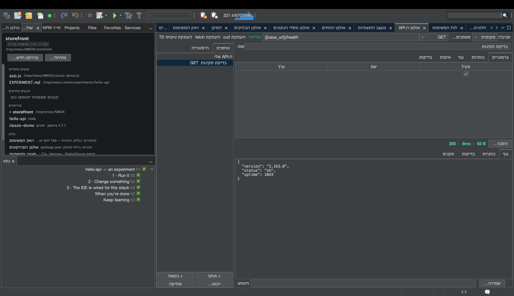

# מדריך: אולפן ה‑API

<!-- languages -->
[English](api-studio.md) · [Español](api-studio.es.md) · [Français](api-studio.fr.md) · [Deutsch](api-studio.de.md) · [Русский](api-studio.ru.md) · [Українська](api-studio.uk.md) · [Polski](api-studio.pl.md) · [Português (Brasil)](api-studio.pt.md) · [Bahasa Indonesia](api-studio.id.md) · [Filipino](api-studio.tl.md) · [Tiếng Việt](api-studio.vi.md) · [简体中文](api-studio.zh.md) · [हिन्दी](api-studio.hi.md) · **עברית** · [العربية](api-studio.ar.md)
<!-- /languages -->

אולפן ה‑API הוא שולחן עבודה ל‑REST בסגנון Postman, מובנה ב‑IDE. בונים בקשות ומריצים בדיקות על התגובה, ומה שמייחד אותו: כל תגובה מקבלת ציון לפי תקני כותרות האבטחה של הרשת.

## פתיחה

`⌥⌘8`, או השורה **אולפן ה‑API** בעמודה כלים של חלון ברוכים הבאים.

## צעדים

1. **צרו בקשה.** בבונה הבקשות קבעו את השיטה ל‑`GET` ואת הכתובת ל‑`https://httpbin.org/json`. לחצו **שליחה**. גוף התגובה מגיע מעוצב; שורת המצב מציגה את הקוד, הזמן והגודל. (תגובה שיוצאת משליטה לא יכולה להזיק — הגופים זורמים דרך תקרה של 8 MB.)

2. **הוסיפו בדיקה.** בלשונית **בדיקות** הוסיפו `Status is 200` ו‑`Body contains slideshow`. שלחו שוב — כל בדיקה מציגה ✓ ירוק או ✗ אדום עם הערך בפועל.

3. **קראו את ציון האבטחה.** פתחו את הלשונית **תקנים**. אולפן ה‑API בודק HSTS, ‏CSP, ‏X-Content-Type-Options, הגנה מפני clickjacking, ‏Referrer-Policy ועוד, ונותן ציון באות — הבדיקה שמפתח ווב ב‑2026 מריץ ב‑securityheaders.com, מובנית בכל שליחה.

4. **השתמשו במשתנה.** צרו סביבה עם `base =
   https://httpbin.org`, ואז קבעו את כתובת הבקשה ל‑`{{base}}/get`. החליפו סביבה כדי לכוון מחדש את כל הבקשות בבת אחת. אם בראק רץ שרת פיתוח חי, אולפן ה‑API אפילו מציע את הכתובת שלו כ‑`{{baseUrl}}`.

5. **הוסיפו אימות בבטחה.** בלשונית **אימות** בחרו Bearer או Basic והזינו אסימון. האסימון **אף פעם** לא נכתב לקובץ ‎`.nmoxapi.json` שנכנס למאגר — הוא נשמר במחזיק המפתחות של המערכת, משויך לבקשה.

6. **ייבאו את מה שכבר יש לכם.** הכפתור **ייבוא…** קורא פקודת curl מודבקת (ה‑"Copy as cURL" של כלי הפיתוח בדפדפן), קובץ בקשות ‎`.http`/`.rest`, או מפרט OpenAPI 3 ‏(JSON או YAML) — כל אחד הופך לבקשות אמיתיות, וכותרת `Authorization` מועברת ישר לשדה האימות שנשען על מחזיק המפתחות, במקום לנחות בקובץ סביבת העבודה שלכם. **העתקת curl** הולכת בכיוון ההפוך: הפקודה המדויקת ש**שליחה** הייתה מריצה, בלוח הגזירים שלכם.

7. **שאלו את KVASIR על תגובה בעייתית.** כשתגובה חוזרת לא כמו שצריך, לחצו **הסבר…**. תיבת הסכמה אומרת קודם בדיוק מה ייצא מהמחשב שלכם — השיטה, הכתובת כש*ערכי* השאילתה ממוסכים, הסטטוס, כותרות בטוחות (כותרות ההרשאה כבר הוסרו ונספרו) וגוף מוגבל בגודלו — ושום דבר לא נשלח עד שתאשרו. סרבו, ושום דבר לא רץ; אשרו, וההסבר נפתח כשיחה שאפשר להמשיך לשאול בה.

## מה למדתם

- בקשות, סביבות ובדיקות נשמרות לכל פרויקט ב‑‎`.nmoxapi.json` (בלי הסודות).
- ציון האבטחה הופך את "האם זה עבד" ל"האם זה בטוח".
- אפשר לבטל שליחות (הכפתור **שליחה** הופך ל**ביטול**), והן אף פעם לא חוסמות את שאר ה‑IDE.

## הלאה

- כוונו בקשה לשרת שרץ בראק דרך ההצעה של `{{baseUrl}}`.
- ראו את [אולפן מסדי הנתונים](db-studio.he.md) למקבילה של מסדי נתונים.
