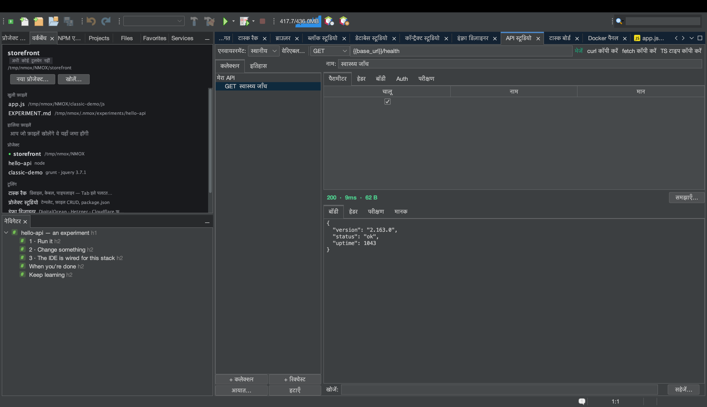

# ट्यूटोरियल: API स्टूडियो

<!-- languages -->
[English](api-studio.md) · [Español](api-studio.es.md) · [Français](api-studio.fr.md) · [Deutsch](api-studio.de.md) · [Русский](api-studio.ru.md) · [Українська](api-studio.uk.md) · [Polski](api-studio.pl.md) · [Português (Brasil)](api-studio.pt.md) · [Bahasa Indonesia](api-studio.id.md) · [Filipino](api-studio.tl.md) · [Tiếng Việt](api-studio.vi.md) · [简体中文](api-studio.zh.md) · **हिन्दी** · [עברית](api-studio.he.md) · [العربية](api-studio.ar.md)
<!-- /languages -->

API स्टूडियो IDE में बना Postman जैसा REST कार्यस्थल है। आप रिक्वेस्ट बनाते
हैं, प्रतिक्रिया पर जाँचें चलाते हैं, और — जो और कहीं नहीं मिलता — हर
प्रतिक्रिया को वेब के सुरक्षा-हेडर मानकों पर ग्रेड किया जाता है।

## इसे खोलें

`⌥⌘8`, या स्वागत के टूलिंग स्तंभ में **API स्टूडियो** की पंक्ति।

## चरण

1. **एक रिक्वेस्ट बनाएँ।** रिक्वेस्ट बिल्डर में मेथड `GET` और URL
   `https://httpbin.org/json` रखें। **भेजें** दबाएँ। प्रतिक्रिया का body
   सुंदर ढंग से फ़ॉर्मैट होकर आता है; स्थिति-पंक्ति कोड, समय और आकार
   दिखाती है। (बेक़ाबू प्रतिक्रिया आपको नुक़सान नहीं पहुँचा सकती — body 8 MB
   की सीमा के भीतर ही पढ़े जाते हैं।)

2. **एक जाँच जोड़ें।** **परीक्षण** टैब पर `Status is 200` और
   `Body contains slideshow` जोड़ें। फिर से भेजें — हर जाँच असली मान के साथ
   हरा ✓ या लाल ✗ दिखाती है।

3. **सुरक्षा ग्रेड पढ़ें।** **मानक** टैब खोलें। API स्टूडियो HSTS, CSP,
   X-Content-Type-Options, clickjacking से बचाव, Referrer-Policy और भी बहुत
   कुछ ग्रेड करता है और एक अक्षर-ग्रेड देता है — वही जाँच जो 2026 का वेब
   डेवलपर securityheaders.com पर चलाता है, हर भेजने में शामिल।

4. **एक चर इस्तेमाल करें।** `base =
   https://httpbin.org` वाला एक परिवेश बनाएँ, फिर किसी रिक्वेस्ट का URL
   `{{base}}/get` रखें। परिवेश बदलें और हर रिक्वेस्ट एक साथ नई जगह इंगित
   करने लगती है। अगर रैक में कोई जीवित डेवलपमेंट सर्वर है, तो API स्टूडियो
   उसका URL `{{baseUrl}}` के रूप में प्रस्तावित भी करता है।

5. **auth सुरक्षित ढंग से जोड़ें।** **Auth** टैब पर Bearer या Basic चुनें
   और टोकन डालें। टोकन कमिट की जाने वाली `.nmoxapi.json` में **कभी** नहीं
   लिखा जाता — वह OS कीचेन में रहता है, उसी रिक्वेस्ट से बँधा हुआ।

6. **जो आपके पास पहले से है उसे आयात करें।** **आयात…** बटन चिपकाया हुआ curl
   कमांड (ब्राउज़र devtools का “Copy as cURL”), कोई `.http`/`.rest`
   रिक्वेस्ट फ़ाइल, या OpenAPI 3 spec (JSON या YAML) पढ़ता है — हर एक असली
   रिक्वेस्ट बन जाता है, और `Authorization` हेडर आपकी वर्कस्पेस फ़ाइल में
   जाने के बजाय सीधे कीचेन वाले Auth फ़ील्ड में उठा लिया जाता है।
   **curl कॉपी करें** उल्टी दिशा में जाता है: ठीक वही कमांड जो भेजें चलाता,
   आपके क्लिपबोर्ड पर।

7. **ख़राब प्रतिक्रिया के बारे में KVASIR से पूछें।** जब भेजने का नतीजा
   ग़लत आए, **समझाएँ…** दबाएँ। पहले एक सहमति संवाद ठीक-ठीक बताता है कि आपकी
   मशीन से क्या बाहर जाएगा — मेथड, query के *मान* छिपाकर URL, स्थिति,
   सुरक्षित हेडर (साख वाले हेडर पहले ही हटाए और गिने हुए), और सीमित body —
   और जब तक आप न कहें, कुछ नहीं भेजा जाता। मना करें और कुछ नहीं चलता;
   स्वीकार करें और व्याख्या एक बातचीत की तरह खुलती है जिसमें आप आगे के
   सवाल पूछ सकते हैं।

## आपने अभी क्या सीखा

- रिक्वेस्ट, परिवेश और जाँचें हर प्रोजेक्ट के लिए `.nmoxapi.json` में बनी
  रहती हैं (रहस्यों को छोड़कर)।
- सुरक्षा ग्रेड “क्या यह चला” को “क्या यह सुरक्षित है” में बदल देता है।
- भेजना रद्द किया जा सकता है (भेजें बटन **रद्द करें** बन जाता है) और यह
  बाक़ी IDE को कभी नहीं रोकता।

## आगे

- `{{baseUrl}}` प्रस्ताव से किसी रिक्वेस्ट को रैक के चलते सर्वर पर इंगित करें।
- डेटाबेस के लिए यही सब [डेटाबेस स्टूडियो](db-studio.hi.md) में देखें।
