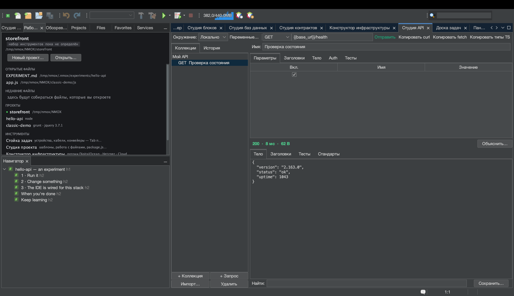

# Урок: Студия API

<!-- languages -->
[English](api-studio.md) · [Español](api-studio.es.md) · [Français](api-studio.fr.md) · [Deutsch](api-studio.de.md) · **Русский** · [Українська](api-studio.uk.md) · [Polski](api-studio.pl.md) · [Português (Brasil)](api-studio.pt.md) · [Bahasa Indonesia](api-studio.id.md) · [Filipino](api-studio.tl.md) · [Tiếng Việt](api-studio.vi.md) · [简体中文](api-studio.zh.md) · [हिन्दी](api-studio.hi.md) · [עברית](api-studio.he.md) · [العربية](api-studio.ar.md)
<!-- /languages -->

Студия API — верстак REST в духе Postman, встроенный в IDE. Вы собираете
запросы, проверяете ответ утверждениями и — чего нет больше нигде —
каждый ответ получает оценку по стандартам заголовков безопасности веба.

## Как открыть

`⌥⌘8` или строка **Студия API** в столбце ИНСТРУМЕНТЫ страницы
приветствия.

## Шаги

1. **Сделайте запрос.** В конструкторе запроса выберите метод `GET` и
   URL `https://httpbin.org/json`. Нажмите **Отправить**. Тело ответа
   придёт отформатированным; строка состояния покажет код, время и
   размер. (Разбушевавшийся ответ вам не навредит — тела читаются потоком
   с пределом 8 МБ.)

2. **Добавьте утверждение.** На вкладке **Тесты** добавьте
   `Статус равен 200` и `Тело содержит «slideshow»`. Отправьте ещё раз —
   у каждого утверждения появится зелёная ✓ или красный ✗ с фактическим
   значением.

3. **Прочтите оценку безопасности.** Откройте вкладку **Стандарты**.
   Студия API оценивает HSTS, CSP, X-Content-Type-Options, защиту от
   кликджекинга, Referrer-Policy и другое и выставляет буквенную оценку —
   ту проверку, которую веб-разработчик 2026 года делает на
   securityheaders.com, встроенную в каждую отправку.

4. **Воспользуйтесь переменной.** Создайте окружение с `base =
   https://httpbin.org`, затем задайте в запросе URL `{{base}}/get`.
   Переключите окружение — и все запросы разом перенацелятся. Если в
   стойке работает сервер разработки, Студия API даже предложит его адрес
   как `{{baseUrl}}`.

5. **Добавьте авторизацию безопасно.** На вкладке **Auth** выберите Bearer
   или Basic и введите токен. Токен **никогда** не пишется в
   `.nmoxapi.json`, который кладут в репозиторий, — он живёт в связке
   ключей ОС, привязанный к запросу.

6. **Импортируйте то, что у вас уже есть.** Кнопка **Импорт…** читает
   вставленную команду curl («Copy as cURL» из инструментов разработчика
   браузера), файл запросов `.http`/`.rest` или спецификацию OpenAPI 3
   (JSON или YAML) — каждый источник превращается в настоящие запросы, а
   заголовок `Authorization` переносится прямо в поле Auth, хранящееся в
   связке ключей, вместо того чтобы оказаться в файле рабочего
   пространства. **Копировать curl** работает в обратную сторону: в буфер
   обмена попадает ровно та команда, которую выполнила бы отправка.

7. **Спросите KVASIR о плохом ответе.** Когда отправка возвращает не то,
   нажмите **Объяснить…**. Сначала диалог согласия точно скажет, что
   покинет вашу машину: метод, URL со скрытыми *значениями* параметров
   запроса, статус, безопасные заголовки (заголовки с учётными данными уже
   убраны и посчитаны) и урезанное тело, — и ничего не отправится, пока вы
   не разрешите. Откажитесь — ничего не произойдёт; согласитесь — и
   объяснение откроется как беседа, в которой можно задавать уточняющие
   вопросы.

## Что вы узнали

- Запросы, окружения и утверждения хранятся по проекту в `.nmoxapi.json`
  (без секретов).
- Оценка безопасности превращает «сработало ли» в «безопасно ли».
- Отправку можно отменить (кнопка «Отправить» превращается в **Отмена**),
  и она никогда не блокирует остальную IDE.

## Дальше

- Направьте запрос на работающий сервер стойки через предложение
  `{{baseUrl}}`.
- Аналог для баз данных — [Студия баз данных](db-studio.ru.md).
