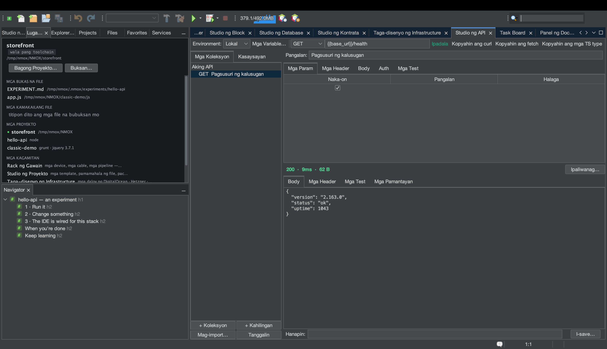

# Tutorial: Studio ng API

<!-- languages -->
[English](api-studio.md) · [Español](api-studio.es.md) · [Français](api-studio.fr.md) · [Deutsch](api-studio.de.md) · [Русский](api-studio.ru.md) · [Українська](api-studio.uk.md) · [Polski](api-studio.pl.md) · [Português (Brasil)](api-studio.pt.md) · [Bahasa Indonesia](api-studio.id.md) · **Filipino** · [Tiếng Việt](api-studio.vi.md) · [简体中文](api-studio.zh.md) · [हिन्दी](api-studio.hi.md) · [עברית](api-studio.he.md) · [العربية](api-studio.ar.md)
<!-- /languages -->

Ang Studio ng API ay REST workbench na estilong Postman na nakapaloob sa
IDE. Bumubuo mo ng mga request, nagpapatakbo ng mga assertion sa response,
at — natatangi rito — minamarkahan ang bawat response ayon sa mga pamantayan
ng web para sa security header.

## Buksan ito

`⌥⌘8`, o ang hanay na **Studio ng API** sa hanay na MGA KASANGKAPAN ng
Maligayang Pagdating.

## Mga hakbang

1. **Gumawa ng request.** Sa request builder, itakda ang method sa `GET`
   at ang URL sa `https://httpbin.org/json`. Pindutin ang **Ipadala**.
   Dumarating ang body ng response na nakaayos nang maganda; ipinapakita ng
   status line ang code, tagal, at laki. (Walang panganib mula sa response
   na walang humpay — dumadaloy ang mga body sa hangganang 8 MB.)

2. **Magdagdag ng assertion.** Sa tab na **Mga Test**, idagdag ang
   `Status is 200` at `Body contains slideshow`. Ipadala muli — nagpapakita
   ang bawat assertion ng berdeng ✓ o pulang ✗ kasama ang tunay na halaga.

3. **Basahin ang marka ng seguridad.** Buksan ang tab na
   **Mga Pamantayan**. Minamarkahan ng Studio ng API ang HSTS, CSP,
   X-Content-Type-Options, proteksiyon sa clickjacking, Referrer-Policy at
   iba pa, at nagbibigay ng markang titik — ang pagsusuring pinapatakbo ng
   isang web developer ng 2026 sa securityheaders.com, nakapaloob sa bawat
   padala.

4. **Gumamit ng variable.** Lumikha ng environment na may `base =
   https://httpbin.org`, saka itakda ang URL ng request sa `{{base}}/get`.
   Magpalit ng environment para ituro nang sabay ang bawat request sa ibang
   lugar. Kung may buhay na dev server ang rack, inaalok pati ng Studio ng
   API ang URL nito bilang `{{baseUrl}}`.

5. **Magdagdag ng auth nang ligtas.** Sa tab na **Auth**, pumili ng Bearer
   o Basic at ilagay ang token. **Hindi kailanman** isinusulat ang token sa
   `.nmoxapi.json` na maii-commit — nakatira ito sa keychain ng OS,
   nakaugnay sa request.

6. **I-import ang mga bagay na mayroon mo.** Binabasa ng pindutang
   **Mag-import…** ang idinikit na curl command (“Copy as cURL” ng browser
   devtools), file ng request na `.http`/`.rest`, o spec ng OpenAPI 3
   (JSON o YAML) — bawat isa ay nagiging tunay na mga request, at ang
   header na `Authorization` ay tuwirang inililipat sa field ng Auth na
   nasa keychain, sa halip na dumapo sa file ng iyong workspace. Kabaligtaran
   ang **Kopyahin ang curl**: ang eksaktong command na pinapatakbo ng
   Ipadala, sa iyong clipboard.

7. **Tanungin ang KVASIR tungkol sa maling response.** Kapag maling
   bumalik ang isang padala, pindutin ang **Ipaliwanag…**. Muna, sinasabi
   ng dialog ng pahintulot ang eksaktong umaalis sa iyong makina — method,
   URL na nakatago ang mga *halaga* ng query, status, mga ligtas na header
   (ang mga header ng credential ay inalis na at binilang), at body na may
   hangganan — at walang ipinapadala hanggang pumayag mo. Tumanggi, at
   walang tumatakbo; pumayag, at bumubukas ang paliwanag bilang usapan kung
   saan maaari kang magtanong ng mga karugtong.

## Ang iyong natutunan

- Naka-imbak kada proyekto sa `.nmoxapi.json` ang mga request, environment,
  at assertion (hindi kasama ang mga lihim).
- Ang marka ng seguridad ay ginagawang “ligtas ba” ang “gumana ba”.
- Maaaring kanselahin ang mga padala (nagiging **Kanselahin** ang pindutang
  Ipadala) at hindi kailanman pinapabitin ang natitirang IDE.

## Susunod

- Itutok ang isang request sa tumatakbong server ng rack sa pamamagitan ng
  alok na `{{baseUrl}}`.
- Tingnan ang [Studio ng Database](db-studio.tl.md) para sa katumbas nito
  para sa database.
