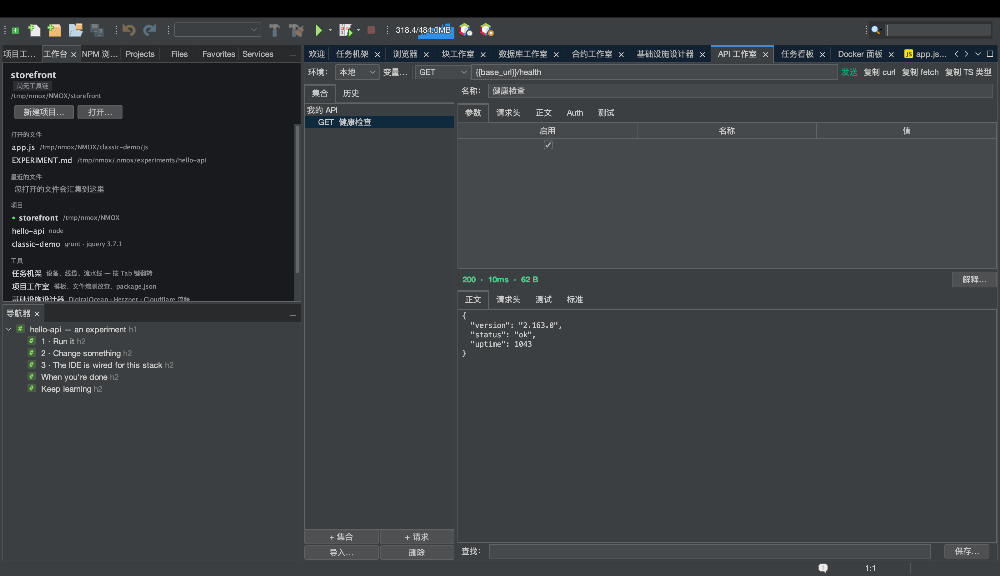

# 教程：API 工作室

<!-- languages -->
[English](api-studio.md) · [Español](api-studio.es.md) · [Français](api-studio.fr.md) · [Deutsch](api-studio.de.md) · [Русский](api-studio.ru.md) · [Українська](api-studio.uk.md) · [Polski](api-studio.pl.md) · [Português (Brasil)](api-studio.pt.md) · [Bahasa Indonesia](api-studio.id.md) · [Filipino](api-studio.tl.md) · [Tiếng Việt](api-studio.vi.md) · **简体中文** · [हिन्दी](api-studio.hi.md) · [עברית](api-studio.he.md) · [العربية](api-studio.ar.md)
<!-- /languages -->

API 工作室是内置在 IDE 里的 Postman 风格 REST 工作台。你构造请求，对响应运行断言，而且 — 这是它独有的 — 每一个响应都会依据网站安全响应头的标准得到评分。

## 打开方式

`⌥⌘8`，或者欢迎页“工具”栏里的 **API 工作室** 那一行。

## 步骤

1. **发一个请求。**在请求构造器里，把方法设为 `GET`，网址设为 `https://httpbin.org/json`。按**发送**。响应体会以美化后的格式到达；状态行显示状态码、耗时和大小。（失控的响应伤不到你 — 响应体以 8 MB 为上限流式读取。）

2. **加一条断言。**在**测试**标签页里加上 `Status is 200` 和 `Body contains slideshow`。再发一次 — 每条断言都会显示绿色的 ✓ 或红色的 ✗，并附上实际的值。

3. **读安全评分。**打开**标准**标签页。API 工作室会给 HSTS、CSP、X-Content-Type-Options、点击劫持防护、Referrer-Policy 等打分，并给出一个字母等级 — 这正是 2026 年的网页开发者会去 securityheaders.com 做的检查，如今内置在每一次发送里。

4. **用一个变量。**新建一个环境，设 `base =
   https://httpbin.org`，然后把某个请求的网址设为 `{{base}}/get`。切换环境，就能一次把所有请求指向别处。如果机架上有一个正在运行的开发服务器，API 工作室甚至会把它的地址作为 `{{baseUrl}}` 提供给你。

5. **安全地加上认证。**在 **Auth** 标签页里选 Bearer 或 Basic，输入令牌。令牌**绝不会**写进可以提交的 `.nmoxapi.json` — 它住在操作系统钥匙串里，与该请求绑定。

6. **导入你已有的东西。****导入…**按钮可以读取粘贴进来的 curl 命令（浏览器开发者工具里的“Copy as cURL”）、一个 `.http`/`.rest` 请求文件，或一份 OpenAPI 3 规范（JSON 或 YAML）— 每一种都会变成真正的请求，而 `Authorization` 请求头会被直接提进由钥匙串支撑的 Auth 字段，而不是落进你的工作区文件。**复制 curl** 则反过来：把“发送”将要执行的那条确切命令放到你的剪贴板上。

7. **就一个不对劲的响应问问 KVASIR。**当一次发送的结果不对时，按**解释…**。一个许可对话框会先准确告诉你哪些东西会离开你的机器 — 方法、查询参数*值*已被遮蔽的网址、状态码、安全的请求头（凭据类请求头已被去掉并计数），以及有上限的响应体 — 在你点头之前什么都不会发送。拒绝就什么都不会执行；同意之后，解释会作为一场对话打开，你可以接着追问。

## 你刚学到了什么

- 请求、环境和断言按项目保存在 `.nmoxapi.json` 里（不含密钥）。
- 安全评分把“能不能用”变成了“安不安全”。
- 发送可以取消（**发送**按钮会变成**取消**），而且从不阻塞 IDE 的其他部分。

## 下一步

- 通过 `{{baseUrl}}` 这个提议，把请求指向机架上正在运行的服务器。
- 数据库方面的对应物，见[数据库工作室](db-studio.zh.md)。
