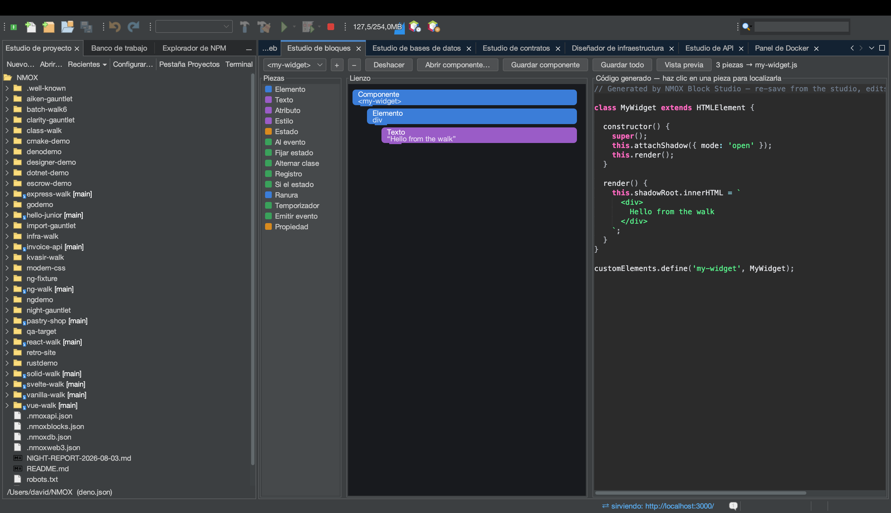

# Tutorial: el Estudio de bloques

<!-- languages -->
[English](block-studio.md) · **Español** · [Français](block-studio.fr.md) · [Deutsch](block-studio.de.md) · [Русский](block-studio.ru.md) · [Українська](block-studio.uk.md) · [Polski](block-studio.pl.md) · [Português (Brasil)](block-studio.pt.md) · [Bahasa Indonesia](block-studio.id.md) · [Filipino](block-studio.tl.md) · [Tiếng Việt](block-studio.vi.md) · [简体中文](block-studio.zh.md) · [हिन्दी](block-studio.hi.md) · [עברית](block-studio.he.md) · [العربية](block-studio.ar.md)
<!-- /languages -->

El Estudio de bloques compone Web Components **de verdad** al estilo de
Scratch. Encajas bloques tipados y genera un elemento personalizado
autónomo (shadow DOM, estado, escuchadores), además de un servidor de
vista previa para que lo veas funcionar. Pulsa un bloque y se resaltan
exactamente las líneas que produjo.

## Ábrelo

`⌥⌘5`, o la pestaña **Estudio de bloques**.

## Pasos

1. **Ponle nombre a tu elemento.** Todo elemento personalizado necesita
   una etiqueta con guion. Empieza un componente y dale una etiqueta como
   `hello-badge`.

2. **Añade bloques desde la paleta.** Arrastra un bloque **Elemento** (un
   nodo del DOM) y ponle texto; añade un campo **Estado**; añade un
   **Al evento** que alterne una clase al hacer clic. Solo se permiten
   anidaciones legales: el lienzo muestra los huecos válidos al soltar y
   rechaza los ilegales, también al cargar.

3. **Lee el código.** El panel central muestra el `text/javascript`
   generado: un elemento personalizado completo. Pulsa cualquier bloque y
   se resaltan las líneas que produjo; la correspondencia es exacta.

4. **Míralo en vivo.** Pulsa **Vista previa**. El Estudio de bloques sirve
   el componente desde un servidor en memoria y lo muestra; `⇄` y la
   búsqueda rápida enseñan la URL viva. Los componentes del mismo espacio
   de trabajo pueden incluso usarse entre sí.

5. **Guárdalo.** **Guardar componente** escribe
   `src/components/<tag>.js` de forma atómica, sin pisar nunca un archivo
   editado a mano. Todo el espacio de trabajo vive en `.nmoxblocks.json`;
   **Abrir componente…** vuelve a importar un archivo que escribiste tú (o
   el estudio), siempre que siga en el dialecto de bloques.

## Lo que acabas de aprender

- El resultado es un elemento personalizado real, sin framework, listo
  para publicar.
- La correspondencia bloque↔código va en los dos sentidos: las ediciones
  dentro del dialecto se reimportan limpiamente.
- Un espacio de trabajo guarda muchos componentes; cambiar de uno a otro
  es un límite de deshacer.

## Siguiente

- Compón componentes con componentes: un bloque que nombra la etiqueta de
  un hermano lo muestra anidado en la vista previa.
