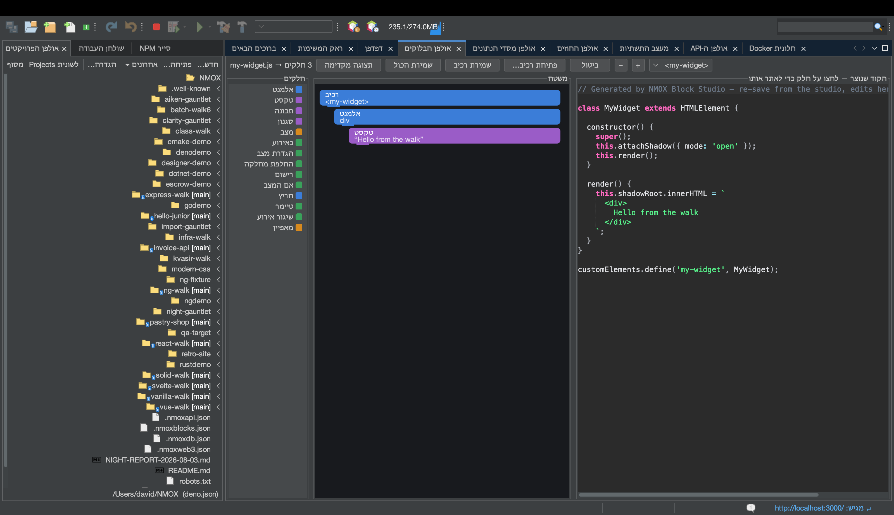

# מדריך: אולפן הבלוקים

<!-- languages -->
[English](block-studio.md) · [Español](block-studio.es.md) · [Français](block-studio.fr.md) · [Deutsch](block-studio.de.md) · [Русский](block-studio.ru.md) · [Українська](block-studio.uk.md) · [Polski](block-studio.pl.md) · [Português (Brasil)](block-studio.pt.md) · [Bahasa Indonesia](block-studio.id.md) · [Filipino](block-studio.tl.md) · [Tiếng Việt](block-studio.vi.md) · [简体中文](block-studio.zh.md) · [हिन्दी](block-studio.hi.md) · **עברית** · [العربية](block-studio.ar.md)
<!-- /languages -->

אולפן הבלוקים הוא כלי הרכבה בסגנון Scratch ל‑Web Components **אמיתיים**. מצמידים בלוקים מוקלדים זה לזה, והוא יוצר Custom Element עצמאי (shadow DOM, מצב, מאזינים) — ושרת תצוגה מקדימה חי, כדי שתראו אותו רץ. לחיצה על בלוק מדגישה בדיוק את השורות שהוא יצר.

## פתיחה

`⌥⌘5`, או הלשונית **אולפן הבלוקים**.

## צעדים

1. **תנו שם לרכיב.** כל Custom Element צריך תג עם מקף. התחילו רכיב ותנו לו תג כמו `hello-badge`.

2. **הוסיפו בלוקים מהפלטה.** גררו בלוק **אלמנט** (צומת DOM) ותנו לו טקסט; הוסיפו שדה **מצב**; הוסיפו בלוק **באירוע** ובתוכו **החלפת מחלקה**. רק קינונים חוקיים מותרים — משטח העבודה מראה מראש היכן מותר להניח, ודוחה את המקומות הלא חוקיים, גם בטעינה.

3. **קראו את הקוד.** החלונית האמצעית מציגה את ה‑`text/javascript` שנוצר — Custom Element שלם. לחצו על בלוק כלשהו, והשורות שהוא יצר מודגשות; המיפוי מדויק.

4. **ראו אותו חי.** לחצו **תצוגה מקדימה**. אולפן הבלוקים מגיש את הרכיב משרת בזיכרון ומציג אותו; `⇄` והחיפוש המהיר מראים את הכתובת החיה. רכיבים באותה סביבת עבודה יכולים אפילו להשתמש זה בזה.

5. **שמרו אותו.** **שמירת רכיב** כותבת `src/components/<tag>.js` — באופן אטומי, ולעולם בלי לדרוס קובץ שנערך ביד. סביבת העבודה כולה נשמרת ב‑‎`.nmoxblocks.json`; **פתיחת רכיב…** מייבאת מחדש קובץ שאתם (או האולפן) כתבתם, כל עוד הוא עדיין בניב הבלוקים.

## מה למדתם

- הפלט הוא Custom Element אמיתי בלי מסגרת עבודה, שאפשר לשלוח לייצור.
- המיפוי בין בלוקים לקוד עובד בשני הכיוונים: עריכות בתוך הניב מיובאות מחדש בלי תקלות.
- סביבת עבודה אחת מחזיקה רכיבים רבים; מעבר ביניהם הוא גבול של ביטול.

## הלאה

- הרכיבו רכיבים מרכיבים — בלוק שנוקב בתג של רכיב אחר מציג אותו מקונן בתצוגה המקדימה.
