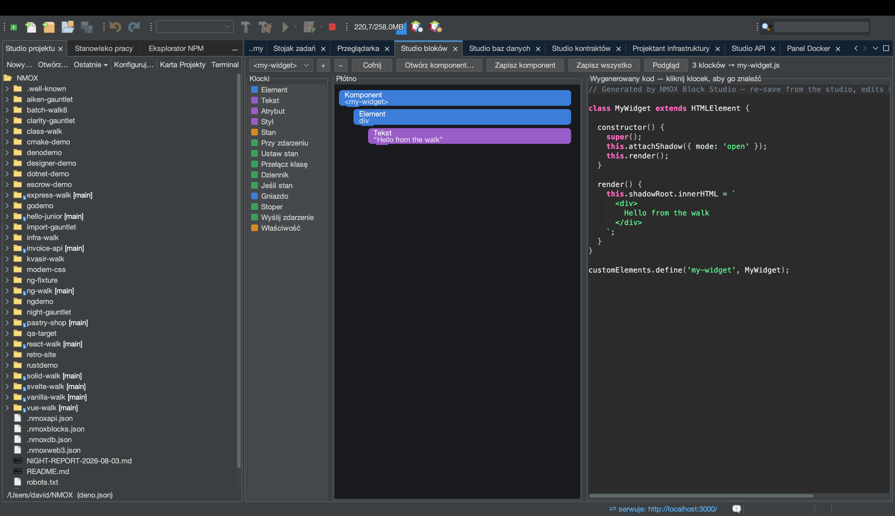

# Samouczek: Studio bloków

<!-- languages -->
[English](block-studio.md) · [Español](block-studio.es.md) · [Français](block-studio.fr.md) · [Deutsch](block-studio.de.md) · [Русский](block-studio.ru.md) · [Українська](block-studio.uk.md) · **Polski** · [Português (Brasil)](block-studio.pt.md) · [Bahasa Indonesia](block-studio.id.md) · [Filipino](block-studio.tl.md) · [Tiếng Việt](block-studio.vi.md) · [简体中文](block-studio.zh.md) · [हिन्दी](block-studio.hi.md) · [עברית](block-studio.he.md) · [العربية](block-studio.ar.md)
<!-- /languages -->

Studio bloków to kompozytor w stylu Scratcha dla **prawdziwych** Web
Components. Łączysz typowane bloki, a studio tworzy z nich samodzielny
element niestandardowy (shadow DOM, stan, nasłuchiwanie zdarzeń) — i do
tego serwer podglądu na żywo, żebyś zobaczył, jak działa. Kliknij blok,
a podświetlą się dokładnie te wiersze, które wytworzył.

## Otwieranie

`⌥⌘5` albo karta **Studio bloków**.

## Kroki

1. **Nazwij swój element.** Każdy element niestandardowy potrzebuje tagu
   z myślnikiem. Zacznij komponent i nadaj mu tag w rodzaju `hello-badge`.

2. **Dodaj bloki z palety.** Przeciągnij blok **Element** (węzeł DOM)
   i daj mu tekst; dodaj pole **Stan**; dodaj blok **Przy zdarzeniu**
   z blokiem **Przełącz klasę** w środku. Dozwolone są tylko poprawne
   zagnieżdżenia — płótno podpowiada poprawne miejsca upuszczenia
   i odrzuca niedozwolone, nawet przy wczytywaniu.

3. **Przeczytaj kod.** Środkowy panel pokazuje wygenerowany
   `text/javascript` — kompletny element niestandardowy. Kliknij dowolny
   blok, a podświetlą się wiersze, które wytworzył; mapowanie jest dokładne.

4. **Zobacz go na żywo.** Naciśnij **Podgląd**. Studio bloków serwuje
   komponent z serwera w pamięci i go renderuje; `⇄` i szybkie
   wyszukiwanie pokazują żywy adres. Komponenty z tej samej przestrzeni
   roboczej mogą nawet używać siebie nawzajem.

5. **Zapisz go.** **Zapisz komponent** zapisuje `src/components/<tag>.js`
   — atomowo, nigdy nie nadpisując pliku poprawianego ręcznie. Cała
   przestrzeń robocza mieszka w `.nmoxblocks.json`; **Otwórz komponent…**
   importuje z powrotem plik, który napisałeś ty (albo studio), pod
   warunkiem że wciąż trzyma się dialektu bloków.

## Czego się właśnie nauczyłeś

- Wynik to prawdziwy element niestandardowy bez żadnego frameworka,
  gotowy do wdrożenia.
- Mapowanie blok↔kod działa w obie strony: poprawki w obrębie dialektu
  importują się czysto.
- Jedna przestrzeń robocza mieści wiele komponentów; przełączenie się
  między nimi jest granicą cofania.

## Dalej

- Składaj komponenty z komponentów — blok, który nazywa tag sąsiedniego
  komponentu, renderuje go w podglądzie jako zagnieżdżony.
