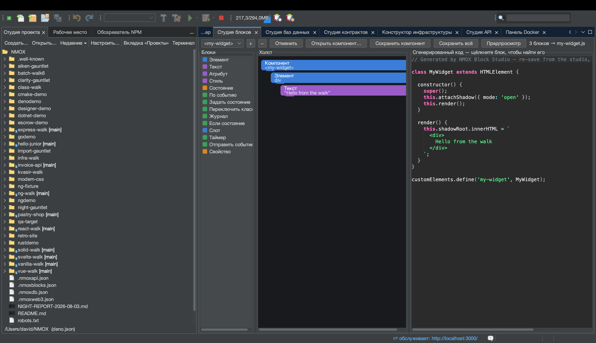

# Урок: Студия блоков

<!-- languages -->
[English](block-studio.md) · [Español](block-studio.es.md) · [Français](block-studio.fr.md) · [Deutsch](block-studio.de.md) · **Русский** · [Українська](block-studio.uk.md) · [Polski](block-studio.pl.md) · [Português (Brasil)](block-studio.pt.md) · [Bahasa Indonesia](block-studio.id.md) · [Filipino](block-studio.tl.md) · [Tiếng Việt](block-studio.vi.md) · [简体中文](block-studio.zh.md) · [हिन्दी](block-studio.hi.md) · [עברית](block-studio.he.md) · [العربية](block-studio.ar.md)
<!-- /languages -->

Студия блоков — это конструктор **настоящих** веб-компонентов в духе
Scratch. Вы сцепляете типизированные блоки, а студия создаёт
самодостаточный пользовательский элемент (shadow DOM, состояние,
обработчики событий) и поднимает живой сервер предпросмотра, чтобы вы
видели его в работе. Щёлкните блок — подсветятся ровно те строки, которые
он породил.

## Как открыть

`⌥⌘5` или вкладка **Студия блоков**.

## Шаги

1. **Назовите элемент.** Любому пользовательскому элементу нужен тег с
   дефисом. Начните компонент и дайте ему тег вроде `hello-badge`.

2. **Добавьте блоки из палитры.** Перетащите блок **Элемент** (узел DOM)
   и задайте ему текст; добавьте поле **Состояние**; добавьте блок
   **По событию** с блоком **Переключить класс** внутри. Разрешены только допустимые
   вложения: холст подсвечивает подходящие места для вставки и отвергает
   недопустимые — даже при загрузке.

3. **Прочтите код.** В средней панели — сгенерированный
   `text/javascript`, полноценный пользовательский элемент. Щёлкните любой
   блок — подсветятся строки, которые он породил; соответствие точное.

4. **Посмотрите вживую.** Нажмите **Предпросмотр**. Студия блоков
   раздаёт компонент с сервера в памяти и отрисовывает его; `⇄` и
   быстрый поиск показывают живой адрес. Компоненты одного рабочего
   пространства могут даже использовать друг друга.

5. **Сохраните.** **Сохранить компонент** пишет
   `src/components/<tag>.js` — атомарно и никогда не затирая файл,
   исправленный вручную. Всё рабочее пространство живёт в
   `.nmoxblocks.json`; **Открыть компонент…** снова импортирует файл,
   который написали вы (или студия), — если он всё ещё на диалекте блоков.

## Что вы узнали

- Результат — настоящий пользовательский элемент без фреймворков, его
  можно поставлять.
- Соответствие «блоки ↔ код» работает в обе стороны: правки в рамках
  диалекта импортируются обратно без потерь.
- Одно рабочее пространство вмещает много компонентов; переключение между
  ними — граница отмены.

## Дальше

- Собирайте компоненты из компонентов: блок, который называет тег
  соседнего компонента, отрисует его вложенным в предпросмотре.
