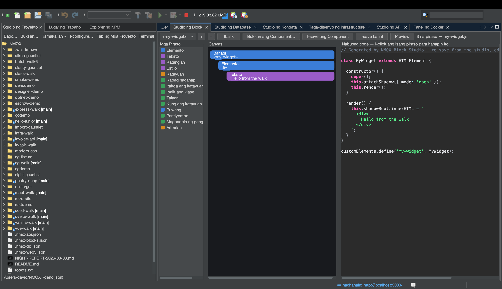

# Tutorial: Studio ng Block

<!-- languages -->
[English](block-studio.md) · [Español](block-studio.es.md) · [Français](block-studio.fr.md) · [Deutsch](block-studio.de.md) · [Русский](block-studio.ru.md) · [Українська](block-studio.uk.md) · [Polski](block-studio.pl.md) · [Português (Brasil)](block-studio.pt.md) · [Bahasa Indonesia](block-studio.id.md) · **Filipino** · [Tiếng Việt](block-studio.vi.md) · [简体中文](block-studio.zh.md) · [हिन्दी](block-studio.hi.md) · [עברית](block-studio.he.md) · [العربية](block-studio.ar.md)
<!-- /languages -->

Ang Studio ng Block ay isang composer na parang Scratch para sa **tunay**
na Web Components. Pinagkakabit-kabit mo ang mga block na may uri, at
lumilikha ito ng custom element na nakatayo mag-isa (shadow DOM, state,
listener) — kasama ang buhay na preview server para makita mo itong
tumatakbo. I-click ang isang block para ipakita ang mismong mga linyang
nilikha nito.

## Buksan ito

`⌥⌘5`, o ang tab na **Studio ng Block**.

## Mga hakbang

1. **Pangalanan ang iyong element.** Kailangan ng bawat custom element
   ang tag na may gitling. Magsimula ng component at bigyan ito ng tag
   gaya ng `hello-badge`.

2. **Magdagdag ng mga block mula sa palette.** Maghila ng block na
   **Elemento** (isang DOM node) at bigyan ito ng teksto; magdagdag ng
   field na **Katayuan**; magdagdag ng block na **Kapag naganap** na may
   **Ipalit ang klase** sa loob nito. Ang mga pinapayagang pagsasalansan lamang ay tinatanggap
   — ipinapakita ng canvas ang mga wastong puwang at tinatanggihan ang mga
   bawal, kahit sa pag-load.

3. **Basahin ang code.** Ipinapakita sa gitnang pane ang nilikhang
   `text/javascript` — isang buong custom element. I-click ang anumang
   block at iilawan ang mga linyang nilikha nito; eksakto ang pagmamapa.

4. **Tingnan itong buhay.** Pindutin ang **Preview**. Hinahain ng Studio
   ng Block ang component mula sa isang server sa memorya at ipinapakita
   ito; ipinapakita ng `⇄` at ng Mabilisang Paghahanap ang buhay na URL.
   Maaari pa ring gamitin ng mga component sa parehong workspace ang isa’t
   isa.

5. **I-save ito.** Isinusulat ng **I-save ang Component** ang
   `src/components/<tag>.js` — atomic, hindi kailanman pinapatungan ang
   file na binago nang mano-mano. Nasa `.nmoxblocks.json` ang buong
   workspace; muling ini-import ng **Buksan ang Component…** ang file na
   isinulat mo (o ng studio), hangga’t nasa dialect ng block pa ito.

## Ang iyong natutunan

- Ang output ay tunay na custom element na walang framework, na maaari
  mong i-ship.
- Dalawang direksyon ang pagmamapa ng block↔code: ang mga pagbabagong
  nasa dialect ay malinis na muling na-import.
- Maraming component ang hawak ng iisang workspace; hangganan ng undo ang
  paglipat sa pagitan ng mga ito.

## Susunod

- Bumuo ng component mula sa mga component — ang block na
  pumapangalan sa tag ng isang kapatid ay ipinapakita itong nakapaloob sa
  preview.
