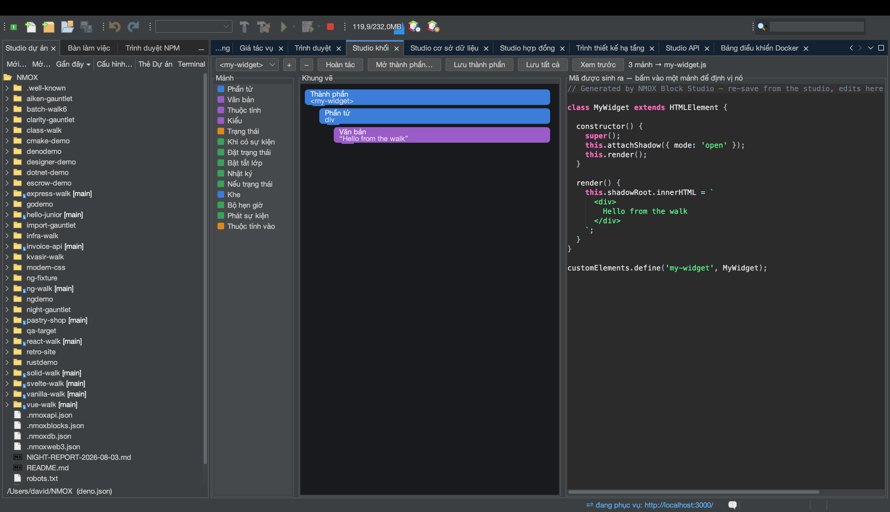

# Hướng dẫn: Studio khối

<!-- languages -->
[English](block-studio.md) · [Español](block-studio.es.md) · [Français](block-studio.fr.md) · [Deutsch](block-studio.de.md) · [Русский](block-studio.ru.md) · [Українська](block-studio.uk.md) · [Polski](block-studio.pl.md) · [Português (Brasil)](block-studio.pt.md) · [Bahasa Indonesia](block-studio.id.md) · [Filipino](block-studio.tl.md) · **Tiếng Việt** · [简体中文](block-studio.zh.md) · [हिन्दी](block-studio.hi.md) · [עברית](block-studio.he.md) · [العربية](block-studio.ar.md)
<!-- /languages -->

Studio khối là một trình ghép theo lối Scratch dành cho Web Component
**thật**. Bạn ráp những khối có kiểu lại với nhau và nó sinh ra một phần tử
tùy biến đứng độc lập (shadow DOM, trạng thái, trình lắng nghe) — kèm một
máy chủ xem trước đang sống để bạn thấy nó chạy. Nhấp vào một khối để tô sáng
đúng những dòng mà khối đó sinh ra.

## Mở nó

`⌥⌘5`, hoặc thẻ **Studio khối**.

## Các bước

1. **Đặt tên cho phần tử.** Mọi phần tử tùy biến đều cần một thẻ có dấu
   gạch nối. Bắt đầu một thành phần và đặt cho nó một thẻ như `hello-badge`.

2. **Thêm khối từ bảng khối.** Kéo một khối **Phần tử** (một nút DOM) và cho
   nó chữ; thêm một trường **Trạng thái**; thêm một khối **Khi có sự kiện**
   với một khối **Bật tắt lớp** bên trong. Chỉ những cách lồng hợp lệ mới được phép — khung
   vẽ cho xem trước những chỗ thả hợp lệ và từ chối chỗ không hợp lệ, kể cả
   lúc nạp.

3. **Đọc mã.** Khung giữa hiển thị `text/javascript` được sinh ra — một phần
   tử tùy biến hoàn chỉnh. Nhấp vào khối nào thì những dòng nó sinh ra được
   tô sáng; ánh xạ là chính xác.

4. **Xem nó chạy.** Nhấn **Xem trước**. Studio khối phục vụ thành phần từ
   một máy chủ trong bộ nhớ và hiển thị nó; `⇄` và Tìm nhanh cho thấy địa chỉ
   đang sống. Các thành phần trong cùng một không gian làm việc thậm chí dùng
   được lẫn nhau.

5. **Lưu lại.** **Lưu thành phần** ghi `src/components/<tag>.js` — nguyên
   tử, không bao giờ ghi đè một tệp đã sửa tay. Cả không gian làm việc nằm
   trong `.nmoxblocks.json`; **Mở thành phần…** nhập lại một tệp do bạn (hoặc
   studio) viết, miễn là nó vẫn nằm trong phương ngữ khối.

## Bạn vừa học được gì

- Kết quả là một phần tử tùy biến thật, không phụ thuộc framework, mang đi
  phát hành được.
- Ánh xạ khối↔mã đi hai chiều: những chỉnh sửa còn trong phương ngữ được
  nhập lại gọn gàng.
- Một không gian làm việc chứa nhiều thành phần; chuyển giữa chúng là một
  ranh giới hoàn tác.

## Tiếp theo

- Ghép thành phần từ các thành phần — một khối gọi tên thẻ của một thành
  phần anh em sẽ hiển thị nó lồng bên trong bản xem trước.
