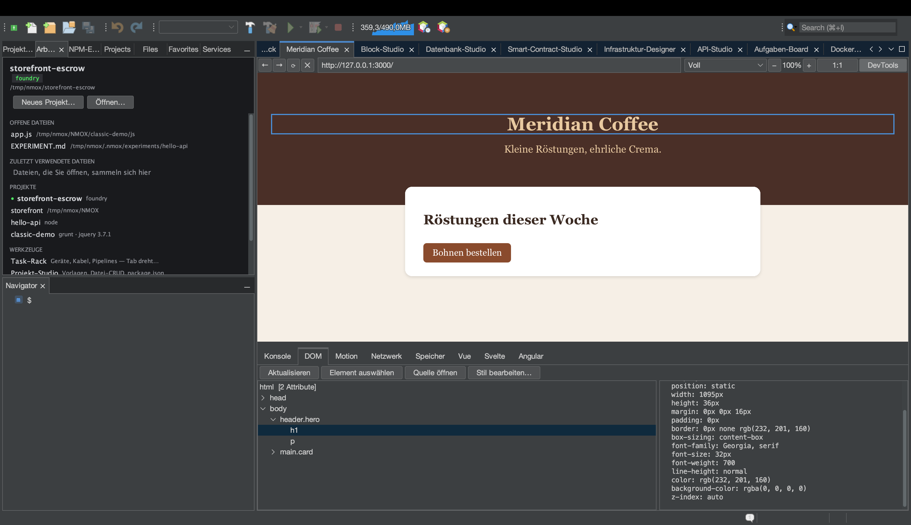

# Vom Browser zur Quelle: auswählen, springen, umgestalten

<!-- languages -->
[English](browser-to-source.md) · [Español](browser-to-source.es.md) · [Français](browser-to-source.fr.md) · **Deutsch** · [Русский](browser-to-source.ru.md) · [Українська](browser-to-source.uk.md) · [Polski](browser-to-source.pl.md) · [Português (Brasil)](browser-to-source.pt.md) · [Bahasa Indonesia](browser-to-source.id.md) · [Filipino](browser-to-source.tl.md) · [Tiếng Việt](browser-to-source.vi.md) · [简体中文](browser-to-source.zh.md) · [हिन्दी](browser-to-source.hi.md) · [עברית](browser-to-source.he.md) · [العربية](browser-to-source.ar.md)
<!-- /languages -->

*In einer Sitzung. Sie klicken ein Element im eingebauten Browser an,
landen in der Datei, die es erzeugt hat, ändern seinen Stil in den
DevTools und sehen zu, wie die Änderung in Ihrer Stilvorlage ankommt —
ohne etwas abzutippen.*

Die älteste Kluft der Webentwicklung: Browser und Editor wissen
Verschiedenes. Der Browser weiß, *welches Element Sie meinen*, der
Editor weiß, *wo der Code steht*, und Sie tragen die Information von
Hand hin und her. Der Browser von NMOX Studio schließt diese Kluft.
Dieses Tutorial geht die ganze Schleife an einer Seite durch, die Sie
in zwei Minuten anlegen.



## 1. Eine Seite anlegen

Legen Sie einen Ordner mit zwei Dateien an (über „Neue Datei“ im
Projekt-Studio oder auf jede andere Art):

`index.html`

```html
<!doctype html>
<html>
<head>
    <title>Loop Demo</title>
    <link rel="stylesheet" href="style.css">
</head>
<body>
    <header class="hero">
        <h1 id="headline">Hello, loop</h1>
        <p class="tagline">watch this paragraph change color</p>
    </header>
</body>
</html>
```

`style.css`

```css
.hero {
    background: #222;
    color: white;
    padding: 2rem;
}

.tagline {
    color: gray;
    font-style: italic;
}
```

## 2. Im Browser öffnen

Öffnen Sie den Tab **Browser** (⌥⌘4), tippen Sie den Pfad der Datei
als `file://`-URL in die Adresszeile — zum Beispiel
`file:///Users/you/NMOX/loopdemo/index.html` — und drücken Sie die
Eingabetaste.

> Eine Seite, die eines der ausliefernden Rack-Geräte bereitstellt
> (IGNITION, VELOCITY, HALO und Co.), funktioniert genauso — der Browser
> weiß, zu welchem Projekt ein laufender Server gehört. **Nicht**
> funktioniert eine entfernte Website: Die Schleife traut nur Seiten,
> die sie auf Dateien auf Ihrer Platte zurückführen kann, und sagt das,
> statt zu raten.

Klicken Sie in der Werkzeugleiste des Browsers auf **DevTools** und
wählen Sie den Tab **DOM**.

## 3. Ein Element in der Seite auswählen

Klicken Sie auf **Element auswählen**. Der Mauszeiger über der Seite
wird zum Fadenkreuz. Klicken Sie jetzt die Überschrift in der Seite
selbst an.

Drei Dinge geschehen auf einmal: Der Klick wird geschluckt (keine
Navigation), der DOM-Baum wählt `h1#headline` aus, und ein blauer
Rahmen umgibt das Element in der Seite. Die Detailansicht füllt sich mit
seinen Attributen und berechneten Stilen — samt WCAG-Kontrasturteil,
wenn beide Farben bekannt sind.

## 4. Zur Quelle springen

Klicken Sie bei ausgewähltem Element auf **Quelle öffnen** (ein
Doppelklick auf den Knoten im Baum tut dasselbe). Der Editor öffnet
`index.html` mit der Schreibmarke genau in der Zeile, die das Element
erzeugt hat.

Wie die Zeile gefunden wird, und wann die Suche ablehnt:

- Ein Element **mit id** wird über diese id gefunden — ids sind
  eindeutig, das Ergebnis ist also exakt.
- Ein Element **ohne id** wird als N-tes Vorkommen seines Tags in
  Dokumentreihenfolge gefunden, wobei Kommentare und die Inhalte von
  `<script>`/`<style>` ignoriert werden (ein `<div>` in einem Kommentar
  oder einem JS-String ist kein Element).
- Ein Element, das **nur existiert, weil ein Skript es erzeugt hat**,
  steht gar nicht in Ihrer Quelle — die Statuszeile sagt
  „wahrscheinlich per Skript erzeugt“, statt an eine falsche Stelle zu
  springen.
- Eine Seite ohne lokale Datei dahinter — eine entfernte Website, ein
  unbekannter Entwicklungsserver — lehnt ab mit „wird hier nicht aus
  einem Projekt ausgeliefert“.

Die Ablehnungen sind der Sinn der Sache: Ein Sprung, der falsch sein
könnte, ist schlimmer als gar keiner.

## 5. Umgestalten — und zusehen, wie sich die Quelle ändert

Wählen Sie die Tagline aus (`p.tagline`) — in der Seite oder per Klick
im Baum — und drücken Sie **Stil bearbeiten…**. Wählen Sie im Dialog die
Eigenschaft `color`, tippen Sie den Wert `tomato` ein und drücken Sie
OK.

Zwei Dinge geschehen, in dieser Reihenfolge:

1. **Die Seite zeichnet sich sofort neu.** Die Änderung wird zuerst
   inline angewendet, Sie sehen also immer, was Sie verlangt haben.
2. **Die Quell-Stilvorlage ändert sich.** Die Statuszeile meldet
   `Gespeichert in style.css  (.tagline)` — öffnen Sie `style.css`, und
   aus `color: gray;` ist `color: tomato;` geworden, an Ort und Stelle,
   jedes andere Byte unberührt.

Welche Regel bearbeitet wird, entscheidet die *Seite*: Sie wird gefragt,
welche Stilregeln auf das Element gepasst haben — die Antwort der
Kaskade selbst, der letzte Treffer gewinnt —, und so landet die
Änderung in der Regel, die tatsächlich gestaltet, was Sie sehen, auch
wenn derselbe Selektor zweimal in einer Datei steht.

## 6. Die ehrlichen Grenzen

Stil bearbeiten… lehnt mit einem Grund in der Statuszeile ab, sobald
das Schreiben ein Raten wäre oder Arbeit zerstören würde. Die
Inline-Vorschau greift trotzdem in jedem Fall — Sie sehen die Änderung,
und die Meldung sagt Ihnen, warum sie nicht gespeichert wurde.

| Situation | Was die Meldung sagt |
|-----------|--------------|
| Die Regel steht in einem eingebetteten `<style>`-Block | „Die Regel steht in einem eingebetteten `<style>`, nicht in einer Stylesheet-Datei“ |
| Die Stilvorlage ist entfernt oder kommt von einem unbekannten Server | „wird hier nicht aus einem Projekt ausgeliefert“ |
| Neben der `.css` liegt eine `.scss`/`.less`/`.sass` | „ist kompilierte Ausgabe — bearbeiten Sie stattdessen die Präprozessor-Quelle“ (eine Änderung hier ginge beim nächsten Kompilieren verloren) |
| Die Datei hat ungespeicherte Änderungen in einem Editor | „hat ungespeicherte Editoränderungen — speichern Sie es zuerst“ |
| Keine Stilregel passt überhaupt auf das Element | „Nur in der Seite angewendet — keine Stylesheet-Regel passt zu diesem Element“ |

## 7. Die Schleife schließen

Stellt ein Rack-Gerät die Seite bereit, müssen Sie nicht einmal neu
laden: Das Neuladen beim Speichern des Browsers beobachtet gespeicherte
Webdateien und lädt lokale Seiten von selbst neu. Auswählen → ändern →
Quelle aktualisiert → Seite aus dieser Quelle neu geladen. Browser und
Editor, eine Oberfläche.
