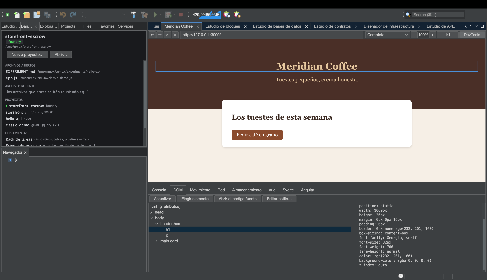

# Del navegador al código fuente: elige, salta, cambia el estilo

<!-- languages -->
[English](browser-to-source.md) · **Español** · [Français](browser-to-source.fr.md) · [Deutsch](browser-to-source.de.md) · [Русский](browser-to-source.ru.md) · [Українська](browser-to-source.uk.md) · [Polski](browser-to-source.pl.md) · [Português (Brasil)](browser-to-source.pt.md) · [Bahasa Indonesia](browser-to-source.id.md) · [Filipino](browser-to-source.tl.md) · [Tiếng Việt](browser-to-source.vi.md) · [简体中文](browser-to-source.zh.md) · [हिन्दी](browser-to-source.hi.md) · [עברית](browser-to-source.he.md) · [العربية](browser-to-source.ar.md)
<!-- /languages -->

*Una sola sesión. Harás clic en un elemento del Navegador web integrado,
aterrizarás en el archivo que lo produjo, cambiarás su estilo desde
DevTools y verás el cambio llegar a tu hoja de estilos — sin volver a
teclear nada.*

La brecha más antigua del desarrollo web es que el navegador y el editor
saben cosas distintas: el navegador sabe *a qué elemento te refieres*, el
editor sabe *dónde vive el código*, y tú llevas la información de uno a
otro a mano. El Navegador web de NMOX Studio cierra esa brecha. Este tutorial
recorre el ciclo completo sobre una página que harás en dos minutos.



## 1. Crea una página

Crea una carpeta con dos archivos (sirve el Nuevo archivo del Estudio de
proyecto, o como prefieras):

`index.html`

```html
<!doctype html>
<html>
<head>
    <title>Loop Demo</title>
    <link rel="stylesheet" href="style.css">
</head>
<body>
    <header class="hero">
        <h1 id="headline">Hello, loop</h1>
        <p class="tagline">watch this paragraph change color</p>
    </header>
</body>
</html>
```

`style.css`

```css
.hero {
    background: #222;
    color: white;
    padding: 2rem;
}

.tagline {
    color: gray;
    font-style: italic;
}
```

## 2. Ábrela en el Navegador web

Abre la pestaña **Navegador web** (⌥⌘4), escribe la ruta del archivo en la
barra de direcciones como una URL `file://` — por ejemplo
`file:///Users/you/NMOX/loopdemo/index.html` — y pulsa Retorno.

> Una página servida por uno de los dispositivos del rack que sirven
> (IGNITION, VELOCITY, HALO y compañía) funciona exactamente igual — el
> Navegador web sabe a qué proyecto pertenece un servidor en marcha. Lo que
> **no** funciona es un sitio remoto: el ciclo solo se fía de páginas que
> puede rastrear hasta archivos de tu disco, y te lo dirá en vez de
> adivinar.

Pulsa **DevTools** en la barra del Navegador web y elige la pestaña **DOM**.

## 3. Elige un elemento en la página

Pulsa **Elegir elemento**. El cursor de la página se convierte en una
cruz. Ahora haz clic en el titular, en la propia página.

Pasan tres cosas a la vez: el clic se absorbe (no navega), el árbol del
DOM selecciona `h1#headline` y un contorno azul rodea el elemento en la
página. El panel de detalles se llena con sus atributos y sus estilos
calculados — incluido un veredicto de contraste WCAG cuando se conocen los
dos colores.

## 4. Salta al código fuente

Con el elemento seleccionado, pulsa **Abrir el código fuente** (hacer
doble clic en el nodo del árbol hace lo mismo). El editor abre
`index.html` con el cursor en la línea exacta que produjo el elemento.

Cómo encuentra la línea, y cuándo se niega:

- Un elemento **con id** se encuentra por ese id — los id son únicos, así
  que es exacto.
- Un elemento **sin id** se encuentra como la enésima aparición de su
  etiqueta en el orden del documento, ignorando los comentarios y el
  contenido de `<script>`/`<style>` (un `<div>` dentro de un comentario o
  de una cadena de JS no es un elemento).
- Un elemento que **solo existe porque un script lo creó** no está en tu
  código en absoluto — la barra de estado dice «probablemente generado por
  script» en lugar de saltar a un sitio equivocado.
- Una página que no está respaldada por un archivo local — un sitio
  remoto, un servidor de desarrollo desconocido — se niega con «no se sirve
  desde un proyecto de aquí».

Las negativas son la clave: un salto que podría ser erróneo es peor que
ningún salto.

## 5. Cambia el estilo — y mira cómo cambia el código

Selecciona el lema (`p.tagline`) — elígelo en la página o haz clic en él
en el árbol — y pulsa **Editar estilo…**. En el diálogo elige la propiedad
`color`, escribe el valor `tomato` y pulsa Aceptar.

Pasan dos cosas, en este orden:

1. **La página se repinta al instante.** El ajuste se aplica primero en
   línea, así que siempre ves lo que pediste.
2. **La hoja de estilos de origen cambia.** La barra de estado indica
   `Guardado en style.css  (.tagline)` — abre `style.css` y
   `color: gray;` se ha convertido en `color: tomato;`, en su sitio, sin
   tocar ningún otro byte.

La regla que se edita se elige preguntando a la *página* qué reglas de las
hojas de estilo coincidieron con el elemento — la respuesta de la propia
cascada, gana la última coincidencia —, así que la escritura va a parar a
la regla que de verdad da estilo a lo que ves, incluso cuando el mismo
selector aparece dos veces en un archivo.

## 6. Los límites honestos

Editar estilo… se niega, con el motivo en la barra de estado, siempre que
escribir sería adivinar o destruiría trabajo. La vista previa en línea se
aplica en todos los casos — ves el ajuste; el mensaje te dice por qué no
se guardó.

| Situación | Qué dice |
|-----------|----------|
| La regla vive en un bloque `<style>` en línea | «la regla vive en un `<style>` en línea, no en un archivo de hoja de estilos» |
| La hoja de estilos es remota o viene de un servidor desconocido | «no se sirve desde un proyecto de aquí» |
| El `.css` tiene un hermano `.scss`/`.less`/`.sass` | «es salida compilada — edita en su lugar el código del preprocesador» (una escritura aquí se perdería en la siguiente compilación) |
| El archivo tiene cambios sin guardar en un editor | «tiene cambios sin guardar en el editor — guárdalo primero» |
| Ninguna regla de hoja de estilos coincide con el elemento | «Aplicado solo en la página — ninguna regla de la hoja de estilos coincide con este elemento» |

## 7. Cierra el ciclo

Si la página la sirve un dispositivo del rack, ni siquiera tienes que
recargar: la recarga al guardar del Navegador web vigila cuándo guardas
archivos web y refresca las páginas locales sola. Elegir → ajustar →
código actualizado → página recargada desde ese código. El navegador y el
editor, una sola superficie.
