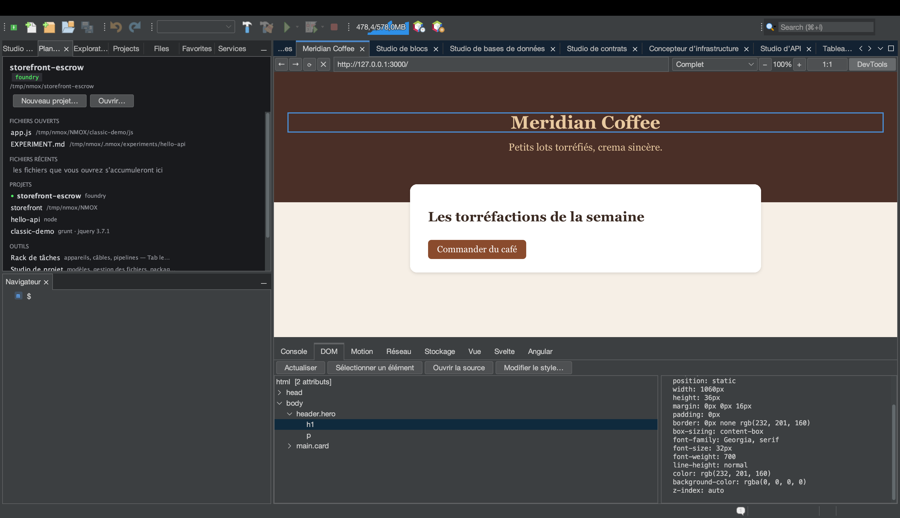

# Du Navigateur web à la source : désigner, sauter, restyler

<!-- languages -->
[English](browser-to-source.md) · [Español](browser-to-source.es.md) · **Français** · [Deutsch](browser-to-source.de.md) · [Русский](browser-to-source.ru.md) · [Українська](browser-to-source.uk.md) · [Polski](browser-to-source.pl.md) · [Português (Brasil)](browser-to-source.pt.md) · [Bahasa Indonesia](browser-to-source.id.md) · [Filipino](browser-to-source.tl.md) · [Tiếng Việt](browser-to-source.vi.md) · [简体中文](browser-to-source.zh.md) · [हिन्दी](browser-to-source.hi.md) · [עברית](browser-to-source.he.md) · [العربية](browser-to-source.ar.md)
<!-- /languages -->

*Une seule séance. Vous allez cliquer un élément dans le Navigateur web intégré,
arriver dans le fichier qui l’a produit, changer son style depuis les
DevTools et voir la modification arriver dans votre feuille de style — sans
rien retaper.*

La plus vieille fracture du développement web, c’est que le navigateur et
l’éditeur ne savent pas les mêmes choses : le navigateur sait *de quel élément
vous parlez*, l’éditeur sait *où vit le code*, et c’est vous qui portez
l’information de l’un à l’autre, à la main. Le Navigateur web de NMOX Studio
referme cette fracture. Ce tutoriel parcourt toute la boucle sur une page que
vous créerez en deux minutes.



## 1. Créer une page

Créez un dossier avec deux fichiers (le Nouveau fichier du Studio de projet
fait l’affaire, comme n’importe quelle autre méthode) :

`index.html`

```html
<!doctype html>
<html>
<head>
    <title>Loop Demo</title>
    <link rel="stylesheet" href="style.css">
</head>
<body>
    <header class="hero">
        <h1 id="headline">Hello, loop</h1>
        <p class="tagline">watch this paragraph change color</p>
    </header>
</body>
</html>
```

`style.css`

```css
.hero {
    background: #222;
    color: white;
    padding: 2rem;
}

.tagline {
    color: gray;
    font-style: italic;
}
```

## 2. L’ouvrir dans le Navigateur web

Ouvrez l’onglet **Navigateur web** (⌥⌘4), tapez le chemin du fichier dans la
barre d’adresse sous forme d’URL `file://` — par exemple
`file:///Users/you/NMOX/loopdemo/index.html` — et pressez Entrée.

> Une page servie par l’un des appareils serveurs du rack (IGNITION, VELOCITY,
> HALO et compagnie) fonctionne exactement de la même façon : le Navigateur web
> sait à quel projet appartient un serveur en marche. Ce qui ne fonctionne
> **pas**, c’est un site distant : la boucle ne fait confiance qu’aux pages
> qu’elle peut rattacher à des fichiers de votre disque, et elle le dit
> plutôt que de deviner.

Cliquez **DevTools** dans la barre d’outils du Navigateur web et choisissez
l’onglet **DOM**.

## 3. Désigner un élément dans la page

Cliquez **Sélectionner un élément**. Le curseur de la page devient une croix.
Cliquez maintenant le titre dans la page elle-même.

Trois choses se produisent à la fois : le clic est absorbé (aucune
navigation), l’arbre DOM sélectionne `h1#headline`, et un contour bleu
entoure l’élément dans la page. Le panneau de détail se remplit de ses
attributs et de ses styles calculés — y compris un verdict de contraste WCAG
quand les deux couleurs sont connues.

## 4. Sauter à la source

L’élément sélectionné, cliquez **Ouvrir la source** (un double-clic sur le
nœud de l’arbre fait de même). L’éditeur ouvre `index.html`, le curseur sur
la ligne exacte qui a produit l’élément.

Comment il trouve la ligne, et quand il refuse :

- Un élément **avec un id** est trouvé par cet id — les id sont uniques, le
  résultat est donc exact.
- Un élément **sans id** est trouvé comme la N-ième occurrence de sa balise
  dans l’ordre du document, en ignorant les commentaires et le contenu des
  `<script>`/`<style>` (un `<div>` dans un commentaire ou dans une chaîne JS
  n’est pas un élément).
- Un élément qui **n’existe que parce qu’un script l’a créé** n’est pas du
  tout dans votre source — la barre d’état dit « probablement généré par
  script » au lieu de sauter au mauvais endroit.
- Une page qui ne repose pas sur un fichier local — un site distant, un
  serveur de développement inconnu — refuse avec « non servi depuis un
  projet ici ».

Les refus sont tout l’intérêt : un saut qui pourrait être faux est pire que
pas de saut du tout.

## 5. Le restyler — et voir la source changer

Sélectionnez l’accroche (`p.tagline`) — désignez-la dans la page ou cliquez-la
dans l’arbre — et pressez **Modifier le style…**. Dans la boîte de dialogue,
choisissez la propriété `color`, tapez la valeur `tomato` et pressez OK.

Deux choses se produisent, dans l’ordre :

1. **La page se redessine aussitôt.** La retouche est d’abord appliquée en
   ligne, pour que vous voyiez toujours ce que vous avez demandé.
2. **La feuille de style source change.** La barre d’état indique
   « Enregistré dans style.css (.tagline) » (`Saved to style.css (.tagline)`
   dans un IDE en anglais) — ouvrez `style.css` : `color: gray;` est devenu
   `color: tomato;`, sur place, sans qu’aucun autre octet ait bougé.

La règle à modifier est choisie en demandant à la *page* quelles règles de
feuille de style correspondaient à l’élément — la réponse de la cascade
elle-même, où la dernière correspondance l’emporte —, si bien que l’écriture
atterrit dans la règle qui style réellement ce que vous voyez, même quand le
même sélecteur apparaît deux fois dans un fichier.

## 6. Les limites honnêtes

Modifier le style… refuse, avec la raison dans la barre d’état, chaque fois
qu’écrire reviendrait à deviner ou détruirait du travail. L’aperçu en ligne
s’applique quand même dans tous les cas — vous voyez la retouche ; le message
vous dit pourquoi elle n’a pas été enregistrée.

| Situation | Ce qu’il dit |
|-----------|--------------|
| La règle vit dans un bloc `<style>` en ligne | « la règle vit dans un `<style>` en ligne, pas dans un fichier de feuille de style » |
| La feuille de style est distante ou vient d’un serveur inconnu | « n’est pas servie depuis un projet ici » |
| Le `.css` a un voisin `.scss`/`.less`/`.sass` | « est un résultat compilé — modifiez plutôt la source du préprocesseur » (une écriture ici serait perdue à la prochaine compilation) |
| Le fichier a des modifications non enregistrées dans un éditeur | « comporte des modifications non enregistrées dans l’éditeur — enregistrez-le d’abord » |
| Aucune règle de feuille de style ne correspond à l’élément | « Appliqué dans la page uniquement — aucune règle de feuille de style ne correspond à cet élément » |

## 7. Boucler la boucle

Si la page est servie par un appareil du rack, vous n’avez même pas besoin de
recharger : le rechargement à l’enregistrement du Navigateur web surveille les
enregistrements de fichiers web et rafraîchit automatiquement les pages
locales. Désigner → retoucher → source mise à jour → page rechargée depuis
cette source. Le navigateur et l’éditeur, une seule surface.
