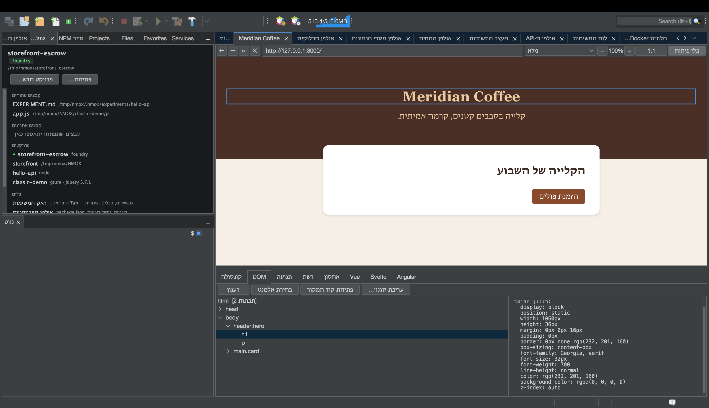

# מהדפדפן לקוד המקור: בחירה, קפיצה, עיצוב מחדש

<!-- languages -->
[English](browser-to-source.md) · [Español](browser-to-source.es.md) · [Français](browser-to-source.fr.md) · [Deutsch](browser-to-source.de.md) · [Русский](browser-to-source.ru.md) · [Українська](browser-to-source.uk.md) · [Polski](browser-to-source.pl.md) · [Português (Brasil)](browser-to-source.pt.md) · [Bahasa Indonesia](browser-to-source.id.md) · [Filipino](browser-to-source.tl.md) · [Tiếng Việt](browser-to-source.vi.md) · [简体中文](browser-to-source.zh.md) · [हिन्दी](browser-to-source.hi.md) · **עברית** · [العربية](browser-to-source.ar.md)
<!-- /languages -->

*ישיבה אחת. תלחצו על אלמנט בדפדפן המובנה, תנחתו בקובץ שיצר אותו, תשנו
את הסגנון שלו מכלי הפיתוח ותראו את השינוי מגיע לגיליון הסגנונות שלכם —
בלי להקליד שום דבר מחדש.*

הפיצול הוותיק ביותר בפיתוח ווב הוא שהדפדפן והעורך יודעים דברים שונים:
הדפדפן יודע *לאיזה אלמנט אתם מתכוונים*, העורך יודע *איפה הקוד נמצא*,
ואתם מעבירים את המידע ביניהם ביד. הדפדפן של NMOX Studio סוגר את הפיצול
הזה. המדריך עובר על הלולאה כולה בדף שתכינו בשתי דקות.



## 1. הכינו דף

צרו תיקייה עם שני קבצים (קובץ חדש באולפן הפרויקטים מתאים, או כל דרך
אחרת):

`index.html`

```html
<!doctype html>
<html>
<head>
    <title>Loop Demo</title>
    <link rel="stylesheet" href="style.css">
</head>
<body>
    <header class="hero">
        <h1 id="headline">Hello, loop</h1>
        <p class="tagline">watch this paragraph change color</p>
    </header>
</body>
</html>
```

`style.css`

```css
.hero {
    background: #222;
    color: white;
    padding: 2rem;
}

.tagline {
    color: gray;
    font-style: italic;
}
```

## 2. פתחו אותו בדפדפן

פתחו את הלשונית **דפדפן** (⌥⌘4), הקלידו בשורת הכתובת את הנתיב של הקובץ
ככתובת `file://`‎ — למשל
`file:///Users/you/NMOX/loopdemo/index.html` — ולחצו Return.

> דף שמוגש על ידי אחד ממכשירי ההגשה של הראק (IGNITION, ‏VELOCITY, ‏HALO
> וחבריהם) עובד בדיוק באותה צורה — הדפדפן יודע לאיזה פרויקט שייכת הגשה
> חיה. מה ש**לא** עובד הוא אתר מרוחק: הלולאה סומכת רק על דפים שהיא יכולה
> לקשר לקבצים בדיסק שלכם, והיא תגיד את זה במקום לנחש.

לחצו **כלי פיתוח** בסרגל הכלים של הדפדפן ובחרו בלשונית **DOM**.

## 3. בחרו אלמנט בדף

לחצו **בחירת אלמנט**. הסמן בדף הופך לכוונת. עכשיו לחצו על הכותרת בדף
עצמו.

שלושה דברים קורים בבת אחת: הלחיצה נבלעת (אין ניווט), עץ ה‑DOM בוחר את
`h1#headline`, ומסגרת כחולה מקיפה את האלמנט בדף. חלונית הפרטים מתמלאת
במאפיינים שלו ובסגנונות המחושבים — כולל פסיקת ניגודיות WCAG כששני הצבעים
ידועים.

## 4. קפצו לקוד המקור

כשהאלמנט בחור, לחצו **פתיחת קוד המקור** (לחיצה כפולה על הצומת בעץ עושה
את אותו הדבר). העורך פותח את `index.html` עם הסמן על השורה המדויקת שיצרה
את האלמנט.

איך הוא מוצא את השורה, ומתי הוא מסרב:

- אלמנט **עם id** נמצא לפי ה‑id — מזהים הם ייחודיים, כך שזה מדויק.
- אלמנט **בלי id** נמצא כמופע ה‑N של התגית שלו לפי סדר המסמך, כשהערות
  ותוכן של `<script>`/`<style>` אינם נספרים (`<div>` בתוך הערה או
  במחרוזת JS אינו אלמנט).
- אלמנט **שקיים רק כי סקריפט יצר אותו** אינו בקוד המקור שלכם בכלל — שורת
  המצב אומרת "כנראה נוצר על ידי סקריפט" במקום לקפוץ למקום שגוי.
- דף שאין מאחוריו קובץ מקומי — אתר מרוחק, שרת פיתוח לא מוכר — מסרב עם
  "אינו מוגש מפרויקט כאן".

הסירובים הם העיקר: קפיצה שעלולה להיות שגויה גרועה מאין קפיצה.

## 5. עצבו אותו מחדש — וצפו בקוד המקור משתנה

בחרו את שורת התיאור (`p.tagline`) — בחרו אותה בדף או לחצו עליה בעץ —
ולחצו **עריכת סגנון…**. בתיבת הדו‑שיח בחרו את המאפיין `color`, הקלידו
את הערך `tomato` ולחצו אישור.

שני דברים קורים, לפי הסדר:

1. **הדף מצטייר מחדש מיד.** השינוי מוחל קודם כסגנון מוטבע, כך שתמיד
   תראו את מה שביקשתם.
2. **גיליון הסגנונות במקור משתנה.** שורת המצב מדווחת
   `נשמר ב‑style.css  (.tagline)` — פתחו את `style.css`, ו‑
   `color: gray;` הפך ל‑`color: tomato;`, במקום, וכל שאר הבייטים לא נגעו.

הכלל שנערך נבחר כששואלים את *הדף* אילו כללים בגיליונות הסגנונות התאימו
לאלמנט — התשובה של ה‑cascade עצמו, ההתאמה האחרונה גוברת — כך שהכתיבה
נוחתת בכלל שבאמת מעצב את מה שאתם רואים, גם כשאותו סלקטור מופיע פעמיים
בקובץ.

## 6. המגבלות הכנות

עריכת סגנון… מסרבת, עם הסיבה בשורת המצב, בכל פעם שכתיבה תהיה ניחוש או
תהרוס עבודה. התצוגה המקדימה המוטבעת מוחלת בכל מקרה — אתם רואים את
השינוי, וההודעה אומרת למה הוא לא נשמר.

| מצב | מה נאמר |
|-----------|--------------|
| הכלל נמצא בבלוק `<style>` מוטבע | "הכלל נמצא ב‑`<style>` מוטבע, לא בקובץ גיליון סגנונות" |
| גיליון הסגנונות מרוחק או משרת לא מוכר | "אינו מוגש מפרויקט כאן" |
| ל‑‎`.css` יש קובץ אח ‎`.scss`/`.less`/`.sass` | "פלט מקומפל — ערכו במקום זאת את מקור הקדם‑מעבד" (כתיבה כאן הייתה אובדת בקומפילציה הבאה) |
| בקובץ יש שינויים שלא נשמרו בעורך | "יש שינויים שלא נשמרו בעורך — שמרו אותו קודם" |
| אף כלל בגיליון סגנונות אינו תואם לאלמנט | "הוחל בדף בלבד — אף כלל בגיליון הסגנונות אינו תואם לאלמנט הזה" |

## 7. סגרו את הלולאה

אם הדף מוגש על ידי מכשיר בראק, אין צורך אפילו לטעון מחדש: הטעינה מחדש
בשמירה של הדפדפן צופה בשמירות של קובצי ווב ומרעננת דפים מקומיים לבד.
בחירה ← שינוי ← המקור מתעדכן ← הדף נטען מחדש מאותו מקור. הדפדפן והעורך,
משטח אחד.
