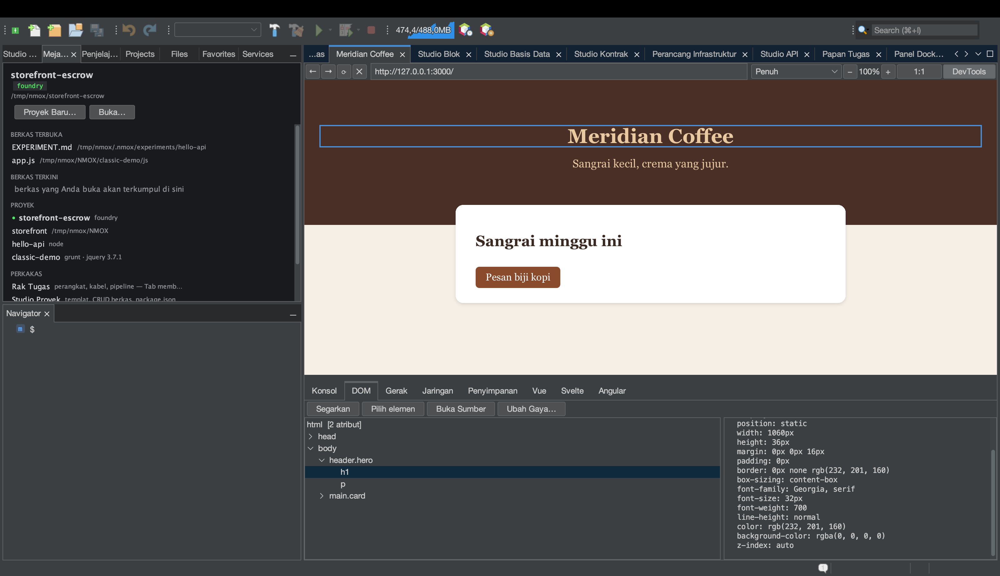

# Dari peramban ke sumber: pilih, lompat, ubah gaya

<!-- languages -->
[English](browser-to-source.md) · [Español](browser-to-source.es.md) · [Français](browser-to-source.fr.md) · [Deutsch](browser-to-source.de.md) · [Русский](browser-to-source.ru.md) · [Українська](browser-to-source.uk.md) · [Polski](browser-to-source.pl.md) · [Português (Brasil)](browser-to-source.pt.md) · **Bahasa Indonesia** · [Filipino](browser-to-source.tl.md) · [Tiếng Việt](browser-to-source.vi.md) · [简体中文](browser-to-source.zh.md) · [हिन्दी](browser-to-source.hi.md) · [עברית](browser-to-source.he.md) · [العربية](browser-to-source.ar.md)
<!-- /languages -->

*Sekali duduk. Anda akan mengeklik sebuah elemen di peramban bawaan,
mendarat di berkas yang melahirkannya, mengubah gayanya dari DevTools,
dan melihat perubahannya sampai di lembar gaya Anda — tanpa mengetik
ulang apa pun.*

Keterpisahan tertua dalam pengembangan web: peramban dan penyunting
tahu hal yang berbeda. Peramban tahu *elemen mana yang Anda maksud*,
penyunting tahu *di mana kodenya berada*, dan Anda sendiri yang
membawa informasi di antara keduanya. Peramban NMOX Studio menutup
celah itu. Tutorial ini menyusuri seluruh putarannya pada halaman yang
Anda buat dalam dua menit.



## 1. Buat halaman

Buat folder berisi dua berkas (lewat **File Baru…** di Studio Proyek,
atau cara apa pun yang Anda suka):

`index.html`

```html
<!doctype html>
<html>
<head>
    <title>Loop Demo</title>
    <link rel="stylesheet" href="style.css">
</head>
<body>
    <header class="hero">
        <h1 id="headline">Hello, loop</h1>
        <p class="tagline">watch this paragraph change color</p>
    </header>
</body>
</html>
```

`style.css`

```css
.hero {
    background: #222;
    color: white;
    padding: 2rem;
}

.tagline {
    color: gray;
    font-style: italic;
}
```

## 2. Buka di peramban

Buka tab **Peramban** (⌥⌘4), ketik jalur berkasnya di bilah URL sebagai
URL `file://` — misalnya
`file:///Users/you/NMOX/loopdemo/index.html` — lalu tekan Return.

> Halaman yang disajikan salah satu perangkat penyaji di rak (IGNITION,
> VELOCITY, HALO, dan kawan-kawannya) bekerja persis sama — peramban
> tahu proyek mana pemilik sebuah sajian yang hidup. Yang **tidak**
> bekerja adalah situs jarak jauh: putaran ini hanya memercayai halaman
> yang bisa ia telusuri sampai ke berkas di disk Anda, dan ia akan
> mengatakannya alih-alih menebak.

Klik **DevTools** di bilah alat peramban dan pilih tab **DOM**.

## 3. Pilih elemen di halaman

Klik **Pilih elemen**. Kursor halaman berubah menjadi tanda silang.
Sekarang klik judul di halaman itu sendiri.

Tiga hal terjadi sekaligus: kliknya ditelan (tidak ada navigasi),
pohon DOM memilih `h1#headline`, dan garis biru melingkari elemen itu
di halaman. Panel detail terisi atribut dan gaya terhitungnya —
termasuk putusan kontras WCAG bila kedua warnanya diketahui.

## 4. Lompat ke sumber

Dengan elemen terpilih, klik **Buka Sumber** (klik ganda pada simpul
pohon juga sama). Penyunting membuka `index.html` dengan kursor di
baris persis yang melahirkan elemen itu.

Bagaimana ia menemukan barisnya, dan kapan ia menolak:

- Elemen **yang punya id** ditemukan lewat id itu — id bersifat unik,
  jadi ini tepat.
- Elemen **tanpa id** ditemukan sebagai kemunculan ke-N tagnya dalam
  urutan dokumen, dengan komentar dan isi `<script>`/`<style>`
  diabaikan (`<div>` di dalam komentar atau string JS bukan elemen).
- Elemen yang **hanya ada karena dibuat skrip** sama sekali tidak ada
  di sumber Anda — bilah status berkata “kemungkinan dihasilkan skrip”
  alih-alih melompat ke tempat yang salah.
- Halaman yang tidak berasal dari berkas lokal — situs jarak jauh,
  server pengembangan yang tidak dikenal — menolak dengan “tidak
  disajikan dari proyek di sini”.

Penolakan itulah intinya: lompatan yang mungkin salah lebih buruk
daripada tidak melompat.

## 5. Ubah gayanya — dan lihat sumbernya berubah

Pilih tagline (`p.tagline`) — pilih di halaman atau klik di pohon —
lalu tekan **Ubah Gaya…**. Di dialognya pilih properti `color`, ketik
nilai `tomato`, lalu tekan OK.

Dua hal terjadi, berurutan:

1. **Halaman dilukis ulang seketika.** Perubahannya diterapkan sebaris
   lebih dulu, jadi Anda selalu melihat apa yang Anda minta.
2. **Lembar gaya sumbernya berubah.** Bilah status melaporkan
   `Disimpan ke style.css (.tagline)` — buka `style.css`, dan
   `color: gray;` sudah menjadi `color: tomato;`, di tempatnya, dengan
   setiap bita lain tak tersentuh.

Aturan yang disunting dipilih dengan bertanya kepada *halaman* aturan
lembar gaya mana yang cocok dengan elemen itu — jawaban kaskade itu
sendiri, kecocokan terakhir menang — sehingga tulisannya mendarat di
aturan yang benar-benar memberi gaya pada apa yang Anda lihat, bahkan
ketika pemilih yang sama muncul dua kali dalam satu berkas.

## 6. Batas-batas yang jujur

**Ubah Gaya…** menolak, dengan alasannya di bilah status, setiap kali
menulis berarti menebak atau akan merusak pekerjaan. Pratinjau sebaris
tetap diterapkan dalam semua kasus — Anda melihat perubahannya; pesannya
memberi tahu mengapa ia tidak disimpan.

| Situasi | Apa yang dikatakannya |
|-----------|--------------|
| Aturannya berada di blok `<style>` sebaris | “aturan berada di `<style>` sebaris, bukan berkas lembar gaya” |
| Lembar gayanya jarak jauh atau dari server yang tidak dikenal | “tidak disajikan dari proyek di sini” |
| `.css` punya saudara `.scss`/`.less`/`.sass` | “keluaran hasil kompilasi — ubah sumber praprosesornya” (tulisan di sini akan hilang pada kompilasi berikutnya) |
| Berkasnya punya perubahan yang belum disimpan di penyunting | “memiliki perubahan editor yang belum disimpan — simpan dulu” |
| Tidak ada satu pun aturan lembar gaya yang cocok dengan elemen | “Diterapkan hanya di halaman — tidak ada aturan lembar gaya yang cocok dengan elemen ini” |

## 7. Tutup putarannya

Bila halamannya disajikan oleh perangkat rak, Anda bahkan tidak perlu
memuat ulang: fitur simpan-lalu-muat-ulang di peramban mengawasi
penyimpanan berkas web dan menyegarkan halaman lokal secara otomatis.
Pilih → ubah → sumber diperbarui → halaman dimuat ulang dari sumber
itu. Peramban dan penyunting, satu permukaan.
