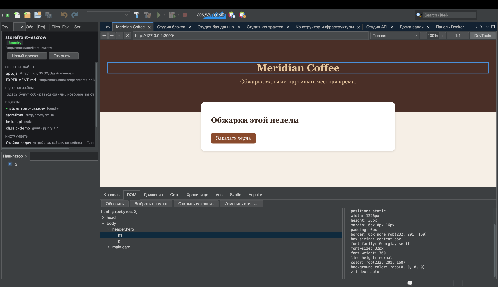

# От браузера к исходнику: выбрать, перейти, перекрасить

<!-- languages -->
[English](browser-to-source.md) · [Español](browser-to-source.es.md) · [Français](browser-to-source.fr.md) · [Deutsch](browser-to-source.de.md) · **Русский** · [Українська](browser-to-source.uk.md) · [Polski](browser-to-source.pl.md) · [Português (Brasil)](browser-to-source.pt.md) · [Bahasa Indonesia](browser-to-source.id.md) · [Filipino](browser-to-source.tl.md) · [Tiếng Việt](browser-to-source.vi.md) · [简体中文](browser-to-source.zh.md) · [हिन्दी](browser-to-source.hi.md) · [עברית](browser-to-source.he.md) · [العربية](browser-to-source.ar.md)
<!-- /languages -->

*За один присест. Вы щёлкнете элемент во встроенном браузере, окажетесь
в файле, который его породил, измените его стиль из DevTools и увидите,
как изменение попадает в вашу таблицу стилей, — ничего не перепечатывая.*

Самый старый разрыв в веб-разработке в том, что браузер и редактор знают
разное: браузер знает, *какой элемент вы имеете в виду*, редактор знает,
*где живёт код*, а информацию между ними вы переносите руками. Браузер
NMOX Studio этот разрыв закрывает. Урок проходит весь круг на странице,
которую вы сделаете за две минуты.



## 1. Сделайте страницу

Создайте папку с двумя файлами (подойдёт «Новый файл…» в Студии проекта
или любой удобный способ):

`index.html`

```html
<!doctype html>
<html>
<head>
    <title>Loop Demo</title>
    <link rel="stylesheet" href="style.css">
</head>
<body>
    <header class="hero">
        <h1 id="headline">Hello, loop</h1>
        <p class="tagline">watch this paragraph change color</p>
    </header>
</body>
</html>
```

`style.css`

```css
.hero {
    background: #222;
    color: white;
    padding: 2rem;
}

.tagline {
    color: gray;
    font-style: italic;
}
```

## 2. Откройте её в браузере

Откройте вкладку **Браузер** (⌥⌘4), введите путь к файлу в адресную
строку как URL `file://` — например,
`file:///Users/you/NMOX/loopdemo/index.html` — и нажмите Return.

> Страница, которую раздаёт один из приборов стойки (IGNITION, VELOCITY,
> HALO и компания), работает точно так же: браузер знает, какому проекту
> принадлежит живая раздача. **Не** работает удалённый сайт: круг
> доверяет только страницам, которые может проследить до файлов на вашем
> диске, и скажет об этом, а не станет гадать.

Нажмите **DevTools** на панели инструментов браузера и выберите вкладку
**DOM**.

## 3. Выберите элемент на странице

Нажмите **Выбрать элемент**. Курсор на странице станет перекрестием.
Теперь щёлкните заголовок на самой странице.

Одновременно происходят три вещи: щелчок поглощается (перехода нет),
дерево DOM выделяет `h1#headline`, а синяя рамка обводит элемент на
странице. Панель подробностей заполняется его атрибутами и вычисленными
стилями — включая вердикт по контрасту WCAG, когда известны оба цвета.

## 4. Перейдите к исходнику

Выделив элемент, нажмите **Открыть исходник** (двойной щелчок по узлу
дерева делает то же самое). Редактор откроет `index.html` с кареткой
ровно на той строке, которая породила элемент.

Как находится строка и когда следует отказ:

- Элемент **с id** находится по этому id — id уникальны, так что это
  точно.
- Элемент **без id** находится как N-е вхождение его тега в порядке
  документа; комментарии и содержимое `<script>`/`<style>` пропускаются
  (`<div>` внутри комментария или JS-строки — не элемент).
- Элемента, который **существует только потому, что его создал скрипт**,
  в вашем исходнике нет вовсе — строка состояния говорит «вероятно,
  создан скриптом», а не прыгает не туда.
- Страница, за которой не стоит локальный файл, — удалённый сайт,
  неизвестный сервер разработки — получает отказ: «отдаётся не из
  проекта здесь».

Отказы и есть смысл: переход, который может оказаться неверным, хуже,
чем никакого.

## 5. Перекрасьте — и смотрите, как меняется исходник

Выделите подзаголовок (`p.tagline`) — выберите его на странице или
щёлкните в дереве — и нажмите **Изменить стиль…**. В диалоге выберите
свойство `color`, введите значение `tomato` и нажмите OK.

Происходят две вещи, по порядку:

1. **Страница мгновенно перерисовывается.** Правка сначала применяется
   встроенно, так что вы всегда видите то, что просили.
2. **Меняется исходная таблица стилей.** Строка состояния сообщает
   `Сохранено в style.css  (.tagline)` — откройте `style.css`: там
   `color: gray;` превратился в `color: tomato;`, на месте, а все
   остальные байты не тронуты.

Правило для правки выбирается вопросом к *странице*: какие правила таблиц
стилей подошли элементу — собственный ответ каскада, побеждает последнее
совпадение. Поэтому запись попадает в то правило, которое действительно
оформляет то, что вы видите, даже если тот же селектор встречается в
файле дважды.

## 6. Честные пределы

«Изменить стиль…» отказывает, называя причину в строке состояния, всякий
раз, когда запись была бы догадкой или уничтожила бы работу.
Встроенный предпросмотр при этом применяется в любом случае: вы видите
правку, а сообщение объясняет, почему она не сохранена.

| Ситуация | Что сообщается |
|-----------|--------------|
| Правило находится во встроенном блоке `<style>` | «правило находится во встроенном `<style>`, а не в файле таблицы стилей» |
| Таблица стилей удалённая или с неизвестного сервера | «отдаётся не из проекта здесь» |
| У `.css` есть сосед `.scss`/`.less`/`.sass` | «результат компиляции; правьте исходник препроцессора» (запись здесь пропала бы при следующей компиляции) |
| В файле есть несохранённые изменения в редакторе | «содержит несохранённые изменения в редакторе — сначала сохраните файл» |
| Элементу не подходит вообще ни одно правило таблицы стилей | «Применено только на странице — ни одно правило таблицы стилей не подходит этому элементу» |

## 7. Замкните круг

Если страницу раздаёт прибор стойки, перезагружать её даже не нужно:
перезагрузка по сохранению в браузере следит за сохранением веб-файлов и
сама обновляет локальные страницы. Выбор → правка → исходник обновлён →
страница перезагружена из этого исходника. Браузер и редактор — одна
поверхность.
