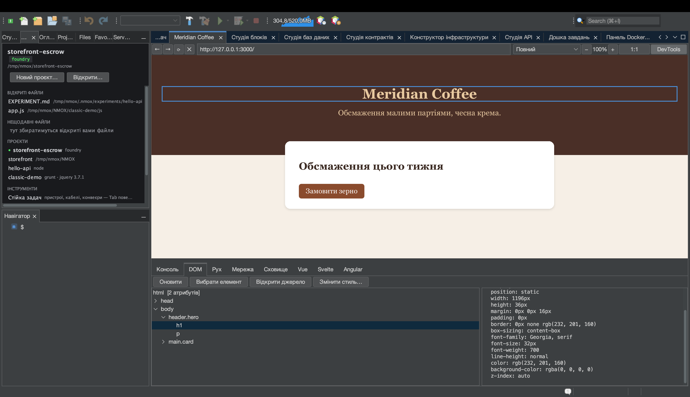

# Від браузера до джерела: вибрати, перейти, змінити стиль

<!-- languages -->
[English](browser-to-source.md) · [Español](browser-to-source.es.md) · [Français](browser-to-source.fr.md) · [Deutsch](browser-to-source.de.md) · [Русский](browser-to-source.ru.md) · **Українська** · [Polski](browser-to-source.pl.md) · [Português (Brasil)](browser-to-source.pt.md) · [Bahasa Indonesia](browser-to-source.id.md) · [Filipino](browser-to-source.tl.md) · [Tiếng Việt](browser-to-source.vi.md) · [简体中文](browser-to-source.zh.md) · [हिन्दी](browser-to-source.hi.md) · [עברית](browser-to-source.he.md) · [العربية](browser-to-source.ar.md)
<!-- /languages -->

*За один присід. Ви клацнете елемент у вбудованому Браузері, опинитеся у
файлі, що його породив, зміните його стиль у DevTools і побачите, як зміна
потрапить у вашу таблицю стилів — нічого не передруковуючи.*

Найдавніший розрив у веброзробці полягає в тому, що браузер і редактор
знають різне: браузер знає, *який елемент ви маєте на увазі*, редактор
знає, *де живе код*, а інформацію між ними ви переносите вручну. Браузер
NMOX Studio цей розрив закриває. Цей посібник проводить повним колом на
сторінці, яку ви зробите за дві хвилини.



## 1. Зробіть сторінку

Створіть теку з двома файлами (підійде «Новий файл» у Студії проєкту або
будь-який інший зручний вам спосіб):

`index.html`

```html
<!doctype html>
<html>
<head>
    <title>Loop Demo</title>
    <link rel="stylesheet" href="style.css">
</head>
<body>
    <header class="hero">
        <h1 id="headline">Hello, loop</h1>
        <p class="tagline">watch this paragraph change color</p>
    </header>
</body>
</html>
```

`style.css`

```css
.hero {
    background: #222;
    color: white;
    padding: 2rem;
}

.tagline {
    color: gray;
    font-style: italic;
}
```

## 2. Відкрийте її в Браузері

Відкрийте вкладку **Браузер** (⌥⌘4), введіть шлях до файлу в адресний
рядок як URL `file://` — наприклад,
`file:///Users/you/NMOX/loopdemo/index.html` — і натисніть Return.

> Сторінка, яку віддає один з обслуговуючих приладів стійки (IGNITION,
> VELOCITY, HALO та інші), працює точно так само — Браузер знає, якому
> проєкту належить живий сервер. **Не** працює віддалений сайт: коло
> довіряє лише сторінкам, які може простежити до файлів на вашому диску,
> і прямо про це скаже, а не вгадуватиме.

Натисніть **DevTools** на панелі інструментів Браузера й виберіть вкладку
**DOM**.

## 3. Виберіть елемент на сторінці

Натисніть **Вибрати елемент**. Курсор на сторінці перетворюється на
перехрестя. Тепер клацніть заголовок на самій сторінці.

Одночасно стаються три речі: клацання поглинається (переходу немає),
дерево DOM виділяє `h1#headline`, а синя рамка обводить елемент на
сторінці. Панель подробиць заповнюється його атрибутами й обчисленими
стилями — зокрема вердиктом контрастності WCAG, коли відомі обидва
кольори.

## 4. Перейдіть до джерела

Коли елемент вибрано, натисніть **Відкрити джерело** (подвійне клацання
на вузлі дерева робить те саме). Редактор відкриває `index.html` із
курсором точно на тому рядку, що породив елемент.

Як знаходиться рядок і коли настає відмова:

- Елемент **з id** знаходиться за цим id — id унікальні, тож це точно.
- Елемент **без id** знаходиться як N-те входження його тегу в порядку
  документа, а коментарі та вміст `<script>`/`<style>` не враховуються
  (`<div>` усередині коментаря чи рядка JS — не елемент).
- Елемента, який **існує лише тому, що його створив скрипт**, у вашому
  джерелі немає взагалі — рядок стану пише «імовірно, згенеровано
  скриптом», а не переносить вас кудись не туди.
- Сторінка, за якою не стоїть локальний файл — віддалений сайт, невідомий
  сервер розробки, — відмовляє з повідомленням «не подається з проєкту
  тут».

Відмови і є суттю: перехід, який може бути хибним, гірший, ніж жодного
переходу.

## 5. Змініть стиль — і стежте, як змінюється джерело

Виділіть підзаголовок (`p.tagline`) — виберіть його на сторінці або
клацніть у дереві — і натисніть **Змінити стиль…**. У діалозі оберіть
властивість `color`, введіть значення `tomato` і натисніть OK.

Відбуваються дві речі, одна за одною:

1. **Сторінка миттєво перемальовується.** Зміну спершу застосовано
   вбудованим стилем, тож ви завжди бачите те, про що просили.
2. **Змінюється вихідна таблиця стилів.** Рядок стану повідомляє
   `Збережено до style.css (.tagline)` — відкрийте `style.css`, і
   `color: gray;` уже стало `color: tomato;`, на тому самому місці, а
   решту байтів не зачеплено.

Правило для редагування обирається запитанням до *сторінки*, які правила
таблиць стилів відповіли цьому елементу — це власна відповідь каскаду, де
перемагає останній збіг, — тож запис потрапляє в те правило, яке справді
стилізує побачене, навіть коли той самий селектор трапляється у файлі
двічі.

## 6. Чесні межі

**Змінити стиль…** відмовляє, пишучи причину в рядку стану, щоразу, коли
запис був би здогадкою або знищив би роботу. Вбудований попередній
перегляд застосовується в кожному разі: ви бачите зміну, а повідомлення
пояснює, чому її не збережено.

| Ситуація | Що каже продукт |
|-----------|--------------|
| Правило живе у вбудованому блоці `<style>` | «правило міститься у вбудованому `<style>`, а не у файлі таблиці стилів» |
| Таблиця стилів віддалена або з невідомого сервера | «не подається з проєкту тут» |
| Поряд із `.css` лежить `.scss`/`.less`/`.sass` | «скомпільований вивід — змінюйте натомість джерело препроцесора» (запис тут зник би при наступній компіляції) |
| Файл має незбережені зміни в редакторі | «має незбережені зміни в редакторі — спершу збережіть його» |
| Жодне правило таблиці стилів не відповідає елементу | «Застосовано лише на сторінці — жодне правило таблиці стилів не відповідає цьому елементу» |

## 7. Замкніть коло

Якщо сторінку віддає прилад стійки, навіть перезавантажувати не треба:
перезавантаження після збереження в Браузері стежить за збереженням
вебфайлів і саме оновлює локальні сторінки. Вибрати → змінити → джерело
оновлено → сторінку перезавантажено з цього джерела. Браузер і редактор —
одна поверхня.
