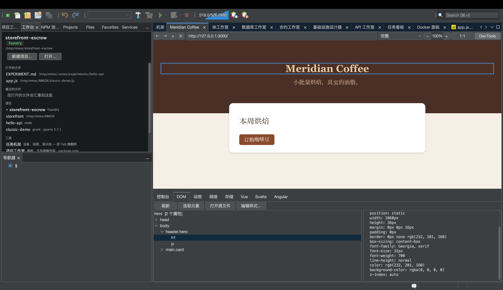

# 从浏览器到源代码：选取、跳转、改样式

<!-- languages -->
[English](browser-to-source.md) · [Español](browser-to-source.es.md) · [Français](browser-to-source.fr.md) · [Deutsch](browser-to-source.de.md) · [Русский](browser-to-source.ru.md) · [Українська](browser-to-source.uk.md) · [Polski](browser-to-source.pl.md) · [Português (Brasil)](browser-to-source.pt.md) · [Bahasa Indonesia](browser-to-source.id.md) · [Filipino](browser-to-source.tl.md) · [Tiếng Việt](browser-to-source.vi.md) · **简体中文** · [हिन्दी](browser-to-source.hi.md) · [עברית](browser-to-source.he.md) · [العربية](browser-to-source.ar.md)
<!-- /languages -->

*一次坐下来就能做完。你会在内置浏览器里点一个元素，落到生成它的那个文件里，在 DevTools 中改它的样式，然后看着这处改动出现在你的样式表里 — 什么都不用重新输入。*

Web 开发里最古老的一道裂缝，是浏览器和编辑器各知道一半：浏览器知道*你指的是哪个元素*，编辑器知道*代码在哪里*，而你得亲手在两者之间搬运信息。NMOX Studio 的浏览器把这道裂缝合上了。本教程在一个两分钟就能做好的页面上，把整个闭环走一遍。



## 1. 做一个页面

建一个文件夹，放两个文件（用项目工作室里的新建文件就行，用什么方式都可以）：

`index.html`

```html
<!doctype html>
<html>
<head>
    <title>Loop Demo</title>
    <link rel="stylesheet" href="style.css">
</head>
<body>
    <header class="hero">
        <h1 id="headline">Hello, loop</h1>
        <p class="tagline">watch this paragraph change color</p>
    </header>
</body>
</html>
```

`style.css`

```css
.hero {
    background: #222;
    color: white;
    padding: 2rem;
}

.tagline {
    color: gray;
    font-style: italic;
}
```

## 2. 在浏览器中打开它

打开**浏览器**标签页（⌥⌘4），在地址栏里把文件路径写成 `file://` 地址 — 例如 `file:///Users/you/NMOX/loopdemo/index.html` — 然后按回车。

> 由机架上某台服务设备（IGNITION、VELOCITY、HALO 等等）提供的页面，用法完全一样 — 浏览器知道一个正在运行的服务属于哪个项目。**不**适用的是远程站点：这个闭环只信任能追溯到你磁盘上文件的页面，遇到追溯不了的，它会明说，而不是去猜。

点浏览器工具栏上的 **DevTools**，然后选 **DOM** 标签页。

## 3. 在页面里选取一个元素

点**选取元素**。页面上的光标会变成十字准星。现在点页面里的标题本身。

三件事同时发生：这次点击被吞掉（不会跳转页面），DOM 树选中 `h1#headline`，页面中的元素被一圈蓝色轮廓框住。详情面板里填满它的属性和计算样式 — 两种颜色都已知时，还会给出 WCAG 对比度判定。

## 4. 跳到源代码

选中元素后，点**打开源文件**（双击树节点效果相同）。编辑器会打开 `index.html`，光标就停在生成这个元素的那一行。

它是怎么找到这一行的，以及什么时候会拒绝：

- **带 id** 的元素按 id 查找 — id 是唯一的，所以这是精确的。
- **不带 id** 的元素按其标签在文档顺序中的第 N 次出现来查找，注释以及 `<script>`/`<style>` 的内容会被忽略（注释里或 JS 字符串里的 `<div>` 不是元素）。
- **只因脚本创建才存在**的元素根本不在你的源码里 — 状态栏会说“很可能是脚本生成的”，而不是跳到某个错误的位置。
- 背后没有本地文件的页面 — 远程站点、不认识的开发服务器 — 会以“并非由此处的项目提供”拒绝。

拒绝正是重点所在：一次可能跳错的跳转，比不跳更糟。

## 5. 改样式 — 看着源码跟着变

选中标语（`p.tagline`）— 在页面里选取，或在树里点它 — 然后按**编辑样式…**。在对话框里选属性 `color`，输入值 `tomato`，按确定。

有两件事按顺序发生：

1. **页面立刻重绘。**改动先以内联方式应用，所以你总能看到自己要的效果。
2. **源样式表被修改。**状态栏报告 `已保存到 style.css  （.tagline）` — 打开 `style.css`，`color: gray;` 已经就地变成了 `color: tomato;`，其余每个字节都没动。

要修改哪条规则，是通过询问*页面*哪些样式表规则匹配了该元素来决定的 — 用的是层叠自己的答案，最后一个匹配者胜出 — 所以即使同一个选择器在文件里出现两次，写入也会落在真正给你看到的内容上样式的那条规则上。

## 6. 诚实的边界

只要写入会变成猜测或会毁掉已有工作，编辑样式… 就会拒绝，并在状态栏上给出原因。无论哪种情况，内联预览照样生效 — 你能看到改动；消息告诉你它为什么没被保存。

| 情况 | 它怎么说 |
|-----------|--------------|
| 规则位于内联 `<style>` 块中 | “规则位于内联 `<style>` 中，而非样式表文件” |
| 样式表来自远程或不认识的服务器 | “并非由此处的项目提供” |
| 这个 `.css` 旁边有一个同名的 `.scss`/`.less`/`.sass` | “是编译输出 — 请改为编辑预处理器源文件”（写在这里的内容会在下一次编译时丢失） |
| 该文件在某个编辑器里有未保存的改动 | “有未保存的编辑器更改 — 请先保存” |
| 根本没有样式表规则匹配这个元素 | “仅应用于页面 — 没有样式表规则匹配此元素” |

## 7. 合上闭环

如果页面由机架设备提供服务，你连重新加载都不需要：浏览器的保存即重载会盯着 Web 文件的保存，并自动刷新本地页面。选取 → 调整 → 源码更新 → 页面从那份源码重新加载。浏览器和编辑器，成了同一个界面。
