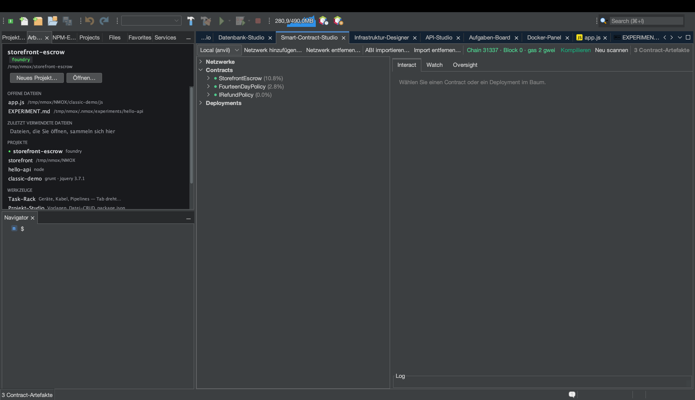

# Tutorial: Smart-Contract-Studio (Web3)

<!-- languages -->
[English](contract-studio.md) · [Español](contract-studio.es.md) · [Français](contract-studio.fr.md) · **Deutsch** · [Русский](contract-studio.ru.md) · [Українська](contract-studio.uk.md) · [Polski](contract-studio.pl.md) · [Português (Brasil)](contract-studio.pt.md) · [Bahasa Indonesia](contract-studio.id.md) · [Filipino](contract-studio.tl.md) · [Tiếng Việt](contract-studio.vi.md) · [简体中文](contract-studio.zh.md) · [हिन्दी](contract-studio.hi.md) · [עברית](contract-studio.he.md) · [العربية](contract-studio.ar.md)
<!-- /languages -->

Das Smart-Contract-Studio ist eine vollständige Werkbank für Smart
Contracts: ein Artefaktbaum für Foundry/Hardhat, eine von der ABI geführte
Interaktion mit entschlüsselten Rückgaben und Reverts, ein Live-Beobachter
für Blöcke und Events sowie eine Aufsicht über Gas und Größe — mit der
harten Regel, dass **nie ein privater Schlüssel die IDE berührt**.

Dies ist der schnelle Rundgang. Ein vollständiges Beispiel — einen
Treuhandvertrag schreiben, testen und gegen eine lokale Chain laufen
lassen — finden Sie in
[making-a-smart-contract.md](../making-a-smart-contract.md).

## Öffnen

`⌥⌘6`, oder der Tab **Smart-Contract-Studio**. Sie brauchen Foundry
(`anvil`, `forge`); prüfen Sie das mit `Extras ▸ Environment Doctor…`.

## Schritte

1. **Starten Sie eine lokale Chain.** Setzen Sie im Rack **ANVIL** ein und
   drücken Sie GO — es startet ein lokales EVM-Devnet mit entsperrten,
   vorab aufgeladenen Konten. Das Smart-Contract-Studio verbindet sich
   automatisch damit.

2. **Erzeugen Sie Artefakte.** Führen Sie in einem Foundry-Projekt
   `forge build` aus (das Gerät **FORGE** oder **Erstellen** der IDE). Der
   Artefaktbaum des Smart-Contract-Studios füllt sich mit Ihren kompilierten
   Verträgen.

3. **Rollen Sie aus und interagieren Sie.** Wählen Sie einen Vertrag,
   drücken Sie **Deploy** (es nutzt ein entsperrtes anvil-Konto — keine
   Schlüsseleingabe) und nutzen Sie dann den Bereich **Interact**: `CALL`
   auf eine View-Funktion zeigt die entschlüsselte Rückgabe; `SEND` schickt
   eine Transaktion, und Sie verfolgen die Quittung. Reverts und Custom
   Errors werden in lesbaren Text übersetzt.

4. **Beobachten Sie die Chain.** Der Bereich **Watch** fragt alle paar
   Sekunden neue Blöcke ab und entschlüsselt Event-Logs anhand Ihrer ABIs.
   Der Bereich **Oversight** zeigt die Gastabelle, die EIP-170-Größenurteile
   und ein Adressbuch der Deployments.

## Was Sie gerade gelernt haben

- Sendungen laufen über die **entsperrten Konten** eines Devnets — die IDE
  hält kein Schlüsselmaterial und hat keinen Signiercode.
- Geheime RPC-URLs liegen allein im Schlüsselbund und werden nie
  gespeichert.
- Eine Bestätigung sichert jede Sendung an einen Endpunkt **außerhalb von
  Loopback** ab, damit Sie nicht versehentlich an eine echte Chain senden.

## Weiter

- Der vollständige Treuhand-Rundgang:
  [making-a-smart-contract.md](../making-a-smart-contract.md).
- GOVERNOR (die Gas-Schranke) und die Vorlage Web3 Bench liegen im Rack.
