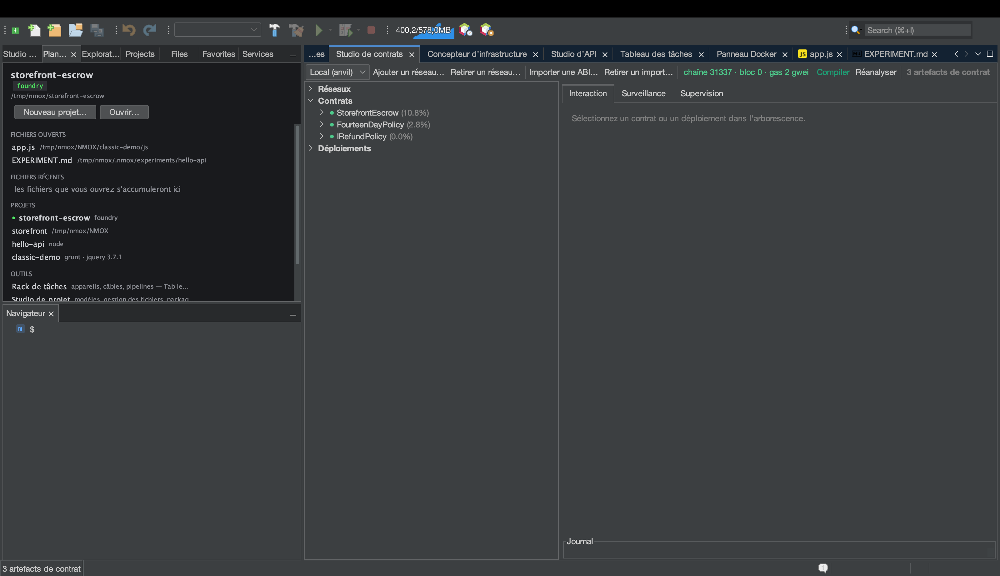

# Tutoriel : le Studio de contrats (Web3)

<!-- languages -->
[English](contract-studio.md) · [Español](contract-studio.es.md) · **Français** · [Deutsch](contract-studio.de.md) · [Русский](contract-studio.ru.md) · [Українська](contract-studio.uk.md) · [Polski](contract-studio.pl.md) · [Português (Brasil)](contract-studio.pt.md) · [Bahasa Indonesia](contract-studio.id.md) · [Filipino](contract-studio.tl.md) · [Tiếng Việt](contract-studio.vi.md) · [简体中文](contract-studio.zh.md) · [हिन्दी](contract-studio.hi.md) · [עברית](contract-studio.he.md) · [العربية](contract-studio.ar.md)
<!-- /languages -->

Le Studio de contrats est un atelier complet pour les contrats
intelligents : une arborescence d’artefacts Foundry/Hardhat, une
interaction guidée par l’ABI avec retours et annulations décodés, un
observateur de blocs et d’événements en direct, et un panneau de
supervision du gaz et de la taille — avec une règle ferme : **aucune clé
privée ne touche jamais l’IDE**.

Voici la visite rapide. Pour un exemple complet — écrire un contrat de
séquestre, le tester et le faire tourner sur une chaîne locale — voyez
[making-a-smart-contract.md](../making-a-smart-contract.md).

## L’ouvrir

`⌥⌘6`, ou l’onglet **Studio de contrats**. Il vous faudra Foundry (`anvil`,
`forge`) ; vérifiez avec `Outils ▸ Docteur de l'environnement…`.

## Étapes

1. **Démarrez une chaîne locale.** Dans le rack, montez **ANVIL** et
   pressez GO — il fait tourner un réseau EVM local avec des comptes
   déverrouillés et approvisionnés. Le Studio de contrats s’y connecte
   automatiquement.

2. **Construisez les artefacts.** Dans un projet Foundry, lancez
   `forge build` (l’appareil **FORGE**, ou Construire dans l’IDE).
   L’arborescence des artefacts du Studio de contrats se remplit de vos
   contrats compilés.

3. **Déployez et interagissez.** Choisissez un contrat, pressez
   **Déployer** (un compte anvil déverrouillé est utilisé — aucune clé à
   saisir), puis servez-vous du panneau **Interaction** : `CALL` sur une
   fonction de lecture pour voir le retour décodé ; `SEND` une transaction
   et suivez le reçu. Les annulations et les erreurs personnalisées sont
   décodées en texte lisible.

4. **Surveillez la chaîne.** Le panneau **Surveillance** interroge les
   nouveaux blocs toutes les deux secondes environ et décode les journaux
   d’événements d’après vos ABI. Le panneau **Supervision** montre la table
   de gaz, les verdicts de taille EIP-170 et un carnet d’adresses des
   déploiements.

## Ce que vous venez d’apprendre

- Les envois passent par les **comptes déverrouillés** d’un réseau local —
  l’IDE ne détient aucun matériel de clé et n’a aucun code de signature.
- Les URL RPC secrètes vivent uniquement dans le trousseau et ne sont
  jamais sérialisées.
- Une confirmation garde tout envoi vers un point d’accès **hors boucle
  locale**, pour que vous ne puissiez pas diffuser par accident sur une
  vraie chaîne.

## Et ensuite

- Le parcours complet du séquestre :
  [making-a-smart-contract.md](../making-a-smart-contract.md).
- GOVERNOR (la porte du gaz) et le préréglage Web3 Bench vivent dans le rack.
