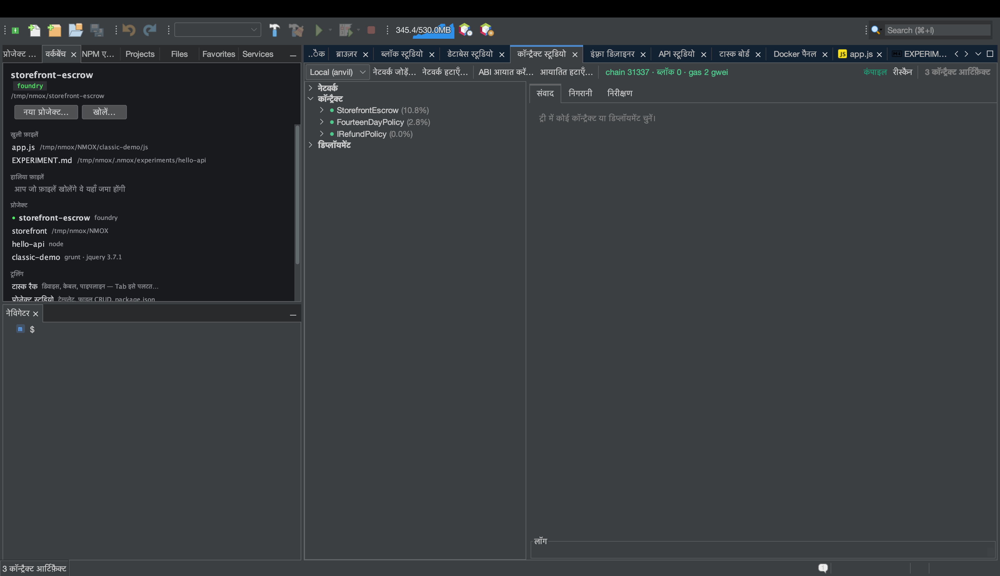

# ट्यूटोरियल: कॉन्ट्रैक्ट स्टूडियो (Web3)

<!-- languages -->
[English](contract-studio.md) · [Español](contract-studio.es.md) · [Français](contract-studio.fr.md) · [Deutsch](contract-studio.de.md) · [Русский](contract-studio.ru.md) · [Українська](contract-studio.uk.md) · [Polski](contract-studio.pl.md) · [Português (Brasil)](contract-studio.pt.md) · [Bahasa Indonesia](contract-studio.id.md) · [Filipino](contract-studio.tl.md) · [Tiếng Việt](contract-studio.vi.md) · [简体中文](contract-studio.zh.md) · **हिन्दी** · [עברית](contract-studio.he.md) · [العربية](contract-studio.ar.md)
<!-- /languages -->

कॉन्ट्रैक्ट स्टूडियो स्मार्ट कॉन्ट्रैक्ट का पूरा कार्यस्थल है: Foundry/Hardhat
आर्टिफ़ैक्ट का ट्री, ABI से चलने वाला संवाद जिसमें लौटाए गए मान और revert
विकोडित होते हैं, ब्लॉक/इवेंट की जीवित निगरानी, और गैस तथा आकार का
निरीक्षण पैन — इस पक्के नियम के साथ कि **कोई निजी कुंजी कभी IDE को नहीं
छूती**।

यह एक झटपट दौरा है। पूरे उदाहरण के लिए — एक escrow कॉन्ट्रैक्ट लिखना,
उसका टेस्ट करना और उसे लोकल चेन पर चलाना —
[making-a-smart-contract.md](../making-a-smart-contract.md) देखें।

## इसे खोलें

`⌥⌘6`, या **कॉन्ट्रैक्ट स्टूडियो** टैब। आपको Foundry (`anvil`, `forge`)
संस्थापित चाहिए; `उपकरण ▸ परिवेश डॉक्टर…` से जाँच लें।

## चरण

1. **लोकल चेन शुरू करें।** रैक में **ANVIL** लगाएँ और GO दबाएँ — यह
   अनलॉक, पहले से पैसे वाले खातों के साथ एक लोकल EVM devnet चलाता है।
   कॉन्ट्रैक्ट स्टूडियो उससे अपने आप जुड़ जाता है।

2. **आर्टिफ़ैक्ट बनाएँ।** किसी Foundry प्रोजेक्ट में `forge build` चलाएँ
   (**FORGE** डिवाइस, या IDE का बिल्ड)। कॉन्ट्रैक्ट स्टूडियो का आर्टिफ़ैक्ट
   ट्री आपके कंपाइल किए कॉन्ट्रैक्ट से भर जाता है।

3. **डिप्लॉय करें और संवाद करें।** कोई कॉन्ट्रैक्ट चुनें, **डिप्लॉय** दबाएँ
   (यह एक अनलॉक anvil खाता इस्तेमाल करता है — कोई कुंजी नहीं डालनी), फिर
   **संवाद** पैन का इस्तेमाल करें: किसी view फ़ंक्शन पर `CALL` करें और
   विकोडित लौटाया मान देखें; कोई ट्रांज़ैक्शन `SEND` करें और उसकी रसीद
   देखें। revert और कस्टम त्रुटियाँ पढ़ने लायक़ टेक्स्ट में विकोडित होती हैं।

4. **चेन पर नज़र रखें।** **निगरानी** पैन हर दो-एक सेकंड में नए ब्लॉक देखता
   है और आपके ABI के हिसाब से इवेंट लॉग विकोडित करता है। **निरीक्षण** पैन
   गैस तालिका, EIP-170 आकार के निर्णय और डिप्लॉयमेंट की पता-पुस्तिका दिखाता
   है।

## आपने अभी क्या सीखा

- भेजना किसी devnet के **अनलॉक खातों** से होता है — IDE के पास न कोई कुंजी
  सामग्री है, न हस्ताक्षर करने वाला कोड।
- गुप्त RPC URL केवल कीचेन में रहते हैं और कभी फ़ाइल में नहीं लिखे जाते।
- किसी **non-loopback** एंडपॉइंट पर भेजने से पहले पुष्टि माँगी जाती है,
  ताकि आप ग़लती से किसी असली चेन पर प्रसारित न कर दें।

## आगे

- escrow का पूरा वॉकथ्रू:
  [making-a-smart-contract.md](../making-a-smart-contract.md)।
- GOVERNOR (गैस गेट) और Web3 Bench प्रीसेट रैक में हैं।
