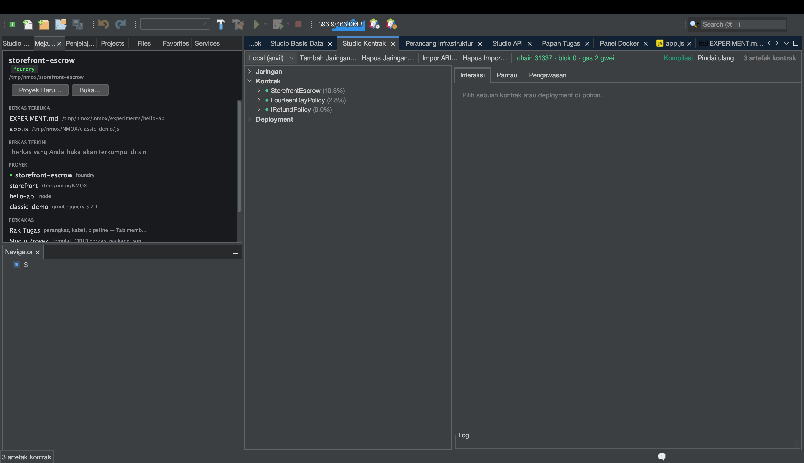

# Tutorial: Studio Kontrak (Web3)

<!-- languages -->
[English](contract-studio.md) · [Español](contract-studio.es.md) · [Français](contract-studio.fr.md) · [Deutsch](contract-studio.de.md) · [Русский](contract-studio.ru.md) · [Українська](contract-studio.uk.md) · [Polski](contract-studio.pl.md) · [Português (Brasil)](contract-studio.pt.md) · **Bahasa Indonesia** · [Filipino](contract-studio.tl.md) · [Tiếng Việt](contract-studio.vi.md) · [简体中文](contract-studio.zh.md) · [हिन्दी](contract-studio.hi.md) · [עברית](contract-studio.he.md) · [العربية](contract-studio.ar.md)
<!-- /languages -->

Studio Kontrak adalah meja kerja kontrak pintar yang lengkap: pohon artefak
Foundry/Hardhat, interaksi yang dituntun ABI dengan nilai kembalian dan
pembatalan yang terurai, pengamat blok/peristiwa yang hidup, dan panel pengawasan
gas + ukuran — dengan aturan keras bahwa **tidak ada kunci privat yang pernah
menyentuh IDE**.

Ini tur singkatnya. Untuk contoh lengkap yang dikerjakan — menulis kontrak escrow,
mengujinya, dan menjalankannya pada rantai lokal — lihat
[making-a-smart-contract.md](../making-a-smart-contract.md).

## Membukanya

`⌥⌘6`, atau tab **Studio Kontrak**. Anda perlu Foundry (`anvil`, `forge`)
terpasang; periksa dengan `Alat ▸ Dokter Lingkungan…`.

## Langkah-langkah

1. **Mulai rantai lokal.** Di rak, pasang **ANVIL** dan tekan GO — ia menjalankan
   devnet EVM lokal dengan akun tak terkunci yang sudah berisi dana. Studio Kontrak
   tersambung ke sana secara otomatis.

2. **Bangun artefak.** Di proyek Foundry, jalankan `forge build` (perangkat
   **FORGE**, atau Bangun milik IDE). Pohon artefak Studio Kontrak terisi dengan
   kontrak Anda yang terkompilasi.

3. **Terapkan dan berinteraksi.** Pilih sebuah kontrak, tekan **Deploy** (ia memakai
   akun anvil tak terkunci — tanpa memasukkan kunci), lalu pakai panel
   **Interaksi**: `CALL` fungsi view dan lihat nilai kembalian yang terurai; `SEND`
   sebuah transaksi dan amati tanda terimanya. Pembatalan dan galat kustom diurai
   menjadi teks yang terbaca.

4. **Awasi rantainya.** Panel **Pantau** menanyakan blok baru setiap beberapa detik
   dan mengurai log peristiwa terhadap ABI Anda. Panel **Pengawasan** menampilkan
   tabel gas, putusan ukuran EIP-170, dan buku alamat penerapan.

## Yang baru saja Anda pelajari

- Pengiriman melewati **akun tak terkunci** sebuah devnet — IDE tidak menyimpan
  materi kunci dan tidak punya kode penandatanganan.
- URL RPC rahasia hanya tinggal di gantungan kunci dan tidak pernah diserialkan.
- Sebuah konfirmasi menjaga setiap pengiriman ke titik akhir **non-loopback**,
  sehingga Anda tidak bisa tanpa sengaja menyiarkan ke rantai sungguhan.

## Berikutnya

- Panduan escrow lengkap:
  [making-a-smart-contract.md](../making-a-smart-contract.md).
- GOVERNOR (gerbang gas) dan prasetel Web3 Bench ada di rak.
