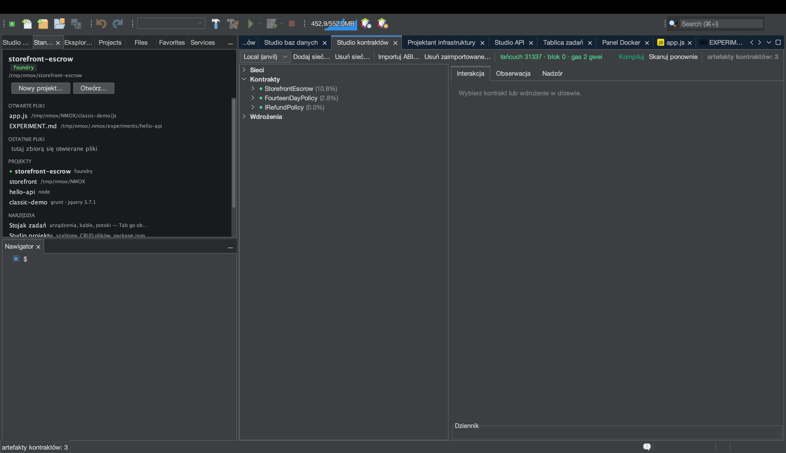

# Samouczek: Studio kontraktów (Web3)

<!-- languages -->
[English](contract-studio.md) · [Español](contract-studio.es.md) · [Français](contract-studio.fr.md) · [Deutsch](contract-studio.de.md) · [Русский](contract-studio.ru.md) · [Українська](contract-studio.uk.md) · **Polski** · [Português (Brasil)](contract-studio.pt.md) · [Bahasa Indonesia](contract-studio.id.md) · [Filipino](contract-studio.tl.md) · [Tiếng Việt](contract-studio.vi.md) · [简体中文](contract-studio.zh.md) · [हिन्दी](contract-studio.hi.md) · [עברית](contract-studio.he.md) · [العربية](contract-studio.ar.md)
<!-- /languages -->

Studio kontraktów to kompletne stanowisko do smart kontraktów: drzewo
artefaktów Foundry i Hardhata, interakcja prowadzona przez ABI
z rozszyfrowanymi zwrotami i wycofaniami, żywy podgląd bloków i zdarzeń
oraz panel nadzoru nad gazem i rozmiarem — z twardą zasadą, że **żaden
klucz prywatny nigdy nie dotyka IDE**.

To szybka wycieczka. Pełny przykład — napisanie kontraktu escrow, jego
testy i uruchomienie na lokalnym łańcuchu — znajdziesz w
[making-a-smart-contract.md](../making-a-smart-contract.md).

## Otwieranie

`⌥⌘6` albo karta **Studio kontraktów**. Przyda się zainstalowane Foundry
(`anvil`, `forge`); sprawdzisz to przez `Narzędzia ▸ Diagnostyka środowiska…`.

## Kroki

1. **Uruchom lokalny łańcuch.** Na stojaku wstaw **ANVIL** i naciśnij GO
   — uruchamia lokalną sieć deweloperską EVM z odblokowanymi, zasilonymi
   kontami. Studio kontraktów łączy się z nią samo.

2. **Zbuduj artefakty.** W projekcie Foundry uruchom `forge build`
   (urządzenie **FORGE** albo polecenie Zbuduj w IDE). Drzewo artefaktów
   Studia kontraktów wypełnia się skompilowanymi kontraktami.

3. **Wdróż i działaj.** Wybierz kontrakt, naciśnij **Wdróż** (używa
   odblokowanego konta anvil — bez wpisywania klucza), a potem przejdź do
   panelu **Interakcja**: `CALL` na funkcji widoku pokazuje rozszyfrowany
   zwrot; `SEND` wysyła transakcję, a ty patrzysz na pokwitowanie.
   Wycofania i własne błędy są rozszyfrowywane na czytelny tekst.

4. **Obserwuj łańcuch.** Panel **Obserwacja** co kilka sekund odpytuje
   o nowe bloki i rozszyfrowuje dzienniki zdarzeń według twoich ABI.
   Panel **Nadzór** pokazuje tabelę gazu, werdykty rozmiaru EIP-170
   i książkę adresową wdrożeń.

## Czego się właśnie nauczyłeś

- Wysyłki idą przez **odblokowane konta** sieci deweloperskiej — IDE nie
  trzyma żadnego materiału kluczy i nie ma kodu podpisującego.
- Tajne adresy RPC są tylko w pęku kluczy i nigdy nie trafiają do pliku.
- Każdą wysyłkę do punktu końcowego **spoza interfejsu lokalnego**
  poprzedza potwierdzenie, więc nie nadasz przypadkiem na prawdziwy
  łańcuch.

## Dalej

- Pełne przejście z escrow:
  [making-a-smart-contract.md](../making-a-smart-contract.md).
- GOVERNOR (bramka gazu) i preset Web3 Bench mieszkają na stojaku.
