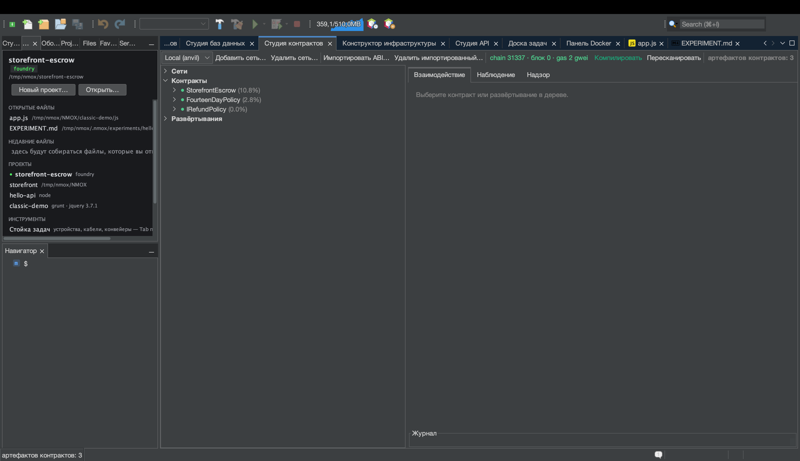

# Урок: Студия контрактов (Web3)

<!-- languages -->
[English](contract-studio.md) · [Español](contract-studio.es.md) · [Français](contract-studio.fr.md) · [Deutsch](contract-studio.de.md) · **Русский** · [Українська](contract-studio.uk.md) · [Polski](contract-studio.pl.md) · [Português (Brasil)](contract-studio.pt.md) · [Bahasa Indonesia](contract-studio.id.md) · [Filipino](contract-studio.tl.md) · [Tiếng Việt](contract-studio.vi.md) · [简体中文](contract-studio.zh.md) · [हिन्दी](contract-studio.hi.md) · [עברית](contract-studio.he.md) · [العربية](contract-studio.ar.md)
<!-- /languages -->

Студия контрактов — полноценный верстак для смарт-контрактов: дерево
артефактов Foundry/Hardhat, взаимодействие по ABI с расшифрованными
возвратами и откатами, живое наблюдение за блоками и событиями и панель
надзора за газом и размером — при жёстком правиле: **никакие приватные
ключи никогда не касаются IDE**.

Это быстрая экскурсия. Полный разобранный пример — как написать
контракт эскроу, протестировать его и запустить в локальной сети — в
[making-a-smart-contract.md](../making-a-smart-contract.md).

## Как открыть

`⌥⌘6` или вкладка **Студия контрактов**. Понадобится установленный
Foundry (`anvil`, `forge`); проверьте через
`Сервис ▸ Диагностика окружения…`.

## Шаги

1. **Поднимите локальную сеть.** Поставьте в стойку **ANVIL** и нажмите
   GO — он запускает локальную сеть EVM с разблокированными счетами,
   на которых уже есть средства. Студия контрактов подключается к нему
   сама.

2. **Соберите артефакты.** В проекте Foundry выполните `forge build`
   (прибор **FORGE** или команда IDE «Сборка»). Дерево артефактов Студии
   контрактов заполнится скомпилированными контрактами.

3. **Разверните и взаимодействуйте.** Выберите контракт, нажмите
   **Развернуть** (используется разблокированный счёт anvil — ключ
   вводить не нужно), затем перейдите на панель **Взаимодействие**:
   `CALL` вызывает функцию просмотра и показывает расшифрованный возврат;
   `SEND` отправляет транзакцию, и вы следите за квитанцией. Откаты и
   пользовательские ошибки расшифровываются в читаемый текст.

4. **Наблюдайте за сетью.** Панель **Наблюдение** каждые пару секунд
   опрашивает новые блоки и расшифровывает журналы событий по вашим ABI.
   Панель **Надзор** показывает таблицу газа, вердикты по размеру EIP-170
   и адресную книгу развёртываний.

## Что вы узнали

- Отправка идёт через **разблокированные счета** локальной сети — IDE не
  хранит ключей и не содержит кода подписи.
- Секретные адреса RPC живут только в связке ключей и никогда не
  сериализуются.
- Любую отправку на **нелокальную** конечную точку охраняет
  подтверждение, так что случайно разослать транзакцию в настоящую сеть
  не выйдет.

## Дальше

- Полный разбор эскроу:
  [making-a-smart-contract.md](../making-a-smart-contract.md).
- GOVERNOR (затвор по газу) и пресет Web3 Bench живут в стойке.
