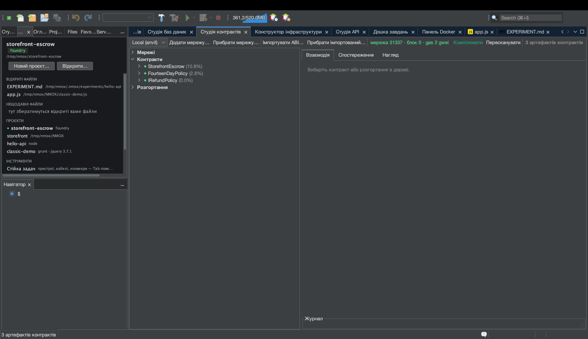

# Урок: Студія контрактів (Web3)

<!-- languages -->
[English](contract-studio.md) · [Español](contract-studio.es.md) · [Français](contract-studio.fr.md) · [Deutsch](contract-studio.de.md) · [Русский](contract-studio.ru.md) · **Українська** · [Polski](contract-studio.pl.md) · [Português (Brasil)](contract-studio.pt.md) · [Bahasa Indonesia](contract-studio.id.md) · [Filipino](contract-studio.tl.md) · [Tiếng Việt](contract-studio.vi.md) · [简体中文](contract-studio.zh.md) · [हिन्दी](contract-studio.hi.md) · [עברית](contract-studio.he.md) · [العربية](contract-studio.ar.md)
<!-- /languages -->

Студія контрактів — повноцінне робоче місце для смартконтрактів: дерево
артефактів Foundry/Hardhat, взаємодія за ABI з розшифрованими поверненнями
й відкотами, живий спостерігач блоків і подій та панель нагляду за газом і
розміром — із жорстким правилом: **жоден приватний ключ ніколи не торкається IDE**.

Це швидкий огляд. Повний розібраний приклад — написання контракту ескроу,
його тестування й запуск у локальній мережі — див. у
[making-a-smart-contract.md](../making-a-smart-contract.md).

## Як відкрити

`⌥⌘6` або вкладка **Студія контрактів**. Знадобиться встановлений Foundry (`anvil`,
`forge`); перевірте через `Інструменти ▸ Діагностика середовища…`.

## Кроки

1. **Запустіть локальну мережу.** У стійці поставте **ANVIL** і натисніть GO —
   він запускає локальну devnet EVM із розблокованими рахунками, на яких уже
   є кошти. Студія контрактів підключається до неї сама.

2. **Зберіть артефакти.** У проєкті Foundry виконайте `forge build` (прилад
   **FORGE** або «Зібрати» в IDE). Дерево артефактів Студії контрактів
   заповниться скомпільованими контрактами.

3. **Розгорніть і взаємодійте.** Оберіть контракт, натисніть **Розгорнути**
   (використовується розблокований рахунок anvil — ключ вводити не треба),
   потім відкрийте панель **Взаємодія**: `CALL` для view-функції — і бачите
   розшифроване повернення; `SEND` для транзакції — і стежите за квитанцією.
   Відкоти й користувацькі помилки розшифровуються в читабельний текст.

4. **Стежте за мережею.** Панель **Спостереження** кожні кілька секунд
   опитує нові блоки й розшифровує журнали подій за вашими ABI. Панель
   **Нагляд** показує таблицю газу, вердикти щодо розміру за EIP-170 і
   адресну книгу розгортань.

## Що ви щойно дізналися

- Надсилання йде через **розблоковані рахунки** devnet — IDE не тримає
  ключів і не має коду підпису.
- Таємні URL RPC живуть лише у в’язці ключів і ніколи не серіалізуються.
- Підтвердження охороняє будь-яке надсилання на адресу **поза loopback**,
  тож випадково відправити транзакцію в справжню мережу не вийде.

## Далі

- Повний розбір ескроу:
  [making-a-smart-contract.md](../making-a-smart-contract.md).
- GOVERNOR (затвор газу) і пресет Web3 Bench живуть у стійці.
