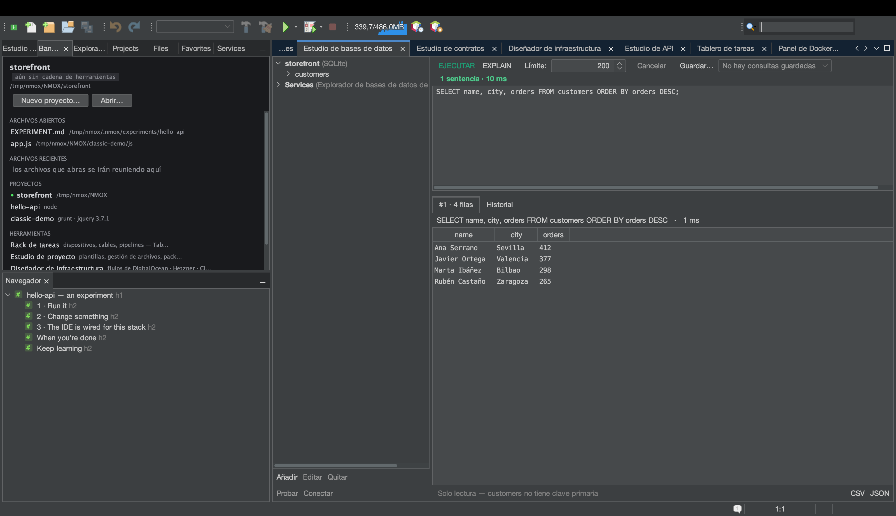

# Tutorial: el Estudio de bases de datos

<!-- languages -->
[English](db-studio.md) · **Español** · [Français](db-studio.fr.md) · [Deutsch](db-studio.de.md) · [Русский](db-studio.ru.md) · [Українська](db-studio.uk.md) · [Polski](db-studio.pl.md) · [Português (Brasil)](db-studio.pt.md) · [Bahasa Indonesia](db-studio.id.md) · [Filipino](db-studio.tl.md) · [Tiếng Việt](db-studio.vi.md) · [简体中文](db-studio.zh.md) · [हिन्दी](db-studio.hi.md) · [עברית](db-studio.he.md) · [العربية](db-studio.ar.md)
<!-- /languages -->

El Estudio de bases de datos es una suite para SQLite, PostgreSQL,
MySQL/MariaDB, MongoDB y CouchDB: controladores incluidos, una consola
que conoce el motor y rejillas de resultados que puedes editar en su
sitio. Este tutorial usa SQLite porque no necesita servidor.



## Ábrelo

`⌥⌘7`, o la pestaña **Estudio de bases de datos**.

## Pasos

1. **Crea una conexión SQLite.** Haz clic en **Añadir**, elige
   **SQLite** y escoge la ruta de un archivo (un selector de tipo
   «guardar» te deja crear un `.db` nuevo). Aparece en el árbol de
   conexiones.

2. **Ejecuta algo de SQL.** En la consola, escribe y ejecuta:

   ```sql
   CREATE TABLE users (id INTEGER PRIMARY KEY, name TEXT, active BOOLEAN);
   INSERT INTO users (name, active) VALUES ('Ada', 1), ('Bob', 0);
   SELECT * FROM users;
   ```

   Cada sentencia tiene su propia rejilla de resultados debajo, con su
   tiempo.

3. **Edita una fila en la rejilla.** Haz doble clic en la celda `name` de
   Bob, cámbiala y pulsa **Aplicar…**. El Estudio de bases de datos solo
   permite editar en la rejilla cuando puede construir un `UPDATE` seguro
   de una sola fila (una sola tabla, con clave primaria): te enseña el SQL
   exacto antes de ejecutarlo y luego vuelve a consultar para mostrar la
   verdad. Si una fila no se puede editar con seguridad, te dice por qué.

4. **Exporta.** Pulsa **CSV** o **JSON** en cualquier rejilla de
   resultados. La exportación a CSV neutraliza automáticamente la inyección de
   fórmulas en hojas de cálculo.

5. **Aplica EXPLAIN a una consulta.** Selecciona un `SELECT` y pulsa
   **EXPLAIN** para ver el plan de consulta nativo del motor.

6. **Deja que KVASIR explique un fallo.** Ejecuta `SELECT * FROM user;`
   (fíjate en la errata). Bajo el mensaje de error aparece un botón
   **Explicar…**. Púlsalo y un diálogo de consentimiento nombra
   exactamente lo que se enviaría: el SQL que ejecutaste (incluidos los
   valores literales que contenga), el mensaje de error y el tipo de
   motor; nunca la conexión, la contraseña ni ninguna fila. Acepta y
   KVASIR explica el error y propone la solución, en una ventana de
   conversación que admite preguntas de seguimiento.

## Lo que acabas de aprender

- Las contraseñas viven solo en el llavero del sistema operativo, nunca
  en `.nmoxdb.json`.
- La consola conoce el motor: SQL para los motores SQL y una consola de
  documentos JSON para MongoDB/CouchDB.
- El historial y las consultas guardadas persisten por proyecto; los
  archivos `.env` ofrecen sus conexiones `DATABASE_URL`/`DB_*`
  automáticamente.

## Siguiente

- ¿Tienes una base de datos en Docker? El Estudio de bases de datos te
  ofrece una conexión para ella; consulta el
  [Panel de Docker](docker-panel.es.md).
