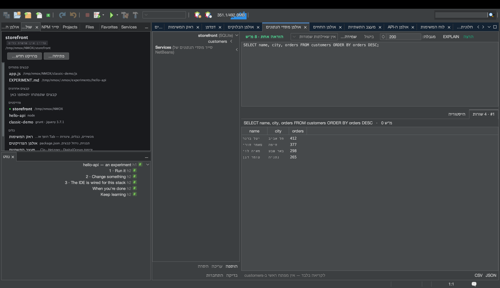

# מדריך: אולפן מסדי הנתונים

<!-- languages -->
[English](db-studio.md) · [Español](db-studio.es.md) · [Français](db-studio.fr.md) · [Deutsch](db-studio.de.md) · [Русский](db-studio.ru.md) · [Українська](db-studio.uk.md) · [Polski](db-studio.pl.md) · [Português (Brasil)](db-studio.pt.md) · [Bahasa Indonesia](db-studio.id.md) · [Filipino](db-studio.tl.md) · [Tiếng Việt](db-studio.vi.md) · [简体中文](db-studio.zh.md) · [हिन्दी](db-studio.hi.md) · **עברית** · [العربية](db-studio.ar.md)
<!-- /languages -->

אולפן מסדי הנתונים הוא חבילה למסדי נתונים עבור SQLite, ‏PostgreSQL, ‏MySQL/MariaDB, ‏MongoDB ו‑CouchDB — מנהלי התקן מצורפים, קונסולה שמכירה את סוג המנוע, וטבלאות תוצאות שאפשר לערוך במקום. המדריך הזה משתמש ב‑SQLite, כי הוא לא צריך שרת.



## פתיחה

`⌥⌘7`, או הלשונית **אולפן מסדי הנתונים**.

## צעדים

1. **צרו חיבור SQLite.** לחצו **הוספה**, בחרו **SQLite** ובחרו נתיב לקובץ (בורר בסגנון שמירה מאפשר ליצור קובץ ‎`.db` חדש). החיבור מופיע בעץ החיבורים.

2. **הריצו קצת SQL.** בקונסולה הקלידו והריצו:

   ```sql
   CREATE TABLE users (id INTEGER PRIMARY KEY, name TEXT, active BOOLEAN);
   INSERT INTO users (name, active) VALUES ('Ada', 1), ('Bob', 0);
   SELECT * FROM users;
   ```

   כל הוראה מקבלת טבלת תוצאות משלה למטה, עם זמן הביצוע.

3. **ערכו שורה בטבלה.** לחצו לחיצה כפולה על תא ה‑`name` של Bob, שנו אותו ולחצו **החלה…**. אולפן מסדי הנתונים מאפשר עריכה בטבלה רק כשהוא יכול לבנות `UPDATE` בטוח לשורה אחת (טבלה אחת, מפתח ראשי קיים) — הוא מראה לכם את ה‑SQL המדויק לפני שהוא רץ, ואז שולף מחדש כדי לראות את האמת. אם אי אפשר לערוך שורה בבטחה, הוא אומר למה.

4. **ייצאו.** לחצו **CSV** או **JSON** בכל טבלת תוצאות. ייצוא CSV מנטרל אוטומטית הזרקת נוסחאות לגיליונות אלקטרוניים.

5. **הריצו EXPLAIN על שאילתה.** סמנו `SELECT` ולחצו **EXPLAIN** כדי לקבל את תוכנית השאילתה של המנוע עצמו.

6. **תנו ל‑KVASIR להסביר כישלון.** הריצו `SELECT * FROM user;` (שימו לב לשגיאת ההקלדה). מתחת להודעת השגיאה מופיע כפתור **הסבר…**. לחצו עליו, ותיבת דו־שיח של הסכמה נוקבת בדיוק במה שיישלח — ה‑SQL שהרצתם (כולל ערכים ליטרליים שבו), הודעת השגיאה וסוג המנוע; אף פעם לא החיבור, הסיסמה או שורות כלשהן. אשרו, ו‑KVASIR מסביר את השגיאה ומציע תיקון, בחלון שיחה שמקבל שאלות המשך.

## מה למדתם

- סיסמאות נשמרות רק במחזיק המפתחות של המערכת, אף פעם לא ב‑‎`.nmoxdb.json`.
- הקונסולה מכירה את סוג המנוע: SQL למנועי SQL, וקונסולת מסמכי JSON עבור MongoDB/CouchDB.
- ההיסטוריה והשאילתות השמורות נשמרות לכל פרויקט; קובצי ‎`.env` מציעים אוטומטית את חיבורי ה‑`DATABASE_URL`/`DB_*` שלהם.

## הלאה

- מריצים מסד נתונים ב‑Docker? אולפן מסדי הנתונים מציע עבורו חיבור — ראו [חלונית Docker](docker-panel.he.md).
