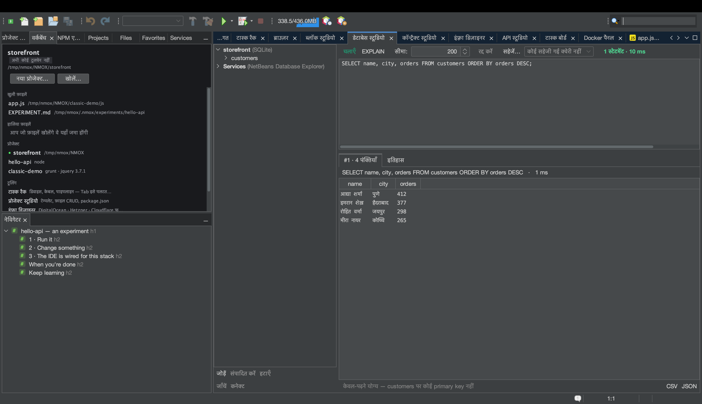

# ट्यूटोरियल: डेटाबेस स्टूडियो

<!-- languages -->
[English](db-studio.md) · [Español](db-studio.es.md) · [Français](db-studio.fr.md) · [Deutsch](db-studio.de.md) · [Русский](db-studio.ru.md) · [Українська](db-studio.uk.md) · [Polski](db-studio.pl.md) · [Português (Brasil)](db-studio.pt.md) · [Bahasa Indonesia](db-studio.id.md) · [Filipino](db-studio.tl.md) · [Tiếng Việt](db-studio.vi.md) · [简体中文](db-studio.zh.md) · **हिन्दी** · [עברית](db-studio.he.md) · [العربية](db-studio.ar.md)
<!-- /languages -->

डेटाबेस स्टूडियो SQLite, PostgreSQL, MySQL/MariaDB, MongoDB और CouchDB के
लिए डेटाबेस सूट है — साथ आए ड्राइवर, डेटाबेस के प्रकार को पहचानने वाला
कंसोल, और परिणाम ग्रिड जिन्हें आप वहीं संपादित कर सकते हैं। यह ट्यूटोरियल
SQLite इस्तेमाल करता है, क्योंकि उसे किसी सर्वर की ज़रूरत नहीं।



## इसे खोलें

`⌥⌘7`, या **डेटाबेस स्टूडियो** टैब।

## चरण

1. **SQLite कनेक्शन बनाएँ।** **जोड़ें** पर क्लिक करें, **SQLite**
   चुनें, और फ़ाइल का पथ चुनें (सहेजने वाला चयनक आपको नई `.db` बनाने देता
   है)। वह कनेक्शन ट्री में दिखाई देता है।

2. **कुछ SQL चलाएँ।** कंसोल में टाइप करें और चलाएँ:

   ```sql
   CREATE TABLE users (id INTEGER PRIMARY KEY, name TEXT, active BOOLEAN);
   INSERT INTO users (name, active) VALUES ('Ada', 1), ('Bob', 0);
   SELECT * FROM users;
   ```

   हर स्टेटमेंट को नीचे अपना परिणाम ग्रिड मिलता है, समय के साथ।

3. **ग्रिड में एक पंक्ति संपादित करें।** Bob के `name` सेल पर डबल-क्लिक
   करें, उसे बदलें और **लागू करें…** दबाएँ। डेटाबेस स्टूडियो ग्रिड में
   संपादन तभी करने देता है जब वह एक सुरक्षित, एक-पंक्ति वाला `UPDATE` बना
   सके (एक ही टेबल, प्राइमरी की मौजूद) — चलाने से पहले वह आपको ठीक-ठीक
   SQL दिखाता है, फिर सच जानने के लिए दोबारा क्वेरी करता है। अगर कोई पंक्ति
   सुरक्षित रूप से संपादित नहीं हो सकती, तो वह बताता है क्यों।

4. **निर्यात करें।** किसी भी परिणाम ग्रिड पर **CSV** या **JSON** दबाएँ। CSV निर्यात स्प्रेडशीट के
   फ़ॉर्मूला-इंजेक्शन को अपने आप निष्प्रभावी कर देता है।

5. **किसी क्वेरी पर EXPLAIN करें।** कोई `SELECT` चुनें और इंजन की अपनी
   क्वेरी योजना के लिए **EXPLAIN** दबाएँ।

6. **KVASIR से विफलता समझवाएँ।** `SELECT * FROM user;` चलाएँ (टाइपो पर
   ध्यान दें)। त्रुटि संदेश के नीचे एक **समझाएँ…** बटन आता है। उसे दबाएँ
   और एक सहमति संवाद ठीक-ठीक बताता है कि क्या भेजा जाएगा — आपका चलाया SQL
   (उसमें मौजूद literal मानों सहित), त्रुटि संदेश और इंजन का प्रकार; कभी
   कनेक्शन, पासवर्ड या कोई पंक्ति नहीं। स्वीकार करें और KVASIR त्रुटि
   समझाता है और सुधार सुझाता है, एक बातचीत की विंडो में जहाँ आप आगे के
   सवाल भी पूछ सकते हैं।

## आपने अभी क्या सीखा

- पासवर्ड केवल OS कीचेन में रहते हैं, कभी `.nmoxdb.json` में नहीं।
- कंसोल डेटाबेस के प्रकार को पहचानता है: SQL इंजनों के लिए SQL,
  MongoDB/CouchDB के लिए JSON दस्तावेज़ वाला कंसोल।
- इतिहास और सहेजी गई क्वेरी हर प्रोजेक्ट के लिए बनी रहती हैं; `.env`
  फ़ाइलें अपने `DATABASE_URL`/`DB_*` कनेक्शन अपने आप प्रस्तावित करती हैं।

## आगे

- Docker में डेटाबेस चला रहे हैं? डेटाबेस स्टूडियो उसके लिए कनेक्शन का
  प्रस्ताव देता है — [Docker पैनल](docker-panel.hi.md) देखें।
