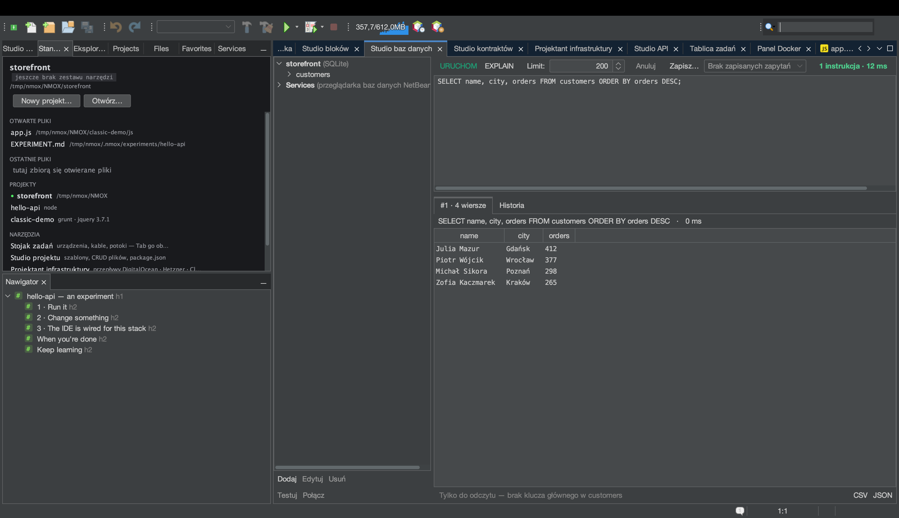

# Samouczek: Studio baz danych

<!-- languages -->
[English](db-studio.md) · [Español](db-studio.es.md) · [Français](db-studio.fr.md) · [Deutsch](db-studio.de.md) · [Русский](db-studio.ru.md) · [Українська](db-studio.uk.md) · **Polski** · [Português (Brasil)](db-studio.pt.md) · [Bahasa Indonesia](db-studio.id.md) · [Filipino](db-studio.tl.md) · [Tiếng Việt](db-studio.vi.md) · [简体中文](db-studio.zh.md) · [हिन्दी](db-studio.hi.md) · [עברית](db-studio.he.md) · [العربية](db-studio.ar.md)
<!-- /languages -->

Studio baz danych to zestaw do pracy z SQLite, PostgreSQL, MySQL/MariaDB,
MongoDB i CouchDB — sterowniki w komplecie, konsola znająca silnik
i siatki wyników edytowalne na miejscu. Ten samouczek używa SQLite, bo
nie potrzebuje serwera.



## Otwieranie

`⌥⌘7` albo karta **Studio baz danych**.

## Kroki

1. **Utwórz połączenie SQLite.** Kliknij **Dodaj**, wybierz **SQLite**
   i wskaż ścieżkę pliku (okno wyboru w stylu zapisu pozwala założyć nowy
   `.db`). Połączenie pojawi się w drzewie połączeń.

2. **Uruchom trochę SQL.** W konsoli wpisz i uruchom:

   ```sql
   CREATE TABLE users (id INTEGER PRIMARY KEY, name TEXT, active BOOLEAN);
   INSERT INTO users (name, active) VALUES ('Ada', 1), ('Bob', 0);
   SELECT * FROM users;
   ```

   Każde polecenie dostaje poniżej własną siatkę wyników, z czasem
   wykonania.

3. **Zmień wiersz w siatce.** Kliknij dwukrotnie komórkę `name` Boba,
   zmień ją i naciśnij **Zastosuj…**. Studio baz danych pozwala edytować
   w siatce tylko wtedy, gdy potrafi zbudować bezpieczny `UPDATE` jednego
   wiersza (jedna tabela, jest klucz główny) — pokazuje dokładny SQL,
   zanim go wykona, a potem odpytuje ponownie, żeby pokazać stan
   faktyczny. Jeśli wiersza nie da się bezpiecznie edytować, mówi
   dlaczego.

4. **Wyeksportuj.** Naciśnij **CSV** albo **JSON** na dowolnej siatce wyników.
   Eksport do CSV automatycznie unieszkodliwia wstrzykiwanie formuł
   arkusza kalkulacyjnego.

5. **EXPLAIN dla zapytania.** Zaznacz `SELECT` i naciśnij **EXPLAIN**,
   żeby zobaczyć plan zapytania w formacie samego silnika.

6. **Niech KVASIR wyjaśni porażkę.** Uruchom `SELECT * FROM user;` (zwróć
   uwagę na literówkę). Pod komunikatem błędu pojawia się przycisk
   **Wyjaśnij…**. Naciśnij go, a okno zgody nazwie dokładnie to, co
   zostałoby wysłane — SQL, który uruchomiłeś (razem ze wszystkimi
   wartościami literalnymi), komunikat błędu i rodzaj silnika; nigdy
   połączenie, hasło ani żadne wiersze. Zgódź się, a KVASIR wyjaśni błąd
   i zaproponuje poprawkę w oknie rozmowy, w którym można dopytywać.

## Czego się właśnie nauczyłeś

- Hasła są tylko w pęku kluczy systemu, nigdy w `.nmoxdb.json`.
- Konsola zna rodzaj silnika: SQL dla silników SQL, konsola dokumentów
  JSON dla MongoDB/CouchDB.
- Historia i zapisane zapytania zapisują się per projekt; pliki `.env`
  same proponują swoje połączenia `DATABASE_URL`/`DB_*`.

## Dalej

- Baza działa w Dockerze? Studio baz danych zaproponuje połączenie z nią
  — zobacz [Panel Docker](docker-panel.pl.md).
