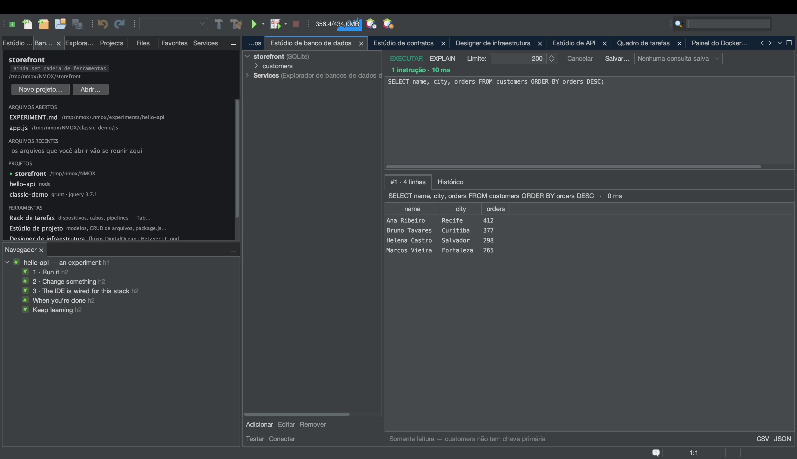

# Tutorial: Estúdio de banco de dados

<!-- languages -->
[English](db-studio.md) · [Español](db-studio.es.md) · [Français](db-studio.fr.md) · [Deutsch](db-studio.de.md) · [Русский](db-studio.ru.md) · [Українська](db-studio.uk.md) · [Polski](db-studio.pl.md) · **Português (Brasil)** · [Bahasa Indonesia](db-studio.id.md) · [Filipino](db-studio.tl.md) · [Tiếng Việt](db-studio.vi.md) · [简体中文](db-studio.zh.md) · [हिन्दी](db-studio.hi.md) · [עברית](db-studio.he.md) · [العربية](db-studio.ar.md)
<!-- /languages -->

O Estúdio de banco de dados é uma suíte para SQLite, PostgreSQL,
MySQL/MariaDB, MongoDB e CouchDB — drivers inclusos, um console que conhece
o motor e grades de resultado que você edita ali mesmo. Este tutorial usa
SQLite porque ele dispensa servidor.



## Abrir

`⌥⌘7`, ou a aba **Estúdio de banco de dados**.

## Passos

1. **Crie uma conexão SQLite.** Clique em **Adicionar**, escolha
   **SQLite** e indique o caminho de um arquivo (um seletor no estilo
   “salvar” deixa você criar um `.db` novo). Ela aparece na árvore de
   conexões.

2. **Rode um pouco de SQL.** No console, digite e execute:

   ```sql
   CREATE TABLE users (id INTEGER PRIMARY KEY, name TEXT, active BOOLEAN);
   INSERT INTO users (name, active) VALUES ('Ada', 1), ('Bob', 0);
   SELECT * FROM users;
   ```

   Cada instrução ganha a própria grade de resultado logo abaixo, com o
   tempo gasto.

3. **Edite uma linha na grade.** Clique duas vezes na célula `name` do Bob,
   mude o valor e aperte **Aplicar…**. O Estúdio de banco de dados só
   permite edição na grade quando consegue montar um `UPDATE` seguro de uma
   linha (uma única tabela, chave primária presente) — ele mostra o SQL
   exato antes de rodar e depois consulta de novo para confirmar. Se uma
   linha não puder ser editada com segurança, ele diz por quê.

4. **Exporte.** Aperte **CSV** ou **JSON** em qualquer grade de resultado.
   A exportação CSV neutraliza sozinha a injeção de
   fórmulas de planilha.

5. **Faça EXPLAIN de uma consulta.** Selecione um `SELECT` e aperte
   **EXPLAIN** para ver o plano de consulta nativo do motor.

6. **Deixe o KVASIR explicar uma falha.** Rode `SELECT * FROM user;`
   (repare no erro de digitação). Sob a mensagem de erro aparece um botão
   **Explicar…**. Aperte-o e um diálogo de consentimento diz exatamente o
   que seria enviado — o SQL que você rodou (inclusive os valores literais
   dele), a mensagem de erro e o tipo de motor; nunca a conexão, a senha ou
   linha nenhuma. Aceite e o KVASIR explica o erro e sugere a correção,
   numa janela de conversa que aceita perguntas de acompanhamento.

## O que você aprendeu

- As senhas ficam só no chaveiro do sistema operacional, nunca no
  `.nmoxdb.json`.
- O console conhece o motor: SQL para os motores SQL, um console de
  documentos JSON para MongoDB/CouchDB.
- O histórico e as consultas salvas ficam guardados por projeto; arquivos
  `.env` oferecem sozinhos as conexões `DATABASE_URL`/`DB_*` deles.

## Próximos passos

- Seu banco roda no Docker? O Estúdio de banco de dados oferece uma conexão
  para ele — veja o [Painel do Docker](docker-panel.pt.md).
