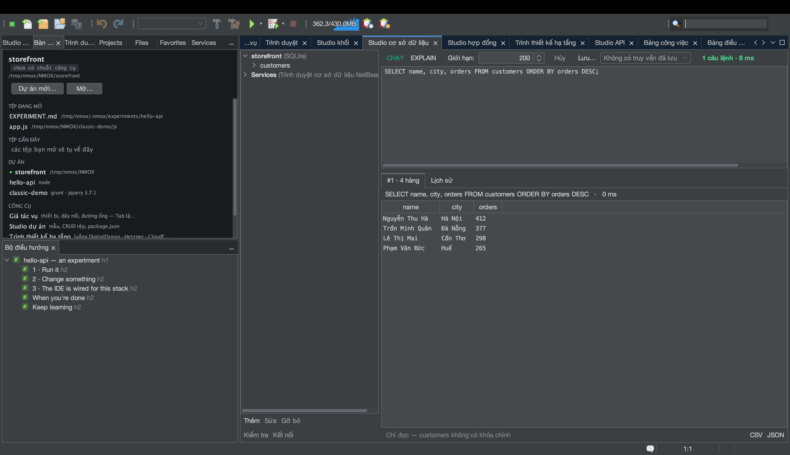

# Hướng dẫn: Studio cơ sở dữ liệu

<!-- languages -->
[English](db-studio.md) · [Español](db-studio.es.md) · [Français](db-studio.fr.md) · [Deutsch](db-studio.de.md) · [Русский](db-studio.ru.md) · [Українська](db-studio.uk.md) · [Polski](db-studio.pl.md) · [Português (Brasil)](db-studio.pt.md) · [Bahasa Indonesia](db-studio.id.md) · [Filipino](db-studio.tl.md) · **Tiếng Việt** · [简体中文](db-studio.zh.md) · [हिन्दी](db-studio.hi.md) · [עברית](db-studio.he.md) · [العربية](db-studio.ar.md)
<!-- /languages -->

Studio cơ sở dữ liệu là bộ công cụ cho SQLite, PostgreSQL, MySQL/MariaDB,
MongoDB và CouchDB — trình điều khiển đi kèm, một bảng điều khiển hiểu từng
loại máy, và những lưới kết quả sửa được ngay tại chỗ. Bài này dùng SQLite vì
nó không cần máy chủ.



## Mở nó

`⌥⌘7`, hoặc thẻ **Studio cơ sở dữ liệu**.

## Các bước

1. **Tạo một kết nối SQLite.** Nhấp **Thêm**, chọn **SQLite**, rồi chọn một
   đường dẫn tệp (hộp chọn kiểu “lưu” cho phép bạn tạo một `.db` mới). Nó xuất
   hiện trong cây kết nối.

2. **Chạy chút SQL.** Trong bảng điều khiển, gõ và chạy:

   ```sql
   CREATE TABLE users (id INTEGER PRIMARY KEY, name TEXT, active BOOLEAN);
   INSERT INTO users (name, active) VALUES ('Ada', 1), ('Bob', 0);
   SELECT * FROM users;
   ```

   Mỗi câu lệnh có một lưới kết quả riêng bên dưới, kèm thời gian chạy.

3. **Sửa một hàng trong lưới.** Nhấp đúp vào ô `name` của Bob, đổi nó, rồi
   nhấn **Áp dụng…**. Studio cơ sở dữ liệu chỉ cho sửa trong lưới khi nó dựng
   được một câu `UPDATE` an toàn cho đúng một hàng (một bảng, có khóa chính) —
   nó cho bạn xem đúng câu SQL trước khi chạy, rồi truy vấn lại để lấy sự thật.
   Nếu một hàng không sửa an toàn được, nó nói cho bạn biết vì sao.

4. **Xuất dữ liệu.** Nhấn **CSV** hoặc **JSON** trên bất kỳ lưới kết quả nào.
   Bản xuất CSV tự động vô hiệu hóa kiểu tấn công chèn công thức vào
   bảng tính.

5. **EXPLAIN một truy vấn.** Chọn một câu `SELECT` và nhấn **EXPLAIN** để
   xem kế hoạch truy vấn của chính máy cơ sở dữ liệu.

6. **Để KVASIR giải thích một lần hỏng.** Chạy `SELECT * FROM user;` (để ý
   lỗi chính tả). Bên dưới thông báo lỗi hiện ra nút **Giải thích…**. Nhấn nó
   và một hộp thoại đồng ý gọi tên đúng những gì sẽ được gửi — câu SQL bạn đã
   chạy (kể cả mọi giá trị hằng trong đó), thông báo lỗi và loại máy; không bao
   giờ có kết nối, mật khẩu hay bất kỳ hàng dữ liệu nào. Đồng ý, và KVASIR giải
   thích lỗi rồi gợi ý cách sửa, trong một cửa sổ hội thoại nhận thêm câu hỏi
   tiếp theo.

## Bạn vừa học được gì

- Mật khẩu chỉ nằm trong chùm khóa của hệ điều hành, không bao giờ trong
  `.nmoxdb.json`.
- Bảng điều khiển hiểu từng loại máy: SQL cho máy SQL, bảng điều khiển tài
  liệu JSON cho MongoDB/CouchDB.
- Lịch sử và truy vấn đã lưu được giữ theo từng dự án; các tệp `.env` tự động
  mời những kết nối `DATABASE_URL`/`DB_*` của chúng.

## Tiếp theo

- Đang chạy cơ sở dữ liệu trong Docker? Studio cơ sở dữ liệu mời bạn một kết
  nối tới nó — xem [Bảng điều khiển Docker](docker-panel.vi.md).
