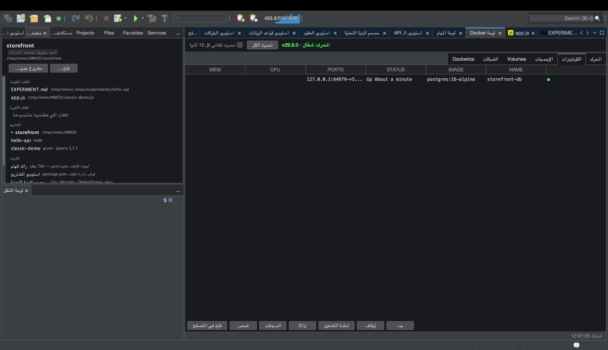

# درس: لوحة Docker

<!-- languages -->
[English](docker-panel.md) · [Español](docker-panel.es.md) · [Français](docker-panel.fr.md) · [Deutsch](docker-panel.de.md) · [Русский](docker-panel.ru.md) · [Українська](docker-panel.uk.md) · [Polski](docker-panel.pl.md) · [Português (Brasil)](docker-panel.pt.md) · [Bahasa Indonesia](docker-panel.id.md) · [Filipino](docker-panel.tl.md) · [Tiếng Việt](docker-panel.vi.md) · [简体中文](docker-panel.zh.md) · [हिन्दी](docker-panel.hi.md) · [עברית](docker-panel.he.md) · **العربية**
<!-- /languages -->

لوحة Docker لوحة تحكم في محرك Docker المحلي عندكم — الكونتينرات،
والإيمدجات، والـ volumes، والشبكات — ومعاها تبويب **Dockerize** بيعمل
Dockerfile جاهز للإنتاج لمشروعكم. الجهاز المقابل ليها في الراك هو
**HARBOR**.

## قبل ما تبدأوا

خلّوا Docker شغال على جهازكم (`docker version` لازم ينجح؛ و
`أدوات ◂ طبيب البيئة…` هيأكّد ده).

## الخطوات

1. **افتحوا اللوحة.** دوسوا `⌘8`، أو اضغطوا على **لوحة Docker** في عمود
   «الأدوات» في نافذة أهلًا بيك. النظرة العامة في **المحرك** بتوضّح الـ
   daemon شغال ولا لأ.

2. **افحصوا الكونتينرات.** تبويب **الكونتينرات** بيعرض اللي شغال —
   الأسامي، والإيمدجات، والبورتات، والحالة. **الإيمدجات**، و**Volumes**،
   و**الشبكات** كل واحد فيهم ليه تبويب.

3. **اعملوا Dockerize لمشروع.** افتحوا تبويب **Dockerize** وانتوا متوجهين
   على مشروع. بيعمل `Dockerfile` للإنتاج، و‎`.dockerignore`، وملف `compose`
   مظبوطين على سلسلة أدواتكم (Node على مراحل، و`php-fpm` في PHP ومعاه
   nginx كـ sidecar، وغيرهم) — ومن غير ما يكتب فوق ملفات موجودة أبدًا (لو
   فيه ملف موجود، بيكتب جنبه نسخة ‎`.suggested`).

4. **عرض اتصال بقاعدة بيانات.** لو فيه كونتينر قاعدة بيانات شغال، استوديو
   قواعد البيانات بيعرض عليكم اتصال ليه لوحده — بيستنتج من اسم الإيمدج
   الأول وبعدين من البورت، مرة واحدة لكل كونتينر.

## اللي اتعلمتوه

- اللوحة غلاف async حقيقي فوق الـ CLI بتاع `docker`؛ الـ daemon اللي
  مهنّج بيتبلّغ عنه، واللوحة مش بتهنّج معاه.
- Dockerize فاهم سلسلة الأدوات، وتشغيله تاني بيدّي نفس النتيجة.

## بعد كده

- ركّبوا **HARBOR** في الراك عشان PANEL/PRUNE/REFRESH من على الواجهة.
- اتصلوا بقاعدة بيانات في كونتينر من
  [استوديو قواعد البيانات](db-studio.ar.md).
