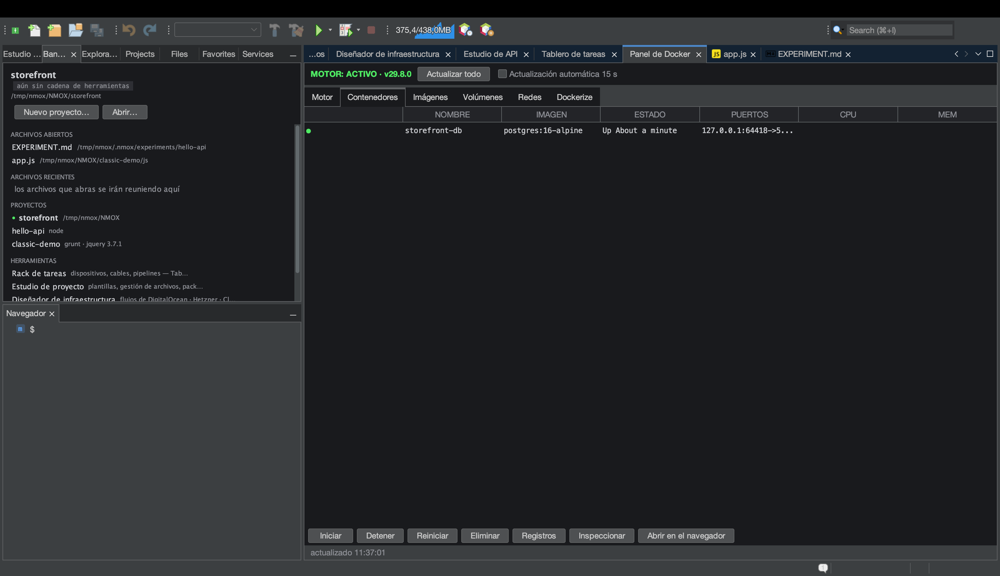

# Tutorial: el Panel de Docker

<!-- languages -->
[English](docker-panel.md) · **Español** · [Français](docker-panel.fr.md) · [Deutsch](docker-panel.de.md) · [Русский](docker-panel.ru.md) · [Українська](docker-panel.uk.md) · [Polski](docker-panel.pl.md) · [Português (Brasil)](docker-panel.pt.md) · [Bahasa Indonesia](docker-panel.id.md) · [Filipino](docker-panel.tl.md) · [Tiếng Việt](docker-panel.vi.md) · [简体中文](docker-panel.zh.md) · [हिन्दी](docker-panel.hi.md) · [עברית](docker-panel.he.md) · [العربية](docker-panel.ar.md)
<!-- /languages -->

El Panel de Docker es un panel de control para tu motor de Docker local
—contenedores, imágenes, volúmenes, redes— más una pestaña
**Dockerize** que genera un Dockerfile de producción para tu proyecto.
Su equivalente en el rack es el dispositivo **HARBOR**.

## Antes de empezar

Ten Docker corriendo en local (`docker version` debe funcionar;
`Herramientas ▸ Doctor del entorno…` te lo confirma).

## Pasos

1. **Abre el panel.** Pulsa `⌘8`, o haz clic en **Panel de Docker** en la
   columna HERRAMIENTAS de la Bienvenida. La vista **Motor** muestra si
   el demonio está en marcha.

2. **Inspecciona los contenedores.** La pestaña **Contenedores** lista lo
   que está corriendo: nombres, imágenes, puertos y estado. **Imágenes**,
   **Volúmenes** y **Redes** tienen cada una su pestaña.

3. **Dockeriza un proyecto.** Abre la pestaña **Dockerize** con un
   proyecto apuntado. Genera un `Dockerfile` de producción, un
   `.dockerignore` y un archivo `compose` ajustados a tu cadena de
   herramientas (Node en varias etapas, PHP con `php-fpm` y un sidecar de
   nginx, etc.), sin pisar nunca archivos existentes (si ya hay uno,
   escribe un hermano `.suggested`).

4. **Recibe la oferta de conexión.** Si hay un contenedor de base de
   datos corriendo, el Estudio de bases de datos te ofrece una conexión
   para él automáticamente: deduce el motor por el nombre de la imagen y
   luego por el puerto, una vez por contenedor.

## Lo que acabas de aprender

- El panel es un envoltorio asíncrono real sobre la CLI `docker`; un
  demonio atascado se notifica, no bloquea el IDE.
- Dockerize conoce tu cadena de herramientas y es idempotente.

## Siguiente

- Monta **HARBOR** en el rack para tener PANEL/PRUNE/REFRESH en una
  carátula.
- Conéctate a una base de datos en contenedor desde el [Estudio de bases
  de datos](db-studio.es.md).
